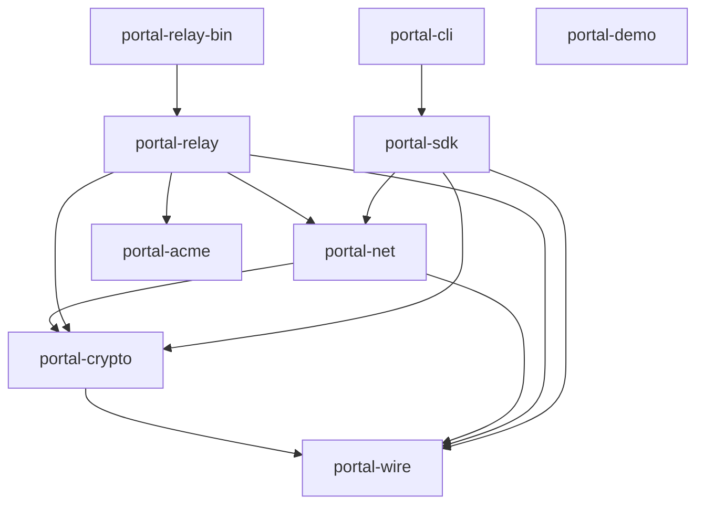
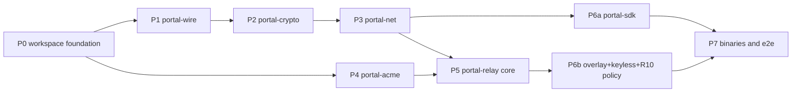

---

name: port go to rust greenfield
overview: Port the entire portal-tunnel Go codebase (~19.5k LoC, 3 binaries) to idiomatic Rust 2024 with a greenfield wire — Go acts as behavioral spec only, no interop required. Roadmap structured as 8 phases; Phase 0 (workspace foundation) is directly executable, Phases 1-7 each spawn their own /ce-plan run downstream.
todos:

- id: phase-0-foundation
content: "Phase 0 — Workspace foundation post-round2-review: 11 commit sequence (workspace skeleton → ADR-0001 → ADR-0002 → ADR-0003 → ADR-0004 → AGENTS.md rewrite → deny.toml/cargo-deny → CI workflow → prek.toml → xtask + .cargo/config.toml → architecture.md). Each commit ≤200 LoC per AGENTS.md. Cargo.toml: `rustls@0.23.22` with prefer-post-quantum feature (per /research; was wrongly anchored at 0.23.18); rustls-post-quantum 0.2.x sidecar option; aws-sdk-route53 with explicit default-features=false + behavior-version-latest+rt-tokio+default-https-client (per FEAS-R2-4 to avoid legacy hyper-0.14+rustls-0.21 stack); `ratatui@0.30` + `ratatui-crossterm@0.1`; siwe='=0.6.1' exact pin; aws-sdk-route53 MSRV-1.91 floor. [workspace.package] inheritance for edition=2024 + rust-version=1.91 (per FEAS-R2-9). Deferred to v0.2: console-subscriber + tokio-metrics (R11), tokio_unstable cfg flag (R11). WG fork deferred to Phase 6b. h3-quinn deferred to Phase 5. AGENTS.md rewrite drops v2.1.8. Four ADRs (0001 greenfield-wire, 0002 aggressive register, 0003 registry-fork+v2.1.8 migration, 0004 supported-clients+upgrade-encouragement). deny.toml direct-deps-only + rustls-MANDATORY (openssl/openssl-sys/libssh2-sys banned direct AND transitive; chrono/nom/async-trait/derive_builder/typed-builder/lazy_static/once_cell/tarpaulin direct only; criterion NOT banned). 9 stub crates + xtask. Verify: full toolchain green on Linux+macOS at MSRV 1.91; cargo tree -i openssl returns empty (rustls-MANDATORY); cargo-deny smoke rejects direct chrono AND direct openssl; criterion smoke passes (R8 escape-hatch verified)."
status: completed
- id: phase-1-wire-plan
content: "Phase 1 — Run /ce-plan for portal-wire crate. Produces docs/plans/*-feat-portal-wire-plan.md plus full docs/wire-protocol.md (greenfield framing, ALPN portal/2, channel tags, ed25519 Envelope { payload, sig, claims } with claim set per SEC-001, ReputationDelta envelope per R10, MITM-probe label rename per SEC-013, postcard size budget per SEC-014, domain separators per SEC-007). Plus docs/threat-model.md per SEC-006 (8 R10 threat classes a-h, multi-hop privacy claims, SEC-001..005 evaluation context). Pack portal-tunnel/types and portal-tunnel/portal/auth via repomix. Behavioral gate: phase plan must list at least one proptest codec round-trip test as Phase 1 deliverable."
status: in_progress
- id: phase-2-crypto-plan
content: "Phase 2 — Run /ce-plan for portal-crypto. Identity (ed25519 + k256 with distinct SecretBox newtypes per role per R2), signed-envelope JWT replacement (claim set per SEC-001, domain separators per SEC-007), SIWE→ed25519 binding protocol (SEC-002), keyless SigningKey trait skeleton (sync trait per FEAS-2; async-bridge architecture in Phase 6b). siwe-rs fork-vs-contribute decision per FEAS-4. Pack portal-tunnel/types/identity.go, portal-tunnel/portal/auth, portal-tunnel/portal/keyless, portal-tunnel/utils/crypto.go. Behavioral gate: ed25519 round-trip + SIWE→ed25519 binding tests as Phase 2 deliverables."
status: in_progress
- id: phase-3-net-plan
content: Phase 3 — Run /ce-plan for portal-net. quinn QUIC backhaul, TCP port relay, UDP datagram session, port allocator. Pack portal-tunnel/portal/transport.
status: in_progress
- id: phase-4-acme-plan
content: "Phase 4 — Run /ce-plan for portal-acme. ACME via instant-acme + DNS-01 providers (local / Cloudflare / Route53 / Cloud DNS — evaluate native google-cloud-dns-v1 SDK per FEAS-7). DNS-provider credential isolation per SEC-012. Pack portal-tunnel/portal/acme. Parallelizable with Phases 1-3. Behavioral gate: wiremock-driven ACME order-flow test per DNS provider as Phase 4 deliverables."
status: in_progress
- id: phase-5-relay-plan
content: "Phase 5 — Run /ce-plan for portal-relay core. Lease (papaya-backed registry), axum-based API server with three trust boundaries enforced via type-level SecretBox newtypes per R2, base policy engine (BPS manager, IP filter, proxy trust, approver — direct ports of Go's portal/policy/), discovery announce/refresh, public registry handler. R10 reputation engine + cross-relay propagation lands in Phase 6b. Phase 5 also lands deferred-from-Phase-0 cargo-vet setup (supply-chain/audits.toml, supply-chain/config.toml). Hot-reload semantics for arc-swap (SEC-010), rate-limit surface enumeration (SEC-011), at-rest encryption strategy for identity.json/ACME/DNS keys (SEC-005), admin auth design (SEC-008). Pack portal-tunnel/portal/lease.go, api_server.go, server.go, proxy.go, portal-tunnel/portal/policy, portal-tunnel/portal/discovery. Behavioral gate: lease-lifecycle integration test + wiremock-driven discovery announce round-trip."
status: in_progress
- id: phase-6a-sdk-plan
content: Phase 6a — Run /ce-plan for portal-sdk. Expose, listener, MITM probe via rustls TLS exporter (RFC 5705, label per SEC-013 rename), eclipse-resistant relay-set picker per R10 (≥3 relays from operationally-independent ASN bins). Runs in parallel with Phase 5 (depends only on U4/portal-net). Pack portal-tunnel/sdk. Behavioral gate per product-lens P1#4.
status: in_progress
- id: phase-6b-overlay-plan
content: "Phase 6b (v0.1 narrowed) — Run /ce-plan for portal-relay overlay + keyless server. WireGuard fork pick (NepTUN server-validated primary / GotaTun Android-only / defguard_boringtun / wiresock / Cloudflare upstream-post-restructure) with explicit go/no-go date for vendoring wireguard-go semantics if all forks fall through (per F6 risk). Smoltcp hop-mux overlay. Rustls SigningKey-backed keyless server with mTLS, async-bridged via tokio channel + worker pool (FEAS-2). Keyless oracle protections (SEC-004): mTLS root, input validation, per-tenant rate limit, output domain separation. R10 cross-relay reputation propagation + ReputationDelta wire envelope + hop-mux traffic accounting deferred to v0.2 per R10 narrowing. Per-relay R10 engine ships in Phase 5 / U6, not here. Pack portal-tunnel/portal/overlay, portal-tunnel/portal/keyless. Behavioral gate: keyless mTLS sign round-trip + smoltcp hop-mux unit test as Phase 6b deliverables."
status: in_progress
- id: phase-7-binaries-plan
content: "Phase 7 — Run /ce-plan for binaries + e2e + release-engineering + behavioral-trace harness. Three binaries with binary names (portal-relay, portal, portal-demo) distinct from crate names (portal-relay-bin, portal-cli, portal-demo) per R5+C11. portal-relay-bin embeds Svelte assets via rust-embed (committed under crates/portal-relay-bin/assets/). Single-process e2e harness exercises all three trust boundaries. Behavioral-trace harness boots Go relay-server in Docker sidecar under fixtures, captures canonical scenarios, replays against Rust port (per R3 reframed). Svelte regen pipeline per F1: utoipa exports docs/openapi.yaml; CI gate fails if committed Svelte bundle's TS-client types don't match. utoipa coverage CI gate per F10 (every Router::route registration has #[utoipa::path]). Per-dep task-spawning audit per F4 (quinn, axum, instant-acme, chosen WG fork). MVP shipping subset declared per F11 (e.g., v0.1 = Phase 0-5 with v0.2-will-break-wire notice OR v0.1 = Phase 0-7 minus overlay). Cross-compile matrix for portal CLI (Linux/macOS/Windows). Deferred-from-Phase-0 release files: cliff.toml, release.toml, .github/workflows/release.yml. Adapted install scripts (release artifact named 'portal' not 'portal-tunnel'). Dockerfile + docker-compose regenerated. Pack portal-tunnel/cmd. Behavioral gates: e2e harness, behavioral-trace harness, utoipa coverage gate, dep-audit all listed as Phase 7 deliverables not deferred."
status: in_progress
isProject: false

---

# feat: Port portal-tunnel to Rust 2024 — greenfield wire, phased roadmap

```
---
title: Port portal-tunnel to Rust 2024 — greenfield wire, phased roadmap
type: feat
status: active
date: 2026-05-03
---
```

## Summary

The Rust port is the modern reference implementation of Portal. Go v2.1.8 supplies behavior; ADR-0003 captures the v2.1.8 user-base migration posture. Two distinct scope buckets:

- **Port** (R1-R6 + R7-R9 Engineering Defaults): greenfield wire, aggressive 2026 Rust register, modern transport security baseline (R13 narrowed). This is the v0.1 ship.
- **Expand** (R10-R15): distributed anti-abuse, observability stack, IPv6 dual-stack, SvelteKit frontend, dual TUI. **Most expand-bucket items are scoped down to v0.1 essentials with v0.2 backlog for the full vision** — see `## v0.2 Backlog` section. R12 IPv6 ships in v0.1.

12 product-failure requirements (R1-R6 + R10-R15) plus 3 engineering defaults (R7-R9). 8 phases (U1-U8 with U7 split into U7a/U7b). Phase 0 directly executable; Phases 1-7 each spawn their own `/ce-plan` downstream.

**Phase 0 deliverables — locatable in 30 seconds; full spec in U1.** Workspace `Cargo.toml` + 9 stub crates + `xtask`. AGENTS.md rewrite. ADRs 0001-0004. `rust-toolchain.toml` pin 1.91. `deny.toml` direct-deps-only ban list. `prek.toml` git hooks. CI workflow. `docs/architecture.md` skeleton + `docs/adr/README.md`. Verify: full toolchain green on Linux + macOS at MSRV 1.91.

**Phase 0 commit sequence** (AGENTS.md ≤200 LoC rule applies per commit; Phase 0 is multi-commit by design):

1. `**feat(workspace): cargo workspace skeleton + 9 stub crates + xtask`** — `Cargo.toml`, `rust-toolchain.toml`, `[workspace.package]` inheritance, `[workspace.dependencies]` with the 2026 register, 9 empty `crates/*/{Cargo.toml,src/{lib.rs,main.rs}}` stubs, `xtask/` skeleton.
2. `**feat(adr): ADR-0001 greenfield-wire`** — `docs/adr/0001-greenfield-wire.md` + `docs/adr/README.md` index.
3. `**feat(adr): ADR-0002 aggressive 2026 register`** — `docs/adr/0002-aggressive-2026-register.md` with banned-crates list + /research citations.
4. `**feat(adr): ADR-0003 registry-fork + v2.1.8 migration`** — `docs/adr/0003-registry-fork-and-v2-1-8-migration.md`.
5. `**feat(adr): ADR-0004 supported-clients + upgrade encouragement`** — `docs/adr/0004-supported-clients-and-upgrade-encouragement.md`.
6. `**feat(constitution): rewrite AGENTS.md`** — drops v2.1.8 wire pin; codifies R7-R9 as Engineering Defaults with deviation-via-ADR procedure.
7. `**feat(supply-chain): deny.toml + cargo-deny config`** — direct-deps-only ban list with rustls-MANDATORY policy and transitive-allowlist.
8. `**feat(ci): GitHub Actions workflow`** — `.github/workflows/ci.yml` with fmt + clippy + nextest + deny + machete + msrv + llvm-cov gates.
9. `**feat(hooks): prek.toml git hooks`** — pre-commit (fmt/clippy/taplo/machete) + pre-push (nextest).
10. `**feat(tools): xtask aliases + .cargo/config.toml`** — `cargo xtask ci` alias + registry/profile config.
11. `**docs(architecture): skeleton`** — `docs/architecture.md` with trait_variant Send-bound migration shape.

Each commit ≤200 LoC substantive diff (file moves and generated files don't count). Smoke-test commit (verify cargo-deny rejects direct chrono / direct openssl / criterion-as-dev-dep passes; cargo tree -i openssl returns empty) lands as commit 12 if needed.

## Current implementation status

- **Phase 0 — landed.** Workspace `Cargo.toml`, `rust-toolchain.toml`, all four ADRs (0001-0004), rewritten `AGENTS.md`, `deny.toml`, `prek.toml`, `.cargo/config.toml`, `.github/workflows/ci.yml`, `xtask/` skeleton, `docs/architecture.md`, `docs/adr/README.md`, nine crate stubs are all committed. CI pipeline runs fmt + clippy + nextest + deny + machete + msrv + llvm-cov + rustls-mandatory + wire-protocol-gates jobs.
- **Phase 1 — active, gates pending.** `crates/portal-wire/src/*` (envelope, descriptor, hop-route, reputation-delta, channel framing, claims/audience/purpose, lease, MITM probe label, paths, response wrapper, routed_hostname, domain separators, limits, error, API DTOs), `docs/wire-protocol.md`, `docs/threat-model.md`, and `xtask/src/wire_drift_check.rs` are committed. The five named U17 `proptest_*.rs` suites and the `PROPTEST_CASES=4096` CI/local case-count gate are pending. Phase 1 remains active until the U16 commit-bound drift marker matches HEAD AND the five U17 suites pass at `PROPTEST_CASES=4096` on CI.
- **Phases 2-7 — planned/stubbed.** All seven phase plans are committed under `docs/plans/2026-05-04-{002..008}-feat-*-plan.md`. Library crates contain stubs only; binaries print placeholder output. Phase 2 begins from these committed plans only after Phase 1 gates pass.

## Authority precedence

When `PLAN.md`, a committed phase plan, and the actual code disagree:

- **Wire / contract questions** (type shapes, framing, claim sets, domain separators, signing inputs): code > committed phase plan > `PLAN.md`.
- **Scope / sequencing questions** (which unit ships in v0.1 vs v0.2, phase ordering, deferred-work boundary): `PLAN.md` > committed phase plan.
- "Audit / upgrade" alone is not a tie-breaker. A reconciliation pass cites which side it picks and why.

The Phase 1 wire contract already exists in `docs/wire-protocol.md` + `crates/portal-wire/src/*` + the U16 drift marker. Phase 2-7 plans MUST NOT redesign wire types without updating `docs/wire-protocol.md`, the drift marker, and affected tests in the same change.

## Problem Frame

The Go codebase is a working v2.1.8 of a relay-tunnel system (SIWE-authenticated tenants, QUIC backhaul, WireGuard hop-mux, ACME-issued tenant certs, MITM probe detection, end-to-end TLS termination on the client). Porting at the wire level — the original `AGENTS.md` posture — would lock Rust to byte-compat with `quic-go`, `yamux`, `decred/secp256k1` ES256K JWTs, and `gosuda/keyless_tls`. The user has explicitly elected greenfield: Go is now the behavioral spec only, the Rust shape is the new source of truth, and the v2.1.8 wire pin is dropped. This roadmap sequences that port atomically without losing any behavioral surface.

## Requirements

R1-R6 and R10-R15 are product-failure constraints. R7-R9 are engineering defaults — see [Engineering Defaults](#engineering-defaults) for their full text and the deviation procedure.

- R1. Workspace and module shape are idiomatic Rust 2024 — Resolver 3, edition 2024, `forbid(unsafe_code)`, `clippy::pedantic + cargo` at warn, deps in `[workspace.dependencies]`.
- R2. **Trust boundaries are enforced at key-material level, not config-builder level.** Each of the three trust surfaces (relay API HTTPS, tenant TLS keyless signing, QUIC datagram identity) loads its signing key from a distinct path, holds it in a distinct `secrecy::SecretBox<KeyType>` newtype, and a CI clippy `disallowed_methods` rule rejects any function returning more than one `SigningKey` from a single load call. The three `rustls::ServerConfig` instances and three `axum::Router` mounts are downstream of this key-material isolation, not load-bearing on their own.
- R3. **Feature parity at user-visible CLI and admin-API surface.** `portal expose`, `portal-relay` startup, admin endpoints, and the nine behavioral surfaces (lease lifecycle, SIWE registration, ACME issuance, multi-hop routing, MITM probe, raw TCP/UDP routing, admin API, public discovery) produce equivalent outcomes for equivalent inputs, validated via a behavioral-trace harness (Phase 7) that captures Go reference traces under fixtures and replays them against Rust. Wire-level parity is explicitly NOT required (greenfield, per R4).
- R4. Greenfield wire is documented in `docs/wire-protocol.md` before any wire-touching code lands. ADR-0001 captures the decision to drop v2.1.8 wire-compat. ADR-0003 captures the registry-fork strategy and the v2.1.8 user-base migration posture.
- R5. Three binaries ship: `portal-relay` (server), `portal` (client CLI with `expose` subcommand), `portal-demo` (sample target).
- R6. **SDK is a workspace-internal library crate (`portal-sdk`) consumed by `portal-cli` and the e2e harness.** Promotion to a published crates.io crate with semver guarantees is deferred to a future ADR, gated on at least one named external consumer.
- R10. **Anti-abuse subsystem (v0.1 = single-relay defense; v0.2 = cross-relay propagation).** v0.1 ships per-relay defense only: governor-keyed adaptive rate limiting (per identity + IP + lease triple), per-identity reputation with exponential decay (local to the relay), SIWE+ENS Sybil gating, signed `RelayDescriptor` verification on the discovery side, honeypot/canary fingerprinting, backpressure-before-block, `tracing::instrument`-spanned audit log. Eclipse-resistant ≥3-independent-ASN relay picker ships in `portal-sdk` at v0.1 (Phase 6a). **Cross-relay reputation propagation, hop-mux traffic accounting, and the `ReputationDelta` wire envelope are deferred to v0.2** (see v0.2 Backlog) — Phase 6b in v0.1 ships keyless + overlay only, no propagation layer. Phase 5 owns the per-relay engine; Phase 6a owns the eclipse picker.
- R11. **Observability (v0.1 = metrics-only; v0.2 = tokio-console + dashboard).** v0.1 ships `metrics` facade + `metrics-exporter-prometheus` `/metrics` endpoint (operators run their own Prometheus + Grafana — industry standard). `**tokio-console` gRPC endpoint and `/admin/dashboard` HTML aggregator are deferred to v0.2** (see v0.2 Backlog). The deferral resolves the FEAS-R2-2 architecture mismatch (tokio-console is gRPC on a separate port, not an axum HTTP route) and the `tokio_unstable` workspace-wide cfg flag concern — neither lands in v0.1.
- R12. **IPv6 dual-stack by default.** Every public listener (relay API HTTPS, tenant TLS, QUIC datagram, discovery HTTP, keyless mTLS, dashboard endpoint, `/metrics` endpoint) binds both IPv4 and IPv6. `RelayDescriptor` includes both `addresses_v4: Vec<SocketAddrV4>` and `addresses_v6: Vec<SocketAddrV6>` (replacing the Go single-address field). WireGuard overlay carriage supports IPv6 (Phase 6b WG-fork evaluation matrix adds a v6-maturity column). Discovery announce / refresh propagates v6 addresses. Single-stack v4-only is supported via config flag for legacy operators but not the default.
- R13. **Modern transport security baseline.** **TLS implementation is `rustls` only — MANDATORY** (R8 banned-crates list enforces). Two tiers:
  - **Stable baseline (v0.1 must-have)**: TLS 1.3 preferred + AEAD-only (ChaCha20-Poly1305, AES-GCM) + Ed25519/ECDSA-P256/RSA signatures + HSTS preload + cookie hardening + HTTP→HTTPS 308 + per-handshake `tracing` telemetry.
  - **Feature-gated (opt-in via cargo features)**: X25519+ML-KEM-768 hybrid PQ key exchange (requires `rustls@0.23.22+` with the in-core `prefer-post-quantum` feature — verified Tier 1 via [rustls-post-quantum docs](https://docs.rs/rustls-post-quantum/)); ECH on tenant TLS via greenfield wire's `routed_hostname` field. **Relay-side server ECH on the relay's own HTTPS API is deferred** until rustls server-side ECH support lands (tracked in [rustls/rustls#1980](https://github.com/rustls/rustls/issues/1980), PR #2993 in flight as of March 2026). Tenant TLS path keeps ECH-aware-routing-or-SNI-fallback per-connection until ECH crosses ~50% client-side adoption (project: 2028+).
  Older standards remain supported as **upgrade-encouraged paths** (HSTSering, telemetry-tracked downgrade events) — not legacy-deprecate paths. Full upgrade-encouragement matrix + per-surface sunset criteria + ECH+plaintext-SNI routing rule + ML-KEM hybrid availability schedule live in **ADR-0004**. Phase 1 wire-protocol.md owns carriage decisions; Phase 5 owns listener config defaults.
- R14. **Frontend strategy (v0.1 = commit pre-built artifacts from Go upstream; v0.2 = Rust-native UI).** Go upstream has TWO frontend trees with different stacks per /research-verified `package.json` inspection: `portal-tunnel/frontend/` is **React 19 + Vite + shadcn/ui + Radix** (admin SPA); `portal-tunnel/docs/` is **SvelteKit** (docs site). `cmd/relay-server/dist/` in the Go repo is `.gitkeep`-only — there are no committed pre-built artifacts upstream. **v0.1 ships**: a one-time external build (Node toolchain run OUTSIDE Rust CI) of both frontends, output bundled and committed to `crates/portal-relay-bin/assets/` with a `MANIFEST.toml` recording Go-upstream SHA + per-file SHA-256 + Node version + lockfile hashes; CI gate verifies committed assets match the manifest; `rust-embed` serves the bundle. Refresh on intentional UI work via `cargo xtask refresh-frontend-bundle` which rebuilds from a pinned Go-upstream SHA + verifies manifest. **v0.2 deferral**: unify both surfaces into a Rust-native UI — **Leptos** primary (signals-based, type-safe shared types with backend via utoipa) since the admin is React not Svelte; SvelteKit-unification is no longer the v0.2 design.
- R15. **TUI tooling (ratatui + crossterm).** v0.1 ships two minimal TUI surfaces:
  - **Client-side TUI** (`portal expose 3000` ships TUI as default; `--no-tui` for plain output): single **Tunnel** view — active relay chain (with operator names), MITM probe status, live BPS graphs (up/down), recent connections (hostname, source IP, bytes), policy events (rate-limit hits).
  - **Relay-side TUI** (`portal-relay tui` subcommand): single **Status** view — lifecycle (status, start/stop/reload), recent error log, current lease count, BPS aggregate.
  **Launch wizard, Config editor, and Admin (tenant/lease/policy management) views are deferred to v0.2** (see v0.2 Backlog). v0.1 admin uses the API surface directly; v0.2 adds the rich TUI views alongside the SvelteKit web admin (also v0.2 — see R14).

## Engineering Defaults

R7-R9 are engineering defaults, not product-failure requirements. A downstream phase plan may deviate from any of them when it records the rationale in an ADR amendment; the cargo-deny ban list is amended in the same commit. Deviation is auditable, not silent.

- R7. Each crate has one real owner per contract — no mirroring, no umbrella `portal-utils` or `portal-types` crates.
- R8. Dependency selection uses **2026 de-facto Rust crates** (full register in Context & Research → "Aggressive 2026 register"). The pick is always the modern Rust-native crate, never the legacy-compatible or non-Rust-native one — `**rustls` over `openssl` (MANDATORY per R13; no exception)**, `jiff` over `chrono`, `winnow` over `nom`, `bon` over `derive_builder` / `typed-builder`, `divan` over `criterion` (criterion remains acceptable for CI regression detection only), `aws-lc-rs` over `ring`-only, `axum` over `actix`, `prek` (Rust-native, used by CPython/Airflow/FastAPI 2026) over `lefthook` (Go) over `pre-commit` (Python), `cargo-llvm-cov` over `tarpaulin`, `papaya` (read-heavy, lock-free, async-safe with `pin_owned()` for `.await` boundaries) primary with `dashmap` fallback for write-heavy maps, `arc-swap` over `RwLock` for hot-reload, `governor` over hand-rolled token buckets, `secrecy::SecretBox` over bare `String` for keys, `compact_str` over `String` for short identifiers, `postcard` over JSON for binary wire envelopes, `utoipa` over hand-written OpenAPI, `trait_variant` for Send-bound async-trait shapes.
- R9. **Aggressive break posture**: when an idiomatic Rust pattern conflicts with a Go-shape carry-over, the Rust pattern wins. Examples: structured concurrency via `tokio::task::JoinSet` and `tokio_util::sync::CancellationToken` replaces Go's goroutine-leak patterns at our surface (transitive deps follow each dep's documented shutdown contract, not our token); `tracing::instrument` replaces zerolog's manual context plumbing; sealed `#[non_exhaustive]` enums and `#[must_use]` builders replace Go's stringly-typed return tuples; native async-fn-in-trait (edition 2024) replaces `async-trait` macro, with `trait_variant` filling the Send-bound migration shape.

## Scope Boundaries

- This is a *roadmap* plan. Phase 0 is directly executable; Phases 1-7 each require a downstream `/ce-plan <phase>` run before code lands.
- Frontend Svelte UI ([portal-tunnel/docs/src](portal-tunnel/docs/src) and [portal-tunnel/frontend/src](portal-tunnel/frontend/src)) is **not ported** — built artifacts ship as embedded assets via `rust-embed` in `portal-relay-bin`.
- VS Code extension ([portal-tunnel/extensions/vscode](portal-tunnel/extensions/vscode)) is out of scope.
- `install.sh` and `install.ps1` shell scripts ([portal-tunnel/cmd/portal-tunnel/installer](portal-tunnel/cmd/portal-tunnel/installer)) ship as-is, only adapted to the new release artifact name.
- Docker / docker-compose configs are regenerated to point at Rust binaries — no migration path for live v2.1.8 deployments.

### Deferred to Follow-Up Work

- Wire-protocol formal verification (TLA+ / model checking): future ADR after wire-protocol.md stabilizes.
(Performance benchmarks vs Go v2.1.8 promoted to v0.2 first-class — see v0.2 Backlog.)
- Auto-update mechanism in client CLI ([portal-tunnel/cmd/portal-tunnel/installer/update.go](portal-tunnel/cmd/portal-tunnel/installer/update.go)): Phase 7 ships static install only.

## Context & Research

### Go module layout (~19.5k LoC, tokei)

- `portal/` — relay-server core: `server.go` (23k bytes), `api_server.go` (17k), `lease.go` (23k), `proxy.go`, plus `acme/`, `auth/`, `discovery/`, `keyless/`, `overlay/`, `policy/`, `transport/`
- `sdk/` — client lib: `expose.go`, `listener.go`, `mitm.go`, `http.go`, `api_client.go`
- `cmd/` — three binaries (`relay-server`, `portal-tunnel`, `demo-app`) plus shell installers
- `types/` — wire types: `api.go`, `identity.go`, `paths.go`, `transport.go`, `error.go`
- `utils/` — `crypto.go`, `tls.go`, `network.go`, `cmd.go`, `file.go`, `api.go`

### Architectural pillars carried forward

- TLS passthrough on relay (only ClientHello SNI parsed; ciphertext forwarded to tenant)
- TLS exporter (RFC 5705) MITM probe — Go uses label `Portal-MITM-Probe-v1`; rustls exposes `export_keying_material`
- SIWE for ownership identity (Ethereum signature over EIP-4361 message)
- ACME for tenant cert issuance with DNS-01 across Cloudflare / Route53 / Cloud DNS / local
- WireGuard userspace tunnel with gvisor netstack for hop-mux — Rust analogue: WireGuard-userspace fork TBD at Phase 6b (GotaTun / `defguard_boringtun` / `wiresock/boringtun`) + `smoltcp`
- QUIC backhaul (`quic-go` → `quinn`) with self-signed ES256K cert pinning per relay identity

### Key Go third-party deps and Rust replacements

- `quic-go/quic-go` → **`quinn@0.11`** (Rust QUIC, async-native, the de-facto pick). HTTP/3 via `h3-quinn` deferred to Phase 5 evaluation — `h3` is still 0.0.x and self-described as "experimental"; HTTP/2+HTTP/1.1 is the guaranteed surface, H3 opt-in once the `h3-*` family stabilizes.
- `hashicorp/yamux` → **dropped** (use QUIC streams natively; yamux only existed for TCP backhaul)
- `decred/dcrd/dcrec/secp256k1` → `**k256`** (RustCrypto, secp256k1 for SIWE) and `**ed25519-dalek`** (protocol identity)
- `go-acme/lego` → `**instant-acme`** (rustls-native, async, maintained 2026)
- `spruceid/siwe-go` → `**siwe`** (same author, Rust port)
- `go-jose/v4` (ES256K JWT) → **dropped**; replaced by ed25519-signed `**postcard`**-encoded envelopes (binary, deterministic, `no_std`-friendly)
- `gosuda/keyless_tls` → **bespoke `rustls::sign::SigningKey`** + axum signing endpoint with mTLS
- `aws-sdk-go-v2/route53` → `**aws-sdk-route53**` (Rust SDK, 1.x stable 2026)
- `cloud.google.com/go/...` (Cloud DNS) → `**gcp_auth**` + REST client
- `wireguard-go` + `gvisor/netstack` → **WireGuard-userspace fork TBD at Phase 6b** + `**smoltcp`**. Cloudflare upstream `boringtun` master is in restructuring (advisory: do not link master). 2026 candidates: Mullvad **GotaTun** (Rust, production on Android only as of Dec 2025; server-side Linux validation pending), **NepTUN** (the most server-side-validated active fork at the time of /research; favored for relay-server deployment), `defguard_boringtun@0.6.5` (community fork, active), `wiresock/boringtun` (active fork). Phase 6b plan picks one with explicit rationale; the documented fallback is MVP-without-overlay (defer multi-hop to v0.2). Vendoring `wireguard-go` semantics into pure Rust is treated as a long-tail option requiring its own ADR, not a casual fallback (per the F6 entry under "Phase 6b" below).
- `rs/zerolog` → `**tracing`** + `tracing-subscriber` (JSON formatter) + `**tokio-metrics`** for runtime introspection
- `andybalholm/brotli` → `**brotli`** crate
- `net/http` mux + middleware → `**axum 0.8` + `hyper 1.x` + `tower`** (HTTP/1.1 + HTTP/2 + HTTP/3 negotiated)
- TLS → `**rustls 0.23`** with `**aws-lc-rs`** provider (FIPS-able, smaller than `ring`-only). **MANDATORY across the workspace** (R13): `openssl`/`openssl-sys`/`libssh2-sys` banned by `cargo-deny`, direct AND transitive. No C-FFI TLS dependency anywhere in the resolved tree.
- Time/clock (`time` package) → `**jiff`** (modern tz-aware; ban `chrono` and `time` in new code)
- Builder pattern (none in Go) → `**bon`** macro for every non-trivial constructor
- Wire parsing (none in Go) → `**winnow`** parser combinators (ban `nom`)
- Concurrent maps (`sync.Map`) → `**papaya`** primary (lock-free, designed for read-heavy workloads, predictable latency); `dashmap` fallback only for write-heavy maps. Lease registry is read-dominated (every connection performs SNI→tenant lookup, writes only on register/renew/expire) so `papaya` is the right primary. **Async caveat**: papaya's default `pin()` returns a non-Send `LocalGuard` — only `pin_owned()` produces guards safe to hold across `.await` boundaries, and `pin_owned()` is "more expensive" per upstream docs. Code that holds a guard across an await must use `pin_owned()` explicitly; phase plans flag the choice per call site.
- Hot-reload config (Go atomic.Value) → `**arc-swap`** for `Arc<Config>` swaps
- Rate limiting / BPS manager (`portal/policy/bps_manager.go`) → `**governor`** keyed-rate-limiter
- Secrets handling (Go bare strings) → `**secrecy::SecretBox<T>`** wraps every private key, admin key, signing key, lease token
- Short-string identifiers (hostnames, IDs) → `**compact_str`**
- Configuration loading (Go env+flag merge) → **`figment`** (typed, layered: env + JSON file + CLI flags).
- Metrics facade + Prometheus exporter → **`metrics`** facade + **`metrics-exporter-prometheus`** for the `/metrics` endpoint.
- OpenAPI spec (none in Go) → `**utoipa`** + `utoipa-axum` — single source of truth for the `portal-sdk` types and the embedded Svelte frontend's TypeScript client
- HTTP test doubles (Go httptest) → `**wiremock`** for ACME/Cloud DNS mocks, `**axum::Router::oneshot`** for in-process handler tests
- Snapshot tests (none in Go) → `**insta`** for serialized output / CLI golden files
- Property tests (none in Go) → `**proptest`** for codec round-trip and parser totality
- CLI tests (Go testscript) → `**assert_cmd`** + `**predicates`**
- Embedded assets (Go embed.FS) → `**rust-embed`** with `compression = true`
- TUI framework (none in Go) → `**ratatui`** + `**crossterm`** (de-facto Rust TUI 2026; powers atuin, gitui, lazygit, tokio-console). Two TUI surfaces per R15: relay-side `portal-relay tui` and client-side `portal expose` default mode.
- Runtime introspection dashboard (v0.1 narrowed) → `**metrics-exporter-prometheus`** `/metrics` endpoint only; operators run their own Prometheus + Grafana. **v0.2**: `console-subscriber` (gRPC on separate admin-only port, NOT axum route per FEAS-R2-2) + small axum HTML aggregator on `/admin/dashboard` consuming tokio-metrics + Prometheus data.
- Frontend assets (v0.1) — committed pre-built React admin SPA (Vite + shadcn/ui + Radix) + SvelteKit docs site from Go upstream into `crates/portal-relay-bin/assets/` with `MANIFEST.toml` provenance manifest; `rust-embed` serves. Node toolchain runs ONCE outside Rust CI to produce the bundle. **v0.2**: unify into Rust-native Leptos UI (admin) + mdbook (docs) — no TypeScript regen pipeline.

### Aggressive 2026 register (idiomatic-Rust additions, not Go replacements)

These have no direct Go counterpart; they're patterns the Rust port commits to from Phase 0:

- **Structured concurrency**: `tokio::task::JoinSet` + `tokio_util::sync::CancellationToken` everywhere; ban free-standing `tokio::spawn` outside top-level `main`.
- **Async traits**: native `async fn` in traits (edition 2024); ban `async-trait` macro. For Send-bound trait shapes (where the compiler infers non-Send and breaks tokio scheduling), use `**trait_variant::make`** to generate a parallel `Send`-bounded trait. Document the migration shape in `docs/architecture.md` so contributors don't reach for the banned `async-trait` after the first compile error.
- **Sealed APIs**: `#[non_exhaustive]` on every public enum and struct; `#[must_use]` on every fluent return; sealed traits where third-party impls are forbidden.
- **Tracing discipline**: `#[tracing::instrument(skip_all)]` on every public async fn; structured fields not log-strings.
- **Type-level secrets**: every key/token at rest wrapped in `SecretBox<T>` with `expose_secret()` audit trail.
- **Builders**: `#[derive(bon::Builder)]` on every config struct ≥ 3 fields; ban hand-rolled builder methods.
- **Errors**: `thiserror` per crate, `#[from]` for free conversions, `#[non_exhaustive]` on the error enum, `#[error(transparent)]` for delegation. `eyre` only at `main` boundaries with `color-eyre::install()` for pretty stack traces.
- **Wire codec**: inner envelopes use `postcard::to_allocvec` + ed25519 signature; outer HTTP API stays `serde_json` for human-readable surface and OpenAPI tooling reach.
- **Persistence**: JSON-on-disk via `serde_json` + atomic-write helper (write-to-`.tmp`, fsync, rename) using `tokio::fs` + `OpenOptions::new().write(true).create_new(true)`.
- **Time**: every `Instant`/`SystemTime` boundary mediated through `jiff` types; UTC always explicit.

### Existing constitution to update

- [AGENTS.md](AGENTS.md) currently pins v2.1.8 wire-compat and references crate paths (`crates/portal-relay/src/wire/`, `state/tls_material.rs`, `api/keyless.rs`, `state/identity.rs`) that won't exist in the proposed layout. Phase 0 rewrites it.

### Tooling

- `**cargo nextest`** — test runner (parallel, retries-on-flake); replaces `cargo test`
- `**cargo deny`** — license / CVE / dup-version gates
- `**cargo vet`** — supply-chain audit (Mozilla); peer-reviewed-crate gating, layered atop `cargo deny`
- `**cargo machete`** — unused-dep detection (cheap; runs in CI)
- `**cargo msrv verify`** — verifies the declared MSRV (1.91, bumped from 1.87 per FEAS-1) actually compiles
- `**cargo llvm-cov`** — coverage (replaces `tarpaulin`); de facto in 2026
- `**cargo mutants`** — mutation testing for critical paths (Phase 7 nice-to-have, not Phase 0 must)
- `**cargo release`** — release automation with semver bumps (Phase 7)
- `**git-cliff`** — changelog generation from conventional commits (Phase 7)
- `**taplo`** — TOML formatter for `Cargo.toml` consistency
- `**prek`** — git hooks (Rust-native drop-in replacement for `pre-commit`; single binary, no Python runtime to invoke; used by CPython/Airflow/FastAPI 2026; native `prek.toml` format with backward-compat for existing `.pre-commit-config.yaml`). Preferred over `lefthook` (Go binary) for Rust-native posture. Install via `cargo install prek` (Rust-native path) or `pip install prek` (the pip distribution ships the prebuilt Rust binary; no Python runtime needed at invocation time).
- `**divan`** — micro-benchmarks (replaces `criterion` for iterative dev; less ceremony, attribute-based, compiles faster). Acceptable to add `criterion` later as a `[dev-dependencies]` if CI regression-detection HTML reports become necessary.
- Repomix MCP — used by each downstream phase plan to pack the relevant Go subdirectory as research input

## Key Technical Decisions

- **Greenfield wire over compat**: Go is reference behavior, not a wire constraint. Drops `KEEPALIVE`/`RAW_TCP`/`TLS_ACTIVATE` marker bytes in favor of typed-stream framing per QUIC stream-id convention. Drops ES256K JWT for ed25519-signed `postcard`-encoded envelopes. Captured in ADR-0001.
- **Two-key identity**: `secp256k1` (k256) stays for SIWE message signing — Ethereum ecosystem demands it. `ed25519` is added for fast intra-protocol signatures (relay descriptor, hop route, lease token, keyless signing oracle). One key type per role; no overload. Both private keys wrapped in `secrecy::SecretBox<T>`.
- **Drop yamux**: All multiplexing goes through QUIC streams. Yamux existed in Go because the backhaul could fall back to TCP+TLS. Rust commits to QUIC-only backhaul.
- **Persistence stays JSON-on-disk**: Replicates Go's `identity.json` / `admin_settings.json` shape via `serde_json` with atomic-write helper. No SQLite, no sled. Reduces concepts; preserves hand-edit ergonomics.
- **Wire codec is `postcard`, HTTP body is JSON**: Inner protocol envelopes (lease tokens, hop routes, keyless signing requests) use `postcard` for binary-deterministic encoding. The outer HTTP API surface stays `serde_json` so OpenAPI tooling and the Svelte frontend can consume it.
- **One async runtime**: `tokio`. No `async-std`, no `smol` — too much ecosystem cost.
- **HTTP stack**: `axum@0.8.9` + `hyper 1.x` + `tower`. HTTP/1.1 + HTTP/2 baseline; HTTP/3 (via `h3-quinn`) deferred to Phase 5 evaluation since `h3@0.0.8` and `h3-quinn@0.0.10` remain pre-1.0 and "experimental".
- **Three trust boundaries** (R2): three distinct `rustls::ServerConfig` instances loaded from distinct `SecretBox<KeyType>` newtypes — two consumed by `axum::Router` mounts (relay API HTTPS in `portal-relay/src/api/`, keyless signing in `portal-relay/src/keyless/` with mTLS) and one consumed by a `quinn` endpoint (QUIC datagram identity in `portal-net/src/quic/`).
- **OpenAPI is generated, not hand-written**: `utoipa` + `utoipa-axum` produces the spec; Svelte frontend's TypeScript types regenerate from it. Removes the entire class of "Go and TS schemas drifted" bug.
- **Errors**: `thiserror` per crate for typed boundaries; `eyre` (not `anyhow`) at `main` boundaries with `color-eyre::install()`. No `unwrap`/`expect` in library code outside `#[cfg(test)]`.
- **HTTP response wrapper** (distinct from the binary `Envelope`): Greenfield drops Go's `{ok, data?, error?}` shape. Adopts `Result<T, ApiError>` serialized as either `{"data": T}` (HTTP 2xx) or `{"error": {"code": ..., "message": ...}}` (HTTP 4xx/5xx). HTTP status is the success/failure discriminator. RFC 7807 problem+json compatibility considered for Phase 1 plan. Naming convention: "envelope" = signed binary auth wrapper (`Envelope { payload, sig, claims }`); "response wrapper" = JSON HTTP body shape.
- **Six lib crates + three bin crates**: floor, not ceiling. Each crate has exactly one owner. No `portal-utils` or `portal-types` umbrella.
- **Frontend strategy (R14, v0.1)**: commit pre-built React admin SPA + SvelteKit docs site from Go upstream into `crates/portal-relay-bin/assets/` with `MANIFEST.toml` provenance (Go-repo SHA + per-file SHA-256 + Node version + lockfile hashes). One-time Node-toolchain build outside Rust CI; `cargo xtask refresh-frontend-bundle` regenerates on intentional UI updates; CI verifies manifest. **v0.2**: unify both surfaces into Rust-native Leptos UI (NOT SvelteKit — admin is React) + mdbook for docs. utoipa generates Rust types directly (no TS regen pipeline).
- **TUI strategy (R15, v0.1)**: `ratatui` + `crossterm`. Two narrow surfaces — relay-side `portal-relay tui` subcommand with single Status view, client-side `portal expose` ships TUI as the default mode (Tunnel view). v0.2 adds Launch/Config/Admin views + admin-action coordination with the Rust-native web admin.
- **Observability stack (R11, v0.1)**: `metrics-exporter-prometheus` `/metrics` endpoint only — operators run their own Prometheus + Grafana. tokio-console gRPC endpoint on a separate admin-only port + small axum HTML aggregator (consuming tokio-metrics + Prometheus, NOT console-subscriber) deferred to v0.2.
- **IPv6 (R12)**: dual-stack mandatory by default; v4-only available via explicit config flag. **IPv4-mapped IPv6 (`::ffff:0:0/96`) MUST canonicalize to its 32-bit v4 representation before any policy lookup** (ip_filter, proxy_trust, approver, governor rate-limit key, R10 reputation, audit log) — single owner: `crates/portal-relay/src/listeners/`. Prevents v4-ACL bypass via dual-stack v6 listener.
- **ECH (R13, v0.1)**: ECH-aware tenant TLS routing (greenfield wire's `routed_hostname` field, Phase 1 picks carriage); relay does NOT hold tenant ECH decryption keys. Relay's own HTTPS API surface uses **ECH GREASE only in v0.1** (rustls 0.23 client-side support; server-side ECH not yet released — tracked in [rustls/rustls#1980](https://github.com/rustls/rustls/issues/1980), deferred to v0.2 per R13 + v0.2 Backlog).
- **Edition 2024 native idioms only**: native async-fn-in-trait (no `async-trait` macro), `let-else`, `let-chains`, `use<>` lifetime captures. Crates that pre-date these are replaced or wrapped, not vendored.
- **Structured concurrency mandatory**: every spawned task lives inside a `JoinSet` or carries a `CancellationToken`. Free `tokio::spawn` only at the very top of `main`.

## Open Questions

### Resolved During Planning

- *Wire compat scope?* — Greenfield (user decision). ADR-0001.
- *Port scope?* — All three binaries + SDK (user decision).
- *Frontend strategy?* — **Superseded by R14**. v0.1 embeds pre-built React admin SPA + SvelteKit docs site from Go upstream into `crates/portal-relay-bin/assets/` with `MANIFEST.toml` provenance, served via `rust-embed`. Full Rust-native port (Leptos for admin, mdbook for docs) deferred to v0.2 per R14 v0.2 backlog.
- *Persistence layer?* — JSON-on-disk + atomic-write helper (user decision; at-rest encryption strategy deferred — see SEC-005 below).
- *Distribution?* — Current remote (`portal-tunnel-rs`) is the publish target; binaries via GitHub releases (user decision).
- *Execution cadence?* — Sequential phases, atomic commits per AGENTS.md ≤200 LoC rule (user decision).
- *yamux retention?* — Dropped; QUIC streams replace.
- *JWT algorithm?* — Drops ES256K JWT, adopts ed25519-signed `postcard`-encoded envelopes (claim set deferred to Phase 1 — see SEC-001).
- *Wire codec?* — `postcard` for inner binary envelopes, `serde_json` for outer HTTP response wrapper.
- *TLS provider?* — `rustls 0.23` with `aws-lc-rs` provider (modern default, smaller, FIPS-ready). **rustls-MANDATORY across the workspace** (user decision): `openssl`/`openssl-sys`/`libssh2-sys` banned by `cargo-deny` direct AND transitive; no C-FFI TLS in the resolved tree. Pattern verbatim from cargo-deny's own canonical config (per /research, Tier 1 verified).
- *Time crate?* — `jiff` (ban `chrono` and `time` for new code).
- *Builder crate?* — `bon` (ban `derive_builder`, `typed-builder`, hand-rolled).
- *Parser combinator?* — `winnow` (ban `nom`).
- *Configuration?* — `figment` layered (env + JSON file + CLI flags).
- *Rate limiter primitive?* — `governor` keyed; full anti-abuse subsystem in R10 (Phase 5 deliverable).
- *Secrets wrapper?* — `secrecy::SecretBox<T>` mandatory at type level (in-memory; at-rest in SEC-005).
- *OpenAPI generation?* — `utoipa` + `utoipa-axum`.
- *HTTP/3?* — Deferred to Phase 5 evaluation. `h3-quinn@0.0.10` and `h3@0.0.8` are still pre-1.0 and self-described "experimental". HTTP/2+HTTP/1.1 is the guaranteed surface; H3 opt-in once the family stabilizes or when measured benefit justifies the risk.
- *Coverage tool?* — `cargo-llvm-cov`.
- *Git hooks?* — `prek` (Rust-native, used by CPython/Airflow/FastAPI; drop-in pre-commit replacement).
- *Concurrent map?* — `papaya` primary (read-heavy lease registry, with `pin_owned()` for await-crossing guards); `dashmap` fallback for write-heavy maps.
- *MSRV?* — `1.91` (bumped from 1.87 to satisfy `aws-sdk-route53` 1.110.0 floor; FEAS-1).
- *Cross-relay reputation envelope?* — Defined in Phase 1 wire-protocol.md; signed `ReputationDelta` propagated through discovery announce/refresh (R10).
- *Eclipse-resistant relay picker?* — Client-side requirement: ≥3 relays from independent ASN bins (R10, Phase 6a/U7a).
- *Frontend framework?* — **v0.1: embed pre-built React admin SPA + SvelteKit docs site from Go upstream** (R14 narrowed); **v0.2: Rust-native Leptos admin + mdbook docs** (deferred — see v0.2 Backlog).
- *ECH scope?* — **Modern transport security baseline with upgrade-not-deprecate posture** (R13). Two tiers: **stable baseline** (TLS 1.3 + AEAD-only + HSTS + cookie hardening) is v0.1 must-have; **feature-gated** (X25519+ML-KEM-768 hybrid PQ + ECH on tenant TLS) is opt-in via cargo features. **Server-side ECH on relay HTTPS is deferred** until rustls server-side support lands (rustls#1980 pending). Older peers stay supported with upgrade-encouragement; ECH+SNI both per-connection until ECH crosses ~50% client-side adoption.
- *IPv4+IPv6?* — **Dual-stack by default** (R12). v4-only requires explicit operator config. **IPv4-mapped IPv6 canonicalized to v4 before policy lookup** (per System-Wide Impact, prevents v4-ACL bypass).
- *Lightweight tracing dashboard?* — **v0.1: `metrics-exporter-prometheus` `/metrics` endpoint only** (operators run own Prometheus+Grafana). v0.2: tokio-console gRPC on separate port + axum HTML aggregator (R11, narrowed per round 2).
- *TUI scope?* — **v0.1: minimal dual TUI** (R15 narrowed). Relay-side `portal-relay tui` ships single Status view; client-side `portal expose` ships default Tunnel view. v0.2 adds Launch/Config/Admin views.
- *Bench tool?* — `divan`.
- *Snapshot tests?* — `insta`.
- *Property tests?* — `proptest`.

### Deferred to Phase Plans

This bucket replaces both "Deferred to Implementation" and the "deferred to Phase X" entries that previously sat in "Resolved During Planning." Items here are work that downstream `/ce-plan` runs must address inside their specific phase.

**Phase 1 (portal-wire / wire-protocol.md):**

- **SEC-001** — ed25519 envelope claim set: `nonce`, `not_before`, `not_after`, `audience`, `purpose`. Specifies replay/expiry/audience binding before any wire-touching code lands.
- **SEC-002** — SIWE→ed25519 binding protocol: how the secp256k1 SIWE identity attests the protocol-side ed25519 key on registration. Anti-impersonation guarantee.
- **SEC-003** — Lease token claim set: bind to `(identity, relay_pubkey, expiry, scope)`. Token reuse across relays / after expiry must be impossible by construction.
- **SEC-007** — Domain separators per ed25519 role: `b"portal-tunnel/relay-descriptor/v1"`, `b"portal-tunnel/hop-route/v1"`, `b"portal-tunnel/lease-token/v1"`, `b"portal-tunnel/keyless-request/v1"`, `b"portal-tunnel/reputation-delta/v1"`. Cross-protocol attack prevention.
- **SEC-015** — ECH `routed_hostname` / inner-SNI mismatch verification: relay LS. Phase 1 must specify (a) the failure mode for mismatch — TLS handshake fails closed when cert subject doesn't match `routed_hostname`-routed virtualhost; (b) proof that no routing-confusion primitive exists against wildcard-cert or shared-cert tenants; (c) keyless-oracle (Phase 6b SEC-004) input validation refuses to sign when routing context disagrees with requested cert subject. Without these, an attacker sends ECH with inner SNI = victim.com but `routed_hostname` = attacker.com; relay routes to attacker; tenant TLS terminates against attacker's cert; MITM primitive.
- **Threat model** — `docs/threat-model.md` enumerates adversary capabilities, multi-hop privacy claims, R10 threat classes, and the evaluation context for SEC-001..SEC-005.
- **MITM probe label** — Greenfield rename of Go's `Portal-MITM-Probe-v1` (SEC-013).
- **Postcard envelope size budget** — define max bytes per channel/message-type to prevent amplification (SEC-014).

**Phase 2 (portal-crypto):**

- **FEAS-4** — `siwe-rs` fork-vs-contribute decision; effort budget. Last upstream commit Feb 2024; Alloy PR stuck since March 2025. If Rust-side wallet features lag, fork is likely the answer.

**Phase 4 (portal-acme):**

- **SEC-012** — DNS-provider credential isolation strategy (Route53/Cloud DNS keys live in the relay process; need scoping/at-rest protection).
- **FEAS-7** — Evaluate native `google-cloud-dns-v1` SDK 1.3.0 vs `gcp_auth + REST` (advisory; native SDK is the fresher choice).

**Phase 5 (portal-relay):**

- **R2 type-level enforcement** — Distinct `SecretBox<KeyType>` newtypes per trust boundary; clippy `disallowed_methods` rule on multi-key returns (F2/SEC-009).
- **R3 behavioral-trace harness** — Phase 7 integration test boots Go relay-server in a Docker sidecar, captures a curated scenario corpus as fixtures, replays against Rust asserting state-equivalence on the curated subset.
- **SEC-004** — Keyless oracle protections: mTLS root configuration, input validation rule (what may be signed), per-tenant rate limit, output domain separation.
- **SEC-005** — At-rest encryption strategy for `identity.json`, ACME private keys, DNS-provider credentials. Currently plaintext; `SecretBox<T>` invariant collapses on disk.
- **SEC-008** — Admin auth design: argon2 password storage, session model, brute-force protection, lockout policy.
- **SEC-010** — Hot-reload semantics for `arc-swap<Config>` trust-boundary keys: reload window, in-flight-request handling, audit trail.
- **SEC-011** — Rate-limit surface enumeration: admin auth, SIWE register, ACME challenge, keyless oracle, public discovery; plus R10 anti-abuse adaptive thresholds.
- **product-lens P1#4** — Behavioral gate per phase: each phase plan must list at least one behavioral / property test as a deliverable, not deferred. Phase 0 is exempt (no behavior to test); Phase 7 already has the e2e harness.

**Phase 6b (portal-relay overlay+keyless):**

- **FEAS-2** — `rustls 0.23` `Signer::sign` is sync; keyless-server async-bridge architecture (channel + worker) is a roadmap-level constraint.
- **F6** — WireGuard fork decision criterion + go/no-go date. If GotaTun/NepTUN/defguard_boringtun/wiresock all fall through, vendoring wireguard-go semantics into pure Rust is a 3-6 month project, not a fallback — declare MVP-without-overlay (defer multi-hop to v0.2) as the alternative.

**Phase 7 (binaries + e2e + release):**

- **F1** — Svelte regen pipeline: utoipa-generated TS client lands in Go repo's frontend dir, frontend rebuilds, dist artifacts re-committed to the Go repo; CI gate on TS-client drift between Rust API and committed Svelte bundle.
- **F4** — Per-dep task-spawning audit + shutdown contract for quinn, axum, instant-acme, the chosen WG fork. Honest claim about R9 transitive composition.
- **F10** — utoipa coverage CI gate: every axum route registered via `Router::route` or `Router::nest` must have a corresponding `#[utoipa::path]` annotation.
- **Cross-compile matrix for `portal` CLI** — Linux x86_64+arm64, macOS x86_64+arm64, Windows x86_64; WG userspace differs per OS.
- **No-MVP-rollback risk** — Declare MVP shipping subset explicitly: v0.1 = Phase 0-5 (single-hop relay, no multi-hop, no keyless), with explicit "v0.2 will break wire" OR Phase 0-7 minus overlay (F11).

**Cross-cutting / governance:**

(ADR-0003 registry-fork strategy + v2.1.8 user-base migration posture is a Phase 0 deliverable — see U1 Files. The decision criteria (versioned registry path vs per-entry `protocol` field; deprecation timeline OR indefinite parallel maintenance) live INSIDE ADR-0003's body, not as a deferred question.)

- **Phase 6b WG-fallback honesty** — Risks table calls vendoring wireguard-go a "fallback"; in reality it is a major rewrite. Either declare the fork pick mandatory by date X, or commit to MVP-without-overlay path.

## High-Level Technical Design

> Directional guidance for review, not implementation specification. Downstream phase plans refine each crate's internal shape.

### Workspace shape (Phase 0 deliverable)

```
portal-tunnel-rs/
├── Cargo.toml                       # workspace + [workspace.dependencies]
├── AGENTS.md                        # rewritten: greenfield posture, new crate map
├── deny.toml                        # cargo-deny config
├── rust-toolchain.toml              # pin 1.91
├── docs/
│   ├── architecture.md              # high-level design overview
│   ├── wire-protocol.md             # Phase 1 deliverable
│   └── adr/
│       ├── README.md                # ADR index, Phase 0 deliverable
│       ├── 0001-greenfield-wire.md  # Phase 0 deliverable
│       └── 0002-aggressive-2026-register.md  # Phase 0 deliverable, captures R8/R9 + banned-crates list
├── crates/
│   ├── portal-wire/                 # constants, codecs, framed types (Phase 1)
│   ├── portal-crypto/               # identity, signing, keyless protocol (Phase 2)
│   ├── portal-net/                  # quinn backhaul, TCP/UDP relay, datagram (Phase 3); also owns QUIC trust boundary (R2 surface 3) including SecretBox<QuicIdentityKey> + quinn endpoint config
│   ├── portal-acme/                 # ACME + DNS providers (Phase 4)
│   ├── portal-relay/                # lease, api, server, policy, discovery, overlay (Phase 5+6)
│   ├── portal-sdk/                  # expose, listener, mitm probe (Phase 6)
│   ├── portal-relay-bin/            # relay-server binary + embedded UI (Phase 7)
│   ├── portal-cli/                  # `portal expose` binary (Phase 7)
│   └── portal-demo/                 # demo-app binary (Phase 7)
├── xtask/                           # codegen helpers, release tasks, openapi-export, dep-audit, refresh-frontend-bundle
├── crates/portal-relay-bin/assets/  # v0.1: committed pre-built React admin + SvelteKit docs bundle from Go upstream
│   └── MANIFEST.toml                # provenance: go_repo_sha + per-file SHA-256 + Node version + lockfile hashes
└── portal-tunnel/                   # Go upstte dependency graph



Client side (`portal-cli`) pays only for `pwire + pcrypto + pnet + psdk`. Relay side (`portal-relay-bin`) pays for everything. `portal-demo` is intentionally dependency-free — it is a tiny HTTP server target.

### Phase sequencing




P4 (ACME) runs in parallel with P1-P3 (no internal deps). P6a (portal-sdk) runs in parallel with P5 (portal-relay core) — both depend on P3 + P2 only. P6b (overlay + keyless + R10 cross-relay reputation) requires P5's policy module skeleton. Everything else is dependency-ordered.

### Wire-protocol register (greenfield commitments captured here, refined in Phase 1)

- **Transport**: QUIC-only for the relay backhaul; ALPN identifier `portal/2`. Public API surface uses HTTP/2+HTTP/1.1 over TCP+TLS as the guaranteed baseline; HTTP/3 (via `h3-quinn`) is opt-in at Phase 5 once the `h3-`* family stabilizes past 0.0.x.
- **Framing**: per-stream typed prefix (`Channel::Control`, `Channel::TcpProxy`, `Channel::UdpDatagram`, `Channel::HopRoute`) — 1-byte tag + length-prefixed payload, parsed by `winnow` codecs and emitted as `tokio_util::codec::Framed` adapters.
- **Identity**: ed25519 keypair per relay (protocol-internal); secp256k1 per tenant for SIWE; both private keys wrapped in `secrecy::SecretBox`.
- **API auth**: ed25519-signed `postcard`-encoded envelope `Envelope { payload: Bytes, sig: [u8; 64], claims: Claims }` — replaces JWT entirely. Claim set spec deferred to Phase 1 wire-protocol.md (must include `nonce`, `not_before`, `not_after`, `audience`, `purpose` for replay/expiry/audience binding — see SEC-001 Deferred). Header field carries the envelope; HTTP body stays JSON.
- **HTTP response wrapper**: `{"data": T}` on 2xx, `{"error": {code, message}}` on 4xx/5xx. HTTP status is the discriminator. Spec generated by `utoipa`. (Distinct from the binary `Envelope` above; "envelope" reserved for the signed binary wrapper, "response wrapper" for the JSON HTTP body shape.)
- **Cross-relay reputation signal** (R10, **v0.2 wire — defined in v0.1 Phase 1 spec for forward-compat reservation; envelope + propagation logic ship in v0.2**): `ReputationDelta { identity_key, score_delta, decay_window, reason_code, signed_by_relay_pubkey }` envelope, postcard-encoded, signed by the issuing relay's ed25519 identity, propagated through the discovery announce/refresh path. Phase 1 v0.1 wire-protocol.md reserves the canonical claim set and signature domain separator (`b"portal-tunnel/reputation-delta/v1"`); v0.1 emits no ReputationDelta envelopes on the wire; v0.2 implements the propagation layer.
- **ECH-aware routing** (R13): an ECH-aware client carries an explicit `routed_hostname: CompactStr` field somewhere on the wire (Phase 1 picks: QUIC handshake TLS extension OR portal-wire control-channel header). Relays read `routed_hostname` for SNI-routing without decrypting ECH. Non-ECH clients fall back to ClientHello SNI inspection on the tenant TLS surface. **Relays MUST NOT hold ECH decryption keys for tenant TLS** — preserves the tenant↔relay privacy boundary. The relay's own public HTTPS API surface is ECH-protected via rustls 0.23's `ech` feature flag (separate concern).
- **IPv6 carriage** (R12): `RelayDescriptor` carries `addresses_v4: Vec<SocketAddrV4>` and `addresses_v6: Vec<SocketAddrV6>` (replacing the Go single-string `Address` field). All listener-config wire shapes accept v6.
- **Operational endpoints (v0.1)**: `/healthz` and `/metrics` are unversioned by convention (operational tooling — load balancers, k8s probes, monitoring — predates `/v1/` semantics). All other endpoints carry the `/v1/` prefix. **v0.2 adds**: `/admin/dashboard` (HTML aggregator under admin trust boundary R2#1, `/v1/` prefix) + tokio-console gRPC on a separate admin-only port (NOT an axum HTTP route, NOT under `/v1/`).
- **Versioning**: HTTP path prefix `/v1/` carried on every endpoint (`/v1/sdk/...`, `/v1/admin/...`, `/v1/discovery`). Future major bumps to `/v2/` without breaking deployed clients.
- **Inner binary codec**: `postcard` (deterministic, no_std-friendly, smaller than CBOR, faster than JSON). Used for lease tokens, hop-route signatures, keyless signing requests.
- **Outer HTTP body codec**: `serde_json`. Drives OpenAPI generation; consumed by Svelte frontend.

## Implementation Units

- U1. **Phase 0 — Workspace foundation, AGENTS.md rewrite, ADR-0001**

**Goal:** Land an empty but lint-clean Rust workspace with all foundational documents in place. Directly executable; no downstream plan required.

**Requirements:** R1, R4, R7

**Dependencies:** None.

**Files:**

- Modify: [Cargo.toml](Cargo.toml) — populate `[workspace]` members + `[workspace.dependencies]` + `[workspace.package]` (edition = "2024", rust-version = "1.91", license, repository) with the 2026 register (R8/R9): `tokio`, `axum = "0.8"`, `hyper = "1"`, `tower`, `rustls = "0.23.22"` (aws-lc-rs default, with `prefer-post-quantum` feature for R13's PQ tier per /research-verified version), `quinn = "0.11"`, `serde`, `serde_json`, `postcard = "1"`, `winnow = "1"`, `bon = "3"`, `jiff = "0.2"`, `secrecy = "0.10"`, `compact_str`, `papaya = "0.2"`, `arc-swap`, `governor = "0.10"`, `figment`, `metrics`, `metrics-exporter-prometheus`, `tracing`, `tracing-subscriber`, `thiserror`, `eyre`, `color-eyre`, `clap = "4"`, `rust-embed`, `utoipa = "5"`, `utoipa-axum`, `instant-acme = "0.8"`, `siwe = "=0.6.1"` (exact pin per FEAS-4 stale-upstream risk), `alloy = { version = "0.x", features = ["provider-http", "ens"] }` (ENS resolver for R10 SIWE+ENS Sybil gating per R3-FEAS-1; alloy is the modern Rust-native Ethereum stack), `k256`, `ed25519-dalek`, `trait_variant`, `ratatui = "0.30"` (R15 TUI; modular workspace post-0.30), `ratatui-crossterm = "0.1"` (R15 backend), `aws-sdk-route53 = { version = "1", default-features = false, features = ["behavior-version-latest", "rt-tokio", "default-https-client"] }` (per FEAS-R2-4: avoids legacy hyper-0.14+rustls-0.21+ring stack), `gcp_auth`, `smoltcp`, `brotli`, `tokio-util`. **Each member crate writes `edition.workspace = true`, `rust-version.workspace = true`, `lints.workspace = true`** (per FEAS-R2-9). WireGuard userspace fork deferred to Phase 6b. `h3-quinn` deferred to Phase 5. **Deferred to v0.2**: `console-subscriber` + `tokio-metrics` (R11 v0.2 backlog), `tokio_unstable` cfg flag (gated to v0.2). Optional later: `dashmap` (write-heavy fallback), `criterion` (CI regression-detection — NOT banned). Dev-deps: `divan`, `insta`, `proptest`, `wiremock`, `assert_cmd`, `predicates`.
- Modify: [AGENTS.md](AGENTS.md) — rewrite to remove v2.1.8 wire pin, replace wire-invariant table with crate-ownership table + 2026 register table, update trust-boundary table to key-material isolation per R2, codify R7-R9 as Engineering Defaults with deviation-via-ADR procedure.
- Create: `rust-toolchain.toml` (pin **1.91**, bumped from 1.87 per FEAS-1 / `aws-sdk-route53@1.110` MSRV floor)
- Create: `deny.toml` (cargo-deny config: advisories deny, licenses allowlist; **direct-dep bans on TLS competitors per rustls-MANDATORY policy**: `openssl`, `openssl-sys`, `libssh2-sys`, `cmake` (use `cc` instead) — pattern matches cargo-deny's own canonical `deny.toml` per /research. Direct-dep bans on legacy crates: `chrono`, `nom`, `derive_builder`, `typed-builder`, `async-trait`, `lazy_static`, `once_cell` (use `std::sync::OnceLock`), `tarpaulin`. **Direct-deps-only mode** to avoid tripping on transitive deps; transitive `lazy_static`/`once_cell`/`nom` accepted via `bans.skip` and `bans.skip-tree` with explicit `reason` strings per entry. `criterion` is NOT banned (R8 escape-hatch for CI regression-detection workflows alongside `divan` for iterative dev — both in 2026 community guidance).)
- Create: `prek.toml` (Rust-native git hooks; pre-commit: cargo fmt --check, cargo clippy -D warnings, taplo fmt, cargo machete; pre-push: cargo nextest run)
- Create: `.cargo/config.toml` (registry/profile config; `[alias]` shortcuts: `cargo xtask`, `cargo cov`, `cargo bench-divan`)
- Create: `docs/architecture.md` (skeleton; documents `trait_variant` Send-bound migration shape per R9)
- Create: `docs/adr/0001-greenfield-wire.md` (full ADR — supersedes old AGENTS.md wire pin; "Considered Alternatives" section names the wire-compat-with-internals middle path explicitly per product-lens P2#8)
- Create: `docs/adr/0002-aggressive-2026-register.md` (full ADR — locks in R8/R9 as Engineering Defaults; lists banned crates with /research citations + identity tradeoff weighing per product-lens P2#7)
- Create: `docs/adr/0003-registry-fork-and-v2-1-8-migration.md` (full ADR — captures registry-fork strategy per merged P1#2/F9 + v2.1.8 user-base migration posture per product-lens P1#1; resolves whether registry uses versioned path or per-entry `protocol` field; declares deprecation timeline OR explicit indefinite parallel maintenance for Go v2.1.8 deployments)
- Create: `docs/adr/0004-supported-clients-and-upgrade-encouragement.md` (full ADR — captures R13's upgrade-not-deprecate posture per /research best-practice for greenfield consequence framing; lists what's preserved with upgrade encouragement (TLS 1.2, RSA, X25519-alone, ECH→SNI fallback, IPv4-only operator opt-in), the upgrade signaling mechanism per surface (HSTS preload, ALPN ordering, telemetry-tracked downgrade events, deprecation warning headers), and the v1.0 sunset criteria per surface (e.g., "SNI fallback removed when ECH crosses ~50% client-side adoption"). Pattern follows OpenLEADR's compatibility-statement model + Mozilla's MADR template.)
- Create: `docs/adr/README.md` (ADR index)
- Create: `SECURITY.md` (security policy template per OpenZeppelin rust-project-template baseline)
- Create: `CONTRIBUTING.md` (contribution guide; documents `prek install` + `cargo xtask ci` flow)
- Create: `README.md` "Supported clients" / "Compatibility" section (per OpenLEADR/openleadr-rs pattern; lists the upgrade-encouragement matrix from ADR-0004 in user-visible form; deferred to Phase 7 release work — Phase 0 ships a stub README with the section heading reserved)
- Create: `crates/portal-wire/{Cargo.toml,src/lib.rs}` (empty, lints.workspace = true)
- Create: `crates/portal-crypto/{Cargo.toml,src/lib.rs}` (empty)
- Create: `crates/portal-net/{Cargo.toml,src/lib.rs}` (empty)
- Create: `crates/portal-acme/{Cargo.toml,src/lib.rs}` (empty)
- Create: `crates/portal-relay/{Cargo.toml,src/lib.rs}` (empty)
- Create: `crates/portal-sdk/{Cargo.toml,src/lib.rs}` (empty)
- Create: `crates/portal-relay-bin/{Cargo.toml,src/main.rs}` (hello-world stub)
- Create: `crates/portal-cli/{Cargo.toml,src/main.rs}` (hello-world stub; binary name = `portal` per R5, distinct from crate name `portal-cli`)
- Create: `crates/portal-demo/{Cargo.toml,src/main.rs}` (hello-world stub; binary name = `portal-demo` matches crate name — only `portal-cli` has distinct binary `portal` per R5+C11)
- Create: `xtask/{Cargo.toml,src/main.rs}` (skeleton; reserved for codegen + release tasks)
- Create: `.github/workflows/ci.yml` (jobs: fmt, clippy, nextest, cargo-deny, cargo-machete, cargo-msrv-verify, cargo-llvm-cov)
- **Deferred from Phase 0 to Phase 5** (per scope-guardian #2): `supply-chain/audits.toml` + `supply-chain/config.toml` cargo-vet setup. Phase 0 contributor count is one — supply-chain audit ceremony predates the supply chain it gates.
- **Deferred from Phase 0 to Phase 7** (per scope-guardian #3): `cliff.toml`, `release.toml`, `.github/workflows/release.yml`. Release-engineering scaffolding belongs alongside the release work, not at workspace bootstrap.
- **Deferred from Phase 0 to Phase 7** (R14): `frontend/` SvelteKit app full port from `portal-tunnel/frontend/` + `portal-tunnel/docs/`. Phase 7 owns the SvelteKit unification + utoipa→TS pipeline + asset commit flow.

**Approach:**

- Each new crate has a one-line lib doc-comment naming its single owner concern.
- `[workspace.lints]` propagates to every member via `lints.workspace = true`. Lint set: `clippy::pedantic` + `clippy::cargo` warn (priority -1), `clippy::nursery` warn, `clippy::unwrap_used` deny, `clippy::expect_used` deny outside tests, `unsafe_code` forbid, `unused_must_use` deny, `missing_docs` warn for public items.
- Workspace `[workspace.dependencies]` is the single source of truth — every crate manifest writes `dep.workspace = true`.
- `cargo-deny` `bans` table actively rejects **direct dependencies** on:
  - **TLS competitors (rustls-MANDATORY policy)**: `openssl`, `openssl-sys`, `libssh2-sys`, `cmake` (use `cc` instead). rustls is the only permitted TLS implementation in the workspace. This pattern is taken verbatim from cargo-deny's own canonical `deny.toml` (per /research, Tier 1 verified).
  - **Legacy crates**: `chrono`, `nom`, `async-trait`, `derive_builder`, `typed-builder`, `lazy_static`, `once_cell` (use `std::sync::OnceLock`), `tarpaulin`.
  - `criterion` is NOT banned (acceptable as a `[dev-dependencies]` for CI regression detection per R8 escape-hatch; complementary to `divan` for iterative dev).
  Transitive occurrences of `lazy_static`/`once_cell`/`nom` are inevitable through axum/hyper/tokio/wiremock/aws-sdk; `bans.skip` and `bans.skip-tree` carry the transitive-allowlist with explicit `reason` strings per entry. **This pattern matches cargo-deny's own canonical `deny.toml`** (per /research) — tooling escapes are not legacy concessions, they are upstream-recommended ecosystem alignment. cargo-deny emits cleanup warnings when skip entries no longer match.
- ADR-0001 supersedes the old AGENTS.md wire pin; ADR-0002 locks in the R8/R9 register and explicitly lists banned crates with rationale.
- `prek` runs `cargo fmt --check --all`, `cargo clippy --workspace --all-targets -- -D warnings`, `taplo fmt --check`, `cargo machete` on pre-commit; `cargo nextest run --workspace` on pre-push.

**Patterns to follow:** None applicable (greenfield); ADR-0002 ource.

**Test scenarios:**

- Happy path: `cargo build --workspace --all-targets` succeeds on Linux + macOS.
- Happy path: `cargo clippy --workspace --all-targets -- -D warnings` passes.
- Happy path: `cargo fmt --check --all` and `taplo fmt --check` pass.
- Happy path: `cargo deny check` passes (advisories, bans, licenses, sources).
- Happy path: `cargo machete` reports zero unused deps.
- Happy path: `cargo msrv verify` confirms **1.91** compiles (bumped from 1.87 per FEAS-1).
- Happy path: `cargo llvm-cov report --workspace` produces an empty-but-valid coverage report.
- (cargo-vet deferred to Phase 5 — see scope-guardian #2 deferral.)
- Edge case: `grep -F "v2.1.8" AGENTS.md docs/` returns no matches (wire pin fully removed).
- Edge case: `grep -E "(^chrono|^nom|^async-trait|^derive_builder|^typed-builder|^lazy_static|^once_cell|^tarpaulin|^openssl|^openssl-sys|^libssh2-sys)\\s*=" Cargo.toml crates/*/Cargo.toml` returns no matches (banned **direct** deps absent; criterion permitted).
- Edge case: a smoke commit adding `chrono = "0.4"` to a member crate's `[dependencies]` causes `cargo deny check bans` to fail; a smoke commit adding `openssl = "0.10"` causes the same failure (rustls-MANDATORY verified); a smoke commit adding `criterion = "0.5"` to `[dev-dependencies]` passes (R8 escape-hatch verified).
- Edge case: `cargo build --workspace` on a fresh contributor machine pulls transitive `lazy_static` / `once_cell` through hyper/aws-sdk and `cargo deny check bans` still passes (transitive-allowlist verified).
- Edge case: `cargo tree --workspace -i openssl` reports nothing (no transitive openssl pull either; rustls-MANDATORY enforced through the dep tree, not just direct deps).
- Edge case: ADR-0001 and ADR-0002 are both indexed in `docs/adr/README.md`.
- Edge case: `prek run --all-files` passes on a clean working tree.
- Integration: a fresh clone runs `cargo xtask ci` (alias for fmt + clippy + nextest + deny + vet + machete + cov) end-to-end.

**Verification:**

- Workspace builds, lints, formats, tests-empty cleanly on a fresh clone with the full 2026 register pre-pinned.
- AGENTS.md no longer mentions `v2.1.8`, `KEEPALIVE`, `RAW_TCP`, `TLS_ACTIVATE`, or paths under `wire/`/`state/`/`api/` that don't exist.
- ADR-0001 (greenfield wire) and ADR-0002 (aggressive 2026 register) are committed and indexed.
- `cargo-deny`'s `bans` table actively rejects banned crates, proven by a smoke commit that adds `chrono` to a Cargo.toml and watches CI fail.

---

- U2. **Phase 1 — `portal-wire` crate (constants, codecs, types)**

**Goal:** Pure types + framing crate. No I/O, no async. Source of truth for the new wire protocol.

**Requirements:** R1, R4, R7

**Dependencies:** U1.

**Files:**

- Modify: `crates/portal-wire/src/lib.rs`
- Create: `docs/wire-protocol.md` (full specification — must land in same phase plan)

**Approach:**

- Run `/ce-plan` against the input "Phase 1: portal-wire crate — design and implement greenfield wire types, codecs, and constants". Produces `docs/plans/YYYY-MM-DD-NNN-feat-portal-wire-plan.md`.
- Phase plan packs [portal-tunnel/types](portal-tunnel/types) and [portal-tunnel/portal/auth](portal-tunnel/portal/auth) via repomix as research input, drafts wire-protocol.md, then enumerates U-IDs for each type/codec.

**Test scenarios:**

- Verification of this roadmap unit is the existence of the downstream phase plan.

**Verification:**

- Phase plan exists at `docs/plans/*-feat-portal-wire-plan.md` with status `active`.
- Phase plan references this roadmap as origin.
- `docs/wire-protocol.md` d in the phase plan as a Phase 1 deliverable, not deferred.
- **Behavioral gate (per product-lens P1#4)**: phase plan must list at least one `proptest` codec round-trip test (postcard `Envelope` and `ReputationDelta` shapes) as a Phase 1 deliverable, not deferred.

---

- U3. **Phase 2 — `portal-crypto` crate (identity, signing, keyless protocol skeleton)**

**Goal:** All cryptographic primitives in one crate. ed25519 protocol identity, k256 SIWE wrapper, signed-envelope replacement for JWT, keyless `SigningKey` trait.

**Requirements:** R1, R2, R7

**Dependencies:** U2.

**Files:**

- Modify: `crates/portal-crypto/src/lib.rs`

**Approach:**

- Run `/ce-plan` against "Phase 2: portal-crypto — identity, signing, keyless skeleton".
- Phase plan packs [portal-tunnel/types/identity.go](portal-tunnel/types/identity.go), [portal-tunnel/portal/auth](portal-tunnel/portal/auth), [portal-tunnel/portal/keyless](portal-tunnel/portal/keyless), and [portal-tunnel/utils/crypto.go](portal-tunnel/utils/crypto.go) via repomix.

**Test scenarios:**

- Verification of this roadmap unit is the existence of the downstream phase plan.

**Verification:** Phase plan exists at `docs/plans/*-feat-portal-crypto-plan.md`, references roadmap, lists keyless `SigningKey` trait as deliverable. **Behavioral gate**: phase plan must list at least one ed25519 sign/verify round-trip test + one SIWE→ed25519 binding test (per SEC-002 Deferred) as Phase 2 deliverables.

---

- U4. **Phase 3 — `portal-net` crate (QUIC backhaul, TCP/UDP relay, datagram session)**

**Goal:** Transport layer. quinn-based QUIC backhaul, raw TCP port relay, UDP datagram session, port allocator.

**Requirements:** R1, R2, R3, R8

**Dependencies:** U3.

**Files:**

- Modify: `crates/portal-net/src/lib.rs`

**Approach:**

- Run `/ce-plan` against "Phase 3: portal-net — QUIC backhaul, TCP/UDP relay, datagram".
- Phase plan packs [portal-tunnel/portal/transport](portal-tunnel/portal/transport) via repomix.

**Test scenarios:**

- Verification of this roadmap unit is the existence of the downstream phase plan.

**Verification:** Phase plan exists at `docs/plans/*-feat-portal-net-plan.md`, references roadmap. **Behavioral gate**: phase plan must list at least one in-process QUIC backhaul round-trip test (server + client in same test process) and one TCP-port-relay forwarding test as Phase 3 deliverables.

---

- U5. **Phase 4 — `portal-acme` crate (ACME client + DNS providers)**

**Goal:** ACME issuance with DNS-01 across local / Cloudflare / Route53 / Google Cloud DNS.

**Requirements:** R1, R3, R8

**Dependencies:** U1 (parallel with P1-P3).

**Files:**

- Modify: `crates/portal-acme/src/lib.rs`

**Approach:**

- Run `/ce-plan` against "Phase 4: portal-acme — ACME + DNS providers".
- Phase plan packs [portal-tunnel/portal/acme](portal-tunnel/portal/acme) via repomix; evaluates `instant-acme` vs `acme2` vs hand-rolled.

**Test scenarios:**

- Verification of this roadmap unit is the existence of the downstream phase plan.

**Verification:** Phase plan exists at `docs/plans/*-feat-portal-acme-plan.md`, references roadmap. **Behavioral gate**: phase plan must list at least one `wiremock`-driven ACME order-flow test per DNS provider (local, Route53, Cloud DNS, Cloudflare) as Phase 4 deliverables.

---

- U6. **Phase 5 — `portal-relay` crate (lease, api_server, server, policy, discovery, R10 v0.1 per-relay engine)**

**Goal:** Relay-server library. Lease lifecycle, axum-based admin/SDK API surface (with dual-stack v4+v6 listeners per R12), base policy engine + R10 per-relay r (governor-keyed adaptive rate-limit + per-identity exponential-decay reputation + SIWE+ENS Sybil gating + signed RelayDescriptor verification + honeypot fingerprinting + backpressure-before-block + tracing audit log), discovery announce/refresh, public registry handler, **R11 v0.1 metrics endpoint** (`metrics-exporter-prometheus` `/metrics`; tokio-console gRPC + `/admin/dashboard` HTML deferred to v0.2), **R15 v0.1 relay-side Status view** (`portal-relay tui` subcommand). R10 cross-relay propagation deferred to v0.2. **R13 ECH-aware tenant TLS routing** wire shape lands here (`routed_hostname` field reader on tenant TLS path); relay's own HTTPS API surface uses ECH GREASE only (server-side ECH deferred to v0.2 per rustls#1980).

**Requirements:** R1, R2, R3, R10 (v0.1 per-relay defense leg), R11 (v0.1 metrics-only leg), R12, R13 (stable baseline + tenant ECH-aware routing), R15 (v0.1 Status view)

**Dependencies:** U4 (portal-net), U5 (portal-acme).

**Files:**

- Modify: `crates/portal-relay/src/lib.rs`
- Create: `crates/portal-relay/src/policy/` (directory; ports `portal-tunnel/portal/policy/`)
- Create: `crates/portal-relay/src/api/` (directory; admin + sdk + discovery sub-modules — distinct trust boundary per R2; v0.1 admin sub-module hosts `/metrics` endpoint via `metrics-exporter-prometheus` only; tokio-console gRPC + `/admin/dashboard` HTML deferred to v0.2 per R11 narrowing)
- Create: `crates/portal-relay/src/state/` (directory; identity, lease registry via `papaya`, atomic-write JSON persistence)
- Create: `crates/portal-relay/src/admin/` (directory; `Action` enum + `View` trait shared by web admin and TUI; mirrors Go's admin handlers via the new shared abstraction)
- Create: `crates/portal-relay/src/listeners/` (directory; dual-stack v4+v6 listener helpers per R12; ECH-on-API-surface helper per R13)

**Approach:**

- Run `/ce-plan` against "Phase 5: portal-relay core".
- Phase plan packs [portal-tunnel/portal/lease.go](portal-tunnel/portal/lease.go), [portal-tunnel/portal/api_server.go](portal-tunnel/portal/api_server.go), [portal-tunnel/portal/server.go](portal-tunnel/portal/server.go), [portal-tunnel/portal/proxy.go](portal-tunnel/portal/proxy.go), [portal-tunnel/portal/policy](portal-tunnel/portal/policy), [portal-tunnel/portal/discovery](portal-tunnel/portal/discovery) via repomix.
- Plan separates the three rustls trust boundaries into three explicit `ServerConfig` instances per R2.

**Test scenarios:**

- Verification of this roadmap unit is the existence of the downstream phase plan.

**Verification:** Phase plan exists at `docs/plans/*-feat-portal-relay-plan.md`, references roadmap, three trust boundaries are explicit deliverables (with R2 key-material isolation enforced via type-level `SecretBox<KeyType>` newtypes + clippy `disallowed_methods` rule). `cargo-vet` setup also lands in this phase (deferred from Phase 0 per scope-guardian #2). **Behavioral gate**: phase plan must list at least one lease-lifecycle integration test (register → renew → expire) and one `wiremock`-driven discovery announce round-trip as Phase 5 deliverables.

---

- U7a. **Phase 6a — `portal-sdk` crate (expose, listener, MITM probe, eclipse-resistant relay picker, ECH-aware client wire, client-side Tunnel TUI)**

**Goal:** Client SDK + the `portal expose` UX. `expose` orchestration, lease listener, MITM probe via rustls TLS exporter (RFC 5705), eclipse-resistant relay-set picker (R10 — ≥3 independent ASN bins), ECH-aware client wire (R13: emits `routed_hostname` field for ECH-mode connects), and the **R15 client-side Tunnel TUI** (default mode for `portal expose`; `--no-tui` opts out). The TUI lives in `portal-cli` (binary) and consumes events streamed from `portal-sdk`.

**Requirements:** R1, R3, R6, R10 (eclipse-resistance leg), R13 (client-side ECH carriage), R15 (client-side Tunnel view)

**Dependencies:** U4 (portal-net). Runs in parallel with Phase 5 (U6) — does not require relay-server core.

**Files:**

- Modify: `crates/portal-sdk/src/lib.rs`
- Modify: `crates/portal-cli/src/main.rs` + `crates/portal-cli/src/tui/` (directory; ratatui Tunnel view rendering an event stream from portal-sdk: relay chain, MITM status, BPS graphs, recent connections, policy events)

**Approach:**

- Run `/ce-plan` against "Phase 6a: portal-sdk + portal-cli TUI — expose, listener, MITM probe, eclipse-resistant picker, ECH-aware client wire, Tunnel TUI".
- Phase plan packs [portal-tunnel/sdk](portal-tunnel/sdk) via repomix.
- Eclipse-resistance picker: `portal-sdk` enforces ≥3 relays from operationally-independent operators (distinct `RelayDescriptor.address` ASN bins, considering both v4 and v6 per R12) when constructing a multi-hop chain; SIWE+ENS-named identities can override the threshold.
- ECH-aware connect: client checks DNS HTTPS/SVCB record for relay's `ech` config; if ECH-capable, emits `routed_hostname` per R13 wire spec instead of relying on plaintext SNI.
- Client TUI: ratatui `App` consumes a `tokio::sync::broadcast` stream of events from portal-sdk; `--no-tui` flag falls back to plain stdout output (CI-friendly).

**Test scenarios:**

- Verification of this roadmap unit is the existence of the downstream phase plan.

**Verification:** Phase plan exists at `docs/plans/*-feat-portal-sdk-plan.md`, references roadmap, R10 eclipse-resistance picker + R13 ECH-aware client + R15 client TUI all explicit Phase 6a deliverables. **Behavioral gate**: TUI state-transition snapshot tests via `insta` + a `--no-tui` smoke test for CI usage.

---

- U7b. **Phase 6b — `portal-relay` overlay + keyless server (v0.1 narrowed)**

**Goal:** Keyless signing server (rustls `SigningKey` async-bridged via tokio channel + worker pool — FEAS-2), WireGuard hop-mux overlay. **R10 cross-relay reputation propagation, hop-mux per-hop accounting, and `ReputationDelta` wire envelope are deferred to v0.2** (see v0.2 Backlog).

**Requirements:** R1, R2, R3, R12 (WG-fork IPv6-maturity evaluation column)

**Dependencies:** U6 (portal-relay core).

**Files:**

- Modify: `crates/portal-relay/src/overlay/` (directory; module split per smoltcp integration shape)
- Modify: `crates/portal-relay/src/keyless/` (directory; SigningKey trait + axum signing endpoint + mTLS config)

(Note: per-relay R10 policy engine lives in Phase 5 / U6 per v0.1 narrowed scope. `ReputationDelta` wire envelope + cross-relay propagation + hop-mux accounting deferred to v0.2.)

**Approach:**

- Run `/ce-plan` against "Phase 6b: portal-relay overlay + keyless server + R10 policy".
- Phase plan packs [portal-tunnel/portal/overlay](portal-tunnel/portal/overlay), [portal-tunnel/portal/keyless](portal-tunnel/portal/keyless), and [portal-tunnel/portal/policy](portal-tunnel/portal/policy) via repomix.
- WireGuard-userspace fork pick: evaluate GotaTun (Android-only Dec 2025), NepTUN (most server-validated), `defguard_boringtun@0.6.5`, `wiresock/boringtun`, Cloudflare upstream-post-restructure. ADR records rationale + go/no-go date for vendoring wireguard-go semantics if all forks fall through.
- Keyless async-bridge: `rustls 0.23` `Signer::sign` is sync (FEAS-2); design uses a tokio channel + worker pool to bridge async axum handlers to the sync signing API.
(R10 cross-relay reputation propagation deferred to v0.2; the per-relay R10 engine ships in Phase 5 / U6, not here.)

**Test scenarios:**

- Verification of this roadmap unit is the existence of the downstream phase plan.

**Verification:** Phase plan exists at `docs/plans/*-feat-portal-relay-overlay-keyless-plan.md`, references roadmap, two deliverables explicit (overlay, keyless), behavioral gate (per product-lens P1#4) — at least one keyless mTLS sign round-trip integration test + one smoltcp hop-mux unit test as Phase 6b deliverables. (R10 cross-relay propagation tests deferred to v0.2.)

---

- U8. **Phase 7 — Binaries, e2e integration tests, release engineering, behavioral-trace harness**

**Goal:** Three shipping binaries (binary names: `portal-relay`, `portal`, `portal-demo` — distinct from crate names `portal-relay-bin`, `portal-cli`, `portal-demo` per R5+C11) with embedded frontend assets, end-to-end integration tests covering single-relay and multi-hop paths, Dockerfile, install-script adapters, behavioral-trace harness against Go reference (per R3 reframed), and the deferred release-engineering pipeline.

**Requirements:** R3, R5

**Dependencies:** U7a, U7b.

**Files:**

- Modify: `crates/portal-relay-bin/src/main.rs` (binary `portal-relay`; embeds Svelte assets via `rust-embed`)
- Modify: `crates/portal-cli/src/main.rs` (binary `portal`; the user types `portal expose 3000`)
- Modify: `crates/portal-demo/src/main.rs` (binary `portal-demo`)
- Modify: `Dockerfile`, `docker-compose.yml` (regenerated for Rust binaries)
- Modify: install scripts adapted to new release artifact name (`portal` not `portal-tunnel`)
- Create: `crates/portal-relay-bin/assets/` (committed pre-built React admin SPA + SvelteKit docs site bundle from Go upstream)
- Create: `crates/portal-relay-bin/assets/MANIFEST.toml` (provenance manifest per R3-FEAS-5 + SEC-R3 supply-chain integrity: `go_repo_sha`, per-file SHA-256, Node version, lockfile hashes; CI gate verifies committs match manifest; `cargo xtask refresh-frontend-bundle` rebuilds from pinned SHA + verifies match)
- Create: `xtask/src/openapi-export.rs` (generates `docs/openapi.yaml` from utoipa registrations)
- Create: `xtask/src/dep-audit.rs` (per-dep task-spawning audit + shutdown contract per F4)
- Create: `tests/e2e/` (single-process harness: boots relay + client + demo, runs `expose` round-trip)
- Create: `tests/behavioral-trace/` (R3 reframed: Go reference fixtures + replay harness)
- Create: `cliff.toml` (git-cliff changelog template — deferred from Phase 0 per scope-guardian #3)
- Create: `release.toml` (cargo-release config — deferred from Phase 0)
- Create: `.github/workflows/release.yml` (cross-compile matrix scaffold — deferred from Phase 0)

**Approach:**

- Run `/ce-plan` against "Phase 7: binaries + e2e + release + behavioral-trace + deferred Phase-0 release files".
- Phase plan packs [portal-tunnel/cmd](portal-tunnel/cmd) via repomix.
- E2E harness boots a relay, a client, and a demo target in the same process and runs an `expose` round-trip with all three trust boundaries exercised.
- Behavioral-trace harness (per R3 reframed): boot Go relay-server in Docker sidecar under fixtures, capture canonical scenarios as wire/state outputs, replay against Rust port asserting state-equivalence on the curated subset.
- Svelte regen pipeline (per F1): utoipa exports `docs/openapi.yaml`; CI gate fails if the committed Svelte bundle's TS-client types don't match. Frontend regen lands in Go repo, gets re-committed to `crates/portal-relay-bin/assets/`. Pipeline owner: Phase 7 contributor.
- Per-dep task-spawning audit (per F4): document each library's task-spawning contract (quinn `Endpoint::accept`, axum hyper integration, `instant-acme` polling, chosen WG fork). Honest claim about R9 transitive composition.
- utoipa coverage CI gate (per F10): startup-time assertion that every `Router::route` registration has a corresponding `#[utoipa::path]` annotation; gated by feature flag.
- Release-engineering pipeline (deferred from Phase 0): `cliff.toml` + `release.toml` + `release.yml` cross-compile matrix.

**Test scenarios:**

- Verification of this roadmap unit is the existence of the downstream phase plan.

**Verification:** Phase plan exists at `docs/plans/*-feat-binaries-and-e2e-plan.md`, references roadmap. **Behavioral gates**: e2e harness, behavioral-trace harness against Go reference (per R3 reframed), utoipa coverage CI gate, per-dep task-spawning audit (per F4), all listed as Phase 7 deliverables not deferred.

## System-Wide Impact

- **Trust-boundary invariant (R2)**: Each of the three trust surfaces loads its signing key from a distinct path, holds it in a distinct `secrecy::SecretBox<KeyType>` newtype (`SecretBox<ApiHttpsKey>` in portal-relay, `SecretBox<KeylessSigningKey>` in portal-relay, `SecretBox<QuicIdentityKey>` in portal-net), and the type system rejects cross-use. CI clippy `disallowed_methods` rule rejects any function returning more than one `SigningKey` from a single load call. The three `rustls::ServerConfig` instances are downstream consumers: `crates/portal-relay/src/api/` (api-https boundary, axum::Router) + `crates/portal-relay/src/keyless/` (keyless-signing boundary, axum::Router with mTLS) + `crates/portal-net/src/quic/` (quic-identity boundary, quinn endpoint — not an axum::Router; QUIC trust boundary lives in portal-net per FEAS-R2-5 + CORR-R2-06 reconciliation). Cross-crate plumbing of `SecretBox<QuicIdentityKey>` from portal-relay's identity loader to portal-net's endpoint constructor is dd in U6.
- **Anti-abuse cross-cut (R10, v0.1)**: spans two crates in v0.1. `portal-relay/src/policy/` runs the per-relay reputation engine (Phase 5). `portal-sdk` enforces eclipse-resistant relay-set selection (Phase 6a). Cross-relay propagation (`portal-wire` `ReputationDelta` envelope + `portal-relay` propagation logic) deferred to v0.2.
- **IPv6 canonicalization invariant (R12)**: every IP-keyed surface — `ip_filter`, `proxy_trust`, `approver`, `governor` rate-limit key, R10 per-identity-IP reputation component, audit log — MUST canonicalize IPv4-mapped IPv6 (`::ffff:0:0/96`) to its 32-bit v4 representation BEFORE policy lookup. Single canonicalization helper lives in `crates/portal-relay/src/listeners/`. Without this, an attacker connecting via the dual-stack v6 listener with `::ffff:1.2.3.4` source bypasses any v4-only ACL on `1.2.3.4` (CVE-2023-45288 class). Phase 5 behavioral gate: `connect from ::ffff:1.2.3.4 with v4 ACL deny on 1.2.3.4 fails closed`.
- **Error propagation**: Every public crate boundary returns `Result<T, ThisCrateError>` with `thiserror` + `#[non_exhaustive]`. Binaries collapse to `eyre::Result` at `main` with `color-eyre`. No `unwrap`/`expect` in library code outside `#[cfg(test)]` (enforced by `clippy::unwrap_used` deny in workspace lints).
- **State lifecycle risks**: JSON-on-disk persistence requires atomic-write helper (write to `.tmp`, fsync, rename) — owned by `portal-relay`, used by `identity.json` / `admin_settings.json` writes. `arc-swap::ArcSwap<Config>` mediates hot-reload.
- **Concurrency invariant**: every spawned task lives inside a `tokio::task::JoinSet` or carries a `tokio_util::sync::CancellationToken`. Free `tokio::spawn` permitted only at top-level `main`. Enforced by code review + clippy lint where possible (`disallowed_methods` on bare `tokio::spawn` in library code).
- **Secret invariant**: every private key, admin token, lease secret stored in `secrecy::SecretBox<T>`. Bare `String` for secrets fails clippy via `disallowed_types`.
- **API surface parity**: Three binaries replace three Go binaries. CLI flag surface for `portal expose` and `relay-server` documented in [portal-tunnel/cmd/portal-tunnel/README.md](portal-tunnel/cmd/portal-tunnel/README.md) is preserved at the user-visible level even though the wire is greenfield. `clap 4` derives capture flag definitions; `--help` output regenerated each release via `cargo xtask docs-help`.
- **OpenAPI invariant**: `utoipa`-generated spec is committed at `docs/openapi.yaml` and regenerated by `cargo xtask openapi-export`. CI fails if the committed file diverges from the live build.
- **Integration coverage**: e2e harness (Phase 7) is the only place that proves cross-crate behavior. Per-crate tests cover only their own contracts; property tests via `proptest` cover codec round-trip; `wiremock` doubles cover external HTTP (ACME, Cloud DNS).

## Risks & Dependencies


| Risk                                                                                                                                                                                                                    | Mitigation                                                                                                                                                                                                                                                                                                                                                                                                                                                 |
| ----------------------------------------------------------------------------------------------------------------------------------------------------------------------------------------------------------------------- | ---------------------------------------------------------------------------------------------------------------------------------------------------------------------------------------------------------------------------------------------------------------------------------------------------------------------------------------------------------------------------------------------------------------------------------------------------------- |
| Greenfield wire breaks Go interop forever                                                                                                                                                                               | Stated and accepted in ADR-0001. v2.1.8 is reference behavior only; CI cannot interop-test against Go binaries.                                                                                                                                                                                                                                                                                                                                            |
| `gosuda/keyless_tls` semantics are subtle (TLS 1.2/1.3 signature schemes, key types)                                                                                                                                    | Phase 6b plan starts with a careful read of [portal-tunnel/portal/keyless](portal-tunnel/portal/keyless) and a spike on `rustls::sign::SigningKey` before committing the design.                                                                                                                                                                                                                                                                           |
| WireGuard userspace fork landscape is shifting (Cloudflare upstream restructuring; GotaTun and defguard_boringtun forks active) + `smoltcp` integration is novel                                                                       | Phase 6b allocates explicit research time; ADR records the fork pick at decision time; the documented fallback is MVP-without-overlay (defer multi-hop to v0.2). Vendoring `wireguard-go` is treated as a long-tail option requiring its own ADR, not a casual fallback.                                                                                                                                                                                                                                                               |
| `aws-lc-rs` provider has FIPS surface that surprises us                                                                                                                                                                 | Document provider choice in ADR-0001; Phase 0 verifies build on Linux + macOS.                                                                                                                                                                                                                                                                                                                                                                             |
| Frontend rebuild churn leaks into Rust release cadence                                                                                                                                                                  | v0.1: frontend stays in Go repo; built artifacts committed to `crates/portal-relay-bin/assets/` and refreshed only on intentional UI work (R14 narrowed). v0.2: SvelteKit unified port in Rust workspace per R14 v0.2 backlog.                                                                                                                                                                                                                             |
| 8 phases is too many for a single contributor                                                                                                                                                                           | Phases 1-3 and 5-7 can run sequentially with one contributor; Phase 4 (ACME) is parallelizable. Each phase plan is independently shippable.                                                                                                                                                                                                                                                                                                                |
| Wire-protocol.md drifts from `portal-wire` code                                                                                                                                                                         | Phase 1 plan must include a CI step that fails when the file's "Last verified against `portal-wire` commit" header is older than `git log -1 crates/portal-wire`.                                                                                                                                                                                                                                                                                          |
| Aggressive crate picks (`jiff`@0.2 pre-1.0, `winnow`@1, `bon`@3, `divan`@0.1 pre-1.0, `papaya`@0.2 pre-1.0, `prek`@0.3 pre-1.0, `instant-acme`@0.8 pre-1.0) have less Stack Overflow / blog precedent than legacy peers | ADR-0002 captures rationale for each pick with /research citations; phase plans budget research time for unfamiliar APIs; `cargo-vet` keeps supply-chain audit current as new crates land.                                                                                                                                                                                                                                                                 |
| `utoipa` + Svelte TypeScript regen pipeline drifts                                                                                                                                                                      | Phase 5 plan owns an `xtask openapi-export` task that writes spec to `docs/openapi.yaml`; CI fails if the committed spec lags `cargo build`.                                                                                                                                                                                                                                                                                                               |
| `prek` install fails on contributor machines                                                                                                                                                                            | Document `cargo install prek` (or `pip install prek` per upstream — pip ships prebuilt binary, no Python runtime needed at invocation) + `prek install` in `docs/contributing.md`; `cargo xtask ci` runs the same gates locally as a fallback.                                                                                                                                                                                                             |
| Threat model not yet specified — wire-protocol design downstream of unwritten adversary model (SEC-006)                                                                                                                 | Phase 1 ships `docs/threat-model.md` before any wire-touching code lands; SEC-001..005 evaluation context defined there. R10 threat-class enumeration (8 classes a-h) extends the threat model.                                                                                                                                                                                                                                                            |
| R10 anti-abuse subsystem complexity (cross-relay reputation propagation, hop-mux accounting, eclipse-resistance) is novel territory with no Go reference for the propagation layer                                      | Phase 6b allocates explicit research time; reputation propagation re-uses discovery announce/refresh path so transport is reused; ADR records the reputation-decay constant + ASN-bin independence threshold at decision time; fallback is to ship single-relay defense in v0.1 (R10 cross-relay legs) and defer cross-relay propagation to v0.2.                                                                                                          |
| v2.1.8 user base has no migration path (product-lens P1#1)                                                                                                                                                              | ADR-0003 captures migration posture (deprecation timeline OR parallel maintenance); registry-fork strategy (versioned path or per-entry `protocol` field) prevents silent client/server protocol mismatch; release notes name the discontinuity explicitly.                                                                                                                                                                                                |
| `aws-sdk-route53@1.110` MSRV 1.91 requirement breaks Phase 0's `cargo msrv verify` against pinned 1.87 (FEAS-1)                                                                                                         | Bump `rust-toolchain.toml` to 1.91 in Phase 0; verify on Linux + macOS at workspace bootstrap; document the MSRV bump in ADR-0002 alongside the register rationale.                                                                                                                                                                                                                                                                                        |
| rustls-MANDATORY policy could regress if a future dep upgrade silently introduces a transitive `openssl` pull                                                                                                           | Phase 0 CI gate: `cargo tree --workspace -i openssl` must report nothing. Any PR that introduces a transitive openssl pull fails CI; resolution requires either (a) finding a rustls-only alternative crate, (b) requesting the upstream crate to add a rustls feature flag, (c) explicit ADR amendment whitelisting the specific transitive (last resort, with documented sunset criterion). Pattern matches cargo-deny canonical config (per /research). |
| `boringtun` upstream restructuring leaves us picking a fork                                                                                                                                                             | Phase 6b plan evaluates Mullvad GotaTun, `defguard_boringtun`, `wiresock/boringtun` against current state at decision time; ADR records the rationale; fallback is MVP-without-overlay (defer multi-hop to v0.2). Vendoring `wireguard-go` is treated as a long-tail option requiring its own ADR.                                                                                                                                                                                                                                 |
| `h3-quinn` HTTP/3 still pre-1.0                                                                                                                                                                                         | Phase 5 plan ships HTTP/2+HTTP/1.1 baseline; H3 enabled only when measured benefit + h3-family stability justify the risk.                                                                                                                                                                                                                                                                                                                                 |
| `siwe-rs` is slower-moving than upstream TypeScript siwe                                                                                                                                                                | Pin `siwe@0.6.1`; if Rust-side wallet features lag, contribute upstream rather than fork.                                                                                                                                                                                                                                                                                                                                                                  |
| `cargo-deny` ban list grows hostile to a future-needed crate                                                                                                                                                            | `bans` table is configurable per-ADR; surfacing a need to whitelist requires an ADR amendment, not a silent bypass.                                                                                                                                                                                                                                                                                                                                        |


## Documentation / Operational Notes

- AGENTS.md is rewritten in Phase 0 — old wire-pin language is deleted, not preserved.
- `docs/wire-compat-deltas.md` is **not created** (greenfield decision means there is nothing to diverge from).
- `docs/architecture.md` is a Phase 0 skeleton; each subsequent phase plan extends it.
- `docs/adr/` accumulates one ADR per non-trivial decision per phase.
- Release engineering is consolidated in Phase 7 — no per-phase release artifacts.

## Decision Stability

The plan has accumulated reversal-of-reversal patterns across rounds (e.g., R14 frontend strategy flipped 3 times: embed-pre-built → SvelteKit unified → embed-pre-built; v0.2 Backlog grew from 0 to 8 items in two rounds). To prevent indefinite scope drift, the following commitment device applies from this round forward:

**v0.1 scope freeze.** When Phase 0 CI passes on `main` (all Phase 0 commits merged, `cargo-deny` + `nextest` + `clippy` all green) and the `v0.1-scope-freeze` git tag lands, the v0.1 R-ID set (R1-R6 + R10-R15) and the v0.2 Backlog enumeration both freeze. Any reopening of a frozen decision requires an **ADR amendment** (with rationale, considered alternatives, and impact on phase plans), NOT a TODO. ADR amendments are created via the same Phase-0 ADR-amendment procedure documented in ADR-0002 for cargo-deny ban-list deviations. New scope additions after v0.1 freeze land in a future v0.3 Backlog (separate ADR), not in v0.2.

**v0.2 Backlog freeze trigger.** Each v0.2 Backlog item declares a v0.2 trigger criterion (date OR evidence threshold OR ship-event). Items without a trigger criterion stay in v0.2 Backlog at v0.2 ship; they do NOT auto-promote.

**Reversal procedure.** Reversing a Resolved-During-Planning decision (e.g., flipping R14 again) requires: (a) cite the original rationale, (b) document why it no longer holds, (c) ADR amendment, (d) pass through ce-doc-review at the time of reversal. Mid-flight reversals via TODO are out of process.

This clause is itself binding from this round forward; reopening Decision Stability requires an ADR amendment.

## v0.2 Backlog

Items deferred from v0.1 per round-2 reviewer convergence (product-lens + scope-guardian + adversarial all flagged scope creep). Each ships as its own /ce-plan run after v0.1 ships and operator data informs the design choices.

- **R10 cross-relay reputation propagation** — `portal-wire::ReputationDelta` envelope, propagation through discovery announce/refresh, hop-mux per-hop traffic accounting, ASN-bin Sybil cap on the propagation layer (per ADV-006). v0.1 ships single-relay defense only. **Trigger:** v0.1 ships AND ≥1 operator with >2 relays reports false-positive rate-limiting at single-relay scope.
- **R11 tokio-console + dashboard observability** — `console-subscriber` gRPC endpoint on a separate admin-only port (NOT an axum HTTP route per FEAS-R2-2), `tokio_unstable` cfg flag decision (always-on vs feature-flagged build), `/admin/dashboard` HTML aggregator consuming tokio-metrics + Prometheus (NOT console-subscriber per FEAS-R2-6), per-tenant vs aggregate-only telemetry view (per ADV-007 attack-surface analysis). v0.1 ships `/metrics` endpoint only. **Trigger:** v0.1 ships AND an MTTD regression on a production incident is recorded AND a runtime-state question (task-state, semaphore depth, channel backpressure) is named in the post-mortem as unanswerable from `/metrics`.
- **R13 server-side ECH on relay HTTPS surface** — gated on rustls server-side ECH support landing (rustls#1980, PR #2993 in flight as of March 2026). v0.1 ships ECH-aware tenant TLS path via greenfield wire's `routed_hostname` field; relay's own HTTPS API surface uses ECH GREASE only, no decryption.
- **R14 Rust-native UI port (Leptos)** — port BOTH `portal-tunnel/frontend/` (React 19 + Vite + shadcn/ui + Radix admin SPA) AND `portal-tunnel/docs/` (SvelteKit docs site) into a unified Rust-native UI at `frontend/` in the Rust workspace root. Primary pick: **Leptos** (signals-based reactivity, type-safe shared types with backend via utoipa-generated Rust types — no TypeScript regen pipeline needed). docs site ports to **mdbook** alongside the Leptos admin SPA. Eliminates Node toolchain from the Rust release pipeline entirely. v0.1 ships committed pre-built React+Svelte bundle from Go upstream with provenance manifest (per R14 v0.1). **Trigger:** v0.1 ships AND Node toolchain dependency causes a CI failure or a named external contributor requests UI changes.
- **R15 relay-side TUI Launch + Config + Admin views** — first-run wizard (identity gen, ACME setup, public domain config, registry submission), live config editor with arc-swap reload, tenant/lease/policy management. v0.1 ships only single-Status view + client-side Tunnel view. **Trigger:** v0.1 ships AND ≥3 operators cite missing TUI functionality as blocking.
- **Performance benchmarks vs Go v2.1.8** — promoted from "Deferred to Follow-Up Work" to v0.2 first-class deliverable per product-lens P2-R2-7. Without this, the "modern reference implementation" claim has no v0.1 evidence path. **Trigger:** v0.1 ships AND a measured throughput regression vs Go v2.1.8 ≥10% on the canonical relay-loopback benchmark is recorded, OR an external review cites missing benchmarks as blocking adoption.
(R10 ReputationDelta trust model + Sybil amplification mitigations are part of the R10 cross-relay propagation entry above — not a separate item.)
- **utoipa coverage CI gate** (full implementation) — v0.1 lands the clippy `disallowed_methods` ban on bare `axum::Router::route` + ast-grep CI scan per FEAS-R2-7; v0.2 adds the `xtask openapi-export` snapshot test against committed `docs/openapi.yaml`. **Trigger:** v0.1 ships AND a `Router::route` registration is found in production missing `#[utoipa::path]`.

## Sources & References

- Go upstream: [portal-tunnel](portal-tunnel/) (gosuda/portal-tunnel v2.1.8, used as behavioral spec)
- Existing constitution: [AGENTS.md](AGENTS.md) (rewritten in Phase 0)
- Workspace manifest: [Cargo.toml](Cargo.toml)
- Relay core entry points: [portal-tunnel/porel/portal/server.go), [portal-tunnel/portal/api_server.go](portal-tunnel/portal/api_server.go), [portal-tunnel/portal/lease.go](portal-tunnel/portal/lease.go)
- Anti-abuse / policy reference (R10): [portal-tunnel/portal/policy](portal-tunnel/portal/policy) — bps_manager, ip_filter, proxy_trust, approver, runtime
- SDK entry points: [portal-tunnel/sdk/expose.go](portal-tunnel/sdk/expose.go), [portal-tunnel/sdk/listener.go](portal-tunnel/sdk/listener.go), [portal-tunnel/sdk/mitm.go](portal-tunnel/sdk/mitm.go)
- README context: [portal-tunnel/README.md](portal-tunnel/README.md)
- Phase 0 deliverables: ADR-0001 (greenfield-wire), ADR-0002 (aggressive 2026 register + banned-crates), ADR-0003 (registry-fork + v2.1.8 migration posture, per merged P1#2/F9 + product-lens P1#1), `docs/architecture.md`, `docs/adr/README.md`
- Phase 1 deliverables: `docs/wire-protocol.md`, `docs/threat-model.md` (per SEC-006)

