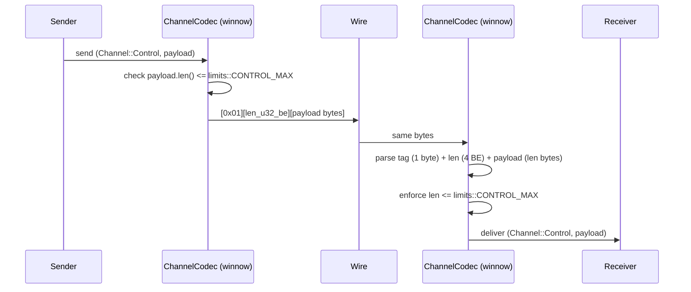
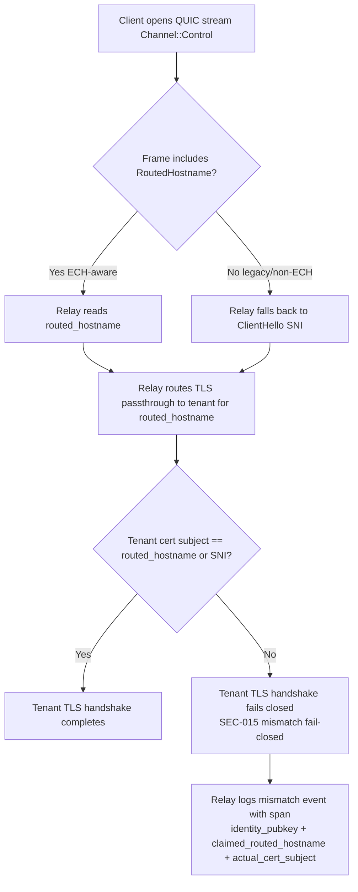

# feat(portal-wire): greenfield wire types, codecs, wire-protocol.md, threat-model.md

## Summary

Phase 1 of the `portal-tunnel-rs` roadmap. Lands the `portal-wire` crate (pure types + framing, **no I/O, no async**) plus the two specifications it implements:

1. `docs/wire-protocol.md` — single source of truth for greenfield framing, ALPN `portal/2`, channel tags, ed25519-signed `postcard` envelopes, claim sets, domain separators, ECH `routed_hostname` carriage, IPv6 dual-stack `RelayDescriptor`, MITM-probe label rename, postcard size budgets, and the v0.2-reserved `ReputationDelta` envelope.
2. `docs/threat-model.md` — adversary capabilities, multi-hop privacy claims, the 8 R10 threat classes (a–h), and the evaluation context for SEC-001..SEC-005.

`portal-wire` holds the type shapes only — it depends on `serde`, `postcard`, `winnow`, `tokio-util`, `bytes`, `compact_str`, `jiff`, `thiserror`, and `bon`. Crypto primitives (`ed25519-dalek`, `k256`, `secrecy`) are intentionally **not** in this crate's dep tree; signing/verification are Phase 2 (`portal-crypto`). Pubkeys appear here as opaque `[u8; 32]` arrays and signatures as `[u8; 64]` arrays so the type system records the shape without embedding crypto policy.

**Behavioral gate (per product-lens P1#4 / U2 verification):** `proptest` codec round-trip tests for postcard `Envelope`, `ReputationDelta`, `RelayDescriptor` canonical bytes, `HopRoute` canonical bytes, and `Channel`-tag framing land in this phase, not deferred.

## Problem Frame

The roadmap committed greenfield-wire (ADR-0001 in Phase 0). Every wire-touching crate downstream — `portal-crypto` (Phase 2), `portal-net` (Phase 3), `portal-relay` (Phase 5), `portal-sdk` (Phase 6a) — needs a single source of truth for type shapes, framing, claim sets, and domain separators **before** their implementations land. Without `docs/wire-protocol.md` finalized in this phase, downstream phases would fork the wire informally and re-converge late, costing rework and risking SEC-007 cross-protocol attacks (missing or inconsistent domain separators).

The threat model has the same upstream-blocker shape: SEC-001..SEC-005 deferred items in the roadmap explicitly list "evaluation context defined in `docs/threat-model.md`" as the precondition for Phase 5/6b crypto and policy work. R10's 8 threat classes (a–h) drive Phase 5's per-relay engine design and the v0.2 cross-relay propagation work — the catalog must exist before either is planned.

`portal-wire`'s code surface is small (the Go `types/` package is ~250 LoC across 7 files; we add postcard envelopes, framing, domain separators, and `bon`-derived constructors for ~600–800 LoC of Rust). The dominant artifact of this phase is the two `.md` documents.

## Requirements

Each requirement here is sourced from the roadmap (R1..R15 + SEC-001..015 + behavioral gate) and scoped to what `portal-wire` plus the two specs must satisfy.

- P1-R1. **Pure types + framing.** `portal-wire` exposes types, codecs, constants, and `winnow`-built `tokio_util::codec::Framed` adapters. No `tokio` runtime calls, no `quinn`, no `axum`, no `rustls`, no async fns.
- P1-R2. **`docs/wire-protocol.md` ships in same phase, not deferred.** Status `active`. Lands before the first `portal-wire` `src/*.rs` file beyond crate-skeleton.
- P1-R3. **`docs/threat-model.md` ships in same phase per SEC-006**, not deferred. Includes adversary capabilities, multi-hop privacy claims, R10 8-class enumeration (a–h), and SEC-001..005 evaluation context.
- P1-R4. **Greenfield wire.** Drops Go's `KEEPALIVE` (`0x00`), `RAW_TCP` (`0x01`), `TLS_ACTIVATE` (`0x02`) marker bytes. Drops ES256K JWT. Drops Go's `{ok, data?, error?}` JSON shape. Drops Go's single-string `Address` field on `RelayDescriptor`.
- P1-R5. **Transport / ALPN.** QUIC-only backhaul; ALPN identifier is `b"portal/2"`. HTTP/2 + HTTP/1.1 baseline for the public API surface (HTTP/3 deferred to Phase 5 evaluation).
- P1-R6. **Channel framing.** Per-stream typed prefix: `Channel::{Control, TcpProxy, UdpDatagram, HopRoute}` — 1-byte tag + `u32`-length-prefixed payload, parsed by `winnow` and emitted as `tokio_util::codec::Framed` adapter.
- P1-R7. **API auth envelope (replaces JWT).** `Envelope { payload: Bytes, sig: [u8; 64], claims: Claims }`, `postcard`-encoded. `Claims { nonce: [u8; 16], not_before: jiff::Timestamp, not_after: jiff::Timestamp, audience: Audience, purpose: Purpose }` — per **SEC-001**. Replay/expiry/audience binding fully specified at the type level.
- P1-R8. **Domain separators (SEC-007).** Five constants: `b"portal-tunnel/relay-descriptor/v1"`, `b"portal-tunnel/hop-route/v1"`, `b"portal-tunnel/lease-token/v1"`, `b"portal-tunnel/keyless-request/v1"`, `b"portal-tunnel/reputation-delta/v1"`. All postcard signing inputs prefix with the appropriate separator before being handed to `portal-crypto` for signing.
- P1-R9. **Lease token shape (SEC-003).** `LeaseToken { identity_pubkey: [u8;32], relay_pubkey: [u8;32], not_before, not_after, scope: Scope }`. Token reuse across relays / after expiry impossible by construction (relay verifies its own pubkey appears in the claim).
- P1-R10. **SIWE→ed25519 binding wire field reserved (SEC-002).** Phase 2 owns the binding *protocol*; Phase 1 reserves the wire field on `RegisterRequest` (`siwe_attestation: SiweAttestation`) so Phase 2 lands the binding without breaking the wire.
- P1-R11. **MITM probe label rename (SEC-013).** Greenfield rename of Go's `Portal-MITM-Probe-v1`. Locked: `b"portal-tunnel/mitm-probe/v2"` (RFC 5705 TLS exporter label). Documented as the only MITM-probe label.
- P1-R12. **Postcard envelope size budget per channel / message-type (SEC-014).** Hard caps as compile-time constants. Initial values (revisited in Phase 5 if traffic data forces a bump): Control envelope ≤ 8 KiB; HopRoute envelope ≤ 4 KiB; UdpDatagram payload ≤ 64 KiB (single UDP payload max); TcpProxy frame ≤ 16 KiB; ReputationDelta ≤ 1 KiB; LeaseToken ≤ 512 B; RelayDescriptor canonical bytes ≤ 4 KiB.
- P1-R13. **ECH-aware routing carriage (R13).** Phase 1 picks: **control-channel header** (`Channel::Control` first frame carries `RoutedHostname(CompactStr)`). Rejected: QUIC TLS custom extension (rustls extension API is unstable; couples wire to TLS layer).
- P1-R14. **SEC-015 ECH `routed_hostname` / inner-SNI mismatch verification.** Wire-protocol.md specifies (a) failure mode: TLS handshake fails closed when the tenant cert subject doesn't match the routed virtualhost, (b) proof no routing-confusion primitive exists against wildcard / shared-cert tenants, (c) keyless-oracle (Phase 6b SEC-004) input-validation refuses to sign when routing context disagrees. Non-ECH clients fall back to ClientHello SNI inspection on the tenant TLS surface (relay never decrypts ECH).
- P1-R15. **`ReputationDelta` envelope reserved for v0.2 (R10 split).** Phase 1 ships the type, the domain separator (`b"portal-tunnel/reputation-delta/v1"`), and the size budget so v0.2 ships propagation without a wire bump. v0.1 emits zero envelopes on the wire (verified via "no callers" search-gate test).
- P1-R16. **IPv6 carriage (R12).** `RelayDescriptor { addresses_v4: Vec<SocketAddrV4>, addresses_v6: Vec<SocketAddrV6>, ... }` replaces Go's single `Address` string. All listener-config wire shapes accept v6.
- P1-R17. **HTTP response wrapper.** `{"data": T}` on 2xx, `{"error": {"code": …, "message": …}}` on 4xx/5xx. HTTP status is the success/failure discriminator. `serde_json` codec. Distinct from the binary `Envelope`. RFC 7807 problem+json compatibility considered and rejected (round-trip with `utoipa` shape is cleaner with the `data`/`error` discriminator).
- P1-R18. **Versioning.** `/v1/` prefix on every endpoint (`/v1/sdk/…`, `/v1/admin/…`, `/v1/discovery/…`, `/v1/agent/…`). `/healthz` and `/metrics` are unversioned by convention (operational tooling — load balancers, k8s probes, monitoring — predates `/v1/` semantics).
- P1-R19. **Codec split.** Inner binary codec is `postcard` (deterministic, no_std-friendly). Outer HTTP body codec is `serde_json` (drives utoipa OpenAPI export consumed by Phase 7 Svelte regen pipeline).
- P1-R20. **Behavioral gate (BLOCKING for U-VERIFY).** `proptest` codec round-trip tests for: `Envelope` (postcard), `ReputationDelta` (postcard, even though no v0.1 emitter), `RelayDescriptor` canonical bytes (determinism + signature-input invariance under field reordering), `HopRoute` canonical bytes (same invariants), `Channel`-tag framing (random payload up to size cap → encode → decode → identity).

## Scope Boundaries

**In-scope (must land in this phase):**

- `crates/portal-wire/{Cargo.toml,src/**}` — types, codecs, constants, framed adapters, error enum, proptest tests.
- `docs/wire-protocol.md` — full greenfield spec.
- `docs/threat-model.md` — full adversary model + R10 8-class enumeration + SEC-001..005 evaluation context.
- CI gate (added to `.github/workflows/ci.yml` from Phase 0 or shipped as a Phase-1 patch to it): `wire-protocol.md` last-verified header must be ≥ `git log -1 --format=%H crates/portal-wire`.

**Out-of-scope (Phase 2+ owns):**

- Signing / verification / key generation (Phase 2 `portal-crypto`).
- SIWE message parsing or Ethereum signature recovery (Phase 2 `portal-crypto`).
- QUIC endpoint configuration, ALPN registration in rustls, listener plumbing (Phase 3 `portal-net`).
- TLS exporter MITM-probe extraction (Phase 6a `portal-sdk` consumes `wire::mitm::PROBE_LABEL`).
- Relay-side signing of `RelayDescriptor` / `HopRoute` (Phase 5 `portal-relay`).
- ACME / DNS-01 — unrelated wire surface (Phase 4 `portal-acme`).
- Lease lifecycle state machine (Phase 5 `portal-relay`).
- ECH key handling, ECH-aware client connect, SVCB lookups (Phase 6a `portal-sdk` + Phase 5 `portal-relay`).

**Deferred to v0.2 (per round-3 split — annotated on each affected unit below):**

- `ReputationDelta` envelope **emission and propagation** (R10 v0.2). Phase 1 ships the type and domain separator only.
- Server-side ECH on relay HTTPS API (R13 v0.2 — gated on rustls#1980).
- Cross-relay reputation envelopes / hop-mux per-hop accounting (R10 v0.2).
- `tokio-console` gRPC + `/admin/dashboard` HTML aggregator wire shapes (R11 v0.2).
- Rust-native (Leptos) admin SPA wire types (R14 v0.2 — utoipa-generated Rust types replace TS regen).
- Launch / Config / Admin TUI views (R15 v0.2).

## Context & Research

### Go reference surface (behavioral spec only — greenfield wire is the new source of truth)

Packed inputs (per roadmap "Pack research input"):

- `portal-tunnel/types/` (7 files, ~480 LoC):
  - `api.go` — `RegisterRequest/RegisterChallengeRequest/RegisterResponse/RenewRequest/RenewResponse/UnregisterRequest/HopRoute/DiscoveryResponse/DiscoveryAnnounce*/AdminLogin*/AdminSnapshot*/AdminApprovalMode*/AdminLandingPage*/AdminBPS*/AdminUDPSettings*/AdminTCPPortSettings*/TunnelStatusResponse/DomainResponse`
  - `identity.go` — `Identity { Name, Address, PublicKey, PrivateKey }`, `RelayIdentity` (extends with admin + WG keys), `LeaseMetadata`, `Lease`, `AdminLease`, `RelayDescriptor` (single `Address` string field — replaced per R12), `CanonicalBytes()` for descriptor signing input
  - `transport.go` — `DatagramFrame { FlowID, Payload, Address, RelayURL, UDPAddr }`, `EncodeDatagram/DecodeDatagram` (varint flowID + payload bytes)
  - `paths.go` — 40+ HTTP path constants (greenfield re-prefixes all SDK/admin/discovery to `/v1/`; keeps `/healthz` unversioned; drops `/install/*` and `/thumbnail/*` as non-wire concerns)
  - `error.go` — 30 `APIErrorCode*` constants + 2 MITM probe reason constants (the latter unused after greenfield rename per SEC-013)
  - `types.go` — `ReleaseVersion = "v2.1.9"`, `SDKVersion = "6"`, `DiscoveryVersion = "7"`, `MarkerKeepalive/RawStart/TLSStart` (all dropped per greenfield)
  - `agent.go` — `AgentStatusResponse/AgentTunnelStatus/AgentRelayStatus/AgentTunnelRequest/AgentRelayRequest/AgentMultiHopRequest`
- `portal-tunnel/portal/auth/` (4 files):
  - `lease_token.go` — Go uses ES256K JWT (`go-jose/v4`); greenfield drops both. Replaced by postcard `LeaseToken` with `(identity, relay_pubkey, expiry, scope)` claim set per SEC-003.
  - `relay_descriptor.go` — Go uses recoverable secp256k1 signatures (no out-of-band public key needed). Greenfield: ed25519 with explicit `signed_by_relay_pubkey` field; recovery shape replaced by explicit-key shape (simpler verification, no recovery quirks).
  - `hop_route.go` — Go uses non-recoverable secp256k1 + JSON canonicalization. Greenfield: ed25519 + postcard canonicalization (deterministic by encoder, no `omitempty` ordering hazards).
  - `register_challenge.go` — Go uses spruceid/siwe-go for EIP-4361 + nonce/domain validation. Phase 1 reserves the wire field for the SIWE attestation (SEC-002 binding); Phase 2 implements parsing + binding-verify.

### Type-shape decisions extracted from Go (not byte-compat ports)

| Go type | Rust shape (this phase) | Greenfield delta |
|---|---|---|
| `Identity { Name, Address, PublicKey, PrivateKey }` | `Identity { name: CompactStr, address: CompactStr, public_key: PublicKey32 }` (no private key on wire) | Drops `PrivateKey` JSON omission (it was always `json:"-"`); makes the omission a type guarantee. |
| `RelayDescriptor { Address: string, ... }` | `RelayDescriptor { addresses_v4: Vec<SocketAddrV4>, addresses_v6: Vec<SocketAddrV6>, ... }` | R12 dual-stack carriage. |
| `MarkerKeepalive/RawStart/TLSStart` (`0x00/0x01/0x02`) | `Channel::{Control, TcpProxy, UdpDatagram, HopRoute}` (`0x01..=0x04`; `0x00` reserved-illegal as guard) | Greenfield framing per ADR-0001. |
| `APIEnvelope[T] { Data, Error, OK }` | `HttpResponseWrapper<T>` discriminated by HTTP status: `Ok { data: T }` / `Err(ApiError { code, message })` | Drops `OK` field (HTTP status is the discriminator per R17). |
| `LeaseAccessTokenClaims` (ES256K JWT) | `LeaseToken { identity_pubkey, relay_pubkey, not_before, not_after, scope }` (postcard, ed25519-signed in Phase 2) | Drops JWT entirely (ADR-0001) + binds to `relay_pubkey` (SEC-003). |
| `HopRoute` (JSON-canonical, secp256k1 sig) | `HopRoute { ... }` + `canonical_bytes()` (postcard-canonical, ed25519 sig) | Domain separator + postcard determinism. |
| `DatagramFrame { FlowID, Payload, ... }` | `DatagramFrame { flow_id: u32, payload: Bytes }` (extra `Address/RelayURL/UDPAddr` fields are server-side metadata, not wire) | Trims wire field set to what crosses the wire. |
| `HeaderAccessToken = "X-Portal-Access-Token"` | `HEADER_ENVELOPE = "X-Portal-Envelope"` | Greenfield: header carries the postcard envelope (base64url-encoded), not a JWT. |

### Greenfield-only additions (no Go counterpart)

- `Envelope { payload: Bytes, sig: [u8; 64], claims: Claims }` — ed25519-signed postcard wrapper that replaces JWT. SEC-001 claim set.
- `Claims { nonce: [u8; 16], not_before: jiff::Timestamp, not_after: jiff::Timestamp, audience: Audience, purpose: Purpose }` — replay/expiry/audience binding.
- `Audience` enum: `RelayApiAdmin`, `RelayApiSdk`, `RelayApiDiscovery`, `Keyless`, `HopForward`. Bound to the receiving surface; wrong audience fails verification.
- `Purpose` enum: `Register`, `Renew`, `Unregister`, `HopAttest`, `KeylessSign`, `DiscoveryAnnounce`, `LeaseAccess`. Bound to the operation; cross-purpose replay fails verification.
- 5 domain separators per SEC-007.
- `RoutedHostname(CompactStr)` carried on the `Channel::Control` first frame (R13 carriage decision).
- `MITM_PROBE_LABEL = b"portal-tunnel/mitm-probe/v2"` (SEC-013 rename).
- Per-channel size budget constants (SEC-014).
- `ReputationDelta { identity_pubkey, score_delta: i32, decay_window: jiff::Span, reason_code: ReasonCode, signed_by_relay_pubkey: [u8; 32] }` (R10 v0.2 forward-compat reservation).
- `SiweAttestation { ed25519_pubkey: [u8; 32], siwe_message: String, siwe_signature: Bytes }` field on `RegisterRequest` (SEC-002 wire reservation).

### Tooling

- `postcard` (1.x) — inner binary codec.
- `serde_json` — outer HTTP body codec.
- `winnow` (1.x) — channel-tag + length-prefix parser.
- `tokio-util` — `codec::{Decoder, Encoder, Framed}` adapter so `quinn` streams (Phase 3) plug straight into `Framed<S, ChannelCodec>`.
- `bytes` — `Bytes` for zero-copy payload.
- `compact_str` — short identifiers (hostnames, route IDs).
- `jiff` — `Timestamp` / `Span` for `Claims`.
- `bon` — derive `Builder` for every constructor with ≥3 fields.
- `thiserror` — `wire::Error` enum with `#[non_exhaustive]`.
- `proptest` — round-trip property tests (behavioral gate).
- `insta` — snapshot the canonical-bytes output for `RelayDescriptor` and `HopRoute` so refactors that change the byte order surface in review.

## Key Technical Decisions

- **`portal-wire` carries no crypto deps.** Pubkeys are `[u8; 32]`, signatures `[u8; 64]`. Phase 2 `portal-crypto` re-exports `ed25519_dalek::VerifyingKey::try_from` over these arrays. Justification: keeps the Phase 1 dep tree tiny, lets `portal-wire` compile in `no_std` if we ever want `cargo check --no-default-features` smoke; isolates crypto-policy churn (FIPS, PQ) from the wire-shape crate.
- **Channel tag values: `Control = 0x01`, `TcpProxy = 0x02`, `UdpDatagram = 0x03`, `HopRoute = 0x04`.** `0x00` is **reserved-illegal** to act as a guard against legacy Go `MarkerKeepalive` (any peer that sends `0x00` is rejected with a typed error, surfacing greenfield-vs-Go drift loudly during QA). 1-byte tag width chosen over 2-byte: 256 channels is plenty (we have 4).
- **`routed_hostname` carriage = control-channel header** (rejected: QUIC TLS extension). Justification: rustls' custom-extension API is unstable; tying wire shape to TLS extension layer couples Phase 1 to Phase 3+5 implementation choices and rejects the layering principle. The control-channel approach also lets the field be visible in `tracing` spans, which the security review (SEC-015) requires for diagnosability of routing-mismatch failures.
- **`Envelope` is postcard, response wrapper is JSON.** Two distinct codecs, two distinct names. "Envelope" = signed binary auth wrapper; "ResponseWrapper" = JSON HTTP body shape. The naming is locked here so no downstream phase confuses the two surfaces.
- **`LeaseToken` includes `relay_pubkey` (SEC-003).** Tokens minted by relay R cannot be replayed against relay R'; the verifier checks `claims.relay_pubkey == self.identity.public_key()` at the policy layer.
- **`Audience` + `Purpose` are sealed enums on `Claims`.** Cross-audience and cross-purpose replay attacks fail at deserialization (postcard rejects unknown discriminants) and at the verifier (audience must match the surface).
- **`ReputationDelta` ships in v0.1 wire types but is NOT emitted on the wire.** A CI grep gate (`! rg -F "ReputationDelta::new\|emit_reputation_delta\|broadcast_reputation_delta" crates/portal-relay crates/portal-net crates/portal-sdk`) makes "v0.1 silently emits a v0.2 envelope" a CI failure. The type, domain separator, and size budget are present so v0.2 can light up emission without a wire bump.
- **ALPN identifier `portal/2`.** The "2" is the protocol generation, not the version; `/v2/` HTTP path bumps would still keep `portal/2` ALPN until the QUIC framing itself changes incompatibly.
- **HTTP response wrapper rejects RFC 7807.** Considered but rejected: utoipa's OpenAPI generation reads cleaner with the `{ "data": T }` / `{ "error": { code, message } }` discriminator than with the RFC 7807 `type/title/status/detail/instance` shape. The former composes naturally with `Result<T, ApiError>` in handlers; the latter forces every handler to construct a problem-document.
- **Postcard size budgets are constants in `wire::limits`, enforced by codec.** `winnow` length-prefix parser checks against the per-channel cap before allocating; oversized frames return `Error::FrameTooLarge`. Prevents amplification (SEC-014) at the wire layer, not just at policy.
- **MITM probe label locked to `b"portal-tunnel/mitm-probe/v2"`.** RFC 5705 exporter labels are namespaced and version-bumpable. The "v2" denotes the protocol generation, parallel to ALPN `portal/2`.
- **Drift CI gate: wire-protocol.md must list "Last verified against `crates/portal-wire` commit: <SHA>".** A scripted CI step fails when `git log -1 --format=%H crates/portal-wire` differs from the recorded SHA. Forces every `portal-wire` PR to either re-affirm the spec or update it.

## Open Questions

### Resolved during this planning round

- *Channel tag width?* — 1 byte (256-way is enough; 4 channels today).
- *`0x00` tag handling?* — reserved-illegal, returns `Error::LegacyKeepaliveByte` (loud Go-drift detector).
- *MITM probe label?* — `b"portal-tunnel/mitm-probe/v2"`.
- *`routed_hostname` carriage?* — control-channel first-frame header.
- *`Envelope` shape?* — `{ payload: Bytes, sig: [u8; 64], claims: Claims }` (postcard).
- *Claim set shape?* — SEC-001: `nonce`, `not_before`, `not_after`, `audience`, `purpose`. `nonce` is `[u8; 16]` (128-bit, enough for ~2^64 envelopes per audience+purpose without collision risk).
- *HTTP response wrapper?* — `{"data": T}` / `{"error": {code, message}}`. Reject RFC 7807.
- *`/v1/` versioning scope?* — every endpoint except `/healthz` and `/metrics`.
- *RelayDescriptor IPv6 carriage?* — split fields `addresses_v4: Vec<SocketAddrV4>` + `addresses_v6: Vec<SocketAddrV6>` (rejected: single `Vec<SocketAddr>` because typed v4/v6 lists make per-stack policy code self-documenting).
- *`ReputationDelta` v0.1 enforcement?* — type ships, no callers; CI grep gate fails on v0.1 emission attempts.
- *Postcard size budgets?* — Control 8 KiB, HopRoute 4 KiB, UdpDatagram 64 KiB, TcpProxy 16 KiB, ReputationDelta 1 KiB, LeaseToken 512 B, RelayDescriptor canonical 4 KiB. Phase 5 may amend with operator data.
- *`portal-wire` crypto deps?* — none. Pubkeys/sigs as opaque byte arrays.

### Deferred to downstream phases

- *Exact `ReasonCode` enum variants for `ReputationDelta`?* — Phase 5 (per-relay R10 engine) defines them; v0.2 envelope honors them. v0.1 wire reserves `ReasonCode(u16)` opaque numeric for forward compat.
- *Concrete `Scope` enum variants for `LeaseToken`?* — Phase 5 (lease lifecycle) defines them. v0.1 wire reserves `Scope { tcp: bool, udp: bool, hop: bool, max_bps: Option<u64> }`.
- *RFC 8446 ALPN registration with IANA?* — out of scope (greenfield protocol; private ALPN until protocol stabilizes per ADR-0001).
- *`tokio-console` / `/admin/dashboard` wire shapes?* — v0.2.
- *Leptos shared-types layer (R14 v0.2)?* — utoipa generates Rust types; no separate wire definition needed.
- *TUI Launch / Config / Admin view event shapes (R15 v0.2)?* — out of scope.

## High-Level Technical Design

### Crate module layout

```mermaid
graph TD
    lib[lib.rs<br/>re-exports + doc]
    constants[wire::constants<br/>ALPN, versions, headers]
    domain[wire::domain_separators<br/>5 SEC-007 separators]
    channel[wire::channel<br/>Channel enum + ChannelCodec]
    envelope[wire::envelope<br/>Envelope + Claims + Audience + Purpose]
    response[wire::response<br/>HttpResponseWrapper + ApiError + ApiErrorCode]
    descriptor[wire::descriptor<br/>RelayDescriptor + canonical_bytes]
    hop[wire::hop<br/>HopRoute + canonical_bytes]
    lease[wire::lease<br/>LeaseToken + Scope]
    siwe[wire::siwe<br/>SiweAttestation field reservation]
    reputation[wire::reputation<br/>ReputationDelta + ReasonCode v0.2 reservation]
    routed[wire::routed_hostname<br/>RoutedHostname newtype]
    mitm[wire::mitm<br/>PROBE_LABEL constant]
    datagram[wire::datagram<br/>DatagramFrame]
    paths[wire::paths<br/>versioned HTTP path constants]
    api[wire::api<br/>RegisterRequest etc. JSON DTOs]
    limits[wire::limits<br/>per-channel size budgets]
    error[wire::error<br/>thiserror enum]
    tests[tests/proptest_*.rs<br/>round-trip + canonical-bytes]

    lib --> constants
    lib --> domain
    lib --> channel
    lib --> envelope
    lib --> response
    lib --> descriptor
    lib --> hop
    lib --> lease
    lib --> siwe
    lib --> reputation
    lib --> routed
    lib --> mitm
    lib --> datagram
    lib --> paths
    lib --> api
    lib --> limits
    lib --> error
    channel --> limits
    envelope --> limits
    envelope --> domain
    descriptor --> domain
    hop --> domain
    lease --> domain
    reputation --> domain
```



### Envelope sign / verify data flow (Phase 2 consumes; Phase 1 just defines the shapes)

```mermaid
sequenceDiagram
    participant Caller
    participant pwire as portal-wire
    participant pcrypto as portal-crypto (Phase 2)

    Caller->>pwire: build payload (Bytes)
    Caller->>pwire: build Claims { nonce, nbf, naf, audience, purpose }
    pwire->>pwire: postcard::to_allocvec(&(separator, payload, claims))
    pwire-->>Caller: signing_input: Vec<u8>
    Caller->>pcrypto: sign(signing_input, ed25519_secret_key)
    pcrypto-->>Caller: sig: [u8; 64]
    Caller->>pwire: Envelope { payload, sig, claims }
    pwire->>pwire: postcard::to_allocvec(&envelope)
    pwire-->>Caller: wire_bytes: Vec<u8>
```

### Channel framing on a QUIC stream



### ECH `routed_hostname` mismatch decision tree (SEC-015)



### Crate boundary recap

`portal-wire` depends only on stable third-party crates and on the type system. It is consumed by every other crate in the workspace except `portal-acme` (which talks to ACME servers, an unrelated wire). `portal-crypto` (Phase 2) implements the signing/verification operations over `Envelope::signing_input()`, `RelayDescriptor::canonical_bytes()`, `HopRoute::canonical_bytes()`, `LeaseToken::canonical_bytes()`, and `ReputationDelta::canonical_bytes()`.

## Implementation Units

Atomic, ≤200 LoC substantive diff per commit (per AGENTS.md). Each unit lists the v0.1-vs-v0.2 split tag where R10/R11/R13/R14/R15 apply.

- **U1. `docs/wire-protocol.md` — full greenfield spec (BLOCKING for all `portal-wire` code units; lands first).**

  **Scope tags:** R10 v0.2 forward-compat reservation noted; R12 v0.1; R13 v0.1 stable baseline + tenant ECH-aware routing carriage; R14/R15 not applicable to wire spec.

  **Goal:** Single source of truth for greenfield wire. Includes: ALPN `portal/2`, channel tag table, envelope shape + Claims (SEC-001), 5 domain separators (SEC-007), MITM probe label rename (SEC-013), per-channel size budgets (SEC-014), `routed_hostname` carriage decision + SEC-015 mismatch policy, IPv6 carriage on `RelayDescriptor` (R12), `ReputationDelta` reserved-for-v0.2 envelope (R10 split), HTTP response wrapper, `/v1/` versioning rule, postcard-vs-JSON codec split, header field name `X-Portal-Envelope`, lease-token claim set (SEC-003), SIWE attestation wire-field reservation (SEC-002).

  **Files:** Create `docs/wire-protocol.md` with required sections: Status (active), ALPN + Versioning, Framing + Channel tags, Envelope + Claims, Domain Separators, RelayDescriptor + Canonical Bytes, HopRoute + Canonical Bytes, LeaseToken + Scope, SIWE Attestation (reserved), ReputationDelta (v0.2 reserved), RoutedHostname + ECH Carriage + SEC-015 Mismatch Policy, MITM Probe Label, Postcard Size Budgets, HTTP Response Wrapper, Path Constants, Drift Gate header.

  **Verification:** Markdown lint clean; every greenfield commitment from roadmap "Wire-protocol register" section is referenced; Drift-Gate header present with placeholder `Last verified against crates/portal-wire commit: <unset>`.

- **U2. `docs/threat-model.md` — adversary model, R10 8-class enumeration, SEC-001..005 evaluation context (SEC-006).**

  **Scope tags:** R10 v0.1 (per-relay defense surface) + R10 v0.2 (cross-relay propagation surface) both characterized.

  **Goal:** Document adversary capabilities (passive observer, active MITM, malicious relay, malicious tenant, registry poisoner), multi-hop privacy claims (each relay knows only its slice of routing), and the 8 R10 threat classes (a) single-relay rate-limit bypass, (b) cross-relay coordinated abuse [v0.2 mitigation], (c) Sybil identity creation, (d) eclipse attacks on relay-set selection, (e) hop-mux traffic laundering [v0.2 mitigation], (f) discovery-pool descriptor poisoning, (g) scan/probe attacks, (h) DDoS amplification. Lays out the v0.1 deployment surface (rustls-MANDATORY relay HTTPS API + axum admin/SDK/discovery routers + keyless mTLS + QUIC backhaul + lease registry + ACME issuance + SIWE registration + IPv6 dual-stack listeners + per-relay R10 engine). Lists SEC-001..SEC-005 evaluation context (what each ID claims; what evidence Phase 1/2/5 ships to substantiate it).

  **Files:** Create `docs/threat-model.md`.

  **Verification:** Every R10 class (a–h) appears with a v0.1 mitigation row + v0.2 mitigation row; SEC-001..SEC-005 each have a "Phase that proves this" row pointing at U6/U9/U11/U13 (this plan) for SEC-001/SEC-007/SEC-003 and at Phase 2/5/6b for SEC-002/SEC-004/SEC-005.

- **U3. `crates/portal-wire/Cargo.toml` + `src/lib.rs` skeleton + `wire::error` + `wire::limits` constants.**

  **Scope tags:** none (foundational).

  **Goal:** Stand up the crate with workspace-inherited lints, dep declarations referencing `[workspace.dependencies]` only, public `mod` re-exports for the modules U4..U16 land in, `wire::Error` thiserror enum (`#[non_exhaustive]`) with variants `FrameTooLarge { channel, max, actual }`, `LegacyKeepaliveByte`, `UnknownChannelTag(u8)`, `Postcard(#[from] postcard::Error)`, `JsonDecode(#[from] serde_json::Error)`, `LengthPrefixOverflow`, plus `wire::limits` constants per P1-R12.

  **Files:** Create `crates/portal-wire/Cargo.toml`, `crates/portal-wire/src/lib.rs`, `crates/portal-wire/src/error.rs`, `crates/portal-wire/src/limits.rs`.

  **Verification:** `cargo build -p portal-wire` and `cargo clippy -p portal-wire --all-targets -- -D warnings` pass on a fresh clone.

- **U4. `wire::constants` (ALPN, versions, header names) + `wire::domain_separators` (5 SEC-007 separators) + `wire::mitm` (PROBE_LABEL).**

  **Scope tags:** R13 v0.1 (MITM probe label rename per SEC-013).

  **Goal:** Lock all the byte-string constants the rest of the crate references. `pub const ALPN: &[u8] = b"portal/2"`. `pub const HEADER_ENVELOPE: &str = "X-Portal-Envelope"`. `pub const PROTOCOL_GENERATION: u8 = 2`. 5 domain separators (relay-descriptor / hop-route / lease-token / keyless-request / reputation-delta), all `&'static [u8]`. `pub const MITM_PROBE_LABEL: &[u8] = b"portal-tunnel/mitm-probe/v2"`.

  **Files:** Create `crates/portal-wire/src/constants.rs`, `crates/portal-wire/src/domain_separators.rs`, `crates/portal-wire/src/mitm.rs`.

  **Verification:** Doc-test asserts each separator is unique (`HashSet::from(separators).len() == 5`); doc-test asserts `MITM_PROBE_LABEL` differs from Go's `Portal-MITM-Probe-v1` byte-for-byte.

- **U5. `wire::channel` — `Channel` enum (`#[non_exhaustive]`) + `ChannelCodec` (winnow parser + `tokio_util::codec::{Encoder, Decoder}`).**

  **Scope tags:** none (greenfield framing).

  **Goal:** 1-byte tag (`0x01..=0x04`) + `u32`-BE length + payload. `Channel::Control = 0x01`, `Channel::TcpProxy = 0x02`, `Channel::UdpDatagram = 0x03`, `Channel::HopRoute = 0x04`. `0x00` returns `Error::LegacyKeepaliveByte` (Go-drift detector). Unknown tag returns `Error::UnknownChannelTag(u8)`. Per-channel size cap from `wire::limits` enforced at decode.

  **Files:** Create `crates/portal-wire/src/channel.rs`.

  **Verification:** Unit tests: encode → decode round-trip for each channel; oversized payload rejected with `FrameTooLarge`; `0x00` rejected with `LegacyKeepaliveByte`; `0x05..=0xff` rejected with `UnknownChannelTag`.

- **U6. `wire::envelope` — `Envelope`, `Claims`, `Audience`, `Purpose` + `Envelope::signing_input(domain_separator)`. (SEC-001.)**

  **Scope tags:** none (foundational; replaces JWT entirely per ADR-0001).

  **Goal:** Postcard struct `Envelope { payload: Bytes, sig: [u8; 64], claims: Claims }`. `Claims { nonce: [u8; 16], not_before: jiff::Timestamp, not_after: jiff::Timestamp, audience: Audience, purpose: Purpose }`. `Audience` and `Purpose` are sealed `#[non_exhaustive]` enums per Key Technical Decisions. `Envelope::signing_input(separator: &[u8]) -> Vec<u8>` returns `postcard::to_allocvec(&(separator, &payload, &claims))` so Phase 2 signs deterministic bytes.

  **Files:** Create `crates/portal-wire/src/envelope.rs`.

  **Verification:** Unit test: changing `audience` changes `signing_input` bytes; doc-test: `Claims` builder via `bon::Builder` rejects `not_before > not_after` at build time.

- **U7. `wire::response` — `HttpResponseWrapper<T>` + `ApiError` + `ApiErrorCode` enum. (R17.)**

  **Scope tags:** R14 v0.2 affects whether utoipa-generated TS or utoipa-generated Rust types consume this — wire shape is the same either way.

  **Goal:** `#[serde(untagged)] enum HttpResponseWrapper<T> { Ok { data: T }, Err { error: ApiError } }`. `ApiError { code: ApiErrorCode, message: CompactStr }`. `ApiErrorCode` is a sealed enum porting all Go `APIErrorCode*` constants (rate_limited, unauthorized, lease_not_found, etc.) + greenfield-only additions (envelope_signature_invalid, envelope_replay, envelope_audience_mismatch, envelope_purpose_mismatch, routed_hostname_mismatch, frame_too_large, legacy_keepalive_byte, unknown_channel_tag).

  **Files:** Create `crates/portal-wire/src/response.rs`.

  **Verification:** insta snapshot of JSON serialization for each variant; round-trip test (`Ok { data: 42i32 }` ↔ `{"data": 42}`).

- **U8. `wire::descriptor` — `RelayDescriptor` (R12 dual-stack) + `canonical_bytes()`.**

  **Scope tags:** R12 v0.1 (IPv6 dual-stack `addresses_v4`/`addresses_v6` carriage).

  **Goal:** `RelayDescriptor { relay_pubkey: [u8;32], addresses_v4: Vec<SocketAddrV4>, addresses_v6: Vec<SocketAddrV6>, version: CompactStr, issued_at, expires_at, api_https_addr_v4, api_https_addr_v6, supports_overlay: bool, supports_udp: bool, supports_tcp: bool, active_connections: u64, tcp_bps: f64 }`. `canonical_bytes(&self) -> Vec<u8>` = `postcard::to_allocvec(&(DOMAIN_SEPARATOR_RELAY_DESCRIPTOR, sort(self.addresses_v4), sort(self.addresses_v6), …))` — sorting v4/v6 lists makes canonical bytes order-independent. Signature lives **outside** the canonical-bytes input (Phase 2 attaches `signature: [u8; 64]` to `SignedRelayDescriptor`).

  **Files:** Create `crates/portal-wire/src/descriptor.rs`.

  **Verification:** Proptest: shuffled `addresses_v4` / `addresses_v6` lists produce the same `canonical_bytes()`; insta snapshot of canonical bytes for a fixed descriptor.

- **U9. `wire::hop` — `HopRoute` + `canonical_bytes()`. Greenfield (postcard, ed25519).**

  **Scope tags:** none.

  **Goal:** `HopRoute { owner_pubkey: [u8;32], relay_url: CompactStr, match_hostname: Option<CompactStr>, match_token: Option<CompactStr>, metadata: LeaseMetadata, forward_relay: RelayDescriptor, forward_token: CompactStr, first_seen_at: jiff::Timestamp, expires_at: jiff::Timestamp }`. `canonical_bytes(method: HttpMethod, route: &HopRoute) -> Vec<u8>` = `postcard::to_allocvec(&(DOMAIN_SEPARATOR_HOP_ROUTE, method, owner_pubkey, …))`. `HttpMethod` is a sealed enum (`Get/Put/Post/Delete`) so the canonical bytes encode the binding to the verb the route attests.

  **Files:** Create `crates/portal-wire/src/hop.rs`.

  **Verification:** Proptest: changing `method` changes `canonical_bytes`; insta snapshot.

- **U10. `wire::lease` — `LeaseToken` + `Scope`. (SEC-003.)**

  **Scope tags:** none.

  **Goal:** `LeaseToken { identity_pubkey: [u8;32], relay_pubkey: [u8;32], not_before, not_after, scope: Scope }`. `Scope { tcp: bool, udp: bool, hop: bool, max_bps: Option<u64> }`. `canonical_bytes(&self) -> Vec<u8>` = `postcard::to_allocvec(&(DOMAIN_SEPARATOR_LEASE_TOKEN, &self))`. Token reuse impossible by construction: `relay_pubkey` is part of the signed bytes, so a token minted by relay R fails verification at relay R'.

  **Files:** Create `crates/portal-wire/src/lease.rs`.

  **Verification:** Proptest round-trip; doc-test that asserts canonical bytes change when `relay_pubkey` changes by one bit.

- **U11. `wire::siwe` — `SiweAttestation` field reservation. (SEC-002.)**

  **Scope tags:** none (Phase 1 reserves wire field; Phase 2 implements binding-verify).

  **Goal:** `SiweAttestation { ed25519_pubkey: [u8;32], siwe_message: String, siwe_signature: Bytes }` — wire shape only. The verification logic (siwe-rs ParseMessage + ECDSA-recover-vs-Ethereum-address + ed25519_pubkey-binding-attestation) is Phase 2 / `portal-crypto`.

  **Files:** Create `crates/portal-wire/src/siwe.rs`.

  **Verification:** Type compiles; serde round-trip via JSON (used by `RegisterRequest`).

- **U12. `wire::routed_hostname` — `RoutedHostname` newtype. (R13 carriage decision.)**

  **Scope tags:** R13 v0.1 (tenant ECH-aware routing wire field).

  **Goal:** `RoutedHostname(CompactStr)` newtype with `validate()` that rejects empty / non-ASCII-DNS hostnames at construction. Carried inside the `Channel::Control` first frame as part of the connection-handshake message (`ControlHandshake { routed_hostname: Option<RoutedHostname>, … }` lands in U13's reputation/api section as part of the broader `wire::api` types).

  **Files:** Create `crates/portal-wire/src/routed_hostname.rs`.

  **Verification:** Unit tests: empty string rejected; uppercase hostnames normalized to lowercase; punycode IDNs accepted as-is.

- **U13. `wire::reputation` — `ReputationDelta` + `ReasonCode`. (R10 v0.2 wire reservation; v0.1 emits zero.)**

  **Scope tags:** **R10 v0.2** — type ships in v0.1 wire crate; v0.1 has no callers; CI grep gate (added in U16) fails on v0.1 emit attempts.

  **Goal:** `ReputationDelta { identity_pubkey: [u8;32], score_delta: i32, decay_window: jiff::Span, reason_code: ReasonCode, signed_by_relay_pubkey: [u8;32] }`. `ReasonCode(u16)` opaque numeric (Phase 5 R10 engine names variants in v0.2). `canonical_bytes(&self)` = `postcard::to_allocvec(&(DOMAIN_SEPARATOR_REPUTATION_DELTA, &self))`. Size budget enforced via `wire::limits::REPUTATION_DELTA_MAX = 1024`.

  **Files:** Create `crates/portal-wire/src/reputation.rs`.

  **Verification:** Proptest round-trip (behavioral gate — see U17); doc-comment explicitly tags type as "v0.2 wire — no v0.1 emitter".

- **U14. `wire::datagram` — `DatagramFrame` (UDP datagram channel payload).**

  **Scope tags:** none.

  **Goal:** `DatagramFrame { flow_id: u32, payload: Bytes }` with winnow parser: varint flowID + payload. Differs from Go `DatagramFrame` by stripping `Address/RelayURL/UDPAddr` (those are server-side metadata, not wire). Size cap from `wire::limits::UDP_DATAGRAM_MAX = 65_536`.

  **Files:** Create `crates/portal-wire/src/datagram.rs`.

  **Verification:** Proptest round-trip; oversized payload rejected.

- **U15. `wire::paths` (versioned HTTP path constants) + `wire::api` (JSON DTO ports).**

  **Scope tags:** R11 v0.1 (`/metrics` unversioned per R18); R14 utoipa Rust types in v0.2 consume these; R15 not applicable.

  **Goal:** Port Go `paths.go` with `/v1/` prefix on every endpoint except `/healthz` and `/metrics`. `wire::api` ports the JSON DTOs from Go `api.go` and `agent.go`: `RegisterRequest { challenge_id, siwe_attestation: SiweAttestation, reported_ip: Option<IpAddr> }` (note: bumped to use `SiweAttestation` per SEC-002 reservation), `RegisterChallengeRequest/Response`, `RegisterResponse`, `RenewRequest/Response`, `UnregisterRequest`, `DiscoveryAnnounceRequest/Response`, `DiscoveryResponse`, `DomainResponse`, `TunnelStatusResponse`, `AdminLoginRequest/Response`, `AdminAuthStatusResponse`, `AdminSnapshotResponse`, `AdminApprovalModeRequest/Response`, `AdminLandingPageSettingsRequest/Response`, `AdminBPSRequest`, `AdminUDPSettingsRequest/Response`, `AdminTCPPortSettingsRequest/Response`, `AgentStatusResponse/AgentTunnelStatus/AgentRelayStatus/AgentTunnelRequest/AgentRelayRequest/AgentMultiHopRequest`. Each derives `serde::{Serialize, Deserialize}` and `bon::Builder` where ≥3 fields. Each marked `#[non_exhaustive]`.

  **Files:** Create `crates/portal-wire/src/paths.rs` and `crates/portal-wire/src/api.rs`.

  **Verification:** insta snapshot per DTO of canonical JSON; doc-test confirms every Go `paths.go` const that survives greenfield triage maps to a Rust constant.

- **U16. CI gates: drift detector + v0.1 ReputationDelta no-emit grep.**

  **Scope tags:** R10 v0.1/v0.2 split enforcement.

  **Goal:** Two CI steps added to `.github/workflows/ci.yml` (Phase 0 file):

  1. **Spec drift gate:** `xtask wire-drift-check` reads the `Last verified against crates/portal-wire commit: <SHA>` header from `docs/wire-protocol.md`, compares to `git log -1 --format=%H crates/portal-wire`, fails CI if behind.
  2. **v0.1 ReputationDelta no-emit gate:** `! rg -F -e 'ReputationDelta::new' -e 'ReputationDelta {' crates/portal-relay crates/portal-net crates/portal-sdk crates/portal-cli crates/portal-relay-bin crates/portal-demo` — fails CI if any caller surfaces in v0.1 crates. (`crates/portal-wire` and `crates/portal-crypto` allowed callers.)

  **Files:** Modify `.github/workflows/ci.yml` (Phase 0); create `xtask/src/wire_drift_check.rs`.

  **Verification:** CI red on a smoke commit that adds `ReputationDelta { … }` to `crates/portal-relay/`; CI red on a smoke commit that touches `crates/portal-wire/src/` without bumping the wire-protocol.md header.

- **U17. Behavioral gate — proptest codec round-trip suite. (Per product-lens P1#4 / U2 verification clause.)**

  **Scope tags:** R10 forward-compat coverage (`ReputationDelta` round-trip even though v0.1 doesn't emit).

  **Goal:** `crates/portal-wire/tests/proptest_*.rs`. Five proptest suites: (1) `Envelope` round-trip — random `payload`/`claims` → postcard serialize → deserialize → identity; (2) `ReputationDelta` round-trip — same shape (forward-compat); (3) `RelayDescriptor` canonical-bytes determinism — random descriptor + shuffled `addresses_v4`/`addresses_v6` lists must produce identical `canonical_bytes`; (4) `HopRoute` canonical-bytes determinism — same shape; (5) `Channel`-tag framing — random `(channel, payload ≤ size_cap)` → encode → decode → identity, plus shrink-tested oversized-payload rejection.

  **Files:** Create `crates/portal-wire/tests/proptest_envelope.rs`, `tests/proptest_reputation_delta.rs`, `tests/proptest_descriptor.rs`, `tests/proptest_hop_route.rs`, `tests/proptest_channel_framing.rs`.

  **Verification:** `cargo nextest run -p portal-wire` passes with `PROPTEST_CASES=4096` on CI.

## System-Wide Impact

- **Downstream-crate type-graph propagation.** Every other workspace crate (except `portal-acme`) takes `portal-wire` as a direct dep. Phase 2 (`portal-crypto`) consumes `Envelope::signing_input`, `RelayDescriptor::canonical_bytes`, `HopRoute::canonical_bytes`, `LeaseToken::canonical_bytes`, `ReputationDelta::canonical_bytes`. Phase 3 (`portal-net`) plugs `ChannelCodec` into `quinn` streams via `tokio_util::codec::Framed`. Phase 5 (`portal-relay`) builds axum handlers over `wire::api` DTOs and `HttpResponseWrapper<T>`; lease lifecycle reads/writes `LeaseToken`. Phase 6a (`portal-sdk`) uses `MITM_PROBE_LABEL` for the rustls TLS exporter call; emits `RoutedHostname` on the control channel for ECH-aware connects.
- **R10 v0.1/v0.2 split is enforced at the crate boundary.** v0.1 ships the type, the domain separator, and the size budget; v0.1 has no callers (CI grep gate per U16); v0.2 lights up emission without a wire bump.
- **R12 IPv6 invariant baseline lands here.** `RelayDescriptor` carries split `addresses_v4`/`addresses_v6` lists. The IPv4-mapped-IPv6 canonicalization invariant (`::ffff:0:0/96` → 32-bit v4 before policy lookup) is owned by `crates/portal-relay/src/listeners/` (Phase 5) — `portal-wire` exposes only the typed addresses; canonicalization is a policy/listener concern.
- **R13 v0.1 baseline.** Wire-protocol.md documents stable baseline TLS (TLS 1.3 + AEAD-only + Ed25519/ECDSA-P256/RSA + HSTS preload + cookie hardening + HTTP→HTTPS 308). ECH GREASE on the relay's own HTTPS is a Phase 5 listener-config concern; tenant ECH-aware routing wire field (`RoutedHostname`) lands here. Server-side ECH on relay HTTPS deferred to v0.2.
- **R14 v0.1.** Wire-protocol.md treats the bundled React + SvelteKit assets as out-of-scope for the wire spec; the API DTOs in `wire::api` plus utoipa-generated TypeScript (Phase 7) are what the bundle consumes.
- **R15 v0.1.** TUI Tunnel-view + Status-view event shapes are out of scope for `portal-wire` — they're internal to `portal-cli` (Phase 6a) and `portal-relay-bin` (Phase 7) and don't cross the wire.
- **OpenAPI invariant downstream.** Phase 7 `xtask openapi-export` generates `docs/openapi.yaml` from `utoipa::Path` annotations on Phase 5 axum routes that consume `wire::api` DTOs. The DTOs being defined here in postcard-friendly + serde-friendly form (no `Bytes` in JSON DTOs except where base64-encoded) is the precondition for that pipeline working.
- **Header field name lock.** `HEADER_ENVELOPE = "X-Portal-Envelope"` replaces Go's `HeaderAccessToken = "X-Portal-Access-Token"`. Single owner: `wire::constants`. Every consumer (axum middleware, sdk client) reads the constant.
- **Drift CI gate (U16) becomes the contract.** Any future `portal-wire` PR that adds/changes a wire shape MUST also touch `docs/wire-protocol.md` and bump the "Last verified" header — or CI fails. Removes the entire "wire spec drifted from code" risk class.

## Risks & Dependencies

| Risk | Mitigation |
|---|---|
| `wire-protocol.md` and `crates/portal-wire/src/` drift over time. | U16 drift CI gate. Every `portal-wire` PR bumps the header or fails CI. |
| `ReputationDelta` accidentally emitted in v0.1 (R10 split violation). | U16 grep CI gate. Smoke commit that adds an emitter to v0.1 crates fails CI. |
| Postcard size budgets (SEC-014) chosen wrong; Phase 5 traffic data forces a bump. | Constants live in `wire::limits`; bump is a one-line change + spec amendment. Wire shape is unchanged (length-prefix is `u32`); only the cap moves. |
| `routed_hostname` carriage decision (control-channel header) leaks routing target before TLS. | The leak is intentional — the outer hostname is the relay (which is public), not the tenant. ECH protects the inner SNI which is what tenant routing privacy actually requires. Documented in wire-protocol.md SEC-015 section. |
| Domain separator naming locked at `v1`; future protocol generation changes force per-separator bumps. | Acceptable — separator-level bumps are cheaper than ALPN-level bumps; the protocol-generation suffix matches ALPN `portal/2` so the lockstep is intentional, not accidental. |
| `Audience` / `Purpose` enums are sealed; future surfaces require enum amendments + ADR. | Acceptable — sealedness is the security property (SEC-001). Adding a variant is a wire-version bump; the alternative (open enum) silently accepts cross-purpose envelopes. |
| `MITM_PROBE_LABEL` chosen here without Phase 6a SDK exporter validation. | Phase 6a smoke test (relay + SDK in-process exporter exchange) verifies the label round-trips; Phase 1 only locks the byte string. |
| `LeaseToken.relay_pubkey` binding (SEC-003) requires Phase 5 verifier to check `claims.relay_pubkey == self.identity.public_key()`. Phase 1 only ships the type; verifier discipline lives downstream. | Documented in wire-protocol.md as a normative MUST for Phase 5 verifier; Phase 5 plan inherits the obligation. |
| `SiweAttestation` field reservation (SEC-002) without Phase 2 binding-verify lands an unverifiable field on the wire. | Documented in wire-protocol.md as "v0.1 implementations MUST reject `RegisterRequest` payloads where `siwe_attestation` is absent or fails Phase 2 binding-verify; Phase 1 ships the type, Phase 2 ships the verifier. v0.1 of `portal-relay` (Phase 5) gates registration on Phase 2 being merged." |
| Spec section count grows beyond the maintainable; reviewers tune out. | edit-article skill applied at PR review; mermaid diagrams compress sequences that would otherwise need 3 paragraphs. |

## Documentation / Operational Notes

- `docs/wire-protocol.md` and `docs/threat-model.md` accumulate one ADR cross-link per non-trivial decision (e.g., `routed_hostname` carriage decision links ADR-0001 greenfield-wire).
- `crates/portal-wire/src/lib.rs` doc comment names the single owner concern: "Greenfield wire types, codecs, and constants. Pure types — no I/O, no async, no crypto. Types here define shapes; signing lives in `portal-crypto`."
- `wire-protocol.md` Drift-Gate header format (locked here): `<!-- Last verified against crates/portal-wire commit: <40-char-SHA> -->` placed as the first comment after the front-matter.
- ADR additions: none in Phase 1. The decisions in Key Technical Decisions amend ADR-0001 (greenfield-wire) by reference; no new ADR needed unless a Key Technical Decision is later reversed.

## Sources & References

- Roadmap origin: [/home/alpha/.cursor/plans/port_go_to_rust_greenfield_383a2dc9.plan.md](/home/alpha/.cursor/plans/port_go_to_rust_greenfield_383a2dc9.plan.md) — U2 (Phase 1) section + Wire-Protocol Register + Open Questions Deferred-to-Phase-Plans → "Phase 1 (portal-wire / wire-protocol.md)" bucket.
- Workspace constitution: [/home/alpha/toys/portal-tunnel-rs/AGENTS.md](/home/alpha/toys/portal-tunnel-rs/AGENTS.md) — wire-invariant table is rewritten in Phase 0; this plan respects the new layout (`crates/portal-wire/`) without referencing the old `crates/portal-relay/src/wire/` paths.
- Workspace manifest: [/home/alpha/toys/portal-tunnel-rs/Cargo.toml](/home/alpha/toys/portal-tunnel-rs/Cargo.toml) — Phase 0 populates `[workspace.dependencies]` with the 2026 register; this phase declares all `portal-wire` deps via `dep.workspace = true`.
- Go reference (behavioral spec only — greenfield wire is the new source of truth):
  - Wire types: [portal-tunnel/types/api.go](/home/alpha/toys/portal-tunnel-rs/portal-tunnel/types/api.go), [identity.go](/home/alpha/toys/portal-tunnel-rs/portal-tunnel/types/identity.go), [transport.go](/home/alpha/toys/portal-tunnel-rs/portal-tunnel/types/transport.go), [paths.go](/home/alpha/toys/portal-tunnel-rs/portal-tunnel/types/paths.go), [error.go](/home/alpha/toys/portal-tunnel-rs/portal-tunnel/types/error.go), [types.go](/home/alpha/toys/portal-tunnel-rs/portal-tunnel/types/types.go), [agent.go](/home/alpha/toys/portal-tunnel-rs/portal-tunnel/types/agent.go).
  - Auth (replaced wholesale by greenfield): [portal-tunnel/portal/auth/lease_token.go](/home/alpha/toys/portal-tunnel-rs/portal-tunnel/portal/auth/lease_token.go), [relay_descriptor.go](/home/alpha/toys/portal-tunnel-rs/portal-tunnel/portal/auth/relay_descriptor.go), [hop_route.go](/home/alpha/toys/portal-tunnel-rs/portal-tunnel/portal/auth/hop_route.go), [register_challenge.go](/home/alpha/toys/portal-tunnel-rs/portal-tunnel/portal/auth/register_challenge.go).
- Roadmap deferred-from-Phase-1 references — ADR-0001 (greenfield-wire), ADR-0002 (aggressive 2026 register), ADR-0003 (registry-fork + v2.1.8 migration), ADR-0004 (supported-clients + upgrade-encouragement) — all Phase 0 deliverables; this plan inherits their commitments without restating.
- Standards / external references for wire-protocol.md normative sections: RFC 5705 (TLS exporters — MITM probe), RFC 8446 (TLS 1.3), RFC 9000 (QUIC), RFC 9001 (QUIC + TLS), RFC 9002 (QUIC loss detection), draft-ietf-tls-esni (ECH), EIP-4361 (SIWE), RFC 7807 (problem+json — considered and rejected per Key Technical Decisions).

---

**Phase 1 deliverables summary (lands in this plan, not deferred):**

1. `docs/wire-protocol.md` — full greenfield spec (U1).
2. `docs/threat-model.md` — adversary model + R10 8-class enumeration + SEC-001..005 evaluation context (U2; SEC-006).
3. `crates/portal-wire/` crate (U3..U15) — pure types + framing, no I/O, no async, no crypto deps.
4. CI gates: spec-drift detector + v0.1 ReputationDelta no-emit grep (U16).
5. Behavioral gate: 5 `proptest` codec round-trip suites (U17), per product-lens P1#4 / U2 verification clause.

**v0.1-vs-v0.2 split propagated through Implementation Units:**

- **R10 v0.1**: per-relay engine wire surface (Envelope/Claims, LeaseToken, RelayDescriptor canonical bytes, HopRoute canonical bytes) ships in U6/U8/U9/U10.
- **R10 v0.2**: `ReputationDelta` envelope + ReasonCode reservation ship in U13; v0.1 emits zero (CI grep gate per U16).
- **R11 v0.1**: `/metrics` unversioned in U15's `wire::paths`; tokio-console / `/admin/dashboard` wire shapes deferred to v0.2.
- **R13 v0.1**: stable baseline TLS documented in U1; tenant ECH-aware routing carriage (`RoutedHostname`) ships in U12; server-side ECH on relay HTTPS deferred to v0.2.
- **R14 v0.1**: API DTOs in U15 are what the committed React + SvelteKit bundles consume via Phase 7 utoipa-TS regen pipeline; no portal-wire change needed for v0.2 Leptos pivot.
- **R15 v0.1**: TUI event shapes are not wire types; out of scope for portal-wire entirely.
