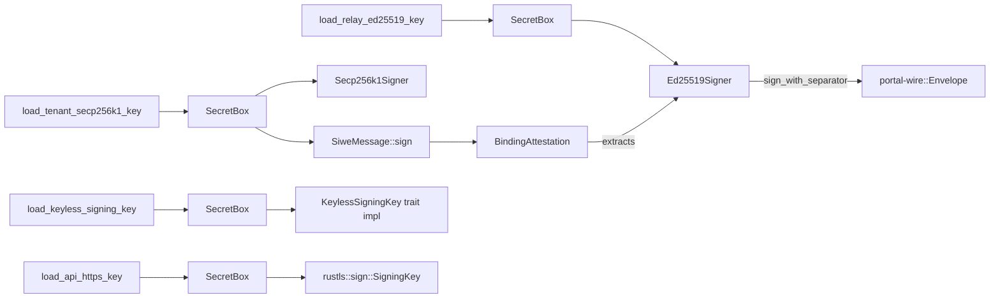
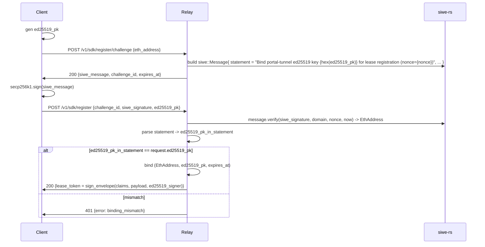

# feat: Phase 2 — `portal-crypto` (identity, signing, SIWE binding, keyless trait, ENS)

```
---
title: Phase 2 — portal-crypto crate
type: feat
status: active
date: 2026-05-04
origin: docs/plans/port_go_to_rust_greenfield_383a2dc9.plan.md (U3)
---
```

## Summary

Build `crates/portal-crypto` — the single owner of every cryptographic primitive in the workspace. Two-key identity model: `k256` for SIWE / Ethereum-side, `ed25519-dalek` for protocol-internal signatures. Each role gets a distinct `SecretBox<KeyType>` newtype with its own loader function; cross-use is rejected by the type system, multi-key returns are rejected by clippy. Domain-separated `Signer::sign_with_separator(payload, separator)` API enforces the SEC-007 separators at sign time so callers can never forget. New SIWE→ed25519 binding attestation (SEC-002) extends Go's `register_challenge.go` flow to bind the protocol-side ed25519 key to the SIWE Ethereum address. Keyless `SigningKey` sync trait per FEAS-2 — async-bridge architecture is deferred to Phase 6b. ENS resolver via `alloy` exists to feed Phase 5's R10 v0.1 SIWE+ENS Sybil gating.

## Requirements

R1, R2, R7, R8 — and partial fulfilment of R10 (ENS leg) and SEC-001/002/007.

- **R1** — Edition 2024, `forbid(unsafe_code)`, `clippy::pedantic + cargo` warn, deps via `[workspace.dependencies]`.
- **R2** — Distinct `SecretBox<KeyType>` newtypes per trust-boundary role; type system rejects cross-use; clippy `disallowed_methods` rejects multi-key returns.
- **R7** — `portal-crypto` is the single owner of crypto primitives. No mirroring into `portal-wire` (which owns codecs/types only) or `portal-relay` (which consumes both).
- **R8** — `k256` over `decred/dcrd/dcrec`; `ed25519-dalek` over hand-rolled; `siwe` over JS bridges; `alloy` over `web3`/`ethers-rs`.
- **R10 (partial)** — ENS resolver primitive, consumed by Phase 5 (`portal-relay/src/policy/`) for Sybil gating.

## Scope

### In scope (Phase 2 deliverables)

- `crates/portal-crypto/{Cargo.toml, src/lib.rs, src/**}` — full module tree.
- Distinct per-role `SecretBox<KeyType>` newtypes: `RelayEd25519Key`, `TenantSecp256k1Key`, `KeylessSigningKey`, `ApiHttpsKey`.
- Distinct per-role load functions; clippy `disallowed_methods` rule rejecting multi-key returns.
- Domain-separated `Ed25519Signer::sign_with_separator(payload, separator)` + `Ed25519Verifier::verify_with_separator`.
- `Envelope` sign/verify wrappers consuming portal-wire's `Envelope` + `Claims` types (SEC-001 claim-set checks live here).
- SIWE wrapper over `siwe = "=0.6.1"` (`ChallengeBuilder`, `verify`).
- SIWE→ed25519 `BindingAttestation` (SEC-002) — sign + verify + mismatch-fails-closed.
- Keyless `SigningKey` sync trait (FEAS-2 skeleton).
- ENS resolver via alloy (`EnsResolver` trait + alloy-backed impl).
- Three behavioral-gate tests (ed25519 round-trip + SIWE-binding + ENS resolution).
- One ADR amendment (or new ADR) recording the siwe-rs fork-vs-contribute decision (FEAS-4).

### Out of scope (defer to other phases)

- Wire types (`Envelope` struct, `Claims` struct, framing) — owned by Phase 1 portal-wire (U2). Phase 2 *consumes* them.
- At-rest encryption of `identity.json` / ACME / DNS-provider keys — SEC-005, owned by Phase 5.
- Keyless server (`axum` signing endpoint, mTLS, async-bridge tokio channel + worker pool) — owned by Phase 6b.
- Hot-reload semantics for `arc-swap<Config>` trust-boundary keys — SEC-010, Phase 5.
- Threat model + adversary capability enumeration — SEC-006, Phase 1 (`docs/threat-model.md`).
- Eclipse-resistant relay-set picker — Phase 6a (`portal-sdk`).
- R10 cross-relay reputation propagation envelope — v0.2 backlog.

## Context & Research

### Pack input

The downstream implementer packs the following Go subdirectories via repomix as research input. They are reference-only — the Rust shape is greenfield.

- `portal-tunnel/types/identity.go` — Go's `Identity { Name, Address, PublicKey, PrivateKey }` + `RelayIdentity { + AdminSecretKey, WireGuardPublicKey, WireGuardPrivateKey }` + `LeaseAccessTokenClaims` shape + `RelayDescriptor` canonical-bytes signing surface + `Identity::DeriveToken` HMAC-SHA256 token derivation.
- `portal-tunnel/portal/auth/` — four files: `hop_route.go` (secp256k1 DER signature over hop-route bytes), `lease_token.go` (ES256K JWT via `go-jose/v4` with custom `es256kOpaqueSigner`/`Verifier`), `register_challenge.go` (SIWE message builder + verifier), `relay_descriptor.go` (recoverable secp256k1 signature with address-recovery validation).
- `portal-tunnel/portal/keyless/` — three files: `signer.go` (Go's keyless `Service` + axum-equivalent HTTP handler at `signrpc.SignPath`), `client.go` (relay-side TLS config builder using `keylesstls.RemoteSigner`), `tls.go` (HTTPS-server attachment helper).
- `portal-tunnel/utils/crypto.go` — secp256k1 sign/verify primitives in three forms (DER, raw r||s 64-byte, compact recoverable 65-byte), EVM address derivation via `golang.org/x/crypto/sha3.NewLegacyKeccak256`, EIP-191 personal-message signing, WireGuard key clamping (out of scope here).
- `portal-tunnel/utils/identity.go` — `NormalizeStoredIdentity`, `NormalizeStoredRelayIdentity`, `LoadOrCreateIdentity` JSON persistence shape, `DeriveToken("admin-secret")` flow.

### Existing code in the workspace to reuse

- `Cargo.toml` already pins the full crypto register via `[workspace.dependencies]`: `k256 = { version = "0.13", features = ["ecdsa"] }`, `ed25519-dalek = { version = "2", features = ["rand_core"] }`, `secrecy = "0.10"`, `siwe = "=0.6.1"`, `alloy = { version = "0.10", default-features = false, features = ["provider-http", "contract"] }`, `jiff = "0.2"`, `compact_str = { version = "0.9", features = ["serde"] }`, `postcard = { version = "1", features = ["alloc"] }`, `thiserror = "2"`, `tracing = "0.1"`. No new direct deps required; alloy `ens` feature flag may need to be added (see Open Questions).
- `[workspace.lints]` already in effect (`clippy::pedantic + cargo + nursery`, `unwrap_used + expect_used` deny, `unsafe_code` forbid, `missing_docs` warn).
- `crates/portal-crypto/{Cargo.toml, src/lib.rs}` are Phase-0 stubs created by the bootstrap commit sequence. Phase 2 fills them.

### Cross-phase consumes

- **From Phase 1 (`portal-wire`)** — `Envelope { payload: Bytes, sig: [u8; 64], claims: Claims }`, `Claims { nonce, not_before, not_after, audience, purpose }`, the five SEC-007 domain-separator byte-string constants (`b"portal-tunnel/relay-descriptor/v1"`, `b"portal-tunnel/hop-route/v1"`, `b"portal-tunnel/lease-token/v1"`, `b"portal-tunnel/keyless-request/v1"`, `b"portal-tunnel/reputation-delta/v1"`), the binding-attestation separator (`b"portal-tunnel/binding-attestation/v1"`, added in Phase 2 since SEC-002 is owned here — but the *constant* lives in portal-wire for single-source-of-truth).

If Phase 1 has not yet defined a needed type at execution time, Phase 2 stubs the type locally with a `// TODO(phase-1)` comment AND files a coordination note in the Phase 1 plan; the stub is replaced when Phase 1 catches up. No Phase 2 code lands without the stub having a clear hand-off.

### External research notes (relevant for implementer)

- `siwe = "=0.6.1"` has no SemVer-stable successor; last release Feb 2024. The Alloy-integration PR is stuck since March 2025. We pin the exact version (already in Cargo.toml). FEAS-4 fork-vs-contribute decision belongs to Phase 2.
- `alloy` 0.10 exposes ENS resolution via `alloy::providers::Provider::resolve_name(...)`. Whether that path requires the `ens` feature (vs being available under `provider-http` alone) needs a one-shot `cargo doc --open -p alloy` check at the start of U11. The workspace currently has `["provider-http", "contract"]` only.
- `rustls = "0.23.22"` `Signer::sign(message: &[u8]) -> Result<Vec<u8>, Error>` is sync (`SigningKey::sign`). Async usage from axum handlers must bridge via `tokio::sync::oneshot` + worker pool — that bridging is Phase 6b's responsibility, not Phase 2's. Phase 2 ships only the trait skeleton.
- `secrecy = "0.10"` `SecretBox<T>` requires `T: Zeroize`. `ed25519_dalek::SigningKey` and `k256::ecdsa::SigningKey` both implement `Zeroize` natively; no shim needed.

## Key Technical Decisions

- **One key per role, no overload.** `RelayEd25519Key` (protocol identity), `TenantSecp256k1Key` (Ethereum/SIWE), `KeylessSigningKey` (TLS sign-on-behalf-of-tenant), `ApiHttpsKey` (relay's own HTTPS API surface). Four distinct newtypes wrapping `SecretBox<…>`. The compiler rejects passing one in place of another.
- **Separate loader function per role.** `load_relay_ed25519_key`, `load_tenant_secp256k1_key`, `load_keyless_signing_key`, `load_api_https_key`. No bundled "load all keys" function exists. Enforced by a `clippy.toml` `disallowed_methods` entry rejecting any function whose return signature contains two `SecretBox<…>` instances or matches `*Key.*Key` (companion ast-grep CI scan).
- **Domain separator is enforced at the Signer API, not at call sites.** `Ed25519Signer::sign_with_separator(payload, separator)` is the only public sign method; it builds `len(separator) || separator || len(payload) || payload` (matching the lease-token-style length-prefixing in Go's `Identity::DeriveToken`) before hashing and signing. There is no `sign_raw` escape hatch in the public API; tests use `#[cfg(test)]` helpers. This makes SEC-007 cross-protocol attacks structurally impossible.
- **Envelope sign/verify lives here, Envelope *type* lives in portal-wire.** Wire layout is portal-wire's job; signing semantics are crypto's job. Splits avoid an umbrella crate while keeping each surface single-owner.
- **SIWE→ed25519 binding (SEC-002) carries the ed25519 pubkey in the SIWE `statement` field.** The statement is `"Bind portal-tunnel ed25519 key {hex} for lease registration (nonce={nonce})"`. siwe-rs verification proves the Ethereum address signed; portal-crypto then parses the statement to extract the ed25519 pubkey and returns a bound `(EthAddress, VerifyingKey)` pair. The relay stores the binding and verifies every subsequent ed25519 protocol signature against this pubkey. Mismatch (statement parses but pubkey differs from what later signs) fails closed at the relay, not at portal-crypto — portal-crypto's job ends when it returns the bound pair.
- **siwe-rs: pin v0.6.1, file upstream issue, defer fork to v0.2.** The Alloy PR being stuck since March 2025 is a maintainer-absent signal but not yet a blocker — `=0.6.1` works for our v0.1 SIWE surface (message build, parse, verify with secp256k1). Forking is a maintenance burden we accept only when v0.1 pin breaks. Action: implementer files an upstream issue in the same commit as U6, recording the contact attempt in the new `docs/adr/0005-siwe-rs-stewardship.md`.
- **Keyless trait is sync.** `pub trait KeylessSigningKey: Send + Sync { fn sign(&self, signing_input: &SigningInput) -> Result<Signature, KeylessError>; … }`. Matches `rustls::sign::SigningKey` shape so Phase 6b can wrap it. Async bridging is **not** Phase 2's job and the trait MUST NOT take `async` methods even as a TODO.
- **ENS resolver is a trait + alloy-backed impl.** `pub trait EnsResolver: Send + Sync { async fn resolve(&self, name: &str) -> Result<H160, EnsError>; }`. The trait exists so Phase 5 can mock it for tests; the alloy impl is the production path. Mainnet RPC URL is constructor-injected, not hardcoded.
- **No persistence in this crate.** Loaders take `&Path` and read JSON via `serde_json` only. Atomic-write helper, identity-file lifecycle, and at-rest encryption all belong to Phase 5 (`portal-relay/src/state/`). portal-crypto exposes `parse_*_from_bytes` + `serialize_*_to_bytes` only; the file-handle dance is a different crate's concern.

## Open Questions

### Resolved during this plan

- *Two-key vs one-key identity?* — Two-key (k256 + ed25519). Ethereum ecosystem demands secp256k1; protocol identity demands fast verify. One key per role, no overload.
- *Where do domain separators live?* — Constants in `portal-wire`, signing-time enforcement in `portal-crypto`. Separator is required by the `Signer` API; cannot be omitted.
- *Should the keyless trait be async?* — No. Sync per FEAS-2 + `rustls 0.23` `Signer::sign` shape. Async bridging is Phase 6b's job.
- *Is at-rest key encryption part of Phase 2?* — No. SEC-005 is Phase 5's responsibility. Phase 2 ships in-memory `SecretBox<…>` only; on-disk plaintext is the v0.1 starting state, with the v0.2 encryption ADR amendment opening the door to KMS / OS-keychain integration.
- *siwe-rs fork or pin?* — Pin v0.6.1 in v0.1, file upstream maintenance issue, ADR-0005 records the decision. Fork only if v0.1 ship is blocked by an upstream-broken bug.
- *ENS resolver lives in portal-crypto or portal-relay?* — portal-crypto. It is a primitive consumed by Phase 5's R10 Sybil gating and by potential future SIWE+ENS authentication paths in Phase 6a's SDK; placing it in portal-relay would force portal-sdk to either reach across the dep graph or duplicate.

### Deferred to implementer (must resolve in U-step listed)

- *Does `alloy` ENS resolution require enabling the `ens` feature, or is it under `provider-http` alone?* — U11 starts with a one-shot `cargo doc --open -p alloy` check; if `ens` feature is required, U11 amends `[workspace.dependencies]` `alloy` features in the same commit (single concern: enable feature for ENS). Open question because the workspace currently has `["provider-http", "contract"]`.
- *Does the SIWE statement format match the Ethereum signed-message canonicalization?* — siwe-rs handles EIP-4361 canonicalization end-to-end; U6's job is to confirm that adding our binding-attestation text in the `statement` field does not break siwe-rs's parser. Empirical check: build message → serialize → reparse → assert statement field round-trips byte-for-byte.
- *What is the on-the-wire shape of the binding attestation?* — Decision: the attestation is the **SIWE message itself plus its signature** (a single signed siwe payload), not a separate envelope. The relay stores `(EthAddress, VerifyingKey, SiweMessage, SiweSignature, ExpiresAt)` and replays the verification on each lease lifecycle event needed. U7 codifies.
- *Should `Ed25519Signer::sign_with_separator` accept a typestate marker for the role (compile-time check) or a runtime `DomainSeparator` value?* — U2/U4 implementer choice. Recommendation: typestate marker per role (`PhantomData<RelayDescriptor>`) so misuse is a compile error, with `DomainSeparator::AS_BYTES` const driving the actual hash input. If typestate proves over-engineered (e.g. heterogeneous-separator iteration is needed in tests), fall back to runtime value.

### Deferred to other phases

- SEC-001 ed25519-envelope claim set finalization — Phase 1 (portal-wire). Phase 2 consumes whatever Phase 1 ships.
- SEC-005 at-rest encryption strategy for identity.json / ACME / DNS keys — Phase 5.
- SEC-008 admin auth design (argon2 password storage) — Phase 5; portal-crypto does NOT own argon2 in v0.1.
- Keyless server async-bridge architecture (channel + worker pool) — Phase 6b.
- Cross-relay reputation propagation `ReputationDelta` envelope — v0.2 backlog.

## High-Level Technical Design

### Crate module tree

```
crates/portal-crypto/
├── Cargo.toml                     # workspace deps only
├── src/
│   ├── lib.rs                     # public re-exports + crate doc-comment naming the single owner concern
│   ├── error.rs                   # PortalCryptoError #[non_exhaustive] with Ed25519, Secp256k1, Siwe, Ens, Envelope, Keyless, Io variants
│   ├── separator.rs               # DomainSeparator newtype + per-role typestate markers
│   ├── secret.rs                  # crate-internal helpers for SecretBox<T> construction + Zeroize bound assertions
│   ├── ed25519/
│   │   ├── mod.rs
│   │   ├── key.rs                 # RelayEd25519Key, load_relay_ed25519_key
│   │   ├── sign.rs                # Ed25519Signer::sign_with_separator
│   │   └── verify.rs              # Ed25519Verifier::verify_with_separator
│   ├── secp256k1/
│   │   ├── mod.rs
│   │   ├── key.rs                 # TenantSecp256k1Key, load_tenant_secp256k1_key
│   │   ├── address.rs             # AddressFromCompressedPublicKeyHex (Keccak-256, EIP-55 checksum)
│   │   └── eip191.rs              # SignEthereumPersonalMessage (EIP-191 prefix)
│   ├── siwe/
│   │   ├── mod.rs                 # re-exports siwe::Message + ChallengeBuilder
│   │   ├── challenge.rs           # ChallengeBuilder, RegisterChallenge, verify
│   │   └── binding.rs             # BindingAttestation sign + verify (SEC-002)
│   ├── ens/
│   │   ├── mod.rs
│   │   └── alloy_resolver.rs      # EnsResolver trait + alloy-backed impl
│   ├── envelope/
│   │   ├── mod.rs                 # consumes portal-wire::Envelope + Claims
│   │   ├── sign.rs                # sign_envelope(claims, payload, &Ed25519Signer, separator) -> Envelope
│   │   └── verify.rs              # verify_envelope(envelope, &Ed25519Verifier, expected_separator, now) -> Result<Payload>
│   ├── keyless/
│   │   ├── mod.rs
│   │   ├── trait_def.rs           # pub trait KeylessSigningKey: Send + Sync (sync per FEAS-2)
│   │   └── newtype.rs             # SecretBox<KeylessSigningKey> + load_keyless_signing_key
│   └── api_https/
│       ├── mod.rs
│       └── key.rs                 # SecretBox<ApiHttpsKey> + load_api_https_key (returns rustls-compatible key)
├── tests/
│   ├── ed25519_roundtrip.rs       # proptest sign/verify, separator-required, mismatched separator fails
│   ├── siwe_binding.rs            # SEC-002 happy + mismatch + replay + expiry
│   └── ens_resolution.rs          # wiremock + alloy + #[ignore]'d live-testnet smoke
└── clippy.toml                    # disallowed-methods rule for multi-key returns (or workspace-root clippy.toml)
```

### Type-level trust-boundary diagram



The graph reads top-to-bottom: a single loader function produces a single newtype, which feeds a single signer surface, which produces a single wire-level artifact. No edge crosses roles; the type system enforces it.

### Domain-separator hash-input layout (U4)

```
hash_input = u8(separator_len) || separator_bytes || u32_be(payload_len) || payload_bytes
```

`separator_len` is `u8` because all SEC-007 separators are short ASCII strings (≤ 64 bytes). `payload_len` is `u32_be` because envelope payloads can be large (up to portal-wire's per-channel size budget per SEC-014). Mismatched separator on verify fails because the prepended bytes differ.

### SIWE→ed25519 binding flow (U7)



portal-crypto owns the green path: the binding-build helper, the binding-parse helper, and the mismatch-fails-closed assertion. The HTTP/registry side belongs to Phase 5.

## Implementation Units

Each unit is one concern, one verifiable outcome, ≤200 LoC substantive diff (per AGENTS.md).

- **U1. Crate skeleton + error type.**
  - **Files:** `crates/portal-crypto/Cargo.toml`, `crates/portal-crypto/src/lib.rs`, `crates/portal-crypto/src/error.rs`.
  - **Action:** Wire `[dependencies]` to workspace deps (k256, ed25519-dalek, secrecy, siwe, alloy, jiff, postcard, thiserror, tracing, compact_str, zeroize). Stub modules: `pub mod separator; pub mod secret; pub mod ed25519; pub mod secp256k1; pub mod siwe; pub mod ens; pub mod envelope; pub mod keyless; pub mod api_https;`. Define `PortalCryptoError` `#[non_exhaustive]` with eight variants (Io, Ed25519, Secp256k1, Siwe, Binding, Envelope, Ens, Keyless) using `#[from]` for free conversions and `#[error(transparent)]` for delegation.
  - **Verify:** `cargo build -p portal-crypto` succeeds; `cargo clippy -p portal-crypto -- -D warnings` passes; `cargo doc -p portal-crypto --no-deps` produces a valid index.

- **U2. Domain-separator newtype + typestate markers.**
  - **Files:** `crates/portal-crypto/src/separator.rs`.
  - **Action:** Define `pub struct DomainSeparator(&'static [u8])`; reject empty + reject `>u8::MAX` length at compile time via const fn. Define per-role marker enums or unit structs: `pub struct RelayDescriptor; pub struct HopRoute; pub struct LeaseToken; pub struct KeylessRequest; pub struct ReputationDelta; pub struct BindingAttestation;` plus a `pub trait Role { const SEPARATOR: DomainSeparator; }`. Stub `impl Role for …` referencing portal-wire constants (use `const SEPARATOR: DomainSeparator = DomainSeparator::new(portal_wire::SEC_007_RELAY_DESCRIPTOR);` and so on; if portal-wire has not yet exported the constants, define local `const`s with a `// TODO(phase-1)` and a hand-off note in the Phase 1 plan).
  - **Verify:** Unit test that constructs each Role's separator and asserts the byte-string matches the SEC-007 spec verbatim.

- **U3. RelayEd25519Key newtype + loader.**
  - **Files:** `crates/portal-crypto/src/ed25519/mod.rs`, `crates/portal-crypto/src/ed25519/key.rs`.
  - **Action:** `pub struct RelayEd25519Key { inner: ed25519_dalek::SigningKey }` with manual `Zeroize` derive (or `derive(Zeroize, ZeroizeOnDrop)`). Wrap in `secrecy::SecretBox`. Public API: `pub fn load_relay_ed25519_key(path: &std::path::Path) -> Result<SecretBox<RelayEd25519Key>, PortalCryptoError>` (reads JSON `{ "ed25519_secret_key": "<hex32>" }`, validates length, constructs SigningKey via `from_bytes`); `pub fn verifying_key(key: &SecretBox<RelayEd25519Key>) -> ed25519_dalek::VerifyingKey`. **Test-only** factory `RelayEd25519Key::from_seed_for_test(seed: [u8; 32])` gated behind `#[cfg(test)]` + `#[doc(hidden)]`.
  - **Verify:** Round-trip: load_relay_ed25519_key on a tempdir-written JSON file recovers a key that signs a known message and produces a verifying-key matching ed25519-dalek's `verifying_key()`.

- **U4. Ed25519Signer + Verifier with mandatory separator.**
  - **Files:** `crates/portal-crypto/src/ed25519/sign.rs`, `crates/portal-crypto/src/ed25519/verify.rs`.
  - **Action:** `pub struct Ed25519Signer<'k> { key: &'k SecretBox<RelayEd25519Key> }` and `pub struct Ed25519Verifier { vk: ed25519_dalek::VerifyingKey }`. Sole sign method: `pub fn sign_with_separator<R: Role>(&self, payload: &[u8]) -> Result<ed25519_dalek::Signature, PortalCryptoError>` that builds `hash_input = [u8::try_from(R::SEPARATOR.as_bytes().len())?, …R::SEPARATOR.as_bytes(), …payload_len_be, …payload]` and calls `SigningKey::sign`. Mirror verify. **No `sign_raw` in public API.** A `#[cfg(test)]` private helper exposes the raw path for negative tests.
  - **Verify:** Sign with Role A, verify with Role B fails with `PortalCryptoError::Ed25519`. Sign with Role A, verify with Role A succeeds for any payload.

- **U5. TenantSecp256k1Key + loader + EVM address derivation.**
  - **Files:** `crates/portal-crypto/src/secp256k1/key.rs`, `crates/portal-crypto/src/secp256k1/address.rs`, `crates/portal-crypto/src/secp256k1/eip191.rs`.
  - **Action:** `pub struct TenantSecp256k1Key { inner: k256::ecdsa::SigningKey }` + `pub fn load_tenant_secp256k1_key(path: &Path) -> Result<SecretBox<TenantSecp256k1Key>, PortalCryptoError>` (reads JSON `{ "secp256k1_secret_key": "<hex32>" }`, rejects all-zero per Go's `requireNonZero`). `pub fn evm_address_from_pubkey(pk: &k256::PublicKey) -> EthAddress` ports `AddressFromCompressedPublicKeyHex`: serialize uncompressed (65B), drop `0x04`, Keccak-256, take trailing 20 bytes, EIP-55 mixed-case encode. `pub fn sign_eip191_personal(message: &[u8], key: &SecretBox<TenantSecp256k1Key>) -> Result<[u8; 65]>`. EIP-55 helper has its own unit test against the canonical Ethereum-Foundation test vectors.
  - **Verify:** EVM-address derivation round-trips against the four reference vectors in `EIP-55` (`0x52908400098527886e0f7030069857d2e4169ee7`, `0x8617e340b3d01fa5f11f306f4090fd50e238070d`, `0xde709f2102306220921060314715629080e2fb77`, `0x27b1fdb04752bbc536007a920d24acb045561c26`).

- **U6. SIWE wrapper.**
  - **Files:** `crates/portal-crypto/src/siwe/mod.rs`, `crates/portal-crypto/src/siwe/challenge.rs`.
  - **Action:** Port `RegisterChallenge` shape: `pub struct ChallengeBuilder { domain: CompactString, uri: CompactString, chain_id: u64, ttl: jiff::SignedDuration }`; `pub fn build(&self, eth_address: EthAddress, ed25519_pk: ed25519_dalek::VerifyingKey, request_id: &str, now: jiff::Timestamp) -> Result<RegisterChallenge>` returns the siwe::Message, ChallengeID, ExpiresAt, plus the embedded statement for binding (handed off to U7). `pub fn verify_siwe(message: &siwe::Message, signature: &[u8; 65], domain: &str, nonce: &str, now: jiff::Timestamp) -> Result<EthAddress>` wraps `siwe::Message::verify`.
  - **Verify:** Build → serialize → re-parse round-trip preserves every field. Verify with wrong-domain / wrong-nonce / past-expiry all fail with distinct `PortalCryptoError::Siwe(_)` variants.

- **U7. SIWE→ed25519 binding (SEC-002).**
  - **Files:** `crates/portal-crypto/src/siwe/binding.rs`.
  - **Action:** `pub struct BindingAttestation { eth_address: EthAddress, ed25519_pubkey: ed25519_dalek::VerifyingKey, nonce: [u8; 32], issued_at: jiff::Timestamp, expires_at: jiff::Timestamp }`. Build: `pub fn build_binding(eth: EthAddress, ed25519: ed25519_dalek::VerifyingKey, nonce: [u8; 32], now: jiff::Timestamp, ttl: jiff::SignedDuration) -> BindingAttestation` plus `pub fn into_siwe_statement(att: &BindingAttestation) -> CompactString` returning the canonical statement text (`"Bind portal-tunnel ed25519 key {hex} for lease registration (nonce={hex})"`). Verify: `pub fn verify_binding(message: &siwe::Message, signature: &[u8; 65], domain: &str, nonce: &str, expected_ed25519_pubkey: ed25519_dalek::VerifyingKey, now: jiff::Timestamp) -> Result<BindingAttestation>` runs `verify_siwe`, parses the ed25519 pubkey out of the statement (regex against the canonical pattern; reject if statement does not match), and asserts equality with `expected_ed25519_pubkey`. Mismatch → `PortalCryptoError::Binding(BindingError::Ed25519PubkeyMismatch)`.
  - **Verify:** SEC-002 behavioral test: forge a valid SIWE signature over a statement containing pubkey A; pass pubkey B as `expected_ed25519_pubkey` to verify_binding; assert verify fails with `Ed25519PubkeyMismatch`. Mutation: change one byte of the statement → siwe-verify catches it before binding-parse runs.

- **U8. Envelope sign + verify.**
  - **Files:** `crates/portal-crypto/src/envelope/sign.rs`, `crates/portal-crypto/src/envelope/verify.rs`.
  - **Action:** `pub fn sign_envelope<R: Role>(claims: portal_wire::Claims, payload: &[u8], signer: &Ed25519Signer<'_>) -> Result<portal_wire::Envelope>`: serialize claims+payload via postcard, call `signer.sign_with_separator::<R>(serialized)`, assemble `Envelope { payload, sig, claims }`. `pub fn verify_envelope<R: Role>(env: &portal_wire::Envelope, verifier: &Ed25519Verifier, now: jiff::Timestamp) -> Result<&[u8]>`: re-serialize claims+payload via postcard, call `verifier.verify_with_separator::<R>(serialized, &env.sig)`, then check claims (`now ∈ [not_before, not_after]`, `audience` matches an expected, `purpose` matches the role).
  - **Verify:** Round-trip with matching role passes. Tampered payload → signature verify fails. Expired claims → `EnvelopeError::Expired`. Wrong audience → `EnvelopeError::AudienceMismatch`.

- **U9. Keyless SigningKey sync trait.**
  - **Files:** `crates/portal-crypto/src/keyless/trait_def.rs`, `crates/portal-crypto/src/keyless/newtype.rs`.
  - **Action:** Define `pub struct SigningInput<'a> { pub message: &'a [u8], pub scheme: SignatureScheme }` and `pub enum SignatureScheme { … }` mirroring `rustls::SignatureScheme` (subset: ECDSA_NISTP256_SHA256, RSA_PSS_SHA256, ED25519). Define `pub trait KeylessSigningKey: Send + Sync { fn sign(&self, input: &SigningInput<'_>) -> Result<Vec<u8>, KeylessError>; fn supported_schemes(&self) -> &[SignatureScheme]; fn public_key_der(&self) -> &[u8]; }` — sync, no `async fn`. Define `pub struct KeylessSigningKeyHandle(SecretBox<dyn KeylessSigningKey>)` *or* (preferred) make `KeylessSigningKey` object-safe and store `SecretBox<Box<dyn KeylessSigningKey>>`. Provide `pub fn load_keyless_signing_key(path: &Path) -> Result<SecretBox<Box<dyn KeylessSigningKey>>, PortalCryptoError>` reading PEM via rustls-pemfile + dispatching to the appropriate concrete impl (RSA, ECDSA, Ed25519 — all `aws-lc-rs`-backed under the hood since rustls is already on aws_lc_rs).
  - **Verify:** Sync compile-only test that `fn assert_sync<T: Send + Sync>() {}; assert_sync::<Box<dyn KeylessSigningKey>>();`. Round-trip: load PEM-encoded RSA key, call sign with a known input, verify signature with `aws_lc_rs::signature::UnparsedPublicKey::verify`.

- **U10. ApiHttpsKey newtype + loader.**
  - **Files:** `crates/portal-crypto/src/api_https/key.rs`.
  - **Action:** `pub struct ApiHttpsKey { inner: Arc<dyn rustls::sign::SigningKey> }` + `pub fn load_api_https_key(path: &Path) -> Result<SecretBox<ApiHttpsKey>, PortalCryptoError>`. Reads PEM, calls `rustls::crypto::aws_lc_rs::sign::any_supported_type`. Distinct from keyless because this key is held in-process and the rustls `ServerConfig` consumes it directly; no remote-signer indirection.
  - **Verify:** Load a self-signed RSA test cert+key pair from a fixture path, assert the returned `ApiHttpsKey` produces a `rustls::sign::CertifiedKey` that can be passed to `rustls::ServerConfig::builder().with_single_cert(…)` without panic.

- **U11. ENS resolver via alloy.**
  - **Files:** `crates/portal-crypto/src/ens/alloy_resolver.rs`.
  - **Action:** First, `cargo doc --open -p alloy` confirm whether ENS resolution requires the `ens` feature; if so, amend `[workspace.dependencies]` `alloy` features to `["provider-http", "contract", "ens"]` in the *same* commit as U11 with a one-line ADR-0002 amendment. Define `#[trait_variant::make(EnsResolver: Send)] pub trait EnsResolverLocal { async fn resolve(&self, name: &str) -> Result<EthAddress, EnsError>; }`. Production impl: `pub struct AlloyEnsResolver { provider: Arc<dyn alloy::providers::Provider> }` constructed from a mainnet RPC URL. Failure modes: `EnsError::NameNotFound`, `EnsError::Rpc(reqwest::Error)`, `EnsError::InvalidAddress`.
  - **Verify:** Wiremock stub returns a canned `eth_call` response for `vitalik.eth`; assert resolver returns `0xd8dA6BF26964aF9D7eEd9e03E53415D37aA96045`. Live test gated `#[ignore]` against Cloudflare's public RPC.

- **U12. clippy.toml multi-key-return ban + ast-grep CI scan.**
  - **Files:** `clippy.toml` at the workspace root (or `crates/portal-crypto/clippy.toml` if Phase 0 has not landed a workspace-level clippy.toml yet — coordinate with Phase 0 implementer), `.github/workflows/ci.yml` amendment for the ast-grep step.
  - **Action:** `clippy.toml` `disallowed-methods` does not natively support return-type matching, so the enforcement is split: (a) a `disallowed-types` entry banning ad-hoc tuple types like `(SecretBox<RelayEd25519Key>, SecretBox<TenantSecp256k1Key>)` is brittle; instead the *primary* enforcement is (b) an `ast-grep` workspace scan in CI that fails on any function signature `fn $NAME($$$ARGS) -> $RET` where `$RET` matches `*SecretBox*SecretBox*` or `*SigningKey*SigningKey*` patterns. The `clippy.toml` carries a `disallowed-methods` entry pre-emptively banning a hypothetical `load_all_keys` symbol so that contributors who reach for the obvious wrong name get an immediate compile error.
  - **Verify:** Smoke commit adding a `pub fn load_two(path: &Path) -> Result<(SecretBox<RelayEd25519Key>, SecretBox<TenantSecp256k1Key>)>` causes the ast-grep CI step to fail with a pinpoint message naming the offending file+line.

- **U13. Behavioral-gate tests.**
  - **Files:** `crates/portal-crypto/tests/ed25519_roundtrip.rs`, `crates/portal-crypto/tests/siwe_binding.rs`, `crates/portal-crypto/tests/ens_resolution.rs`.
  - **Action:**
    - **ed25519_roundtrip.rs** — `proptest!` block: random 32-byte seed → load via `from_seed_for_test` → random payload (1..=64KB) → random Role → `sign_with_separator::<Role>(payload)` → assert verify succeeds; second proptest asserts that swapping Role A for Role B on verify always fails.
    - **siwe_binding.rs** — three cases: (1) happy path, build SIWE message with statement embedding ed25519 pubkey A, sign with k256 key for known eth_address; verify_binding with `expected_ed25519_pubkey = A` → returns BindingAttestation. (2) Mismatch: same as (1) but pass `expected_ed25519_pubkey = B` → assert `BindingError::Ed25519PubkeyMismatch`. (3) Tamper: flip one byte of statement before signing → siwe-verify rejects.
    - **ens_resolution.rs** — wiremock-driven: stand up a `wiremock::MockServer`, stub the `eth_call` for ENS resolver lookup, point `AlloyEnsResolver` at the mock URL, assert `resolve("vitalik.eth")` returns the expected address. Plus `#[ignore]` live-RPC test against `https://cloudflare-eth.com` for opt-in CI smoke.
  - **Verify:** `cargo nextest run -p portal-crypto` green; `cargo nextest run -p portal-crypto --run-ignored only` (with network) green when invoked manually.

## System-Wide Impact

- **R2 trust-boundary keys** — three of the four `SecretBox<KeyType>` newtypes (`RelayEd25519Key`, `KeylessSigningKey`, `ApiHttpsKey`) are consumed by Phase 5 (`portal-relay/src/state/identity.rs` and `crates/portal-relay/src/api/`); the fourth (`TenantSecp256k1Key`) is consumed by Phase 6a (`portal-sdk` for client-side SIWE). The `QuicIdentityKey` newtype mentioned in the roadmap System-Wide Impact section lives in `portal-net` (Phase 3) — portal-crypto is *not* its owner, but Phase 3 will follow the same pattern (distinct loader, `SecretBox<…>`).
- **Domain-separator constants** — owned by portal-wire (single source of truth per SEC-007). Phase 1 implementer must export the five separator constants plus the new `BindingAttestation` separator (`b"portal-tunnel/binding-attestation/v1"`); coordination note filed in Phase 1's plan.
- **siwe-rs upstream-coordination** — ADR-0005 (new) records the v0.1 pin posture and the trigger criterion for v0.2 fork (any v0.1-shipping bug attributable to `siwe = "=0.6.1"` that upstream has not addressed within 30 days of report).
- **alloy ENS feature** — possible amendment to `[workspace.dependencies]` alloy features. If U11's `cargo doc` check shows `ens` is required, the feature-list change lands in the same commit as U11 with a one-line ADR-0002 amendment (matches the Phase-0 ADR-amendment procedure).
- **Concurrency invariant** — portal-crypto exposes one async surface (ENS resolver); every other API is sync. Async surface is `#[tracing::instrument(skip_all)]` per R9.
- **Error propagation** — `PortalCryptoError` `#[non_exhaustive]` with `#[from]` for free conversions from `ed25519_dalek::SignatureError`, `k256::ecdsa::Error`, `siwe::VerificationError`, `serde_json::Error`, `std::io::Error`, `alloy::providers::ProviderError`. No `unwrap`/`expect` outside `#[cfg(test)]` (workspace `clippy::unwrap_used` deny enforces).
- **No `tokio::spawn` in this crate** — pure-sync surface plus one `async fn` (ENS); structured concurrency lives at callers (Phase 5 / Phase 6a). `cargo metadata --no-deps` should show portal-crypto's only async/runtime dep is via alloy, not `tokio` features beyond what alloy pulls.

## Risks & Dependencies

| Risk | Mitigation |
|---|---|
| Phase 1 has not yet exported `Envelope`, `Claims`, or SEC-007 separator constants when Phase 2 implementer reaches U2/U8 | U2 and U8 stub the missing types locally with `// TODO(phase-1)` markers and a coordination note in the Phase 1 plan; replacement is a one-line edit when Phase 1 catches up. Plan writes are atomic — Phase 2 does not block on Phase 1 wire-protocol.md text, only on the type names + separator byte-strings. |
| `siwe = "=0.6.1"` has an unpatched bug that blocks v0.1 ship | Pin the exact version (already in Cargo.toml). File upstream issue. ADR-0005 records the trigger to fork (30 days from report with no upstream response). Worst-case fork lives in `vendor/siwe-rs` with `[patch.crates-io] siwe = { path = "vendor/siwe-rs" }`. |
| `alloy` ENS resolution requires a feature flag we have not enabled | U11 starts with a `cargo doc` check; one-line `Cargo.toml` amendment + ADR-0002 amendment lands in the same commit as U11. |
| `secrecy::SecretBox<T>` requires `T: Zeroize`; `Box<dyn KeylessSigningKey>` is not zeroize-friendly | U9 wraps inner concrete impls (`RsaSigningKey`, `EcdsaSigningKey`) in `#[derive(Zeroize, ZeroizeOnDrop)]` newtypes; `Box<dyn KeylessSigningKey>` is held inside `SecretBox<Box<…>>` only because the *trait object pointer* is what we hide — the actual key bytes are zeroized by the inner impl's drop. Document this in U9's doc-comment so contributors don't add a key without `Zeroize`. |
| EIP-55 mixed-case checksum has subtle off-by-one bugs in custom impls | Test against the four canonical Ethereum Foundation test vectors in U5; reject any address that does not round-trip. |
| `ed25519-dalek = "2"` deprecates `from_bytes` in favor of `from_keypair_bytes` | Implementer checks the live API at U3 time; uses whichever constructor the current version exposes. If both are deprecated, switch to `SigningKey::from_seed`. |
| Domain-separator typestate (`PhantomData<Role>`) over-engineers callers | Fall back to runtime `DomainSeparator` value; the `Signer` API still requires a separator argument, just not via type parameter. Decision belongs to U4 implementer based on call-site ergonomics. |
| ENS resolver wiremock shape does not match real alloy `eth_call` request body | U13's wiremock stub uses `wiremock::matchers::body_string_contains` for the ENS resolver address rather than exact-match; live `#[ignore]` test against Cloudflare RPC validates the real wire. |
| Keyless trait shape diverges from rustls 0.23.22's `SigningKey` such that Phase 6b cannot wrap it | U9's trait deliberately mirrors rustls's `SigningKey` shape: `sign(&self, message: &[u8])`, `algorithm()`, `public_key()`. Phase 6b's wrapper is a thin newtype, not a redesign. |

## Verification

End-to-end Phase 2 verification:

1. **Build + lint** — `cargo build -p portal-crypto`, `cargo clippy -p portal-crypto --all-targets -- -D warnings`, `cargo fmt --check -p portal-crypto`, `cargo doc -p portal-crypto --no-deps`.
2. **Behavioral gates** — `cargo nextest run -p portal-crypto` runs all three behavioral-gate tests (`ed25519_roundtrip`, `siwe_binding`, `ens_resolution` mock leg). Live ENS test invoked separately on demand via `cargo nextest run -p portal-crypto --run-ignored only -- ens_resolution::live`.
3. **Trust-boundary enforcement** — `ast-grep --pattern 'fn $NAME($$$) -> $$$SecretBox$$$SecretBox$$$' crates/portal-crypto crates/portal-relay crates/portal-sdk crates/portal-net` returns no matches (multi-key-return ban). Smoke commit adding `fn load_two(...) -> (SecretBox<A>, SecretBox<B>)` causes CI to fail.
4. **Domain-separator coverage** — unit test in `separator.rs` asserts every `Role` impl returns a non-empty separator and that all separators are pairwise distinct.
5. **Cross-phase consistency** — once Phase 1's `portal-wire` lands its separator constants, a CI step asserts `portal_crypto::separator::*Role::SEPARATOR.as_bytes() == portal_wire::SEC_007_*`. Until then, the local stub carries a `// TODO(phase-1)` and a one-time test asserts the stub matches the SEC-007 spec text.
6. **clippy `disallowed_methods`** — the rule named `load_all_keys` is hit by a smoke test that adds an exported function with that name; clippy emits the deny.
7. **Documentation** — `cargo doc -p portal-crypto --no-deps --document-private-items` produces no warnings; the crate-level doc-comment in `lib.rs` names the single owner concern ("All cryptographic primitives for the portal-tunnel-rs workspace.") and lists the four trust-boundary roles.
8. **ADR landed** — `docs/adr/0005-siwe-rs-stewardship.md` exists, indexed in `docs/adr/README.md`, and references the upstream issue URL.

## Sources & References

- Roadmap origin: `/home/alpha/.cursor/plans/port_go_to_rust_greenfield_383a2dc9.plan.md` — todos `phase-2-crypto-plan` + section U3.
- Workspace constitution: `AGENTS.md` (Phase 0 will rewrite; this plan assumes the rewrite has landed at execution time).
- Workspace manifest: `Cargo.toml` (the crypto register is already pinned: k256, ed25519-dalek, secrecy, siwe, alloy, jiff, postcard, thiserror, tracing, compact_str).
- Go reference (behavior spec, not wire compat):
  - `portal-tunnel/types/identity.go`
  - `portal-tunnel/portal/auth/hop_route.go`
  - `portal-tunnel/portal/auth/lease_token.go`
  - `portal-tunnel/portal/auth/register_challenge.go`
  - `portal-tunnel/portal/auth/relay_descriptor.go`
  - `portal-tunnel/portal/keyless/client.go`
  - `portal-tunnel/portal/keyless/signer.go`
  - `portal-tunnel/portal/keyless/tls.go`
  - `portal-tunnel/utils/crypto.go`
  - `portal-tunnel/utils/identity.go`
- Phase 1 deliverables consumed (assumed shipped at execution time): `crates/portal-wire/src/lib.rs` types `Envelope`, `Claims`, SEC-007 separator constants; `docs/wire-protocol.md`; `docs/threat-model.md`.
- Cross-phase coordination notes:
  - **Phase 0** — Phase 2 may need a workspace-level `clippy.toml` extension (U12); coordinate with the Phase 0 implementer before opening U12. If Phase 0 has not landed `clippy.toml`, U12 creates a crate-local one and the workspace-level merge is an explicit follow-up commit owned by Phase 0.
  - **Phase 1** — Phase 2 consumes `portal_wire::Envelope`, `portal_wire::Claims`, and the SEC-007 separator constants. Phase 1 plan is updated to add the `BindingAttestation` separator (`b"portal-tunnel/binding-attestation/v1"`) since SEC-002 is owned by Phase 2.
  - **Phase 5** — Phase 5 consumes `load_relay_ed25519_key`, `load_keyless_signing_key`, `load_api_https_key`, `EnsResolver`, and the `BindingAttestation` flow. Phase 5 plan must NOT re-implement SIWE verification; it consumes `verify_binding` end-to-end.
  - **Phase 6a** — Phase 6a's `portal-sdk` consumes `load_tenant_secp256k1_key` and `build_binding` for client-side registration.
  - **Phase 6b** — Phase 6b wraps `KeylessSigningKey` (sync) in an async-bridged worker pool; it does NOT modify the trait shape.

---

## Phase 2 deliverables (summary)

- `crates/portal-crypto/{Cargo.toml, src/**, tests/**}` — full crate per the U1–U13 sequence.
- `clippy.toml` (workspace or crate-local) entry banning `load_all_keys`-style multi-key returns + ast-grep CI step.
- `docs/adr/0005-siwe-rs-stewardship.md` recording the v0.1 pin + v0.2 fork-trigger posture (FEAS-4).
- Three behavioral-gate tests: `ed25519_roundtrip`, `siwe_binding`, `ens_resolution` (with `#[ignore]` live-RPC leg).
- Coordination notes filed in Phase 0 (clippy.toml location), Phase 1 (`BindingAttestation` separator constant), Phase 5 (consumes binding verifier), Phase 6a (consumes tenant secp256k1 loader), Phase 6b (wraps keyless trait).

Plan file: `docs/plans/2026-05-04-002-feat-portal-crypto-plan.md`.
