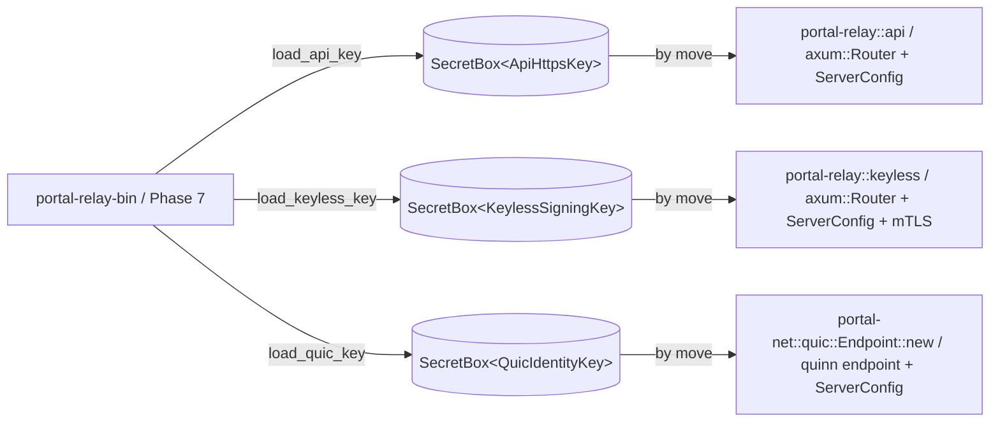

# feat: portal-net (QUIC backhaul + TCP/UDP relay + datagram session)

## Summary

Stand up the `portal-net` crate as the transport layer for the relay-server: a `quinn`-based QUIC backhaul (ALPN `portal/2`) carrying typed channel-tagged streams + QUIC datagrams, a raw TCP port relay, a UDP datagram session, and a port allocator. Owns the QUIC trust boundary (`SecretBox<QuicIdentityKey>` + standalone loader + endpoint constructor), the dual-stack v4+v6 listener helpers, and the IPv6 canonicalization helper consumed cross-crate by `portal-relay` policy lookup.

---

## Problem Frame

The Go upstream (`portal-tunnel/portal/transport/`, ~1,400 LoC across 8 files) carries a marker-byte protocol over a yamux-multiplexed reverse connection: the SDK pre-warms a queue of TCP+TLS reverse connections (`stream_relay.go`), the relay claims one per inbound port hit, writes a `MarkerKeepalive`/`MarkerRawStart`/`MarkerTLSStart` byte (`types/types.go`), and the SDK switches the connection into the matching mode. UDP rides a custom flow-id varint datagram (`types/transport.go::EncodeDatagram`) over QUIC DATAGRAMs. The greenfield wire (per roadmap R4 / Phase 1 wire-protocol register) drops yamux entirely: every multiplexed connection IS a server-initiated QUIC stream whose first frame is a `Channel` tag. Phase 3 ships that simpler shape, owns the QUIC trust boundary per the round-2/round-3 R2 reconciliation (`FEAS-R2-5` + `CORR-R2-06`), and lands the cross-crate IPv6 canonicalization helper that prevents the dual-stack v4-ACL bypass (CVE-2023-45288 class).

---

## Requirements

- R1. Idiomatic Rust 2024 — `forbid(unsafe_code)`, `clippy::pedantic + cargo` at `warn`, deps via `[workspace.dependencies]`. Carried from roadmap U4 + R1.
- R2. QUIC trust boundary lives in `crates/portal-net/src/quic/`. Hosts `pub struct QuicIdentityKey` wrapped in `secrecy::SecretBox<QuicIdentityKey>`, a standalone `load_quic_key(&Path) -> Result<SecretBox<QuicIdentityKey>, NetError>` function (NOT a method on a multi-key loader), and `Endpoint::new(addr, key: SecretBox<QuicIdentityKey>) -> Result<Endpoint, NetError>` that takes ownership by move. CI clippy `disallowed_methods` rule (Phase 0 deliverable) rejects any function returning more than one `SigningKey` from a single load call. Carried from roadmap R2 + System-Wide Impact.
- R3. Behavioral parity at user-visible surface for the transport functions exercised by `portal expose` round-trip (TCP port relay forwarding, UDP datagram session, QUIC backhaul handshake). Greenfield wire is explicitly NOT byte-compat with Go v2.1.8. Carried from roadmap U4 + R3.
- R8. Use the 2026 Rust register: `quinn 0.11`, `rustls 0.23.22` with `aws-lc-rs` provider + `prefer-post-quantum` feature, `winnow 1`, `tokio 1` + `tokio-util 0.7` for `Framed` codecs, `secrecy 0.10` for `SecretBox<T>`, `bon 3` for non-trivial constructors, `thiserror 2` for `NetError`. No `openssl`/`openssl-sys`/`libssh2-sys` in the resolved tree (R13 banned-crates rule, enforced by Phase 0 cargo-deny). Carried from roadmap R8.
- R12. Every public listener in `portal-net` (QUIC endpoint, TCP port relay, UDP datagram socket) binds both IPv4 and IPv6 by default. v4-only requires explicit operator config (a `bind_v4_only: bool` field surfaced through the `Endpoint::new` builder, defaulting to `false`). The `RelayDescriptor` shape (Phase 1 deliverable) carries `addresses_v4: Vec<SocketAddrV4>` AND `addresses_v6: Vec<SocketAddrV6>` — `portal-net` consumes both fields when dialing. Carried from roadmap R12.
- R12-canon. **IPv6 canonicalization invariant.** Every IP-keyed surface MUST canonicalize IPv4-mapped IPv6 (`::ffff:0:0/96`) to its 32-bit v4 representation BEFORE policy lookup. Single helper lives in `portal-net` (decided here — see Open Questions); `portal-relay` (Phase 5) imports it. Phase 5 owns the behavioral gate that exercises the policy-side invariant. Carried from roadmap System-Wide Impact.

---

## Scope Boundaries

- HTTP/3 (`h3-quinn`) is out of scope. The Phase 3 quinn `Endpoint` serves the QUIC backhaul (Channel-tagged streams + QUIC DATAGRAMs) only. `h3-quinn` evaluation lives in Phase 5 per FEAS-R2-1 + roadmap U4 ("HTTP/3 via h3-quinn deferred to Phase 5") — the relay's HTTP API listener is a separate axum + hyper stack.
- Lease lifecycle, policy, discovery, registry, ACME, keyless signing, WireGuard overlay, MITM probe — all downstream of `portal-net`. Phase 5 / 6a / 6b own those.
- The `Channel` enum + per-stream tag codec is **declared by Phase 1 (`portal-wire`)**. Phase 3 imports it; it does NOT redefine the wire shape. If Phase 1 has not yet shipped at execution time, Phase 3 takes a hard dep on Phase 1's plan deliverable and waits.
- The `Envelope { payload, sig, claims }` type + `SecretBox<KeyType>` newtype pattern are **declared by Phase 1 / Phase 2**. Phase 3 imports both; the QUIC backhaul control envelope (replacing Go's `quicBackhaulControlMessage`) is one consumer.
- Marker-byte protocol (Go's `MarkerKeepalive` / `MarkerRawStart` / `MarkerTLSStart`) is **dropped**. KeepAlive uses quinn's `KeepAlivePeriod` config; raw-vs-TLS dispatch comes from the per-stream `Channel` tag. The Go reverse-connection ready queue (`stream_relay.go`'s `RelayStream`) is also dropped — server-initiated QUIC streams replace pre-warmed reverse connections.
- The `tcp_port_relay.go` "claim a reverse session" pattern collapses to "open a server-initiated bidirectional QUIC stream on the existing backhaul connection per accept." No reverse-connection registry.
- Self-signed cert provenance: the `QuicIdentityKey` is an ed25519 key (per Phase 2 + greenfield identity). The X.509 wrapping the public key is generated in-process via `rcgen` (new dep, see Key Technical Decisions). Trust on the SDK side uses a custom `rustls::client::danger::ServerCertVerifier` that pins on `SubjectPublicKeyInfo`, NOT on cert chain validity (per existing pinned-identity pattern in roadmap "Architectural pillars carried forward").

### Deferred to Follow-Up Work

- ECH-aware tenant TLS path on the QUIC datagram surface: deferred to Phase 5 + roadmap R13. The `routed_hostname` field on the QUIC handshake TLS extension is a Phase 1 wire decision; Phase 3 plumbs whatever Phase 1 commits to.
- `ReputationDelta` envelope handling on the QUIC backhaul: v0.2 per roadmap R10. v0.1 carries no reputation deltas on the wire.
- HTTP/3 via `h3-quinn`: Phase 5 evaluation per FEAS-R2-1.
- WireGuard hop-mux overlay: Phase 6b. Phase 3 ships `Channel::HopRoute` as a wire-reserved variant (defined by Phase 1) but Phase 3 includes no overlay logic.

---

## Context & Research

### Relevant Code and Patterns

Go upstream (research input — pack via repomix per roadmap):

- `portal-tunnel/portal/transport/quic_backhaul.go` (174 LoC) — `ListenQUICBackhaul`, `DialQUICBackhaul`, `AcceptQUICBackhaulControl`, `quicBackhaulConfig` (KeepAlive=15s, MaxIdleTimeout=60s, MaxIncomingStreams=16, EnableDatagrams=true). Greenfield Rust port keeps the timeouts but replaces the JSON access-token control message with a typed `Envelope`.
- `portal-tunnel/portal/transport/tcp_port_relay.go` (132 LoC) — `RelayTCPPort` accepts on a port, claims a reverse session via `stream.claimRaw`, splices. Rust port replaces "claim reverse session" with "open server-initiated QUIC stream tagged `Channel::TcpProxy::Raw`".
- `portal-tunnel/portal/transport/stream_relay.go` (349 LoC) — `RelayStream` ready queue + marker-byte activation. Greenfield Rust **drops this entire file's pattern**; the analogue is "open a new bidirectional QUIC stream per inbound connection."
- `portal-tunnel/portal/transport/stream_client.go` (138 LoC) — SDK-side accept loop reading marker bytes and switching to TLS or raw. Rust port replaces the marker switch with a `winnow`-decoded `Channel` tag dispatch.
- `portal-tunnel/portal/transport/datagram_session.go` (162 LoC) — `datagramSession`'s `Bind` / `Send` / `Clear` / `Stop` lifecycle. Rust port keeps the lifecycle shape (a session owns one active QUIC connection with a receive loop) but uses `quinn::Connection::send_datagram` / `read_datagram` directly + a `tokio::sync::mpsc` channel instead of Go's buffered chan.
- `portal-tunnel/portal/transport/datagram_relay.go` (287 LoC) — `RelayDatagram` UDP listener + flow table (varint flow-id → reply-fn) + idle expiry (30s default). Rust port keeps the algorithm; flow table is a `papaya::HashMap<u32, FlowState>` keyed by flow-id with `pin_owned()` for the await-crossing reply path.
- `portal-tunnel/portal/transport/datagram_client.go` (67 LoC) — minimal client wrapper around `datagramSession`.
- `portal-tunnel/portal/transport/port_allocator.go` (104 LoC) — port pool with grace-period reservation. Rust port is a near-direct port; `tokio::sync::Mutex` replaces Go's `sync.Mutex`.
- `portal-tunnel/types/transport.go` — `EncodeDatagram` / `DecodeDatagram` (varint flow-id + payload). Rust analogue lives in `portal-wire` (Phase 1) — Phase 3 imports.
- `portal-tunnel/types/types.go` — marker constants (`MarkerKeepalive=0x00`, `MarkerRawStart=0x01`, `MarkerTLSStart=0x02`). **Dropped in greenfield.**

Phase 1 + Phase 2 dependencies (downstream of those plans):

- `portal-wire` (Phase 1): `Channel` enum + per-stream tag codec (`tokio_util::codec::Framed` adapter), `Envelope { payload: Bytes, sig: [u8; 64], claims: Claims }`, `DatagramFrame` codec (varint flow-id + payload), ALPN constant `b"portal/2"`.
- `portal-crypto` (Phase 2): `secrecy::SecretBox<T>` newtype pattern, ed25519 keypair type, signed-envelope verification helpers.

### Institutional Learnings

- None applicable: the `portal-tunnel-rs` workspace is greenfield (Phase 0 just landed). No `docs/solutions/` entries exist yet. Future Phase 3 plans MAY accumulate learnings; for now, the Phase 1 + Phase 2 phase plans are the only upstream institutional signals.

### External References

- `quinn 0.11` docs ([docs.rs/quinn](https://docs.rs/quinn/0.11/)) — `Endpoint::server`, `Endpoint::client`, `ServerConfig::with_single_cert`, `TransportConfig::keep_alive_interval`, `Connection::send_datagram` / `read_datagram`, `Connection::open_bi`, `Connection::accept_bi`. Quinn 0.11 explicitly targets `rustls 0.23` + `aws-lc-rs` (no glue layer needed).
- `rustls 0.23.22` docs — `ServerConfig::builder_with_provider(aws_lc_rs::default_provider())`, `ALPN_PROTOCOLS`, `client::danger::ServerCertVerifier` for the SDK-side pinned-identity verifier.
- `rcgen` ([docs.rs/rcgen](https://docs.rs/rcgen/)) — self-signed cert generation from an existing ed25519 keypair via `KeyPair::from_pkcs8_der_and_sign_algo`. Rcgen is the de-facto Rust path; no equivalent in current `[workspace.dependencies]` so this plan adds it.
- `tokio_util::codec::{Framed, Encoder, Decoder}` — wire shape for the per-stream tagged frame layer.
- IETF RFC 9000 §4 (flow control) + §6 (DATAGRAM extension via RFC 9221) — informs the `max_datagram_size` planning question.
- CVE-2023-45288 advisory class (HTTP/2 dual-stack v4-ACL bypass via `::ffff:0:0/96` IPv4-mapped addresses) — motivates the canonicalization invariant.

---

## Key Technical Decisions

- **QUIC trust boundary lives in `portal-net`.** Per round-2/round-3 R2 reconciliation (FEAS-R2-5 + CORR-R2-06). `crates/portal-net/src/quic/` hosts the `SecretBox<QuicIdentityKey>` newtype, the standalone `load_quic_key` loader, and the `Endpoint::new(addr, key)` constructor that takes ownership by move. The relay-server binary (Phase 7, `portal-relay-bin`) makes three distinct load calls — one per trust surface — and passes the QUIC key by move to `portal-net`.
- **IPv6 canonicalization helper home: `portal-net`.** Decision made here, replacing the roadmap's "(or `crates/portal-relay/src/listeners/`; coordinate with Phase 5)" open coordination. Rationale: the helper is a small policy-neutral function (`fn canonicalize(addr: IpAddr) -> IpAddr`); Phase 3 needs it for QUIC peer addresses (`Connection::remote_address()`) and UDP source addresses; Phase 5 imports the same helper for HTTP API listener policy lookup. Single owner per R7. The helper lives in `crates/portal-net/src/dual_stack.rs` and is re-exported at the crate root.
- **Greenfield wire drops marker bytes + reverse-connection ready queue.** Per Phase 1 wire-protocol register: every multiplexed connection IS a server-initiated QUIC stream tagged with a `Channel` byte at stream head. KeepAlive is `quinn::TransportConfig::keep_alive_interval(15s)`. The TCP port relay opens a `Channel::TcpProxy` server-initiated stream per accept; raw-vs-TLS dispatch comes from a `TcpProxy::{Raw, Tls}` sub-discriminant declared by Phase 1.
- **ALPN identifier `portal/2`.** Carried from roadmap "Wire-protocol register" + Phase 1. `rustls::ServerConfig::alpn_protocols = vec![b"portal/2".to_vec()]`. The Go literal `"portal-tunnel"` from `quic_backhaul.go::quicBackhaulALPN` is **dropped**.
- **rustls `ServerConfig` for the QUIC endpoint is built once per `Endpoint`.** Constructed via `ServerConfig::builder_with_provider(aws_lc_rs::default_provider())` + the self-signed cert wrapping the `QuicIdentityKey`. Owned by the `Endpoint`; not shared with the relay's HTTP API surface (those are distinct Phase 5 `ServerConfig` instances per R2).
- **Self-signed cert generation: `rcgen` (new workspace dep, added in Phase 3).** Rcgen takes the ed25519 keypair from `QuicIdentityKey`, emits a DER-encoded X.509 + DER-encoded PKCS#8 private key. Rationale: rcgen is the de-facto Rust path (used by quinn-rs's own examples) and supports ed25519 directly. The Phase 0 ADR-0002 banned-crates list requires an amendment commit if rcgen is on the deny-list — verify at execution time. Alternative considered: hand-roll the X.509 via `der`/`x509-parser` — rejected for ceremony cost.
- **SDK-side cert verifier pins on `SubjectPublicKeyInfo`.** Custom `rustls::client::danger::ServerCertVerifier` that compares the leaf cert's `SubjectPublicKeyInfo` to the pinned `RelayDescriptor.identity_key`. Cert chain validity is irrelevant — this is a self-signed pinned-identity boundary, not a public-CA boundary. The verifier ignores expiry, hostname, and signature scheme of the chain; it only validates the SPKI bytes match.
- **Backhaul control handshake uses Phase 1's `Envelope` shape, not Go's JSON.** Go sends `{access_token: "..."}` as JSON over the first stream. Greenfield sends an `Envelope` (postcard-encoded, ed25519-signed) carrying the lease access token + claim set (`nonce`, `not_before`, `not_after`, `audience = "quic-backhaul"`, `purpose = "register"`). Phase 1 owns the canonical claim set (SEC-001).
- **UDP datagram flow table: `papaya::HashMap<u32, FlowState>` with `pin_owned()`.** Rationale: dispatch is read-heavy (per-incoming-datagram lookup); cleanup is write-heavy but infrequent (every 30s ticker); the dispatch path crosses an `await` (the reply callback may await on the UDP socket write), so `pin_owned()` is required per roadmap R8. Write-heavy fallback to `dashmap` is NOT needed — the access pattern matches papaya's strengths.
- **QUIC datagram size budget: `quinn::Connection::max_datagram_size()` returned to caller.** The `RelayDatagram` exposes `fn max_payload(&self) -> usize` so upstream callers can size buffers correctly. Default Go value (`defaultMaxPacketSize = 1350`) is dropped in favor of the actual MTU quinn negotiates.
- **No `unwrap`/`expect` outside `#[cfg(test)]`.** Workspace lints already enforce. Public APIs return `Result<T, NetError>` per R8/R9 (`thiserror`-derived, `#[non_exhaustive]`).
- **Structured concurrency: every spawned task is in a `tokio::task::JoinSet` or carries a `tokio_util::sync::CancellationToken`.** The `Endpoint`, `RelayDatagram`, `TcpPortRelay`, and the per-stream accept loop all use `JoinSet` for child tasks. No bare `tokio::spawn` in library code (per AGENTS.md rewrite landed in Phase 0).
- **Atomic-commit discipline: each U-ID lands as a single commit ≤200 LoC substantive diff.** Per AGENTS.md Phase-0 rewrite. Tests in U11 land as one commit per behavioral gate (3 commits if needed).

---

## Open Questions

### Resolved During Planning

- *ALPN identifier?* — `b"portal/2"`. Per roadmap "Wire-protocol register" + Phase 1.
- *IPv6 canonicalization helper home?* — `crates/portal-net/src/dual_stack.rs`. Decision rationale above.
- *Reverse-connection ready queue (Go's `RelayStream`)?* — Dropped. Replaced by server-initiated QUIC streams per accept.
- *Marker bytes (`MarkerKeepalive` / `MarkerRawStart` / `MarkerTLSStart`)?* — Dropped. KeepAlive = quinn's protocol layer; raw-vs-TLS = per-stream `Channel` tag declared by Phase 1.
- *yamux retention?* — Dropped (already resolved at roadmap level; restated for Phase 3 clarity).
- *HTTP/3 via `h3-quinn` in Phase 3?* — No, deferred to Phase 5 evaluation. Phase 3 ships QUIC backhaul only.
- *QUIC trust boundary location?* — `crates/portal-net/src/quic/`. Per FEAS-R2-5 + CORR-R2-06.
- *Standalone load function vs method on a multi-key loader?* — Standalone function `load_quic_key(&Path) -> Result<SecretBox<QuicIdentityKey>, NetError>`. CI clippy `disallowed_methods` rule (Phase 0 deliverable) rejects multi-key returns.
- *Cert library?* — `rcgen` (new workspace dep). Self-signed X.509 wrapping the ed25519 `QuicIdentityKey`. Phase 0 ADR-0002 amendment required only if `rcgen` is on the cargo-deny ban list — verify at execution.
- *SDK-side trust model?* — Custom `ServerCertVerifier` pinning on `SubjectPublicKeyInfo` against `RelayDescriptor.identity_key`. Cert chain validity irrelevant.

### Deferred to Implementation

- *Exact `winnow` codec shape for the `Channel` tag?* — Depends on Phase 1's final commit of `crates/portal-wire/src/channel.rs`. Phase 3 imports whatever Phase 1 ships; if the codec API changes mid-flight, Phase 3 adapts at the consumer site only.
- *`Envelope` claim set details (`audience`, `purpose` constants)?* — Phase 1 / SEC-001 deliverable. Phase 3 consumes the constants.
- *`rcgen` exact version pin?* — Resolve at `cargo add` time during U2 implementation. Pick the latest 2026 release verified compatible with quinn 0.11 + rustls 0.23.
- *`papaya` `pin_owned()` cost on the UDP dispatch path?* — Profile during U8 implementation. If hot-loop overhead exceeds the per-datagram budget, fall back to `dashmap`. Decision lands in U8's commit message + an ADR amendment if escalating.
- *`max_idle_timeout` / `keep_alive_interval` final tuning?* — Carry Go's defaults (60s idle, 15s keep-alive) into the initial ServerConfig; revisit when the e2e harness (Phase 7) reports real-world session lifetimes.
- *`Endpoint` shutdown semantics (graceful drain vs immediate close)?* — Default to graceful drain via `Endpoint::wait_idle()` on `Drop`. Document the contract in U3's commit.
- *UDP socket buffer sizes (`SO_RCVBUF` / `SO_SNDBUF`)?* — Defer to OS defaults in v0.1; benchmark in Phase 7. Surface a `Settings` field in `Endpoint::new` builder for operator override.
- *Whether `dual_stack.rs` exposes a `tokio::net::TcpListener` builder or just a socket-level helper?* — Phase 5's HTTP listener may want a pre-configured `tokio::net::TcpListener`; Phase 3 needs a `std::net::UdpSocket` (for quinn) and a `tokio::net::TcpListener` (for the TCP port relay). Provide both in U2; minimize the cross-crate API surface.

---

## High-Level Technical Design

> *This illustrates the intended approach and is directional guidance for review, not implementation specification. The implementing agent should treat it as context, not code to reproduce.*

### Backhaul shape (greenfield vs Go)

```mermaid
sequenceDiagram
    participant Client as Tenant TCP/UDP client
    participant Relay as portal-net (relay)
    participant SDK as portal-net (SDK)
    participant Tenant as Tenant origin

    Note over SDK,Relay: 1. SDK dials QUIC backhaul once per lease.<br/>ALPN portal/2; ed25519 SPKI-pin verifier.
    SDK->>Relay: QUIC handshake (1 conn per lease)
    SDK->>Relay: open_bi → Channel::Control + Envelope{access_token,...}
    Relay-->>SDK: Channel::Control + Envelope{ok:true}

    Note over Client,Tenant: 2. Per inbound TCP port hit:
    Client->>Relay: TCP SYN on allocated port
    Relay->>SDK: open_bi (server-initiated) → Channel::TcpProxy::Raw
    SDK->>Tenant: dial origin tcp
    par splice both directions
        Client->>Relay: bytes
        Relay->>SDK: stream write
        SDK->>Tenant: bytes
    and
        Tenant->>SDK: bytes
        SDK->>Relay: stream write
        Relay->>Client: bytes
    end

    Note over Client,Tenant: 3. Per inbound UDP datagram:
    Client->>Relay: UDP packet
    Relay->>Relay: touchFlow(src) → flow_id (varint)
    Relay->>SDK: send_datagram(varint flow_id ‖ payload)
    SDK->>Tenant: udp packet to origin
    Tenant->>SDK: udp reply
    SDK->>Relay: send_datagram(flow_id ‖ payload)
    Relay->>Client: write_to(udp.dst from flow table)
```

### Trust-boundary diagram (R2 surface 3, owned here)



The three `SecretBox<KeyType>` newtypes are non-interchangeable at the type level. CI clippy `disallowed_methods` rule (Phase 0) rejects functions that load more than one. `portal-net` exposes ONLY `QuicIdentityKey`; the other two trust surfaces never link into `portal-net`.

### Module shape

```
crates/portal-net/
├── Cargo.toml                # workspace member; depends on portal-wire, portal-crypto
└── src/
    ├── lib.rs                # re-exports + crate-level docs
    ├── error.rs              # NetError (thiserror, #[non_exhaustive])
    ├── dual_stack.rs         # v4+v6 socket helpers + canonicalize() helper (R12 + R12-canon)
    ├── quic/
    │   ├── mod.rs
    │   ├── identity.rs       # QuicIdentityKey + load_quic_key (R2)
    │   ├── endpoint.rs       # Endpoint::new + ServerConfig + ClientConfig + ALPN portal/2
    │   ├── verifier.rs       # SDK-side SPKI-pin ServerCertVerifier
    │   ├── control.rs        # backhaul control handshake (Envelope-based)
    │   └── stream.rs         # per-stream Channel-tag dispatch (winnow codec via portal-wire)
    ├── tcp/
    │   └── port_relay.rs     # TCP port relay (replaces tcp_port_relay.go)
    ├── udp/
    │   ├── session.rs        # datagram session lifecycle (replaces datagram_session.go)
    │   ├── relay.rs          # server-side UDP→QUIC-DATAGRAM (replaces datagram_relay.go)
    │   └── client.rs         # SDK-side QUIC-DATAGRAM→UDP (replaces datagram_client.go)
    └── allocator.rs          # PortAllocator (replaces port_allocator.go)
crates/portal-net/tests/
├── quic_backhaul_roundtrip.rs    # behavioral gate 1 (in-process QUIC RTT)
├── tcp_port_relay_forwarding.rs  # behavioral gate 2 (TCP relay forwarding)
└── dual_stack_quic_bind.rs       # behavioral gate 3 (R12 dual-stack: ::1 + 127.0.0.1)
```

---

## Output Structure

```
crates/portal-net/
├── Cargo.toml
├── src/
│   ├── lib.rs
│   ├── error.rs
│   ├── dual_stack.rs
│   ├── quic/
│   │   ├── mod.rs
│   │   ├── identity.rs
│   │   ├── endpoint.rs
│   │   ├── verifier.rs
│   │   ├── control.rs
│   │   └── stream.rs
│   ├── tcp/
│   │   └── port_relay.rs
│   ├── udp/
│   │   ├── session.rs
│   │   ├── relay.rs
│   │   └── client.rs
│   └── allocator.rs
└── tests/
    ├── quic_backhaul_roundtrip.rs
    ├── tcp_port_relay_forwarding.rs
    └── dual_stack_quic_bind.rs
```

The `Cargo.toml` workspace `[workspace.dependencies]` table gains one entry: `rcgen = { version = "<resolved at U2 impl time>", default-features = false, features = ["pem", "aws_lc_rs"] }`. No other workspace-deps mutations. Phase 0's cargo-deny config is amended in the same commit IF `rcgen` is currently on the ban list.

---

## Implementation Units

- U1. **Crate scaffold + `NetError`**

**Goal:** Land the `portal-net` workspace member with `Cargo.toml`, lint inheritance, and a typed crate-level error enum. Empty modules, lint-clean.

**Requirements:** R1, R8

**Dependencies:** None (Phase 0 workspace exists; Phase 1 + Phase 2 plans need not have shipped code yet — placeholder imports of the upstream types stub out at U2/U3/U6).

**Files:**
- Create: `crates/portal-net/Cargo.toml`
- Create: `crates/portal-net/src/lib.rs`
- Create: `crates/portal-net/src/error.rs`

**Approach:**
- `[package]` inherits `edition.workspace = true`, `rust-version.workspace = true`, `lints.workspace = true` (per FEAS-R2-9 already encoded in Phase 0).
- `[dependencies]`: `tokio`, `tokio-util`, `quinn`, `rustls`, `secrecy`, `bon`, `thiserror`, `tracing`, `compact_str`, `winnow`, `papaya` (all from `[workspace.dependencies]`). Plus path deps on `portal-wire` and `portal-crypto`.
- `NetError` is `#[derive(Debug, thiserror::Error)] #[non_exhaustive]` with variants stubbed out (`Io`, `Tls`, `Quic`, `WireDecode`, `IdentityLoad`, `BindFailed`, `BackhaulHandshake`, `PortExhausted`). `#[from]` for `std::io::Error`, `quinn::ConnectionError`, `rustls::Error`. `#[error("transparent")]` for the inner-type pass-throughs.
- `lib.rs` declares the module tree (all stub `mod` declarations) and re-exports `NetError`.

**Patterns to follow:**
- Workspace-pkg inheritance shape from any sibling crate's `Cargo.toml` (Phase 0 deliverable).
- `thiserror` shape from `portal-wire` / `portal-crypto` (sibling Phase 1/2 crates).

**Test scenarios:**
- Test expectation: none — pure scaffolding. The compile-clean signal via `cargo check -p portal-net` is the verification.

**Verification:**
- `cargo check -p portal-net` succeeds.
- `cargo clippy -p portal-net -- -D warnings` succeeds with the workspace pedantic+cargo lint set.
- `cargo deny check -p portal-net` succeeds (no new crates added yet beyond workspace deps).

---

- U2. **`QuicIdentityKey` newtype + `load_quic_key` standalone loader**

**Goal:** Land the QUIC trust-boundary key shape (R2 surface 3). Standalone load function, NOT a method on a multi-key loader. Returns `Result<SecretBox<QuicIdentityKey>, NetError>`.

**Requirements:** R2, R8

**Dependencies:** U1. Soft dep on Phase 2's ed25519 keypair type — if Phase 2 hasn't shipped yet, this unit defines a placeholder `pub struct QuicIdentityKey { signing_key: ed25519_dalek::SigningKey }` directly and Phase 2's eventual public type is wrapped at the seam.

**Files:**
- Create: `crates/portal-net/src/quic/mod.rs`
- Create: `crates/portal-net/src/quic/identity.rs`
- Test: `crates/portal-net/src/quic/identity.rs` (inline `#[cfg(test)] mod tests`)

**Approach:**
- `pub struct QuicIdentityKey { signing_key: ed25519_dalek::SigningKey }` — wrapped in `secrecy::SecretBox<QuicIdentityKey>` at every public boundary. Implements `secrecy::SerializableSecret` + `Zeroize` + `ZeroizeOnDrop`.
- `pub fn load_quic_key(path: &Path) -> Result<SecretBox<QuicIdentityKey>, NetError>` — reads PKCS#8-encoded ed25519 private key from disk via `tokio::fs::read` (NOT sync `std::fs::read` — but the function is sync to mirror the Phase 7 binary's startup-time call shape; use `std::fs::read` directly here since this is invoked once at boot from `main`). Decodes via `ed25519_dalek::SigningKey::from_pkcs8_der`. Wraps the result in `SecretBox::new`.
- A companion `pub fn generate_quic_key() -> SecretBox<QuicIdentityKey>` for test fixtures and first-run identity bootstrap. Uses `OsRng` (`rand_core` from `ed25519-dalek`'s `rand_core` feature).
- A `pub fn save_quic_key(key: &SecretBox<QuicIdentityKey>, path: &Path) -> Result<(), NetError>` for first-run persistence — uses Phase 0's atomic-write helper if exposed (else this unit also lands a small `crates/portal-net/src/util/atomic_write.rs` — flagged in Verification).
- The CI clippy `disallowed_methods` rule (Phase 0) is NOT modified here; it already enforces the single-key-per-load contract.

**Patterns to follow:**
- `secrecy::SecretBox<T>` usage from `portal-crypto` (Phase 2). If Phase 2 has not yet shipped, copy the pattern from `secrecy 0.10` docs and document the cross-crate alignment as an integration TODO in the commit message (resolved at Phase 5 wiring time).
- `bon::Builder` is NOT used here — single-arg constructor.

**Test scenarios:**
- Happy path: `generate_quic_key()` produces a `SecretBox<QuicIdentityKey>` whose exposed public key is non-zero (`ed25519_dalek::VerifyingKey::to_bytes() != [0u8; 32]`).
- Happy path: round-trip `generate_quic_key()` → `save_quic_key()` → `load_quic_key()` yields the same public key.
- Edge case: `load_quic_key` on a non-existent path returns `NetError::IdentityLoad` (NOT `NetError::Io` directly — confirms the variant mapping).
- Edge case: `load_quic_key` on a malformed PKCS#8 byte stream returns `NetError::IdentityLoad` (asserts the ed25519 decode-error mapping).
- Edge case: `save_quic_key` does NOT leave a partial file on disk if the write is interrupted (atomic-write helper invariant — covered if the helper is reused; if introduced new here, this test is essential).
- (No security-sensitive zeroize test — `secrecy` upstream is responsible for that invariant; we trust the crate.)

**Verification:**
- `cargo nextest run -p portal-net --test identity` passes the four happy-path + edge-case scenarios.
- `cargo clippy -p portal-net -- -D warnings` passes the workspace's `disallowed_methods` rule (no method on a multi-key struct).
- `grep -r "load_keyless_key\|load_api_key" crates/portal-net/src` returns no matches (no other-trust-surface key loaders ever appear here).

---

- U3. **Dual-stack listener helpers + IPv6 canonicalization (R12 + R12-canon)**

**Goal:** Land the cross-crate-shared dual-stack v4+v6 socket helpers AND the `canonicalize_ip` helper that Phase 5 will import for policy lookup. Single-owner module per R7.

**Requirements:** R1, R12, R12-canon

**Dependencies:** U1.

**Files:**
- Create: `crates/portal-net/src/dual_stack.rs`
- Test: `crates/portal-net/src/dual_stack.rs` (inline `#[cfg(test)] mod tests`)

**Approach:**
- `pub fn canonicalize_ip(addr: IpAddr) -> IpAddr` — if the address is an IPv6 in the `::ffff:0:0/96` block (`Ipv6Addr::to_ipv4_mapped()` returns `Some`), unwrap to the v4 representation; else return as-is. This is THE helper Phase 5 imports; its contract is policy-neutral and pure.
- `pub fn canonicalize_socket(addr: SocketAddr) -> SocketAddr` — applies `canonicalize_ip` and preserves the port.
- `pub fn bind_dual_stack_udp(addr: IpAddr, port: u16, v4_only: bool) -> Result<std::net::UdpSocket, NetError>` — when `v4_only` is `false` (default per R12) AND `addr` is an `Ipv6Addr` (or wildcard), uses `socket2` to set `IPV6_V6ONLY = false` so the kernel accepts both v4 and v6 traffic on a single socket. When `v4_only`, binds a `0.0.0.0` socket. Returns a `std::net::UdpSocket` (suitable for quinn's `Endpoint::new(EndpointConfig::default(), Some(server_config), socket, runtime)`).
- `pub async fn bind_dual_stack_tcp(addr: IpAddr, port: u16, v4_only: bool) -> Result<tokio::net::TcpListener, NetError>` — analogous shape; returns a `tokio::net::TcpListener`.
- Pulls in `socket2` as a new workspace dep — flag as a Phase 0 ADR-0002 amendment in the commit if `socket2` is not yet listed (it is implicit via tokio but not directly exposed as a workspace.dep).
- Re-exported at `crates/portal-net/src/lib.rs::dual_stack::{canonicalize_ip, canonicalize_socket, bind_dual_stack_udp, bind_dual_stack_tcp}` so Phase 5 imports via `use portal_net::dual_stack::canonicalize_ip;`.

**Patterns to follow:**
- `socket2` dual-stack idiom from `tokio::net::TcpListener` source (not user code — reference only).
- `Ipv6Addr::to_ipv4_mapped()` is in `std::net` since Rust 1.63 — no MSRV concern (workspace pins 1.91).

**Test scenarios:**
- Happy path: `canonicalize_ip("::ffff:1.2.3.4".parse().unwrap())` returns `IpAddr::V4(1.2.3.4)`.
- Happy path: `canonicalize_ip("1.2.3.4".parse().unwrap())` returns `IpAddr::V4(1.2.3.4)` unchanged.
- Happy path: `canonicalize_ip("::1".parse().unwrap())` returns `IpAddr::V6(::1)` unchanged (NOT in the v4-mapped range).
- Happy path: `canonicalize_ip("2001:db8::1".parse().unwrap())` returns unchanged.
- Edge case: `canonicalize_ip("::ffff:0.0.0.0".parse().unwrap())` returns `IpAddr::V4(0.0.0.0)` (lower bound of the range).
- Edge case: `canonicalize_ip("::ffff:255.255.255.255".parse().unwrap())` returns `IpAddr::V4(255.255.255.255)` (upper bound).
- Edge case: `canonicalize_socket(...)` preserves port across canonicalization.
- Integration: `bind_dual_stack_udp("::".parse().unwrap(), 0, false)` returns a socket whose local addr is v6 AND `IPV6_V6ONLY` is `false` (verify via `socket2::Socket::from(socket).only_v6()` returning `Ok(false)`).
- Integration: `bind_dual_stack_udp("::".parse().unwrap(), 0, true)` returns a socket with `IPV6_V6ONLY = true`.

**Verification:**
- `cargo nextest run -p portal-net --test dual_stack` passes all 9 scenarios.
- The R12 dual-stack QUIC behavioral gate (U11) consumes `bind_dual_stack_udp` and proves end-to-end binding works.
- Phase 5's importing call site (when it lands) compiles against the public surface re-exported at `portal_net::dual_stack`.

---

- U4. **`Endpoint::new` (quinn endpoint + ALPN `portal/2` + ServerConfig)**

**Goal:** Land the constructor for the QUIC backhaul endpoint that takes `SecretBox<QuicIdentityKey>` by move and returns a configured `quinn::Endpoint`. Server side and client side both supported.

**Requirements:** R2, R8, R12, R13 (TLS 1.3 + AEAD-only baseline)

**Dependencies:** U1, U2, U3.

**Files:**
- Create: `crates/portal-net/src/quic/endpoint.rs`
- Create: `crates/portal-net/src/quic/verifier.rs`
- Modify: `crates/portal-net/src/quic/mod.rs`
- Modify: `crates/portal-net/Cargo.toml` (adds `rcgen` workspace dep)
- Modify: `Cargo.toml` (adds `rcgen` to `[workspace.dependencies]`)
- Modify: `deny.toml` (Phase 0 cargo-deny config — amend if `rcgen` is on ban list)

**Approach:**
- `pub struct Endpoint { inner: quinn::Endpoint, role: EndpointRole }` where `EndpointRole = Server | Client`.
- `pub fn server(addr: SocketAddr, key: SecretBox<QuicIdentityKey>) -> Result<Endpoint, NetError>`:
  1. Generate a self-signed X.509 wrapping the ed25519 public key via `rcgen::CertificateParams::new(vec![])` + `KeyPair::from_pkcs8_der_and_sign_algo(...)` — the cert subject CN is the relay's identity-key hex (purely cosmetic; SDK ignores chain validity).
  2. Build a `rustls::ServerConfig::builder_with_provider(Arc::new(rustls::crypto::aws_lc_rs::default_provider()))` → `with_safe_default_protocol_versions()` → `with_no_client_auth()` → `with_single_cert(vec![cert_der], priv_key_der)`.
  3. Set `server_config.alpn_protocols = vec![b"portal/2".to_vec()]`.
  4. Wrap in `quinn::ServerConfig::with_crypto(Arc::new(QuicServerConfig::try_from(rustls_config)?))` per quinn 0.11's API.
  5. Configure `quinn::TransportConfig`: `keep_alive_interval(Some(Duration::from_secs(15)))`, `max_idle_timeout(Some(Duration::from_secs(60).try_into()?))`, `max_concurrent_bidi_streams(16u32.into())`, `datagram_receive_buffer_size(Some(usize::from(64 * 1024)))`, `datagram_send_buffer_size(64 * 1024)`. Mirrors Go's `quicBackhaulConfig` with explicit datagram buffer sizing.
  6. Bind the underlying socket via `bind_dual_stack_udp(addr.ip(), addr.port(), /* v4_only */ false)` (R12 default).
  7. `quinn::Endpoint::new(EndpointConfig::default(), Some(server_config), udp_socket, runtime)`.
- `pub fn client(addr: SocketAddr, pinned_relay_pubkey: ed25519_dalek::VerifyingKey) -> Result<Endpoint, NetError>` — analogous, but uses `rustls::ClientConfig::builder_with_provider(...)` + `with_custom_certificate_verifier(Arc::new(SpkiPinVerifier::new(pinned_relay_pubkey)))` + `alpn_protocols = vec![b"portal/2".to_vec()]`. Binds a v4+v6 socket on `addr` (typically `[::]:0` for ephemeral client).
- `crates/portal-net/src/quic/verifier.rs` defines `pub struct SpkiPinVerifier { pinned: ed25519_dalek::VerifyingKey }` implementing `rustls::client::danger::ServerCertVerifier`. The `verify_server_cert` method extracts the leaf cert's `SubjectPublicKeyInfo` via `x509-cert` (or hand-roll via `rasn` if `x509-cert` is heavy), compares the contained 32-byte ed25519 public key to `pinned`, returns `Ok(ServerCertVerified::assertion())` on match else `Err(rustls::Error::InvalidCertificate(rustls::CertificateError::ApplicationVerificationFailure))`. `verify_tls12_signature` returns `Err(BadSignature)` (we never speak TLS 1.2). `verify_tls13_signature` accepts only ed25519 (`SignatureScheme::ED25519`).
- `pub async fn accept(&self) -> Option<quinn::Incoming>` (server) and `pub async fn connect(&self, addr: SocketAddr, server_name: &str) -> Result<quinn::Connection, NetError>` (client) wrap the underlying quinn calls. `server_name` is purely cosmetic for the SDK (the verifier doesn't check it) — pass the relay identity-key hex.

**Technical design:** *(directional, not implementation-specification)*

```text
Endpoint::server(addr, key):
  cert_der, priv_key_der = rcgen::self_signed(key.expose_secret().signing_key)
  rustls_cfg = ServerConfig::builder_with_provider(aws_lc_rs)
                 .with_safe_default_protocol_versions()
                 .with_no_client_auth()
                 .with_single_cert([cert_der], priv_key_der)
  rustls_cfg.alpn_protocols = [b"portal/2"]
  quic_cfg = ServerConfig::with_crypto(QuicServerConfig::try_from(rustls_cfg))
  quic_cfg.transport_config = TransportConfig {
    keep_alive_interval: 15s,
    max_idle_timeout: 60s,
    max_concurrent_bidi_streams: 16,
    datagrams: enabled,
  }
  socket = bind_dual_stack_udp(addr.ip, addr.port, v4_only=false)
  endpoint = quinn::Endpoint::new(default_endpoint_cfg, Some(quic_cfg), socket, runtime)
  return Endpoint { inner: endpoint, role: Server }
```

**Patterns to follow:**
- quinn 0.11 example `examples/server.rs` (upstream).
- rustls `ServerCertVerifier` impl shape — reference rustls's own `WebPkiServerVerifier` for the trait signatures.

**Test scenarios:**
- Happy path: `Endpoint::server(addr, generate_quic_key())` returns `Ok` with `inner.local_addr()` matching the requested socket family (v6 dual-stack when bound on `[::]:0`).
- Happy path: `Endpoint::client(...)` returns `Ok` and exposes `local_addr()`.
- Edge case: `Endpoint::server` on an address already in use returns `NetError::BindFailed`.
- Edge case: server config carries `b"portal/2"` in `alpn_protocols` and nothing else (asserts no fallback ALPN leaks).
- Edge case: server config has `KeepAlivePeriod = 15s`, `MaxIdleTimeout = 60s` (read back via `TransportConfig` accessors if exposed; else asserted indirectly via the U11 RTT test running for >15s without client-side timeout).
- Integration: `SpkiPinVerifier` accepts a cert wrapping the pinned key; rejects a cert wrapping a different key. (Inline test with two `generate_quic_key` calls.)
- Integration: `cargo deny check` passes after `rcgen` is added to `[workspace.dependencies]`.

**Verification:**
- `cargo nextest run -p portal-net --test endpoint` (or inline tests) passes.
- `cargo deny check bans` succeeds with `rcgen` either on the allow-list or after Phase 0 ADR-0002 is amended in the same commit.
- `cargo tree --workspace -i openssl` returns nothing (R13 banned-crates invariant holds).
- `cargo tree --workspace -i ring` returns nothing (we are aws-lc-rs only — but if `ring` is pulled transitively by `rcgen`, this becomes a Phase 3 ADR amendment to allow `ring` as a build-time dep of rcgen specifically; document at execution time).

---

- U5. **Channel-tagged stream framing (per Phase 1 wire codec)**

**Goal:** Land the per-stream `Channel` tag dispatch shape: a function that reads the first frame from a `quinn::RecvStream`, decodes the `Channel` discriminant via Phase 1's `winnow` codec, and returns an enum payload the caller switches on.

**Requirements:** R3, R4 (greenfield wire commitments)

**Dependencies:** U1, U4. Hard dep on Phase 1 (`portal-wire`) shipping `Channel` + the `Framed` codec adapter.

**Files:**
- Create: `crates/portal-net/src/quic/stream.rs`
- Modify: `crates/portal-net/src/quic/mod.rs`

**Approach:**
- `pub enum InboundStream { Control(Framed<QuinnBidi, ControlCodec>), TcpProxy(TcpProxyKind, QuinnBidi), UdpDatagram(...), HopRoute(HopRouteHeader, QuinnBidi) }` where `QuinnBidi` is a tokio-compatible duplex wrapper around quinn's `(SendStream, RecvStream)` pair (likely `tokio_util::compat::Compat` or quinn's own `SendStream`/`RecvStream` directly).
- `pub async fn dispatch_inbound(stream: (SendStream, RecvStream)) -> Result<InboundStream, NetError>`:
  1. Read the first 1-byte tag from `RecvStream` via `read_exact`.
  2. Decode via Phase 1's `Channel::decode` (`winnow` parser).
  3. For `Channel::TcpProxy`: read a follow-up `TcpProxyKind` discriminant (`Raw | Tls`) per Phase 1's wire shape.
  4. For `Channel::HopRoute`: read the bounded `HopRouteHeader` envelope (size budget per SEC-014).
  5. For `Channel::Control`: wrap the stream in a `tokio_util::codec::Framed<_, ControlCodec>` adapter where `ControlCodec` is a `Length-delimited postcard envelope` Encoder/Decoder also defined in Phase 1.
  6. For `Channel::UdpDatagram`: error — UDP rides QUIC datagrams, NOT bidirectional streams. Return `NetError::WireDecode("UdpDatagram is not a stream channel")`.
- `pub async fn open_outbound(conn: &quinn::Connection, channel: Channel) -> Result<(SendStream, RecvStream), NetError>` — opens a server-initiated bidi stream and writes the `channel` tag prefix.
- The actual wire bytes for `Channel`, `TcpProxyKind`, and `HopRouteHeader` come from `portal-wire`. This unit imports them as opaque types.

**Patterns to follow:**
- `tokio_util::codec::Framed` shape from any tokio-codec-using crate.
- The greenfield wire's "1-byte tag + length-prefixed payload" rule from roadmap "Wire-protocol register".

**Test scenarios:**
- Happy path: round-trip `Channel::Control` envelope — `open_outbound(conn, Channel::Control)` on the server, `dispatch_inbound(stream)` on the client, assert the returned `InboundStream::Control(framed)` round-trips a `(payload, sig, claims)` envelope.
- Happy path: round-trip `Channel::TcpProxy::Raw` — open outbound, dispatch inbound, assert no extra header bytes consumed.
- Happy path: round-trip `Channel::TcpProxy::Tls` — same.
- Edge case: `dispatch_inbound` on a stream whose first byte is `Channel::UdpDatagram` returns `NetError::WireDecode`.
- Edge case: `dispatch_inbound` on a closed stream returns `NetError::Io` (asserts the read-error mapping).
- Error path: `dispatch_inbound` on a stream whose first byte is an unknown channel tag returns `NetError::WireDecode` (not panic).

**Verification:**
- All 6 scenarios pass via `cargo nextest run -p portal-net --test stream`.
- The behavioral gate U11 (in-process RTT) consumes `dispatch_inbound` end-to-end.

---

- U6. **Backhaul control handshake (typed Envelope)**

**Goal:** Replace Go's JSON `quicBackhaulControlMessage` / `quicBackhaulControlResponse` with a Phase 1 `Envelope`-based exchange. SDK opens a `Channel::Control` stream, sends an `Envelope` carrying the access token + claim set, relay verifies the signature + claims and replies with an Ok/Reject envelope.

**Requirements:** R2, R3, R4 (greenfield wire). SEC-001 (envelope claim set) is owned by Phase 1; this unit consumes the spec.

**Dependencies:** U1, U4, U5. Hard dep on Phase 1's `Envelope` shape + Phase 2's signature verification helpers.

**Files:**
- Create: `crates/portal-net/src/quic/control.rs`
- Modify: `crates/portal-net/src/quic/mod.rs`

**Approach:**
- `pub async fn dial_backhaul(endpoint: &Endpoint, addr: SocketAddr, pinned_relay_pubkey: VerifyingKey, lease_token: SecretBox<LeaseToken>, signing_key: &SecretBox<TenantSigningKey>) -> Result<quinn::Connection, NetError>`:
  1. `endpoint.connect(addr, server_name = pinned_relay_pubkey hex)`.
  2. `open_outbound(conn, Channel::Control)`.
  3. Compose `Envelope { payload: postcard::to_allocvec(LeaseTokenClaim { audience: "quic-backhaul", purpose: "register", nonce: random(), not_before: now, not_after: now + 60s, token: lease_token })?, sig: signing_key.sign(...), claims: ... }` using Phase 1's `Envelope` constructor + Phase 2's signing API.
  4. Send via `Framed<_, ControlCodec>::send(envelope)`.
  5. Receive the response `Envelope`; verify `relay_pubkey` signature; check `claims.audience == "quic-backhaul-ack"`; if `payload.ok` return the connection, else `NetError::BackhaulHandshake(reason)`.
- `pub async fn accept_backhaul(conn: quinn::Connection, verify_token: impl Fn(&LeaseToken) -> Result<TenantContext, RejectReason>) -> Result<BackhaulSession, NetError>` (relay side):
  1. `conn.accept_bi().await` → first stream.
  2. `dispatch_inbound` → expect `InboundStream::Control(framed)`.
  3. Read first envelope; verify signature against the tenant's registered ed25519 pubkey (passed in via the `verify_token` closure — Phase 5 supplies the lookup); validate claims (`audience == "quic-backhaul"`, `not_before <= now <= not_after`, `nonce` not seen).
  4. On accept: send Ok envelope, return `BackhaulSession { conn, tenant: TenantContext, control_stream: framed }`.
  5. On reject: send error envelope, then `conn.close(error_code = 1, reason)`.
- `BackhaulSession` exposes `pub fn conn(&self) -> &quinn::Connection` so U7/U8 can open server-initiated streams + send datagrams. The control stream stays open (no Go-style close-after-handshake) so the relay can push lease-event control messages mid-session.

**Patterns to follow:**
- Go `AcceptQUICBackhaulControl` shape (function signature + reject vs accept distinction). Greenfield drops the JSON encode/decode but keeps the accept/reject duality.
- Phase 2's `Envelope` verify helpers (whatever signature they export).

**Test scenarios:**
- Happy path: in-process server + client, valid Envelope → server accepts, client receives Ok response, both return.
- Error path: client sends Envelope with `audience = "wrong"` → server returns Reject; client gets `NetError::BackhaulHandshake`.
- Error path: client sends Envelope with expired `not_after` → server returns Reject.
- Error path: client sends Envelope signed with wrong key → server returns Reject (signature verification fails before claims check).
- Edge case: server's `verify_token` closure returns `Err(RejectReason::Unknown)` → server sends Reject envelope, closes connection cleanly.
- Integration: replay protection — same `nonce` sent twice, second is rejected. (May defer to Phase 5 if nonce store is policy-owned; document as a Phase 5 follow-up if so.)

**Verification:**
- All 5 scenarios pass via `cargo nextest run -p portal-net --test control`.
- Behavioral gate U11 (in-process RTT) covers the happy path end-to-end.

---

- U7. **TCP port relay (replaces `tcp_port_relay.go`)**

**Goal:** Land the relay-side TCP listener that accepts inbound TCP connections on a per-lease allocated port, opens a server-initiated `Channel::TcpProxy::Raw` QUIC stream on the established backhaul connection, and splices bytes bidirectionally.

**Requirements:** R3 (behavioral parity with Go), R12 (dual-stack listener)

**Dependencies:** U1, U3, U4, U5, U6.

**Files:**
- Create: `crates/portal-net/src/tcp/mod.rs`
- Create: `crates/portal-net/src/tcp/port_relay.rs`
- Modify: `crates/portal-net/src/lib.rs`

**Approach:**
- `pub struct TcpPortRelay { identity_key: CompactString, port: u16, listener: TcpListener, backhaul: Arc<BackhaulSession>, tasks: JoinSet<()> }`.
- `#[bon::builder] pub fn new(identity_key: CompactString, port: u16, backhaul: Arc<BackhaulSession>) -> ...` constructor returning `pin<...>` of an unconfigured relay.
- `pub async fn start(&mut self, cancel: CancellationToken) -> Result<(), NetError>`:
  1. `bind_dual_stack_tcp(IpAddr::V6(Ipv6Addr::UNSPECIFIED), self.port, /* v4_only */ false)?`.
  2. Spawn into `self.tasks` an accept loop: `while let Ok((tcp_conn, peer)) = listener.accept().await { spawn handle_conn(tcp_conn, canonicalize_socket(peer)) }`.
  3. Cancellation token coordinates shutdown (no `closeOnce` mutex needed — `JoinSet::shutdown().await` handles).
- `async fn handle_conn(tcp_conn: TcpStream, peer: SocketAddr, backhaul: Arc<BackhaulSession>) -> Result<(), NetError>`:
  1. `let (send, recv) = open_outbound(backhaul.conn(), Channel::TcpProxy(TcpProxyKind::Raw)).await?;`
  2. `let (tcp_read, tcp_write) = tcp_conn.into_split();`
  3. Splice via `tokio::io::copy_bidirectional`-style helper with quinn's `SendStream` / `RecvStream` (which implement `AsyncRead`/`AsyncWrite` natively in quinn 0.11).
  4. On EOF or error: `send.finish().await.ok();` + `tcp_write.shutdown().await.ok();` — best-effort half-close.
- Drops the Go reverse-connection ready queue. Drops the `defaultTCPPortClaimTimeout = 10s` claim-timeout — quinn's `open_bi` is fast (no inflight handshake) so the timeout is unnecessary; if needed, a bounded retry on `ConnectionError::TimedOut` from quinn is the Rust idiom.
- Tracing: `#[tracing::instrument(skip_all, fields(identity_key = %self.identity_key, port = self.port))]` on `start`. `tracing::warn!(peer = %peer, error = ?err, "tcp port handle failed")` on per-connection errors.

**Patterns to follow:**
- Go `RelayTCPPort::Start` + `acceptLoop` + `handleConn` shape (3-method split). Rust shape mirrors but folds keep-alive / cleanup into structured-concurrency primitives.
- `tokio::io::copy_bidirectional` source for the splice loop pattern.

**Test scenarios:**
- Happy path (inline test): bind a `TcpPortRelay` on `[::]:0`, set up a stub `BackhaulSession` over a `quinn::Endpoint` loopback pair, dial the relay's port from a `tokio::net::TcpStream`, send `b"ping"`, mock SDK side echoes `b"pong"`, assert the TCP client receives `b"pong"`. (This is a smaller version of the U11 behavioral gate; the gate runs the full end-to-end.)
- Edge case: accept loop survives transient `accept` errors (bind a relay, manually drop the underlying socket, assert the spawn'd task exits cleanly without panic — covered by structured concurrency).
- Error path: `handle_conn` when `open_outbound` fails (backhaul is closed) closes the inbound TCP gracefully (no half-open connections).
- Integration: `start()` honors the `CancellationToken` — cancelling shuts down the listener and joins all child tasks via `JoinSet::shutdown().await`.

**Verification:**
- 4 scenarios pass via `cargo nextest run -p portal-net --test port_relay`.
- The dedicated U11 behavioral gate (`tcp_port_relay_forwarding.rs`) covers the full end-to-end forwarding path.
- `tracing` events appear under the `portal_net::tcp::port_relay` target with the documented field set (verified via `tracing-test`).

---

- U8. **UDP datagram session + relay (replaces `datagram_session.go` + `datagram_relay.go`)**

**Goal:** Land the relay-side UDP listener that accepts inbound UDP packets, allocates a flow-id, sends the framed datagram via `quinn::Connection::send_datagram`, and routes reply datagrams back to the original UDP source address. Includes the session lifecycle (bind / clear / stop).

**Requirements:** R3, R12 (UDP listener also dual-stack)

**Dependencies:** U1, U3, U4, U6.

**Files:**
- Create: `crates/portal-net/src/udp/mod.rs`
- Create: `crates/portal-net/src/udp/session.rs`
- Create: `crates/portal-net/src/udp/relay.rs`

**Approach:**
- `crates/portal-net/src/udp/session.rs`:
  - `pub struct DatagramSession { incoming: mpsc::Sender<DatagramFrame>, conn: ArcSwap<Option<quinn::Connection>>, done: CancellationToken, drop_full: bool, on_recv_err: Box<dyn Fn(NetError) + Send + Sync> }`.
  - `pub fn new(buffer_size: usize, drop_full: bool, on_recv_err: F) -> (Self, mpsc::Receiver<DatagramFrame>)`.
  - `pub async fn bind(&self, conn: quinn::Connection) -> Result<CancellationToken, NetError>` — replaces any existing connection (closes old with `CONNECTION_CLOSE replaced`), spawns receive loop into a `JoinSet`, returns a child cancellation token the caller can await.
  - `pub fn send(&self, frame: DatagramFrame) -> Result<(), NetError>` — encodes via Phase 1's `DatagramFrame::encode` (varint flow-id + payload), dispatches via `quinn::Connection::send_datagram`.
  - `pub async fn clear(&self, reason: &str)` / `pub async fn stop(&self, reason: &str)` — lifecycle.
- `crates/portal-net/src/udp/relay.rs`:
  - `pub struct UdpRelay { identity_key: CompactString, port: u16, session: Arc<DatagramSession>, flows: Arc<papaya::HashMap<u32, FlowState>>, addr_index: Arc<papaya::HashMap<SocketAddr, u32>>, next_flow: AtomicU32 }`.
  - `pub async fn start(&self, cancel: CancellationToken) -> Result<(), NetError>` — binds dual-stack UDP via `bind_dual_stack_udp`, spawns 3 tasks (read loop, dispatch loop, cleanup ticker) into a single `JoinSet`.
  - `read_loop`: `socket.recv_from()`, `peer = canonicalize_socket(peer)`, `flow_id = touch_flow(peer)`, `session.send(DatagramFrame { flow_id, payload })`.
  - `dispatch_loop`: `while let Some(frame) = mpsc_rx.recv().await { let flow = flows.pin_owned().get(&frame.flow_id); if let Some(reply) = flow.reply { reply(frame.payload).await }; }` — uses `pin_owned()` because the reply callback awaits on the UDP socket write.
  - `cleanup_ticker`: every 30s, walk `flows`, drop entries whose `last_seen > 30s` ago, also drop the matching `addr_index` entry.
  - `touch_flow(peer)`: `pin = addr_index.pin(); if let Some(id) = pin.get(&peer) { update last_seen, return id } else { id = next_flow.fetch_add(1, AcqRel); flows.pin().insert(id, FlowState { peer, last_seen: now, reply: Box::new(move |payload| socket.send_to(&payload, peer)) }); addr_index.pin().insert(peer, id); id }`.
- IPv6 canonicalization on `peer` is the load-bearing R12-canon use (per System-Wide Impact in roadmap).

**Patterns to follow:**
- Go `RelayDatagram::dispatch` + `runCleanupLoop` + `expireIdleFlows` + `touchFlow` shape.
- `papaya::HashMap` `pin_owned()` async-safety idiom (per roadmap "papaya pin_owned" caveat).

**Test scenarios:**
- Happy path: in-process loopback — UDP client sends to relay, relay encodes + dispatches; mock SDK receives + echoes; relay routes back to UDP client. Asserts byte-perfect round-trip.
- Edge case: two UDP clients hit the same port — each gets a distinct `flow_id`; replies route to the correct client.
- Edge case: idle flow expiry — send one packet, wait 35s, send another from same address — `flow_id` differs (new entry, old expired).
- Edge case: full incoming buffer with `drop_full = true` (relay-side default) — extra frames dropped without blocking the receive loop.
- Edge case: backhaul connection replaced mid-flight — `bind(new_conn)` closes the old conn with `CONNECTION_CLOSE replaced`; any in-flight `send_datagram` on the old connection returns `Err`.
- Error path: `session.send` when no connection is bound returns `NetError::Quic(NoConnection)`.
- Error path: malformed datagram (Phase 1 codec rejects) — receive loop logs + drops, does NOT exit.
- Integration: IPv6 canonicalization — UDP packet arrives with peer `[::ffff:1.2.3.4]:5000`; the flow-table key is `1.2.3.4:5000` (v4 form), so a follow-up packet from raw `1.2.3.4:5000` (v4) reuses the same flow. Asserted by inspecting `flows` after both arrivals.

**Verification:**
- 8 scenarios pass via `cargo nextest run -p portal-net --test udp_relay`.
- The integration scenario is the load-bearing R12-canon validation at the Phase 3 boundary; Phase 5 owns the policy-side gate.

---

- U9. **SDK-side stream/datagram client (replaces `stream_client.go` + `datagram_client.go`)**

**Goal:** Land the SDK-side accept-loop that receives server-initiated bidi streams from the relay, dispatches by `Channel` tag, and exposes accepted (decrypted-if-TLS / raw) streams to the lease handler. Plus the SDK-side datagram client wrapping `DatagramSession`.

**Requirements:** R3, R6

**Dependencies:** U1, U4, U5, U6, U8.

**Files:**
- Create: `crates/portal-net/src/quic/sdk_accept.rs`
- Create: `crates/portal-net/src/udp/client.rs`
- Modify: `crates/portal-net/src/quic/mod.rs`
- Modify: `crates/portal-net/src/udp/mod.rs`

**Approach:**
- `crates/portal-net/src/quic/sdk_accept.rs`:
  - `pub struct SdkAcceptor { conn: quinn::Connection, accepted: mpsc::Sender<AcceptedStream>, cancel: CancellationToken }`.
  - `pub enum AcceptedStream { TcpRaw(QuinnBidi), TcpTls(rustls::ServerConnection<QuinnBidi>) }` — note: TLS-on-stream is the SDK terminating tenant TLS per "TLS passthrough on relay (only ClientHello SNI parsed; ciphertext forwarded to tenant)" — but SDK-side raw TCP is ALSO supported.
  - `pub async fn run(self, tls_config: Arc<rustls::ServerConfig>) -> Result<(), NetError>`:
    1. `loop { let (send, recv) = self.conn.accept_bi().await?; spawn handle_stream(send, recv, ...) }`.
    2. `handle_stream`: `dispatch_inbound((send, recv)).await?` → switch on `InboundStream`.
    3. `InboundStream::TcpProxy(TcpProxyKind::Raw, (s, r))` → `accepted.send(AcceptedStream::TcpRaw(QuinnBidi { s, r }))`.
    4. `InboundStream::TcpProxy(TcpProxyKind::Tls, (s, r))` → `let tls = rustls::ServerConnection::new(tls_config.clone())?;` wrap into a TLS stream over the QuinnBidi, perform handshake with `handshake_timeout`, `accepted.send(AcceptedStream::TcpTls(...))`.
    5. `InboundStream::HopRoute(...)` → out-of-scope for v0.1 (Phase 6b owns); reject with `NetError::WireDecode`.
- `crates/portal-net/src/udp/client.rs`:
  - `pub struct DatagramClient { session: Arc<DatagramSession>, frames: mpsc::Receiver<DatagramFrame> }`.
  - `pub fn new(buffer_size: usize, on_recv_err: F) -> Self` — wraps `DatagramSession::new` with `drop_full = false` (client-side blocks the receive loop instead of dropping — matches Go's `dropIncoming = false` for client).
  - `pub async fn bind(&self, conn: quinn::Connection) -> Result<CancellationToken, NetError>`.
  - `pub async fn accept(&mut self) -> Option<DatagramFrame>` — `self.frames.recv().await`.
  - `pub fn send(&self, frame: DatagramFrame) -> Result<(), NetError>`.
  - `pub fn connected(&self) -> bool`.
  - `pub async fn clear(&self, reason: &str)` / `pub async fn close(&self)`.
- The Go `ClientStream::handshakeTimeout` (per-handshake TLS timeout) carries forward as a configurable field on `SdkAcceptor`; default 10s.

**Patterns to follow:**
- Go `ClientStream::runSession` + `activate` + `activateRaw` shape — Rust replaces marker-byte switch with `dispatch_inbound`.
- `tokio::time::timeout` for per-handshake timeout.

**Test scenarios:**
- Happy path: SDK-side `SdkAcceptor::run` receives a `Channel::TcpProxy::Raw` stream, exposes via `AcceptedStream::TcpRaw`, splice bytes round-trip.
- Happy path: SDK-side receives a `Channel::TcpProxy::Tls` stream, completes a TLS handshake (test fixture cert), exposes via `AcceptedStream::TcpTls`, splice ciphertext.
- Error path: TLS handshake exceeds `handshake_timeout` → stream is closed, no `AcceptedStream` emitted.
- Edge case: `Channel::HopRoute` arrives → SDK rejects with `NetError::WireDecode` (per v0.1 scope).
- Integration: `DatagramClient::accept` + `DatagramClient::send` round-trip a frame against a relay-side mock.
- Edge case: `DatagramClient::connected()` returns false before `bind`, true after, false again after `clear`.

**Verification:**
- 6 scenarios pass via `cargo nextest run -p portal-net --test sdk_accept` and `--test datagram_client`.

---

- U10. **`PortAllocator` (replaces `port_allocator.go`)**

**Goal:** Direct port from Go: pool of allocatable ports + grace-period reservation to prefer re-allocating the same port to the same lease.

**Requirements:** R3, R8

**Dependencies:** U1.

**Files:**
- Create: `crates/portal-net/src/allocator.rs`
- Modify: `crates/portal-net/src/lib.rs`

**Approach:**
- `pub struct PortAllocator { available: Mutex<BTreeSet<u16>>, in_use: Mutex<HashMap<u16, CompactString>>, reserved: Mutex<HashMap<CompactString, Reservation>>, grace: Duration }`. (One outer `Mutex` would suffice but splitting keeps the cleanup path cheap; alternative: single `Mutex<Inner>` per Go.)
- Actually mirror the Go shape exactly: single `tokio::sync::Mutex<Inner>` to preserve atomicity invariants. The Go version's mutex covers all three maps; Rust port uses one `tokio::sync::Mutex` (NOT `std::sync::Mutex` — caller may need to await elsewhere; using `tokio::sync` keeps the `.lock().await` shape consistent with the rest of the crate).
- `pub fn new(min: u16, max: u16, grace: Duration) -> Self` — populates `available` with `min..=max`. If `min > max` or any zero, returns an allocator with empty `available` (matches Go's defensive default).
- `pub async fn allocate(&self, name: &str) -> Result<u16, NetError>`:
  1. Lock inner; cleanup expired reservations (`now > expires_at`).
  2. If `name` has a live reservation, return it (move from `reserved` → `in_use`).
  3. Else pop `available.pop_first()`; if `None`, return `NetError::PortExhausted`.
- `pub async fn release(&self, port: u16)`:
  1. Lock inner; if `port` not in `in_use`, return.
  2. Move to `reserved` with `expires_at = now + grace`.
  3. If `name` already had a different reserved port, return THAT to `available` (mirrors Go's reservation-replace behavior).
- `BTreeSet<u16>` (instead of Go's `[]int + sortedInsertLocked`) gives sorted insert + pop in O(log n) without manual splice.

**Patterns to follow:**
- Go shape directly. The grace-period semantics + reservation-overwrite behavior are the load-bearing test cases.

**Test scenarios:**
- Happy path: `allocate("alice")` returns `min`; `release(min)` reserves it for "alice"; second `allocate("alice")` returns `min` again (within grace).
- Happy path: after `grace` elapses, `allocate("alice")` may or may not return `min` (it's first available — non-deterministic if other allocations happened, but deterministic in single-thread test).
- Edge case: allocate all ports → `allocate(...)` returns `NetError::PortExhausted`.
- Edge case: `release(unknown_port)` is a no-op.
- Edge case: reservation-overwrite — `allocate("alice")` returns 1000; `release(1000)` reserves for "alice"; `allocate("alice")` returns 1000 (consuming reservation); `allocate("alice")` returns next available (e.g., 1001); `release(1001)` reserves 1001 for "alice" — the previously-released 1000 returned to `available`. Asserts the reservation-replace behavior.
- Edge case: `min > max` produces an empty allocator (`allocate` returns `PortExhausted` immediately).
- Concurrency: spawn 100 concurrent `allocate("client_N")` against a 1000-port pool; assert no duplicates.

**Verification:**
- 6 scenarios pass via `cargo nextest run -p portal-net --test allocator`.
- `cargo clippy -p portal-net -- -D warnings` passes (no `unwrap` on `Mutex::lock`).

---

- U11. **Behavioral-gate integration tests (R12 dual-stack QUIC + in-process QUIC RTT + TCP relay forwarding)**

**Goal:** Land the three required behavioral gates per roadmap U4 + this plan's scope. Three integration tests under `crates/portal-net/tests/`, each one process-level (no external services).

**Requirements:** R3, R12. Roadmap U4 behavioral gate.

**Dependencies:** U1-U10. This is the integration-coverage unit.

**Files:**
- Create: `crates/portal-net/tests/quic_backhaul_roundtrip.rs`
- Create: `crates/portal-net/tests/tcp_port_relay_forwarding.rs`
- Create: `crates/portal-net/tests/dual_stack_quic_bind.rs`
- Create (test fixture): `crates/portal-net/tests/common/mod.rs` — shared helpers for spinning up a relay-side `Endpoint::server` + an SDK-side `Endpoint::client` + a stub `verify_token` closure that always accepts.

**Approach:**
- **Test 1 (`quic_backhaul_roundtrip.rs`)**:
  1. `let server_key = generate_quic_key();`
  2. `let server_endpoint = Endpoint::server("[::1]:0".parse().unwrap(), server_key)?;`
  3. `let server_pubkey = server_endpoint.public_key();` (helper that exposes the cert SPKI).
  4. Spawn relay-side accept task: accepts incoming, runs `accept_backhaul` with stub verifier.
  5. `let client_endpoint = Endpoint::client("[::]:0".parse().unwrap(), server_pubkey)?;`
  6. `let conn = dial_backhaul(&client_endpoint, server_addr, server_pubkey, fixture_token, &fixture_signing_key).await?;`
  7. Open a `Channel::Control` stream from server → SDK with a small ping payload; SDK echoes; assert round-trip.
  8. Send a QUIC datagram in each direction; assert round-trip.
  9. Cleanup: `cancel.cancel(); endpoint.wait_idle().await;`.
- **Test 2 (`tcp_port_relay_forwarding.rs`)**:
  1. Bring up a backhaul (per Test 1's fixture).
  2. Spawn SDK-side `SdkAcceptor::run` that for every `AcceptedStream::TcpRaw`, spawns an echo task.
  3. Allocate a port via `PortAllocator::new(20000, 20100, Duration::ZERO).allocate("test").await?;`.
  4. Bring up `TcpPortRelay::new(...)` on that port; `start(cancel.clone())`.
  5. From a `tokio::net::TcpStream::connect(("[::1]", port))`, send `b"hello"`; read; assert `b"hello"` (echo).
  6. Repeat with `tokio::net::TcpStream::connect(("127.0.0.1", port))` to prove dual-stack acceptance.
- **Test 3 (`dual_stack_quic_bind.rs`)** — R12 specifically:
  1. Bring up `Endpoint::server("[::]:0".parse().unwrap(), key)?` (dual-stack default).
  2. Two clients in the same test process, each on its own `Endpoint::client`:
     - Client A binds `[::]:0` and dials `[::1]:<port>` (v6 loopback).
     - Client B binds `0.0.0.0:0` and dials `127.0.0.1:<port>` (v4 loopback).
  3. Both clients complete the backhaul handshake successfully.
  4. Assert that on the server side, `conn_a.remote_address()` is `[::1]:...` and `conn_b.remote_address()` is `127.0.0.1:...` (or its v4-mapped form `[::ffff:127.0.0.1]:...` — and that `canonicalize_socket(conn_b.remote_address())` returns the v4 form).
  5. Repeat with `Endpoint::server("[::]:0", key, builder.v4_only(true))` and assert that the v6 client (Client A) FAILS to connect, while Client B succeeds. Proves the v4_only flag is honored.
- All three tests use `#[tokio::test(flavor = "multi_thread", worker_threads = 2)]` for parallelism.
- Wall-clock budget: each test should complete in <5s (no real-network latency).

**Patterns to follow:**
- `cargo nextest` + `#[tokio::test]` integration-test pattern.
- quinn 0.11's own `tests/many_connections.rs` (upstream) for in-process server-client harness shape.

**Test scenarios:**
- Test 1 covers: backhaul dial + handshake + control RTT + datagram RTT.
- Test 2 covers: TCP port relay forwarding bidirectionally over the backhaul; dual-stack accept.
- Test 3 covers: R12 dual-stack QUIC bind (BOTH ::1 AND 127.0.0.1 reach the same dual-stack listener); R12 v4_only flag honored.
- (Bonus, no extra test needed: U8's IPv6 canonicalization unit test already proves the helper; U11 Test 3 proves it end-to-end on a live QUIC connection's `remote_address`.)

**Verification:**
- `cargo nextest run -p portal-net --tests` passes all 3 behavioral gates.
- Roadmap U4 verification clause is satisfied: "phase plan must list at least one in-process QUIC backhaul round-trip test (server + client in same test process) and one TCP-port-relay forwarding test as Phase 3 deliverables" — Tests 1 + 2 + 3 cover this and add the R12 dual-stack gate from this plan's scope.
- The user-visible 3-gate set (in-process QUIC RTT + TCP forwarding + R12 dual-stack QUIC bind) is exactly the behavioral-gate set listed in the user prompt.

---

## System-Wide Impact

- **Interaction graph:** `portal-net` is consumed by `portal-relay` (Phase 5) for the relay-side QUIC `Endpoint::server` + `TcpPortRelay` + `UdpRelay`, and by `portal-sdk` (Phase 6a) for the SDK-side `Endpoint::client` + `dial_backhaul` + `SdkAcceptor` + `DatagramClient`. The crate exposes ONE QUIC trust surface (`SecretBox<QuicIdentityKey>`), keeping it isolated from the other two trust surfaces (`SecretBox<ApiHttpsKey>` + `SecretBox<KeylessSigningKey>`) which live in `portal-relay`. Cross-crate plumbing of the QUIC key from `portal-relay-bin` → `portal-net::Endpoint::new` is by-move (consumed once), enforced at the type system level.
- **Error propagation:** All public functions return `Result<T, NetError>`. `NetError` is `#[non_exhaustive]` so future variants don't break consumers. Phase 5 / 6a wrap `NetError` into their own crate-local error enums via `#[error(transparent)]` + `#[from]`; binaries collapse to `eyre::Result` at `main` boundary per roadmap R8/R9.
- **State lifecycle risks:** `BackhaulSession` owns a `quinn::Connection`; replacing one mid-session via `DatagramSession::bind(new_conn)` must close the old connection cleanly to avoid resource leak (covered by U8 test). `TcpPortRelay::start` spawns into a `JoinSet` that the caller must `shutdown().await` on cancellation; documented in U7's commit. The `PortAllocator`'s reservation table grows unbounded if `release` is called without ever re-allocating; the `cleanupExpiredLocked` runs on every allocate/release call, so this is bounded by the rate of allocations (covered by U10 grace-period test).
- **API surface parity:** `portal-net`'s public API mirrors the Go transport package's intent (TCP relay, UDP relay, QUIC backhaul) but NOT its byte-level wire shape. Greenfield Rust drops marker bytes + reverse-connection ready queue + JSON control envelope. The user-visible behavioral surface (TCP forwarding + UDP forwarding + backhaul session lifecycle) is preserved; the wire is new.
- **Integration coverage:** Phase 7's e2e harness consumes `portal-net` via `portal-relay-bin` + `portal-cli`. The U11 behavioral-gate suite proves cross-component shape WITHIN portal-net (relay ↔ SDK both in-process). End-to-end coverage (3 binaries + lease lifecycle + ACME + policy) is Phase 7 only.
- **Unchanged invariants:**
  - `portal-wire` (Phase 1) owns the wire shape exclusively; `portal-net` is a consumer, never a definer. If the `Channel` enum gains a variant in Phase 6b (HopRoute payload spec), `portal-net::dispatch_inbound` matches the new variant.
  - `portal-crypto` (Phase 2) owns key types + signature primitives; `portal-net` consumes `SecretBox<QuicIdentityKey>` and Phase 2's verify helpers without redefining them.
  - The three trust boundaries (R2) remain physically separate — `portal-net` never links into `portal-relay::api::*` or `portal-relay::keyless::*`.
  - Phase 5's HTTP API listener is a SEPARATE listener from `portal-net`'s QUIC endpoint — they share the dual-stack helper but NOT the rustls `ServerConfig` or trust root.

---

## Risks & Dependencies

| Risk | Mitigation |
|------|------------|
| `rcgen` is on Phase 0's cargo-deny ban list, blocking U4. | Verify ban list at U4 implementation time; if banned, the same commit lands the ADR-0002 amendment whitelisting `rcgen` with rationale (de-facto Rust path for self-signed cert + ed25519 + quinn integration). Alternative: hand-roll cert via `der`/`x509-cert` — costlier but unblocks. |
| `rcgen` transitively pulls `ring` (banned per R8 / aws-lc-rs only). | If the dep tree post-add shows `ring`, evaluate `rcgen`'s `aws_lc_rs` feature flag (verified to exist as of late 2025); if absent, ADR-0002 amendment whitelists `ring` as a build-time dep of `rcgen` specifically. Likelihood: low — rcgen 0.x explicitly supports aws-lc-rs. |
| Phase 1 (`portal-wire`) hasn't shipped `Channel` enum + `DatagramFrame` codec at execution time. | U2/U3/U10 are Phase-1-independent and can land first. U5/U6/U8/U9 take a hard dep on Phase 1. If Phase 1 is in flight in parallel: stub the imports against the published Phase 1 plan's type signatures; bind to the real types as Phase 1 commits land. |
| Phase 2 (`portal-crypto`) hasn't shipped `Envelope` / signing helpers. | U6 takes the hard dep. Same mitigation: stub against Phase 2 plan signatures, bind to real types as commits land. |
| quinn 0.11 + rustls 0.23 + aws-lc-rs incompatibility surfaces at U4. | Verified upstream that quinn 0.11 explicitly targets rustls 0.23 + aws-lc-rs — no glue layer. If a version-pin mismatch surfaces, fall back to the rustls 0.23.x patch level quinn 0.11 was last tested against (consult quinn's `Cargo.toml`). |
| `papaya::HashMap::pin_owned()` overhead on the UDP dispatch path is too high. | Profile during U8 implementation; if hot-loop overhead exceeds budget, fall back to `dashmap`. Decision lands in U8's commit. |
| IPv4-mapped IPv6 canonicalization missed at a Phase 5 call site (CVE-2023-45288 class regression). | Phase 5's behavioral gate exercises the policy-side invariant (per roadmap System-Wide Impact). Phase 3 ships the helper + the integration test (U11 Test 3) that proves the helper works on a live quinn connection; Phase 5's adoption is Phase 5's responsibility. |
| `quinn::Connection::remote_address()` returns a v4-mapped v6 SocketAddr instead of a plain v4 — silently breaks v4-only ACLs that don't canonicalize. | The U8 integration scenario explicitly asserts this case: a v4 packet arriving on a dual-stack listener is canonicalized BEFORE the flow-table key. Phase 5 must consume `canonicalize_socket` for every `remote_address` lookup; Phase 5's plan documents this. |
| Cross-crate `SecretBox<QuicIdentityKey>` move semantics break at the Phase-7 binary wiring stage. | The constructor signature `Endpoint::new(addr, key: SecretBox<QuicIdentityKey>)` takes the box BY VALUE — the type system enforces single-owner. Phase 7's `main` calls `let key = portal_net::load_quic_key(path)?;` then `Endpoint::server(addr, key)?;` — no clone, no leak. CI clippy `disallowed_methods` rule (Phase 0) catches multi-key returns. |
| Self-signed cert hostname (CN) becomes a routing concern at the Phase 5 ECH path. | Greenfield SDK's `SpkiPinVerifier` ignores hostname; the cert CN is cosmetic. Phase 5's ECH-aware tenant TLS path uses Phase 1's `routed_hostname` field on a SEPARATE TLS surface; no overlap with the QUIC backhaul ServerConfig. |
| `tokio::net::TcpListener` accept loop panics on `accept` IO error and tears down the relay. | Use `loop { match listener.accept().await { Ok(...) => spawn(...), Err(e) if is_transient(&e) => continue, Err(e) => return Err(...) } }` pattern. The U7 edge-case test covers transient-error survival. |
| QUIC datagram size budget exceeded by a payload — quinn returns `SendDatagramError::TooLarge`. | The U8 `RelayDatagram` exposes `max_payload(&self)` so callers can fragment if needed; this contract is documented in the public API. v0.1 does NOT implement application-level fragmentation; payloads exceeding MTU are dropped with a warning (matching Go's `dropping packet` log). |

---

## Documentation / Operational Notes

- `crates/portal-net/src/lib.rs` carries crate-level rustdoc that:
  - Names the QUIC trust boundary (R2) and the cross-crate plumbing contract (`portal-relay-bin` → `portal-net::Endpoint::new` by-move).
  - Names the IPv6 canonicalization helper as the cross-crate-shared utility (Phase 5 imports).
  - Documents the greenfield wire (Channel-tagged streams + KeepAlivePeriod for keepalive — NOT the Go marker bytes).
  - References roadmap origin + Phase 1 wire-protocol.md.
- `docs/architecture.md` (Phase 0 deliverable) gains a new section `## Transport (Phase 3 / portal-net)` summarizing the crate's role, the three behavioral gates, and the dependency chain to Phase 1 + Phase 2.
- AGENTS.md was already rewritten in Phase 0; Phase 3 does NOT touch it. (The current `AGENTS.md` still carries v2.1.8 wire-pin language — that is Phase 0's deliverable to fix; Phase 3 has no AGENTS.md edits in its file list.)
- No new ADR is created by Phase 3 directly. ADR-0002 (aggressive 2026 register) is **amended** in the U4 commit if `rcgen` (or any transitive dep of rcgen) is on the cargo-deny ban list.
- Operational note: the QUIC `keep_alive_interval = 15s` + `max_idle_timeout = 60s` defaults match Go upstream. Operators running the relay behind a stateful firewall with idle timeout <60s will see backhaul drops; document in the Phase 7 release notes.
- Operational note: dual-stack default (R12) means a single IPv6 socket accepts both v4 and v6 traffic. Operators on networks where dual-stack is forbidden (some PCI / k8s policy environments) MUST set the `v4_only` config flag explicitly.

---

## Sources & References

- **Origin document:** [.cursor/plans/port_go_to_rust_greenfield_383a2dc9.plan.md](.cursor/plans/port_go_to_rust_greenfield_383a2dc9.plan.md) — see U4 (Phase 3 — `portal-net` crate), R2, R8, R12, R12-canon (System-Wide Impact), Wire-protocol register, and the round-2/round-3 R2 reconciliation (FEAS-R2-5 + CORR-R2-06).
- Go transport reference: [portal-tunnel/portal/transport/](portal-tunnel/portal/transport/) — `quic_backhaul.go` (174 LoC), `tcp_port_relay.go` (132), `stream_relay.go` (349), `stream_client.go` (138), `datagram_session.go` (162), `datagram_relay.go` (287), `datagram_client.go` (67), `port_allocator.go` (104). Total ~1,413 LoC of Go semantic input.
- Go wire types reference: [portal-tunnel/types/transport.go](portal-tunnel/types/transport.go) (DatagramFrame encode/decode), [portal-tunnel/types/types.go](portal-tunnel/types/types.go) (marker constants, dropped in greenfield).
- Phase 1 plan (when it lands): `docs/plans/*-feat-portal-wire-plan.md` — defines `Channel`, `Envelope`, `DatagramFrame` codec, ALPN constant `b"portal/2"`, claim set (SEC-001).
- Phase 2 plan (when it lands): `docs/plans/*-feat-portal-crypto-plan.md` — defines `SecretBox<KeyType>` newtype pattern, ed25519 keypair, signing helpers.
- Phase 5 plan (downstream): will import `portal_net::dual_stack::canonicalize_ip` for HTTP API listener policy lookup; the behavioral gate for canonicalization on the policy-application side belongs to Phase 5.
- External: [quinn 0.11 API docs](https://docs.rs/quinn/0.11/), [rustls 0.23 API docs](https://docs.rs/rustls/0.23/), [rcgen API docs](https://docs.rs/rcgen/), IETF RFC 9000 (QUIC) + RFC 9221 (DATAGRAM extension), CVE-2023-45288 (dual-stack v4-mapped IPv6 ACL bypass class).
- Workspace foundation: [Cargo.toml](Cargo.toml) (Phase 0 — `[workspace.dependencies]` already lists quinn, rustls, secrecy, winnow, papaya, etc.), [AGENTS.md](AGENTS.md) (still pre-Phase-0-rewrite at planning time — Phase 0 fixes; Phase 3 does not touch).
