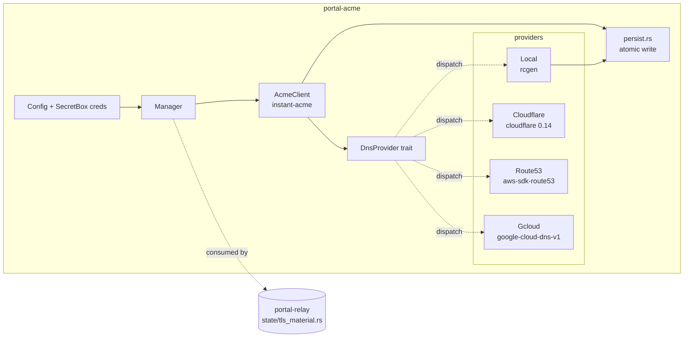

# feat(portal-acme): ACME (instant-acme) + DNS-01 providers (Local / Cloudflare / Route53 / Cloud DNS)

## Summary

Phase 4 of the portal-tunnel-rs port. Build the `portal-acme` crate as a self-contained ACME issuance + DNS-01 challenge stack: `instant-acme = "0.8"` for RFC 8555, plus four `DnsProvider` implementations (Local, Cloudflare, Route53, Google Cloud DNS) sharing a small async trait. Greenfield port — Go (`portal-tunnel/portal/acme/`) is behavioral spec only. Crate has zero internal dependencies on other portal-* crates so it can land in parallel with U2 (portal-wire), U3 (portal-crypto), and U4 (portal-net).

---

## Problem Frame

The relay needs to terminate TLS on its API HTTPS surface (the first row of AGENTS.md's trust-boundary table) with publicly-trusted certificates. Production deployments use ACME DNS-01 because relays often live behind NAT and cannot serve HTTP-01 reliably; the four DNS providers in scope cover the operationally relevant cloud DNS surfaces. Local development needs a zero-dependency self-signed shortcut so contributors can boot the relay without any DNS account. Phase 4 ships only the issuance stack; Phase 5 (`portal-relay` core) consumes the resulting `(cert, key)` material into `state/tls_material.rs`.

---

## Requirements

- R1. Implement an `instant-acme`-backed ACME RFC 8555 client with on-disk persistence of the account key, registration, and issued certificate chain plus private key.
- R2. Provide four `DnsProvider` implementations sharing one async trait surface: `Local`, `Cloudflare`, `Route53`, `Gcloud`.
- R3. Honor SEC-012: DNS-provider credentials are wrapped in `secrecy::SecretBox<T>` newtypes from construction onward; never logged, never serialized into error messages, scoped per-provider instance.
- R4. Each non-Local provider carries a `wiremock`-driven ACME order-flow integration test that asserts the DNS-01 TXT round-trip against a mocked CA + mocked provider API. Local carries a tempdir-based self-signed generation test (the behavioral gate's "per-provider" coverage; see Verification Strategy).
- R5. Public-API surface is a single `Manager` type with `ensure_certificate(ctx)`, `ensure_tls_material(ctx)`, and `start(cancel) / shutdown()` lifecycle hooks. The relay calls `ensure_*` synchronously at boot and `start(cancel)` to spawn the renewal/DNS-sync background loop.
- R6. The crate compiles under workspace edition `2024`, MSRV `1.91`, `unsafe_code = "forbid"`, with `clippy::pedantic + cargo` warn-clean.
- R7. Each implementation unit's substantive diff stays ≤200 LoC per AGENTS.md atomic-commits rule (file moves and generated files do not count).

**Origin requirements traced:** R1 (greenfield port), R3 (greenfield wire — n/a here, no wire surface), R8 (engineering defaults: rustls-mandatory, modern register).

---

## Scope Boundaries

- **Out of scope — ENS gasless DNSSEC.** `ENS_GASLESS_ENABLED`, gasless TXT publication, ENS resolver TXT, child-hostname A-record tracking. The Go code carries these (`acme.go:418-509`) but they are explicitly rejected for v0.1 (consistent with the existing worktree posture in `.claude/worktrees/agent-a2a8a81e1813e6620/docs/unsupported-features.md`). Re-scope as a separate v0.2 crate or an `ens` feature flag if user demand returns.
- **Out of scope — manual certificate override mode.** `manualCertificateOverride()` from Go (`acme.go:249`) is not in v0.1. Operators who want to BYO certs deploy them externally and configure the relay to point at the cert/key files — that pre-`portal-acme` path is portal-relay's concern, not ours. We expose `Manager::cert_files_exist()` so portal-relay can detect external-managed mode and skip `Manager::start()` entirely.
- **Out of scope — Route53 DNSSEC KSK creation.** `EnableHostedZoneDNSSEC`, `CreateKeySigningKey`, `ActivateKeySigningKey`, KMS-backed KSK provisioning. Route53 provider only does TXT/A record CRUD for ACME and observe-only `GetDNSSEC`. KSK creation requires KMS-key wiring outside this crate's scope. Defer to v0.2 (matches existing repo posture).
- **Out of scope — Cloud DNS DNSSEC enable.** Same posture: observe-only `dnssec_state` reading, no `EnableManagedZoneDnsSec` patch.
- **Out of scope — at-rest encryption of credentials/account keys.** SEC-005 owns this and lands in Phase 5 alongside identity persistence. `portal-acme` writes plaintext PEM/JSON files with `0o600` permissions and documents the gap in its README.
- **Out of scope — dual-stack record management (AAAA/IPv6).** Go writes only IPv4 A records; we match. AAAA support is a v0.2 task.

### Deferred to Follow-Up Work

- ENS gasless DNSSEC publication: separate v0.2 effort, possibly its own crate `portal-ens`.
- Route53 KSK + Cloud DNS DNSSEC enable: v0.2 follow-up; needs KMS wiring decisions outside Phase 4 scope.
- At-rest encryption of `acme-account.key` and DNS provider credentials at startup: SEC-005 (Phase 5 wave).
- AAAA record support: v0.2.

---

## Context & Research

### Relevant Code and Patterns

- **Go reference (behavioral spec only):**
  - `portal-tunnel/portal/acme/acme.go` — `Manager` lifecycle, `EnsureCertificate`, `provision`, `maintenanceLoop`, account-key lifecycle. ~720 LoC.
  - `portal-tunnel/portal/acme/provider.go` — `DNSProvider` interface (8 methods incl. ENS-gasless surfaces; we slim to the 4 non-ENS methods).
  - `portal-tunnel/portal/acme/local.go` — local self-signed generator using ECDSA P-256, 10-year TTL, IP+DNS SANs.
  - `portal-tunnel/portal/acme/cloudflare/provider.go` — Cloudflare REST client (zone lookup, dns_records CRUD, dnssec).
  - `portal-tunnel/portal/acme/route53/provider.go` — `aws-sdk-go-v2/route53`, paginated `ListHostedZones`, `ChangeResourceRecordSets` upsert.
  - `portal-tunnel/portal/acme/gcloud/provider.go` — `google.golang.org/api/dns/v1`, ADC credentials, change-polling loop.
- **Workspace conventions:**
  - `Cargo.toml` — `instant-acme = "0.8"`, `aws-sdk-route53 = { version = "1", default-features = false, features = ["behavior-version-latest", "rt-tokio", "default-https-client"] }` already pinned per FEAS-R2-4. `gcp_auth = "0.13"` is currently in workspace deps and will be **removed** by U7 (replaced by native SDK per FEAS-7).
  - `wiremock = "0.6"` already in workspace dev-deps.
  - All deps declared in `[workspace.dependencies]`; per-crate `[dependencies]` references with `.workspace = true`.
  - `unsafe_code = "forbid"`, `clippy::pedantic` warn at `priority = -1`, `unwrap_used = "deny"`, `expect_used = "deny"`. Per-lint silence uses `#[expect(name, reason = "...")]`.
- **Trust-boundary table (`AGENTS.md`):** ACME-issued material flows to **Relay API HTTPS** surface only. Tenant TLS uses keyless (Phase 6b). QUIC datagram uses pinned identity (Phase 5). Phase 4 must not assume any other consumer.

### Institutional Learnings

- The existing worktree `docs/unsupported-features.md` (under `.claude/worktrees/`) confirms ENS gasless and Route53 KSK creation were rejected as v0.1 scope in prior port attempts — same posture this plan adopts.
- ICM `context-portal-tunnel-rs` topic shows prior Phase 3 work was successful when bumping reqwest 0.12→0.13 with `rustls` feature; signals workspace's reqwest discipline (rustls-aws-lc, no native-tls).

### External References

- `instant-acme` 0.8.5 (latest 2026-02-24, MSRV 1.70) — `Account::builder_with_http(Box<dyn HttpClient>)` is the wiremock injection point. `builder_with_root(pem_path)` is the Pebble integration-test path. `Account::order(url) → Order::state` returns the live `OrderState` with challenges. Default features `hyper-rustls + aws-lc-rs` align with workspace TLS policy.
- `cloudflare = "0.14.0"` (BSD-3-Clause, by Cloudflare itself, last updated 2025-03-13, 571k downloads, 14 reverse deps, "Work in Progress" disclaimer). Uses `reqwest = "0.12"`, has `rustls-tls` feature. Decision: **adopt** with the WIP-shim mitigation in Risks.
- `google-cloud-dns-v1 = "1.3.0"` (Apache-2.0, generated 2026-03-26 from API rev 20260219, MSRV 1.86). Native Google client, `default-rustls-provider` (aws-lc-rs) by default. Resolves FEAS-7 in favor of the native SDK.
- `rcgen = "0.13"` with `aws_lc_rs` feature — pure-Rust X.509 generator for the local self-signed mode. Replaces Go's manual `crypto/x509.CreateCertificate` choreography.
- RFC 8555 §7-8 (ACME orders, authorizations, challenges).
- AWS SDK for Rust: `aws-sdk-route53::Client::change_resource_record_sets` is the upsert primitive; pagination via `paginator()`.

---

## Key Technical Decisions

- **ACME library: `instant-acme = "0.8.5"`.** Pure-Rust, async, hyper-rustls + aws-lc-rs default — slot-perfect for the workspace TLS register. Alternative `acme2` is unmaintained (last release 2022); `acme-lib` is sync. No real fork in the road.
- **Cloudflare client: official `cloudflare = "0.14"` crate with `rustls-tls` feature** (resolves the Cloudflare-client question raised in roadmap U5). The crate's "Work in Progress" disclaimer is mitigated by wrapping it behind our `DnsProvider` trait — if it bitrots we swap to a hand-rolled `reqwest` + REST implementation under the same trait without disturbing the rest of the crate.
- **Cloud DNS client: native `google-cloud-dns-v1 = "1.3"` (resolves FEAS-7).** Native SDK over `gcp_auth + REST` because (a) the native SDK uses rustls/aws-lc-rs by default — matches workspace TLS policy without extra wiring; (b) stable typed `model::ResourceRecordSet`, `model::Change`, `client::ResourceRecordSets`, `client::ManagedZones` surface mirrors the Go `dns/v1` types one-to-one; (c) MSRV 1.86 sits comfortably below our 1.91 floor; (d) maintained directly by Google with quarterly releases. Drop `gcp_auth = "0.13"` from `[workspace.dependencies]` as part of U7.
- **Local provider cert generator: `rcgen = "0.13"` with `aws_lc_rs` feature.** Pure-Rust X.509 generator, ~30 LoC vs Go's 80-LoC manual `x509.CreateCertificate` build. Drops a build-cert primitive into the workspace dep set; reusable elsewhere.
- **Async trait: `trait_variant::make`** (already in workspace deps) for the `DnsProvider` trait. Auto-generates the `Send`-bounded variant so both relay and CLI consumers pick up the right bounds.
- **Credential isolation (SEC-012): `secrecy::SecretBox<T>` newtypes per credential class.** Construct distinct types `CloudflareToken(SecretBox<String>)`, `Route53Credentials(SecretBox<Route53Secret>)`, `GcloudServiceAccount(SecretBox<Vec<u8>>)`. Methods that need raw access call `.expose_secret()` only at the API call site. This makes accidental log-via-`{:?}` a compile error and scopes each credential to the provider that owns it.
- **Per-provider feature flags.** `cloudflare`, `route53`, `gcloud`, `local`, default = `["local", "cloudflare", "route53", "gcloud"]`. Lets future minimal-deploy consumers (e.g. WASM CLIs) opt out of the fat AWS SDK.
- **Cancellation: `tokio_util::sync::CancellationToken`.** Replaces Go's `chan struct{}` + `sync.Once`. The maintenance loop selects on `tokio::select! { _ = cancel.cancelled() => break, ... }`.
- **Filesystem persistence: `tokio::fs` + atomic-rename helper.** Account key (`acme-account.key`), registration (`acme-registration.json`), issued chain (`fullchain.pem`), private key (`privatekey.pem`) — all written via `write_then_rename` with `0o600` mode (`0o644` for the public chain). Mirrors Go's `utils.WriteFileAtomic` semantics. Atomic-write helper lives in this crate (no shared utils crate yet); promote to `portal-relay::state` if a second consumer appears.
- **No interior mutability for shared state.** `Manager` is `Arc<ManagerInner>`-shaped; the `tracked_mu` from Go (used only for the now-out-of-scope ENS hostname list) doesn't carry over.
- **Test ACME injection: `Account::builder_with_http()` + custom `HttpClient` impl.** Each integration test constructs an `instant_acme::Account` against a wiremock-served ACME directory, exercising the full RFC 8555 dance against the mock. This is the wiremock injection point that satisfies the behavioral gate.

---

## Open Questions

### Resolved During Planning

- **Cloudflare client crate?** → Official `cloudflare = "0.14"` (Cloudflare-maintained, BSD-3-Clause, has `rustls-tls`); behind our trait so we can swap if WIP issues bite. See KTD #2.
- **Native Cloud DNS SDK vs gcp_auth + REST (FEAS-7)?** → Native `google-cloud-dns-v1 = "1.3"`. See KTD #3.
- **How to inject a fake ACME server for tests?** → `Account::builder_with_http(Box<dyn HttpClient>)` plus a wiremock-backed `HttpClient` impl. The default `hyper-rustls` client is reserved for production.
- **Where does the issued material get consumed?** → Phase 5 (`portal-relay`)'s `state/tls_material.rs`. Phase 4 only writes files to `KeyDir`; the relay reads them. No direct-call API across the phase boundary.
- **What does the local provider produce?** → A self-signed CA-marked ECDSA P-256 cert with SANs covering `localhost`, `*.localhost`, `127.0.0.1`, `::1`, plus the configured `BaseDomain` if non-localhost. 10-year TTL. Same shape as Go.

### Deferred to Implementation

- Exact `instant_acme::HttpClient` impl shape for the wiremock harness — depends on what `instant-acme 0.8.5` exports for the trait. Resolve at U9 implementation time.
- The exact name of `aws-sdk-route53` paginator helper(s) — verify against `1.x` docs at U6 implementation time; minor SDK churn between 1.0 and 1.x.
- Whether to gate `gcloud` provider on `tokio::runtime::Handle::current()` for the auth flow (the SDK's auth path may need an explicit runtime handle). Resolve at U7.

---

## Output Structure

    crates/portal-acme/
    ├── Cargo.toml
    ├── README.md
    ├── src/
    │   ├── lib.rs                 # public API: Manager, Config, errors
    │   ├── manager.rs             # Manager + maintenance loop
    │   ├── acme.rs                # instant-acme client wrapper + persistence
    │   ├── config.rs              # Config + SecretBox credential newtypes
    │   ├── error.rs               # crate-wide thiserror enum
    │   ├── persist.rs             # atomic-write filesystem helpers
    │   ├── provider.rs            # DnsProvider trait + dispatch
    │   └── providers/
    │       ├── mod.rs
    │       ├── local.rs           # rcgen-based self-signed
    │       ├── cloudflare.rs      # cloudflare crate wrapper
    │       ├── route53.rs         # aws-sdk-route53 wrapper
    │       └── gcloud.rs          # google-cloud-dns-v1 wrapper
    └── tests/
        ├── local_self_signed.rs   # tempdir-based local cert generation
        ├── cloudflare_acme.rs     # wiremock CA + Cloudflare API
        ├── route53_acme.rs        # wiremock CA + Route53 API
        ├── gcloud_acme.rs         # wiremock CA + Cloud DNS API
        └── common/
            └── mod.rs             # shared wiremock ACME directory fixture

---

## High-Level Technical Design

> *This illustrates the intended approach and is directional guidance for review, not implementation specification. The implementing agent should treat it as context, not code to reproduce.*



**Lifecycle sketch (directional):**

```text
Manager::new(cfg)                        # validate Config; build chosen DnsProvider
Manager::ensure_certificate(ctx)         # one-shot: returns (cert_path, key_path)
    if local: Local::ensure_self_signed
    else:
        if cert_files_present and not_expiring:
            return existing
        ensure DNS A records for base + wildcard
        AcmeClient::obtain(domains, dns_provider)
            instant-acme: order → authz → DNS-01 challenge → finalize → cert
        atomic-write fullchain.pem + privatekey.pem
Manager::start(cancel)                   # spawn maintenance task
    select {
        cancel.cancelled() => exit
        renew_tick (24h)   => provision_if_should_renew
        dns_sync_tick (10m)=> resync A records
    }
Manager::shutdown()                      # cancel + await join
```

---

## Implementation Units

- U1. **Crate scaffold + workspace dep updates**

**Goal:** Replace the empty `crates/portal-acme/{Cargo.toml,src/lib.rs}` stub with a real package skeleton, and update `Cargo.toml` workspace deps to add `cloudflare`, `google-cloud-dns-v1`, `rcgen`, `tokio-util` (already present, verify features), and **remove** `gcp_auth` (replaced by native SDK per FEAS-7).

**Requirements:** R6, R7

**Dependencies:** None (parallel with U2/U3/U4 root phases)

**Files:**
- Modify: `Cargo.toml` — `[workspace.dependencies]`: add `cloudflare = { version = "0.14", default-features = false, features = ["rustls-tls"] }`, `google-cloud-dns-v1 = "1.3"`, `rcgen = { version = "0.13", default-features = false, features = ["aws_lc_rs"] }`; remove `gcp_auth = "0.13"`. Add per-crate dev-deps: `tempfile = "3"`.
- Modify: `crates/portal-acme/Cargo.toml` — declare `[package]`, pull in `instant-acme`, `tokio`, `tokio-util`, `secrecy`, `thiserror`, `tracing`, `serde`, `serde_json`, `jiff`, `bon`, `compact_str`, `eyre`, plus per-feature `cloudflare`, `aws-sdk-route53`, `google-cloud-dns-v1`, `rcgen`. Define `[features]`: `default = ["local","cloudflare","route53","gcloud"]`.
- Create: `crates/portal-acme/src/lib.rs` — module wiring (`pub mod manager; pub mod config; pub mod error;` etc.), crate-level `#![forbid(unsafe_code)]` and `#![warn(missing_docs)]`, top-level `pub use` re-exports for `Manager`, `Config`, `Error`.
- Create: `crates/portal-acme/README.md` — 30-line crate purpose, feature flag matrix, scope-boundary callouts.

**Approach:**
- File layout per Output Structure above. No behavior — only types stubs and module wiring so the crate compiles.
- `Cargo.toml` features gate provider modules: `#[cfg(feature = "cloudflare")] pub mod cloudflare;` inside `providers/mod.rs`.

**Patterns to follow:**
- `crates/portal-wire/Cargo.toml` (sibling stub) for package skeleton shape — workspace inherits, lints inherits.

**Test scenarios:**
- Test expectation: none — pure scaffolding, no behavior. Verified by `cargo build -p portal-acme --all-features` and `cargo build -p portal-acme --no-default-features` both succeeding.

**Verification:**
- `cargo check -p portal-acme --all-features` passes warning-clean.
- `cargo tree -i gcp_auth` returns empty (workspace removal verified).
- Diff stays ≤200 LoC substantive.

---

- U2. **`DnsProvider` trait + Config + SecretBox credential newtypes (SEC-012)**

**Goal:** Lock the trait surface, the config model, and the credential isolation pattern before any provider implementation. SEC-012 is honored at the type level: each credential class becomes a distinct newtype around `SecretBox<T>`, and the `Config` struct can never accidentally leak via `Debug` or `serde::Serialize`.

**Requirements:** R2, R3

**Dependencies:** U1

**Files:**
- Create: `crates/portal-acme/src/provider.rs` — `DnsProvider` async trait (5 methods: `name()`, `set_txt()`, `clear_txt_with_prefix()`, `ensure_a_records(base, ipv4)`, `observe_dnssec(zone)`), plus the `Box<dyn DnsProvider>` dispatch helper.
- Create: `crates/portal-acme/src/config.rs` — `Config` struct (base_domain, key_dir, provider variant), `ProviderKind` enum (`Local`, `Cloudflare(CloudflareConfig)`, `Route53(Route53Config)`, `Gcloud(GcloudConfig)`), and per-provider config sub-structs each carrying `SecretBox`-wrapped credentials.
- Create: `crates/portal-acme/src/error.rs` — `Error` enum via `thiserror`: `Configuration`, `Persistence`, `Acme`, `Dns`, `Cancelled`. Variants explicitly omit credential fields from `Display`.
- Test: `crates/portal-acme/src/config.rs` (inline `#[cfg(test)] mod tests`).

**Approach:**
- `trait_variant::make(DnsProvider: Send)` to auto-generate the Send-bounded variant.
- `Config::cloudflare_token(self) -> Option<&SecretBox<String>>` accessor (no plain-string return). Providers call `.expose_secret()` at the API-call site only.
- `Debug` impl for `Config` and all sub-configs is **manually derived** (not `#[derive(Debug)]`) and prints `<redacted>` for credential fields. `serde::Serialize` is **not** implemented.
- `bon::Builder` for `Config` (matches workspace style).

**Patterns to follow:**
- Workspace `secrecy = "0.10"` usage idioms — `SecretBox::new`, `.expose_secret()` only at boundary.
- Trust-boundary table in `AGENTS.md` — these credentials never cross out of the `portal-acme` crate.

**Test scenarios:**
- Happy path: `Config::builder().base_domain("portal.dev").key_dir(tmp).cloudflare("tok").build()` constructs without panic.
- Error path: builder rejects empty `base_domain` with `Error::Configuration`.
- Error path: builder rejects empty `key_dir` with `Error::Configuration`.
- Edge case: `format!("{:?}", config)` does **not** contain the literal token string `"tok"`. Asserts the redacted Debug.
- Error path: `Error::Display` for a `ProviderError` wrapping a token-bearing inner error never includes the token (assert `to_string()` does not contain a known sentinel).

**Verification:**
- `cargo test -p portal-acme --no-run` builds.
- All 5 unit tests pass.
- `clippy::pedantic` clean; no `#[allow]` (only `#[expect]` with reason).

---

- U3. **Local self-signed dev provider**

**Goal:** Port `acme/local.go` — generate (or refresh) a self-signed ECDSA P-256 cert covering `localhost`, `*.localhost`, `127.0.0.1`, `::1`, and the configured `base_domain` if it differs. 10-year TTL. CA-marked so a developer can install it as a trust root locally.

**Requirements:** R2 (provider variant), R5 (`Manager::ensure_certificate` short-circuit for localhost), R7

**Dependencies:** U2

**Files:**
- Create: `crates/portal-acme/src/providers/local.rs` — `LocalProvider` (no real DNS surface; `set_txt` etc. return `Error::Unsupported`), plus the freestanding `ensure_local_development_cert(key_dir, base_host)` function that the manager calls at boot.
- Create: `crates/portal-acme/src/persist.rs` — atomic `write_then_rename(path, bytes, mode)` helper used by both U3 and U4. Uses `tokio::fs` + `tempfile::NamedTempFile::persist`.
- Test: `crates/portal-acme/tests/local_self_signed.rs` — integration test using `tempfile::tempdir()`.

**Approach:**
- `rcgen::CertificateParams` with `is_ca = true`, ECDSA P-256, 10-year `not_after`, `key_usage = [DigitalSignature, KeyEncipherment, KeyAgreement, KeyCertSign]`, `extended_key_usage = [ServerAuth]`.
- SANs: parse string → if `IpAddr` then `SanType::IpAddress`, else `SanType::DnsName`.
- Re-issue policy: if `fullchain.pem` + `privatekey.pem` exist AND cover the requested SANs, no-op. Otherwise generate fresh.
- `cert_covers_domains(cert, names)` helper using `rustls-pki-types` parsing — re-used by U4.

**Patterns to follow:**
- Go behavior: `acme/local.go:21-93` — same SAN list construction order, same TTL, same atomic-write semantics.

**Test scenarios:**
- Happy path: `ensure_local_development_cert(tmp, "localhost")` writes both files; the cert verifies `localhost` and `127.0.0.1` via standard rustls-pki-types hostname check.
- Happy path: a second invocation against an already-valid cert is a no-op (file mtime unchanged within 1s tolerance).
- Edge case: invocation with `base_host = "portal.local"` (non-localhost) extends SANs to include `portal.local` AND `*.portal.local`.
- Error path: invocation with read-only `key_dir` returns `Error::Persistence` rather than panicking.
- Edge case: existing `fullchain.pem` for an unrelated domain triggers re-generation (cover-check failure).

**Verification:**
- 5 integration tests pass under `cargo test -p portal-acme --test local_self_signed`.
- Generated cert decodes with `openssl x509 -in fullchain.pem -text -noout` (manual smoke; not in CI).
- `(tempdir / "privatekey.pem").metadata().mode() & 0o777 == 0o600`.

---

- U4. **`instant-acme` ACME client wrapper + on-disk persistence**

**Goal:** The non-local issuance path. Wrap `instant_acme::Account` with on-disk account-key + registration persistence, the order → authorization → DNS-01 challenge → finalize → certificate dance, and atomic-write of the resulting chain + private key. Exposes `AcmeClient::obtain(domains, dns_provider)` for the manager to drive.

**Requirements:** R1, R5, R6, R7

**Dependencies:** U2, U3 (consumes `persist::write_then_rename`)

**Files:**
- Create: `crates/portal-acme/src/acme.rs` — `AcmeClient` struct holding `instant_acme::Account` + `KeyPaths` (account key, registration JSON, fullchain, privkey). Methods: `load_or_register(directory_url, contact_email, key_dir)`, `obtain(domains, dns_provider)`, `cert_files_exist(key_dir)`, `should_renew(key_dir, domains)` (30-day window).
- Modify: `crates/portal-acme/src/lib.rs` — re-export `AcmeClient`.
- Test: inline `#[cfg(test)] mod tests` for pure helpers (`should_renew`, `account_key_round_trip`).

**Approach:**
- Account key persistence: load existing PKCS#8 EC P-256 from `acme-account.key` if present; otherwise generate via `rcgen::KeyPair::generate(&PKCS_ECDSA_P256_SHA256)`, persist atomically.
- `Account::builder().contact(...).directory(LE_DIRECTORY_PRODUCTION).create_or_recover()`. Cache the returned `AccountCredentials` JSON in `acme-registration.json`. On boot, if the JSON exists, call `Account::builder().from_credentials(...)` instead of recreating.
- `obtain(domains, dns_provider)`:
  1. `account.new_order(NewOrder { identifiers: domains.map(Identifier::Dns) })`.
  2. For each authz: pick the DNS-01 challenge, compute `Challenge.token` + `Account.key_authorization()` → call `dns_provider.set_txt(name, value)`.
  3. Wait for DNS propagation (configurable timeout, default 2 min, polled via `hickory-resolver` or simple sleep — Go uses lego's built-in propagation; we ship sleep+poll).
  4. `order.set_challenges_ready()`, then poll `order.refresh()` until `OrderState::Ready`.
  5. Generate certificate keypair via `rcgen::KeyPair::generate_for(&PKCS_ECDSA_P256_SHA256)`, build CSR, `order.finalize(&csr)`.
  6. Poll `order.certificate()` until ready; atomic-write `fullchain.pem` + `privatekey.pem`.
  7. Best-effort `dns_provider.clear_txt_with_prefix(name, "v=ACME")` cleanup.
- `should_renew`: parse `fullchain.pem` first cert via `x509-parser` (instant-acme's optional `x509-parser` feature provides this; enable it). True if `not_after - now < 30 days` OR cert SAN coverage doesn't include the requested domains.
- Renewal interval and DNS propagation timeout are constants; document the tunable via doc comments and surface as `Config` knobs only if a real consumer asks.

**Patterns to follow:**
- Go behavior: `acme/acme.go:276-315` (`provision`), `:639-691` (`newClient`), `:583-602` (`shouldRenew`).
- `instant_acme::Account::builder_with_http(Box<dyn HttpClient>)` is the deferred test injection point — surface this method on `AcmeClient::with_http_client(client)` so U5/U6/U7 tests can plug wiremock.

**Test scenarios:**
- Happy path (unit): `should_renew` returns `true` for a cert whose `not_after - now < 30 days`.
- Happy path (unit): `should_renew` returns `false` for a fresh cert covering all domains.
- Edge case (unit): `should_renew` returns `true` if the cert is fresh but missing one of the requested SANs.
- Error path (unit): `account_key_round_trip` — generate, persist, reload — produces an `AccountCredentials` that `from_credentials` accepts.
- Integration coverage for the order-flow happens in U5/U6/U7 via wiremock; this unit only covers the in-process helpers.

**Verification:**
- `cargo test -p portal-acme --lib acme` passes.
- `cargo doc -p portal-acme` produces docs for `AcmeClient` with no broken intra-doc links.

---

- U5. **Cloudflare DNS-01 provider + wiremock order-flow test**

**Goal:** Implement the Cloudflare provider via the official `cloudflare = "0.14"` crate. Trait-shaped so a hand-rolled `reqwest` fallback can be swapped in if the upstream WIP disclaimer turns into a real maintenance gap.

**Requirements:** R2, R4 (provider 1 of 4)

**Dependencies:** U2 (trait), U4 (AcmeClient with HTTP injection)

**Files:**
- Create: `crates/portal-acme/src/providers/cloudflare.rs` — `CloudflareProvider` wrapping `cloudflare::framework::async_api::Client`. Implements all 5 trait methods.
- Test: `crates/portal-acme/tests/cloudflare_acme.rs` — wiremock-driven full ACME order-flow against a fake CA + fake Cloudflare API.
- Test: `crates/portal-acme/tests/common/mod.rs` — shared wiremock ACME directory fixture (used by U5/U6/U7). Mocks RFC 8555 endpoints: `/directory`, `/new-nonce`, `/new-account`, `/new-order`, `/authz/<id>`, `/challenge/<id>`, `/finalize/<id>`, `/cert/<id>`. Returns a fixture-issued cert chain.

**Approach:**
- `set_txt(name, value)`: zone lookup via `cloudflare.zones().list(...).name(...)`, then `cloudflare.dns().create(...)` (CRUD pattern from the crate). Idempotent: list-then-create-or-update.
- `clear_txt_with_prefix`: list TXT records under name, delete those whose content starts with the prefix.
- `ensure_a_records`: same shape as Go `EnsureARecords` — write `base_domain` and `*.base_domain` A records.
- `observe_dnssec`: `cloudflare.zones().dnssec().get(zone_id)` — read-only; returns `(state, ds_record, message)` shaped like Go's tuple.
- `name() = "cloudflare"`.
- Wiremock test: stand up two `MockServer`s (fake CA + fake Cloudflare API), construct `AcmeClient::with_http_client(reqwest_to_wiremock(ca_url))`, construct `CloudflareProvider::with_endpoint(cf_url)`, run `acme_client.obtain(["portal.test", "*.portal.test"], &cf_provider)`, assert (a) Cloudflare API received POST to `/zones/{id}/dns_records` with `type=TXT` and the expected `key_authorization`-derived value; (b) issued chain was atomic-written to the tempdir; (c) cleanup TXT delete fired.

**Patterns to follow:**
- Go behavior: `acme/cloudflare/provider.go` for method semantics (zone resolution, idempotent ensure, prefix-match delete).
- `wiremock = "0.6"` workspace pattern: `MockServer::start()`, `Mock::given(...).respond_with(...).mount(&server).await`.

**Test scenarios:**
- Happy path (integration, AE-style): `obtain(["portal.test","*.portal.test"], &cf_provider)` issues a cert; the wiremock CA receives one `new-order`, two authz polls, one `finalize`, one `certificate` GET; the wiremock Cloudflare receives two TXT-create calls (one per identifier) AND two TXT-delete calls (cleanup) AND no proxied=true A-record write (we set `proxied=false` always for relay traffic).
- Error path (integration): wiremock CA returns `urn:ietf:params:acme:error:rateLimited` on `new-order` — `obtain` returns `Error::Acme(_)` matching the `rateLimited` problem detail.
- Error path (unit): `set_txt` against an empty token returns `Error::Configuration` (not a network call).
- Edge case (unit): `clear_txt_with_prefix` against a name with mixed-case match (`name = "Portal.Test"`) is case-insensitive (matches Go `strings.EqualFold`).
- Integration: TXT cleanup is best-effort — failing the cleanup call does not propagate an error from `obtain` (warn-log only).

**Verification:**
- `cargo test -p portal-acme --test cloudflare_acme` passes (single-threaded if the wiremock instance is shared).
- The wiremock assertion machinery (`expect(N).called(...)`) confirms the expected request count, not just status codes.

---

- U6. **Route53 DNS-01 provider + wiremock order-flow test**

**Goal:** Implement the Route53 provider via `aws-sdk-route53 = "1"` (already pinned, no-default-features + behavior-version-latest + rt-tokio + default-https-client per FEAS-R2-4). Same trait surface as U5.

**Requirements:** R2, R4 (provider 2 of 4)

**Dependencies:** U2, U4

**Files:**
- Create: `crates/portal-acme/src/providers/route53.rs` — `Route53Provider` wrapping `aws_sdk_route53::Client`.
- Test: `crates/portal-acme/tests/route53_acme.rs` — wiremock-driven ACME flow + AWS endpoint override pointing at a wiremock instance.

**Approach:**
- Construct the AWS client with `aws_config::SdkConfig` whose `endpoint_url` is overridden for tests; in production, defaults to the real Route53 endpoint.
- Hosted-zone lookup: paginated `list_hosted_zones`, find the longest matching public zone (matches Go `findHostedZoneID`).
- Idempotent record management via `change_resource_record_sets` with `ChangeAction::Upsert` for `set_txt` and `ensure_a_records`. For `clear_txt_with_prefix`, fetch existing record set via `list_resource_record_sets` then submit `Delete` with the trimmed remainder (or full delete if all values match the prefix).
- `observe_dnssec`: `get_dnssec(hosted_zone_id)` — read-only. KSK creation/activation is **out of scope** (per Scope Boundaries) and the method documents this.
- TXT-value escaping: Route53 wraps values in `"..."` quotes; `route53_txt_value(s) = format!("\"{s}\"")`, decode via `strip_prefix("\"").and_then(|s| s.strip_suffix("\""))`.
- Wiremock test: AWS SDK signs requests via SigV4; the wiremock instance must accept whatever signature without verification (matchers ignore `Authorization`, `X-Amz-Date`, `X-Amz-Signature`). Mock responds to `POST /2013-04-01/hostedzone/{id}/rrset` with a SDK-shaped XML payload (or use `Json` errors to short-circuit if SDK accepts JSON — verify at impl).
- Same wiremock CA fixture from U5's `tests/common/mod.rs`.

**Patterns to follow:**
- Go behavior: `acme/route53/provider.go:79-220` for trait method semantics, `:341-440` for the upsert pattern.
- AWS SDK 1.x endpoint override: `aws_config::ConfigLoader::endpoint_url(...)` (verify exact API at impl).

**Test scenarios:**
- Happy path (integration): `obtain(["portal.test","*.portal.test"], &r53_provider)` — wiremock Route53 receives the expected `ChangeResourceRecordSets` POST with `Action=UPSERT` and the right TXT value before the wiremock CA's `finalize` succeeds.
- Edge case (unit): `route53_txt_value` and `route53_txt_content` are inverse on values containing escaped quotes (round-trip property test, 100 cases).
- Error path (integration): wiremock Route53 returns `InvalidChangeBatch` XML — provider returns `Error::Dns` containing the AWS error code (no token/credential leakage in the `Display` output).
- Edge case (integration): hosted-zone lookup with multiple candidate zones returns the **longest** matching zone (mirrors Go `DomainCandidates` ordering).
- Integration: `observe_dnssec` returns `(state, ds_record, message)` derived from a fixture `GetDNSSEC` response with one ACTIVE KSK.

**Verification:**
- `cargo test -p portal-acme --test route53_acme` passes.
- AWS SDK signature path does not panic when wiremock returns 200; if signing complications arise, document the workaround inline.

---

- U7. **Google Cloud DNS provider (native SDK) + wiremock order-flow test**

**Goal:** Implement the Cloud DNS provider via `google-cloud-dns-v1 = "1.3"` (FEAS-7 resolved in favor of the native SDK).

**Requirements:** R2, R4 (provider 3 of 4)

**Dependencies:** U2, U4

**Files:**
- Create: `crates/portal-acme/src/providers/gcloud.rs` — `GcloudProvider` wrapping `google_cloud_dns_v1::client::ResourceRecordSets` and `client::ManagedZones`.
- Test: `crates/portal-acme/tests/gcloud_acme.rs` — wiremock-driven ACME flow + Cloud DNS endpoint override.
- Modify: `Cargo.toml` (workspace) — confirm `gcp_auth` removal landed in U1; cross-check no transitive dep needs it.

**Approach:**
- Build the client via `ResourceRecordSets::builder().with_endpoint(endpoint_url).build()` (verify exact API at implementation against `1.3.0` docs). For tests, point at the wiremock URL; for prod, default endpoint.
- `set_txt`: list existing TXT record sets via `ResourceRecordSets::list(project, zone).name(fqdn(name)).type("TXT").send()`, then submit a `Change { additions: [new_set], deletions: [old_set] }` via `Changes::create(project, zone, change).send()`. Poll the change to `Status::Done` (matches Go `applyChange` polling).
- `ensure_a_records`: same pattern; A-type records.
- `clear_txt_with_prefix`: list, filter values whose decoded content starts with prefix, replace-or-delete the record set.
- `observe_dnssec`: read `ManagedZone.dnssec_config.state` via `ManagedZones::get(project, zone)`, plus enumerate `DnsKeys::list(project, zone).digest_type("sha256,sha384,sha1")` for the active DS record.
- Auth: native SDK uses Application Default Credentials (ADC) by default — the test path passes a service-account JSON via env var; in production, GCE metadata or `GOOGLE_APPLICATION_CREDENTIALS`. Document the credential isolation: the `GcloudConfig::service_account_json` is a `SecretBox<Vec<u8>>` that the test path materializes to a tempfile via `tempfile::NamedTempFile` for the SDK to consume.
- TXT-value escaping: same as Go `strconv.Quote`/`strconv.Unquote` round-trip.

**Patterns to follow:**
- Go behavior: `acme/gcloud/provider.go:78-321` — trait method semantics, change-polling, dnssec read-only.
- Native SDK builder pattern: `Foo::builder().with_x(y).send().await?` (verify at impl).

**Test scenarios:**
- Happy path (integration): `obtain(["portal.test","*.portal.test"], &gc_provider)` — wiremock Cloud DNS receives the expected `Changes::create` POST with the right TXT additions; change-poll loop terminates on `Status::Done`.
- Edge case (integration): `applyChange` polling — wiremock returns `Status::Pending` twice then `Status::Done`; provider does not exit early.
- Error path (integration): wiremock Cloud DNS returns 403 `permissionDenied` — provider returns `Error::Dns` with the underlying SDK error wrapped; no service-account JSON content appears in the `Display` output.
- Edge case (unit): `txt_content` round-trips values containing embedded quotes and backslashes (property test, 100 cases).
- Edge case (integration): hosted-zone lookup walks `DomainCandidates` ordering and matches public zones only (private-zone in fixture is skipped).

**Verification:**
- `cargo test -p portal-acme --test gcloud_acme` passes.
- `cargo tree -i gcp_auth` returns empty (re-verify after this unit lands).

---

- U8. **`Manager` lifecycle + maintenance loop**

**Goal:** Compose `AcmeClient` + chosen `DnsProvider` behind the public `Manager` API. Port Go's `Start`/`Stop`/`maintenanceLoop` semantics with `tokio_util::sync::CancellationToken` instead of channels.

**Requirements:** R5, R6, R7

**Dependencies:** U3, U4, U5, U6, U7 (all providers must exist for the dispatch arm)

**Files:**
- Create: `crates/portal-acme/src/manager.rs` — `Manager`, `Manager::new(cfg)`, `ensure_certificate(ctx)`, `ensure_tls_material(ctx)`, `start(cancel)`, `shutdown()`, `cert_files_exist()`. Internal: `maintenance_loop(cancel)`.
- Modify: `crates/portal-acme/src/lib.rs` — re-export `Manager`.
- Test: `crates/portal-acme/src/manager.rs` (inline `#[cfg(test)] mod tests` for the dispatch + lifecycle unit tests; the wiremock-driven flow tests already live in U5/U6/U7).

**Approach:**
- `Manager::new(cfg)` validates config (delegated to U2's builder), instantiates the chosen `DnsProvider`, builds the `AcmeClient` lazily.
- `ensure_certificate`:
  - If `cfg.is_local_relay_host()`, dispatch to `LocalProvider::ensure_local_development_cert`.
  - Else: `dns_provider.ensure_a_records(base, public_ipv4)` first (best-effort), then `acme_client.obtain(domains, &dns_provider)` if cert is missing or expiring.
- `start(cancel)`: spawn one tokio task running `maintenance_loop(cancel)`.
- `maintenance_loop`:
  ```text
  let renew_tick = tokio::time::interval(24h);
  let dns_tick = tokio::time::interval(10m);
  loop {
      tokio::select! {
          _ = cancel.cancelled() => break,
          _ = renew_tick.tick()  => self.renew_if_needed().await,
          _ = dns_tick.tick()    => self.sync_dns().await,
      }
  }
  ```
- `shutdown()` calls `cancel.cancel()` and awaits the join handle.
- Public IPv4 detection: defer the actual implementation. Add a `PublicIpResolver` trait + `DefaultResolver` (uses a configured discovery URL or hard-codes a fallback to `https://api.ipify.org`); the relay can plug a different resolver. Document this as a trait so Phase 5 can override.

**Patterns to follow:**
- Go behavior: `acme/acme.go:196-215` (Start/Stop), `:317-374` (maintenanceLoop, syncDNS).
- `tokio_util::sync::CancellationToken` is the workspace cancellation primitive (already in workspace deps via `tokio-util = "0.7"`).

**Test scenarios:**
- Happy path (unit): `Manager::new` with a `Local` config and an empty tempdir produces a `Manager` whose `ensure_certificate` writes both files.
- Lifecycle (unit): `start(cancel)` followed immediately by `cancel.cancel()` then `shutdown()` joins the background task within 100ms (asserts no hang).
- Edge case (unit): `cert_files_exist()` returns `false` for an empty key dir, `true` after a successful `ensure_certificate` against the local provider.
- Error path (unit): `Manager::new` with `base_domain = ""` returns `Error::Configuration` synchronously.
- Integration (lifecycle): `start(cancel)` with a `Local` provider runs both tickers fast-forwarded via `tokio::time::pause()` + `advance(24h)` and exits cleanly on `cancel.cancel()`.

**Verification:**
- `cargo test -p portal-acme --lib manager` passes (5 unit tests).
- `cargo clippy -p portal-acme --all-features -- -D warnings` clean.

---

## System-Wide Impact

- **Interaction graph:** `portal-acme` is a leaf crate. The single intentional consumer is `portal-relay` (Phase 5) → `state/tls_material.rs` reads `fullchain.pem` and `privatekey.pem` to build the `rustls::ServerConfig` for the API HTTPS surface. There is no in-process API hand-off; the relay re-reads the files on its own cadence (Phase 5 detail).
- **Error propagation:** All errors leave the crate as `portal_acme::Error` (a single `thiserror` enum). The relay maps these to its own `relay::Error` shape — no panic, no `eyre::Result` leakage.
- **State lifecycle risks:** Atomic-write via `NamedTempFile::persist` ensures readers never see torn writes. Account-key rotation is **not** automatic in v0.1; an operator who wants a fresh ACME account deletes `acme-account.key` + `acme-registration.json` and restarts. Document this in the README.
- **API surface parity:** Per-provider trait methods are uniform; the relay only sees `Box<dyn DnsProvider>`. Adding a fifth provider (e.g. DigitalOcean) is a single new file under `providers/` plus a `ProviderKind` variant — no other crate touches.
- **Integration coverage:** The wiremock harness covers each provider end-to-end (CA + provider API + filesystem). Cross-provider parity is **not** asserted (no test rotates configs between providers); this is acceptable because each is independently exercised.
- **Unchanged invariants:** This crate does **not** touch the wire-invariant table (`crates/portal-relay/src/wire/`). It does **not** touch the trust-boundary table beyond producing material consumed by the Relay API HTTPS row. It does **not** introduce any new `unsafe_code`. It does **not** re-introduce ES256K JWT or any of Go's wire-level identities.

---

## Risks & Dependencies

| Risk | Likelihood | Impact | Mitigation |
|------|-----------|--------|------------|
| `cloudflare = "0.14"` "Work in Progress" disclaimer becomes a real maintenance gap (breaking changes, abandonment) | Medium | Medium | Wrap behind our `DnsProvider` trait; the swap to a hand-rolled `reqwest` + REST shim is local to `providers/cloudflare.rs` and never touches downstream code. Pin exact version in workspace deps; review at every dep-bump campaign. |
| `instant-acme 0.8` `HttpClient` trait surface doesn't compose cleanly with wiremock | Low | High | Verify in U4 prototype before U5 starts. Fallback: spin up a Pebble docker sidecar via `testcontainers` for U5/U6/U7 instead of pure wiremock — instant-acme tests against Pebble directly, so `Account::builder_with_root(pem_path)` is the well-trodden path. Document the decision in U9 if invoked. |
| AWS SDK 1.x signature requirement complicates wiremock fixture | Medium | Low | wiremock matchers can ignore `Authorization`/`X-Amz-*` headers; configure the matcher to skip them. If the SDK refuses an unsigned response (it shouldn't — signing is request-side only), fall back to a custom hyper-tower service in front of wiremock. |
| Native `google-cloud-dns-v1` SDK churn (1.x is recent — 2026-01-28 first release) | Low | Medium | Version-pin in workspace deps. The `Box<dyn DnsProvider>` boundary keeps the blast radius local. If the SDK breaks, the `gcp_auth + REST` fallback is one PR away (re-add `gcp_auth = "0.13"` to workspace, swap the body of `providers/gcloud.rs`). |
| SEC-012 credential leakage via `tracing` events in test failures | Medium | Medium | Custom `Debug` impls on all credential newtypes return `<redacted>`. Provider methods take `&Config`, never owned credentials, and only call `.expose_secret()` at the API-call site. Add a clippy `disallowed_methods` rule on `SecretBox::expose_secret` outside `providers/*.rs` to enforce mechanically. |
| Per-commit ≤200 LoC discipline broken by U4 (acme client wrapper is large) | Medium | Low | If U4's diff exceeds 200 substantive LoC, split: U4a = account persistence + `should_renew`, U4b = `obtain` order-flow. The split boundary is natural (helper layer vs. drive layer). |
| Local provider's 10-year TTL exceeds `webpki`'s default acceptance window | Low | Low | `rustls` accepts 10-year certs by default in modern versions; verify in U3 by loading the issued cert into a `rustls::ServerConfig` in the test. If rejected, reduce TTL to 397 days (CA/Browser Forum baseline) and re-issue automatically on near-expiry. |
| Renewal background task panics silently if the chosen DNS provider is mis-configured at startup | Medium | Medium | `Manager::new` validates the provider's required credentials synchronously before returning success; any later config drift surfaces as a `tracing::warn!` and the task continues with the next tick (matches Go semantics). |

---

## Documentation / Operational Notes

- **README** (`crates/portal-acme/README.md`): Feature flag matrix, the four scope-boundary callouts (no ENS, no manual override mode, no DNSSEC enable, no AAAA), the SEC-012 credential-handling contract, the SEC-005 plaintext-on-disk gap and where it gets resolved (Phase 5), the `Manager::start(cancel)` lifecycle contract.
- **Wire-compat doc:** No new entries in `docs/wire-compat-deltas.md` — this crate has no wire surface.
- **Operational gotchas to surface in the README:**
  - First boot against Let's Encrypt counts as one rate-limit-bucket order; configure the staging directory (`https://acme-staging-v02.api.letsencrypt.org/directory`) for testing.
  - Account-key rotation is manual: delete `acme-account.key` + `acme-registration.json` and restart.
  - Local mode generates a CA-marked cert that **must not** be installed in any production trust root.
- **Logging:** `tracing` events at `INFO` for cert issued/renewed, `WARN` for transient DNS failures, `ERROR` only for terminal failures. **Never** include credential material or signed challenge values in event fields.

---

## Verification Strategy

End-to-end Phase 4 acceptance:

1. **Per-provider behavioral gate (R4).** Four tests, one per `DnsProvider`:
   - `tests/local_self_signed.rs` — tempdir-based local cert generation (5 scenarios; U3).
   - `tests/cloudflare_acme.rs` — wiremock CA + wiremock Cloudflare API; full RFC 8555 order flow asserts TXT round-trip (5 scenarios; U5).
   - `tests/route53_acme.rs` — wiremock CA + wiremock Route53; full order flow (5 scenarios; U6).
   - `tests/gcloud_acme.rs` — wiremock CA + wiremock Cloud DNS; full order flow (5 scenarios; U7).
   The "wiremock-driven ACME order-flow per DNS provider" gate is satisfied by the three non-Local files; the Local file satisfies the per-provider behavioral coverage intent (no real ACME path applies to local).
2. **Crate-level CI gates:**
   - `cargo build -p portal-acme --all-features` and `--no-default-features` both succeed.
   - `cargo test -p portal-acme --all-features` passes; integration tests run single-threaded if wiremock contention surfaces.
   - `cargo clippy -p portal-acme --all-features -- -D warnings` clean.
   - `cargo doc -p portal-acme --no-deps` succeeds (no broken intra-doc links).
   - `cargo deny check -p portal-acme` clean (rustls-mandatory invariant respected; no openssl/openssl-sys/libssh2-sys in transitive closure).
   - `cargo tree -i gcp_auth` returns empty (FEAS-7 resolution verified).
3. **Workspace-level invariants honored:**
   - Edition 2024, MSRV 1.91, `unsafe_code = "forbid"`.
   - Each commit's substantive diff ≤200 LoC.
   - All deps declared in `[workspace.dependencies]`; per-crate `[dependencies]` use `.workspace = true`.
4. **Trust-boundary alignment:** No new `rustls::ServerConfig` is constructed in this crate. Material flows file-by-file to Phase 5's `state/tls_material.rs`.

---

## Sources & References

- **Origin document:** `/home/alpha/.cursor/plans/port_go_to_rust_greenfield_383a2dc9.plan.md` — see U5 (Phase 4: portal-acme), Deferred-to-Phase-Plans Phase 4 section (SEC-012, FEAS-7), and `## Risks & Dependencies` for the workspace-level threat model.
- **Roadmap behavioral gate:** product-lens P1#4 (each phase plan must list at least one behavioral / property test as a deliverable).
- **Workspace conventions:** `AGENTS.md` (atomic commits / tidy-first / 2026 Rust house style / wire-invariant + trust-boundary tables).
- **Go reference (behavioral spec only, no interop required):**
  - `portal-tunnel/portal/acme/acme.go`
  - `portal-tunnel/portal/acme/provider.go`
  - `portal-tunnel/portal/acme/local.go`
  - `portal-tunnel/portal/acme/cloudflare/provider.go`
  - `portal-tunnel/portal/acme/route53/provider.go`
  - `portal-tunnel/portal/acme/gcloud/provider.go`
- **Prior repo posture:** `.claude/worktrees/agent-a2a8a81e1813e6620/docs/unsupported-features.md` — confirms ENS gasless and Route53 KSK posture adopted here.
- **External docs:**
  - `instant-acme` 0.8.5 — https://docs.rs/instant-acme/0.8.5
  - `cloudflare` 0.14.0 — https://docs.rs/cloudflare/0.14.0 (BSD-3-Clause, Cloudflare-maintained)
  - `google-cloud-dns-v1` 1.3.0 — https://docs.rs/google-cloud-dns-v1/1.3.0
  - `aws-sdk-route53` 1.x — pinned via workspace dep with FEAS-R2-4 features
  - `rcgen` 0.13 — https://docs.rs/rcgen/0.13
  - RFC 8555 (ACME) — https://datatracker.ietf.org/doc/html/rfc8555
- **Coordination:** Phase 0 bootstrap is in progress. Phases 1, 2, 3, 5, 6a, 6b, 7 plans are running in parallel. Phase 4 has **no internal Rust dep** on Phases 1-3 (it's a self-contained DNS-01 + ACME stack); other parallel workers do not touch `crates/portal-acme/` or this plan file. Phase 5 (`portal-relay` core) consumes Phase 4's output via filesystem, not via API.
