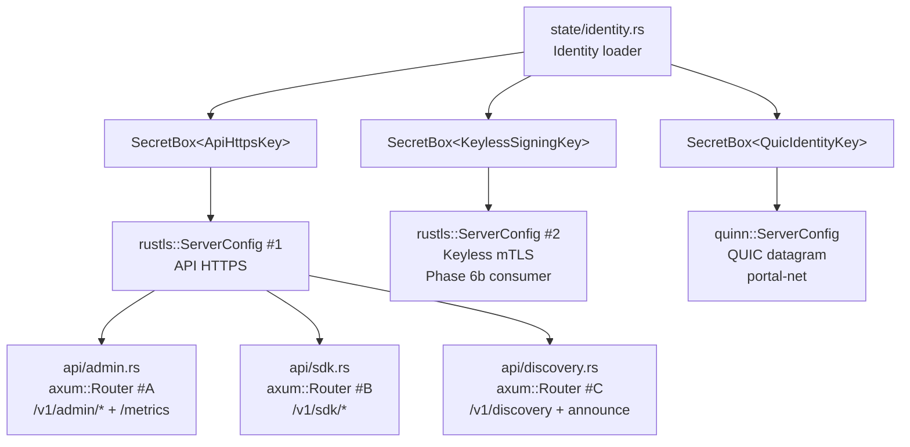
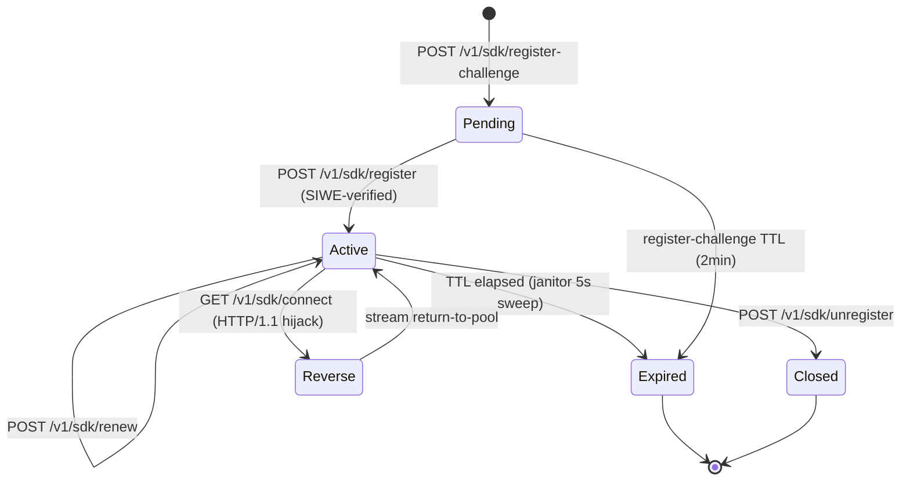
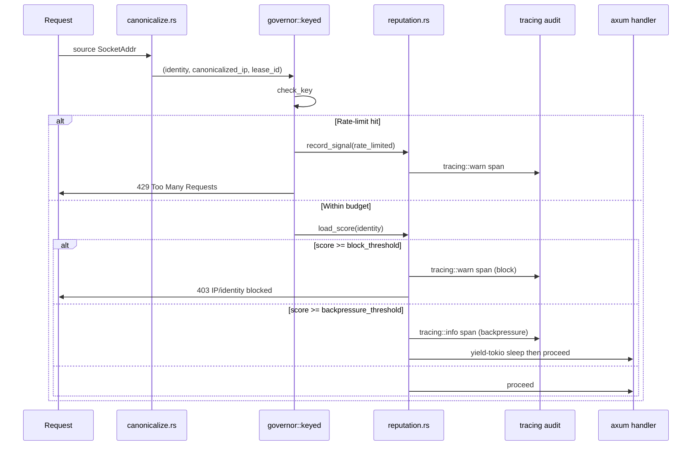

# feat: portal-relay core (Phase 5) — lease, axum API, policy + R10 v0.1, discovery, R11 metrics, R15 status TUI, R13 ECH-aware tenant routing

## Summary

Phase 5 lands the `portal-relay` library crate: lease registry (papaya-backed, atomic-write JSON persistence), the three trust-boundary `axum` surfaces (admin / sdk / discovery) wired behind R2 type-level `SecretBox<KeyType>` newtypes, the base policy engine ported from `portal-tunnel/portal/policy/` plus the R10 v0.1 per-relay reputation engine (governor-keyed adaptive rate-limit + per-identity exponential-decay reputation + SIWE+ENS Sybil gating + signed `RelayDescriptor` verification + honeypot/canary fingerprinting + backpressure-before-block + `tracing::instrument` audit log), discovery announce/refresh + public registry handler, the R11 v0.1 `/metrics` endpoint via `metrics-exporter-prometheus`, the R15 v0.1 relay-side `Status` view scaffold (`portal-relay tui`), and R13 ECH-aware tenant-TLS routing wire shape. Workspace-level `cargo-vet` setup (deferred from Phase 0 per scope-guardian #2) lands in the same phase. v0.2-deferred surfaces — `/admin/dashboard` HTML aggregator, `tokio-console` gRPC port, R10 cross-relay reputation propagation + `ReputationDelta` envelope — are explicitly out of scope.

---

## Problem Frame

`portal-relay` is the relay-server library that the `portal-relay-bin` binary boots in Phase 7. The Go reference (`portal-tunnel/portal/{lease,api_server,server,proxy}.go` + `portal-tunnel/portal/{policy,discovery}/`) collapses lease state, three TLS surfaces, two policy concerns (BPS throttling + ban filter), and discovery into one `Server` struct. Greenfield Rust must carry the same nine behavioral surfaces (lease lifecycle, SIWE registration, ACME issuance, multi-hop routing, MITM probe, raw TCP/UDP routing, admin API, public discovery — R3) **without** replicating the single-`Server` god-object shape and **without** collapsing the three trust boundaries into one `rustls::ServerConfig`. The plan must also (a) introduce the v0.1 R10 anti-abuse subsystem that has no Go equivalent, (b) bake R12 IPv4-mapped IPv6 canonicalization into every IP-keyed surface from day one (CVE-2023-45288 class), and (c) keep each commit ≤200 LoC per AGENTS.md while still landing a coherent crate.

---

## Requirements

- R1. Workspace and module shape are idiomatic Rust 2024 — Resolver 3, edition 2024, `forbid(unsafe_code)`, `clippy::pedantic + cargo` at warn, deps in `[workspace.dependencies]`. *(carried from origin R1)*
- R2. **Trust boundaries enforced at key-material level.** Each of the three trust surfaces loads its signing key from a distinct path, holds it in a distinct `secrecy::SecretBox<KeyType>` newtype, and a clippy `disallowed_methods` rule rejects any function returning more than one `SigningKey` from a single load call. Two of the three live in `portal-relay` (`SecretBox<ApiHttpsKey>` for the HTTPS API surface; `SecretBox<KeylessSigningKey>` consumed by Phase 6b keyless server); the third (`SecretBox<QuicIdentityKey>`) is plumbed from `portal-relay`'s identity loader to `portal-net` per origin System-Wide Impact. *(carried from origin R2)*
- R3. **Feature parity at user-visible CLI and admin-API surface.** `portal-relay` library exposes the lease lifecycle, public discovery, admin endpoints, and reverse-connect hijack handler with equivalent outcomes for equivalent inputs. Wire-level parity is explicitly NOT required (greenfield, R4). *(carried from origin R3)*
- R10. **R10 v0.1 per-relay anti-abuse engine** — governor-keyed adaptive rate limit (per `(identity, ip, lease)` triple) + per-identity reputation with exponential decay + SIWE+ENS Sybil gating (alloy-based ENS resolver) + signed `RelayDescriptor` verification on the discovery path + honeypot/canary fingerprinting + backpressure-before-block semantics + `tracing::instrument`-spanned audit log. **Cross-relay propagation + `ReputationDelta` envelope deferred to v0.2.** *(carried from origin R10 v0.1 leg)*
- R11. **R11 v0.1 observability** — `metrics` facade + `metrics-exporter-prometheus` `/metrics` endpoint mounted on the admin trust boundary. **`tokio-console` gRPC + `/admin/dashboard` HTML aggregator deferred to v0.2.** *(carried from origin R11 v0.1 leg)*
- R12. **Dual-stack v4+v6 listeners by default** with **IPv4-mapped IPv6 canonicalization** (`::ffff:0:0/96` → 32-bit v4 representation) applied **before** any policy lookup (ip_filter, proxy_trust, approver, governor key, R10 per-identity-IP reputation component, audit log). Single canonicalization helper owned by `crates/portal-relay/src/listeners/`. *(carried from origin R12)*
- R13. **R13 stable baseline + tenant ECH-aware routing wire shape.** Listener defaults (TLS 1.3 preferred, AEAD-only, HSTS preload, cookie hardening, HTTP→HTTPS 308, per-handshake `tracing` telemetry) live here; tenant TLS path consumes greenfield wire's `routed_hostname` field for ECH-aware routing without holding tenant ECH decryption keys; relay's own HTTPS API uses ECH GREASE only (server-side ECH deferred per rustls#1980). *(carried from origin R13)*
- R15. **R15 v0.1 relay-side TUI** — `portal-relay tui` subcommand renders a single `Status` view (lifecycle, recent error log, current lease count, BPS aggregate). Launch wizard, Config editor, Admin views deferred to v0.2. *(carried from origin R15)*
- R-S5-1. **SEC-004 keyless oracle protections (shared infrastructure leg).** Phase 5 owns the shared input-validation rule + per-tenant rate-limit primitive that the Phase 6b keyless server consumes; the keyless oracle itself ships in Phase 6b. *(derives from origin Deferred-to-Phase-Plans → Phase 5 SEC-004)*
- R-S5-2. **SEC-005 at-rest encryption strategy** for `identity.json`, ACME private keys, DNS-provider credentials, AND R10 per-identity reputation state JSON — 0600 file permissions enforced + `SecretBox<T>` `Debug` redaction + reputation-row redaction in any debug/dump output; full at-rest encryption design ADR records key-derivation choice + recovery posture. *(derives from origin Phase 5 SEC-005)*
- R-S5-3. **SEC-008 admin auth design** — argon2id password hashing + signed-cookie session model + brute-force protection (governor-keyed by `(username, source_ip)`) + lockout policy with `tracing` audit. *(derives from origin Phase 5 SEC-008)*
- R-S5-4. **SEC-010 hot-reload semantics for `arc-swap<Config>` trust-boundary keys.** Trust-boundary keys (`ApiHttpsKey`, `KeylessSigningKey`, `QuicIdentityKey`) require process restart per round-2 reviewer convergence; non-key surfaces (`approver` mode, `bps_manager` limits, `ip_filter` ban list, R10 thresholds) hot-reload via `arc-swap` with audit-trail entry per swap. *(derives from origin Phase 5 SEC-010)*
- R-S5-5. **SEC-011 rate-limit surface enumeration.** Every public endpoint that mutates server state OR consumes asymmetric work carries a governor-keyed rate limit: admin auth, SIWE register, register-challenge, ACME challenge proxy, public discovery announce, hop-route registration, plus the R10 anti-abuse adaptive thresholds. *(derives from origin Phase 5 SEC-011)*
- R-S5-6. **cargo-vet supply-chain audit setup** (deferred from Phase 0 per scope-guardian #2). `supply-chain/audits.toml` + `supply-chain/config.toml` land in this phase; `cargo xtask ci` learns `cargo vet` after this phase. *(derives from origin Phase 0 deferral note)*

**Origin trace.** Roadmap U6 is the single upstream unit; this plan decomposes U6 into U1–U17 below. R-IDs above prefixed `R-S5-` are plan-local derivations of origin "Deferred to Phase Plans → Phase 5" entries.

---

## Scope Boundaries

- **WireGuard hop-mux overlay**: deferred to Phase 6b (`crates/portal-relay/src/overlay/`). Phase 5 leaves the `HopMux` integration seams as `unimplemented!()` stubs + `cfg(feature = "_phase6b_overlay_seam")` gating for forward types.
- **Keyless `SigningKey` + axum `/v1/sign` endpoint**: deferred to Phase 6b (`crates/portal-relay/src/keyless/`). Phase 5 ships only the **shared input-validation/rate-limit infrastructure** consumed by Phase 6b (R-S5-1).
- **R10 cross-relay reputation propagation**: deferred to v0.2 per origin R10 narrowing. `portal-wire::ReputationDelta` envelope reserved at Phase 1 but not emitted in v0.1; `portal-relay` propagation logic explicitly out of scope.
- **`/admin/dashboard` HTML aggregator** + **`tokio-console` gRPC endpoint**: deferred to v0.2 per origin R11 narrowing (FEAS-R2-2 architecture mismatch + `tokio_unstable` cfg flag concern). v0.1 ships `/metrics` endpoint only.
- **R15 Launch wizard / Config editor / Admin TUI views**: deferred to v0.2 per origin R15 narrowing. Phase 5 ships only the single `Status` view scaffold.
- **R13 server-side ECH on relay HTTPS surface**: deferred to v0.2 (gated on rustls#1980, PR #2993 in flight). Phase 5 ships ECH GREASE (client-side) only on the relay's own HTTPS API surface.
- **HTTP/3 (`h3-quinn`)**: deferred per origin Risks table (`h3@0.0.8` and `h3-quinn@0.0.10` still pre-1.0 and self-described "experimental"). Phase 5 ships HTTP/2 + HTTP/1.1 baseline; H3 evaluation re-runs in a future phase.
- **Behavioral-trace harness vs Go reference (R3)**: deferred to Phase 7. Phase 5 ships per-crate behavioral integration tests only.
- **`utoipa` OpenAPI export `xtask`**: stubbed in this phase (every Phase 5 axum route is annotated with `#[utoipa::path]`); the `xtask openapi-export` driver + committed `docs/openapi.yaml` snapshot test land in Phase 7 per origin v0.2 Backlog ("utoipa coverage CI gate full implementation"). Phase 5 lands the clippy `disallowed_methods` ban on bare `axum::Router::route` per FEAS-R2-7.
- **Frontend asset bundling** (`crates/portal-relay-bin/assets/`, `MANIFEST.toml`, `cargo xtask refresh-frontend-bundle`): Phase 7 work per origin R14 narrowing.

### Deferred to Follow-Up Work

- **Cross-crate `SecretBox<QuicIdentityKey>` plumbing into `portal-net`'s endpoint constructor**: Phase 5 ships the load-side (identity loader emits `SecretBox<QuicIdentityKey>`); the `quinn` endpoint constructor consuming it lands in Phase 3 if Phase 3 finishes after Phase 5, otherwise Phase 5 lands a lints-clean `pub` re-export.
- **Per-relay reputation state migration tool**: future v0.2 ADR.
- **R10 ASN-bin Sybil cap on the propagation layer**: tied to v0.2 cross-relay propagation (origin v0.2 Backlog).

---

## Context & Research

### Relevant Code and Patterns (Go reference)

- `portal-tunnel/portal/lease.go` — `leaseRegistry` struct (Mutex-protected Vec<*leaseRecord>), `Register`/`Renew`/`Unregister`/`RegisterHopRoute`/`DeleteHopRoute`/`admitLeaseByToken`/`Lookup`/`PublicLeases`/`AdminLeases` API, port allocator wiring (`transport.PortAllocator`), challenge-issuing, hostname-conflict + transport-mismatch + capacity errors.
- `portal-tunnel/portal/api_server.go` — `apiHandler` switch dispatch (`PathHealthz`, `PathSDKDomain`, `PathSDKRegisterChallenge`, `PathSDKRegister`, `PathSDKRenew`, `PathSDKUnregister`, `PathSDKHop`, `PathSDKConnect`, `PathDiscovery`, `PathDiscoveryAnnounce`, `PathV1Sign`); `extractAllowedClientIP` (proxy-trust + ip_filter); `apiError` struct + `writeAPIErrorResponse` helper.
- `portal-tunnel/portal/server.go` — `Server` orchestrator (`prepareAPITLS` → ACME issuance → `keyless.AttachToHTTPServer`); ingress/janitor/discovery `errgroup.Go` workers; `runRegistryJanitor` (5s interval, calls `cleanupExpired`); `runRelayDiscoveryLoop` (30s `DiscoveryPollInterval`); `runPublicIngress` (SNI peek → lookup → `bridgeLeaseConn`); `bridgeLeaseConn` (single-hop or hop-mux next-hop).
- `portal-tunnel/portal/proxy.go` — `proxy.bridge` (errgroup half-duplex copies, `closeWrite` per direction, `BPSManager.ThrottleIdentityBPS` gating, `countingConn` byte counter).
- `portal-tunnel/portal/policy/runtime.go` — aggregator over `Approver`, `BPSManager`, `IPFilter`, banned-identity-keys set, UDP+TCP `PortPolicy`, proxy-trust state. `EffectiveApproval` + `IsIdentityRoutable` semantics.
- `portal-tunnel/portal/policy/{approver,bps_manager,ip_filter,proxy_trust}.go` — direct ports.
- `portal-tunnel/portal/discovery/relayset.go` — `RelaySet` (URL → `RelayState` map + signing-identity → `keyIndexEntry` reverse map for rollback defense). `upsertDescriptorLocked` enforces (a) monotonic-IssuedAt-per-key rollback guard with `TombstoneUntil = IssuedAt + AnnounceMaxValidity`, (b) cross-identity URL-takeover guard (only authoritative refresh may take over), (c) `MaxAnnouncedRelays = 1024` LRU cap with bootstrap+confirmed pinning. `AnnounceClockSkewTolerance = 5min`, `AnnounceMaxValidity = 24h`, `DiscoveryDescriptorTTL = 5min`.
- `portal-tunnel/portal/discovery/announce.go` — `AnnounceLimiter` (per-source-IP token bucket: `DefaultAnnounceRatePerMinute=30`, `DefaultAnnounceBurst=60`, idle-bucket prune at 10min interval / 30min TTL, hard ceiling `maxBucketCount=65536`).
- `portal-tunnel/portal/discovery/refresher.go` — `Refresher` (overlay refresh + HTTPS refresh + self-announce). Rust analogue uses `reqwest`-rustls (banned via origin R8) — actually `axum`'s sibling `hyper-rustls` + `tower::Service`-based client per dep policy.

### Relevant Code and Patterns (Rust workspace)

- Phase 0 `Cargo.toml` `[workspace.dependencies]` is the single source of truth for crate version pins. Every `portal-relay` Cargo.toml dep is `workspace = true`.
- Phase 0 `[workspace.lints]` lint set is inherited via `lints.workspace = true`. No per-crate lint overrides.
- Phase 1 `portal-wire` exports: `Envelope`, `Claims`, `Channel`, `RelayDescriptor` (with `addresses_v4: Vec<SocketAddrV4>` + `addresses_v6: Vec<SocketAddrV6>` per R12), `RegisterRequest` / `RegisterChallengeRequest` / `RegisterResponse` / `RenewRequest` / `RenewResponse` / `UnregisterRequest` / `HopRoute` / `DiscoveryResponse` / `DiscoveryAnnounceRequest` / `DiscoveryAnnounceResponse`, the `routed_hostname: CompactStr` ECH field, the `b"portal-tunnel/relay-descriptor/v1"` etc. domain separators, the `ReputationDelta` shape (reserved, not emitted in v0.1).
- Phase 2 `portal-crypto` exports: ed25519 sign/verify, SIWE wrapper, keyless `SigningKey` trait skeleton, lease-token issue/verify (`LeaseAccessToken { identity, relay_pubkey, expiry, scope }` per origin SEC-003), domain-separated signature helpers.
- Phase 3 `portal-net` consumes `SecretBox<QuicIdentityKey>` from `portal-relay`'s identity loader and constructs the `quinn` endpoint. Re-exports `PortAllocator`, `RelayStream`, `RelayDatagram`, `RelayTcpPort` (Rust-side port-relay primitives ported from `portal-tunnel/portal/transport/`).
- Phase 4 `portal-acme` exports `Manager::ensure_tls_material(ctx) -> (CertChain, SecretBox<ApiHttpsKey>)` + `sync_ens_gasless_hostname` / `delete_ens_gasless_hostname` admin operations.

### Institutional Learnings

- **Origin Decision Stability clause** binds v0.1 R-IDs and v0.2 Backlog enumeration after Phase 0 ships. Phase 5 plan does not re-open R10 / R11 / R13 / R15 narrowing. Any reversal requires an ADR amendment.
- **Origin AGENTS.md ≤200 LoC rule** — each implementation unit below is sized so its substantive diff lands in one commit. Test files and generated `utoipa` annotations do not count toward the 200-LoC ceiling.
- **`papaya` async caveat** (origin Context & Research): `pin()` returns non-Send `LocalGuard`. Lease-registry call sites that hold a guard across `.await` MUST use `pin_owned()` explicitly per upstream docs. This plan flags every such site in U7.
- **`aws-sdk-route53` MSRV 1.91 floor** (FEAS-1) is already absorbed at workspace level; Phase 5 inherits.

### External References

- `papaya` 0.2 docs — `pin_owned()` semantics for await-crossing guards.
- `governor` 0.10 docs — `RateLimiter::keyed` keyed-direct-rate-limiter pattern + `governor::clock::QuantaUpkeepClock` for low-overhead time source.
- `axum` 0.8.9 `Router::nest` + `Router::with_state` + `axum-server::tls_rustls` for per-router `rustls::ServerConfig` mounts.
- `metrics-exporter-prometheus` 0.x — `PrometheusBuilder::install_recorder` + manual axum `/metrics` endpoint via `recorder.handle().render()` (not the auto-listener — that bypasses our trust boundary).
- `arc-swap` 1.x — `ArcSwap<Config>` for hot-reload; `ArcSwap::compare_and_swap` for audit-trail emission per swap (R-S5-4).
- `secrecy` 0.10 — `SecretBox::new` + `expose_secret()` audit posture; per origin Aggressive 2026 Register, every key/token at rest wrapped in `SecretBox<T>`.
- `alloy` provider + `ens` feature — ENS resolver for R10 SIWE+ENS Sybil gating per origin Phase 0 dep matrix.
- `ratatui` 0.30 + `ratatui-crossterm` 0.1 — single `Status` view per R15 v0.1 (post-0.30 modular workspace).
- `argon2` crate — argon2id with 2026 OWASP-recommended parameters for SEC-008.
- `cargo-vet` Mozilla docs — `supply-chain/audits.toml` + `supply-chain/config.toml` schema; layered atop `cargo-deny` per origin Tooling section.

---

## Key Technical Decisions

- **Single library crate, six top-level module trees (`policy/`, `api/`, `state/`, `admin/`, `listeners/`, `tui/`) plus `server.rs` orchestrator + `error.rs` + `config.rs` + `reload.rs`.** Mirrors Go's portal-package layout without inheriting the `Server` god-object. Each module has one owner per contract per origin R7.
- **`papaya::HashMap<IdentityKey, Arc<LeaseRecord>>` is the lease registry primary store**, with a `papaya::HashMap<CompactStr, IdentityKey>` hostname → identity reverse index. Reads dominate (every public-ingress connection performs an SNI lookup); writes only on register / renew / expire / janitor sweep. **Every call site that holds a guard across `.await` uses `pin_owned()` explicitly** and is annotated with a `// papaya: pin_owned() across await per upstream docs` comment per U7. Replaces Go's `sync.RWMutex`-protected `[]*leaseRecord` slice — the slice scan was O(n) per lookup; papaya is amortized O(1).
- **Three `axum::Router` mounts on three `axum_server::tls_rustls::RustlsConfig` instances backed by three `SecretBox<KeyType>` newtypes.** Phase 5 owns two of three trust-boundary newtypes (`ApiHttpsKey`, `KeylessSigningKey`); the third (`QuicIdentityKey`) lives in `portal-net` per origin System-Wide Impact + FEAS-R2-5. The clippy `disallowed_methods` rule rejecting multi-key returns is workspace-level (lands in workspace lints; Phase 5 adds the entries for Phase 5's surfaces). Routers do **not** share state — `Arc<RelayState>` is separately constructed per router with the subset of state each surface legitimately needs.
- **All endpoints carry `/v1/` prefix** EXCEPT `/healthz` and `/metrics` (operational tooling — load balancers, k8s probes, monitoring — predates `/v1/` semantics per origin Wire-protocol register).
- **HTTP response wrapper is `Result<T, ApiError>` serialized as `{"data": T}` (HTTP 2xx) or `{"error": {"code": ..., "message": ...}}` (HTTP 4xx/5xx)** per origin Key Technical Decisions. RFC 7807 problem+json compatibility considered but deferred (origin Phase 1 owns).
- **R10 v0.1 reputation engine** lives in `policy/reputation.rs` and consumes `governor::RateLimiter::keyed` over a `(IdentityKey, IpAddr, LeaseId)` triple. Per-identity reputation is an exponential-decay scalar (`score = score * exp(-decay_constant * elapsed) + signal`) with `decay_constant` defaulted at workspace-level config. The engine emits `tracing::instrument(level = "warn")` spans for every backpressure / block / honeypot-hit decision; the audit log is a downstream `tracing-subscriber` sink, not a separate primitive. SIWE+ENS Sybil gating uses an `alloy::providers::ProviderBuilder` ENS resolver behind a `tower::Service` interface so it's mockable without network in tests.
- **Discovery announce limiter** is `governor`-based per-source-IP, parameterized identically to Go's `DefaultAnnounceRatePerMinute=30` / `DefaultAnnounceBurst=60`. Idle-bucket pruning is `governor`'s built-in via the `DefaultDirectRateLimiter::shrink_to_fit` periodic call. Hard ceiling `max_bucket_count=65536` carries forward.
- **`RelaySet` is a single `papaya::HashMap<RelayUrl, RelayState>` + sibling `papaya::HashMap<SigningIdentity, KeyIndexEntry>`** under one `tokio::sync::Mutex` for the `upsertDescriptorLocked`-equivalent batched mutator. The "everything under one write lock" pattern from Go is preserved — papaya gives lock-free reads, but the rollback-defense + cross-identity-takeover guard is one logical transaction and stays serialized.
- **R12 IPv4-mapped IPv6 canonicalization** is owned by `crates/portal-relay/src/listeners/canonicalize.rs` exposing one function: `pub fn canonicalize_source(addr: SocketAddr) -> SocketAddr`. **EVERY** policy lookup site (ip_filter, proxy_trust, approver, governor key, R10 reputation, audit log) calls it BEFORE keying. Enforced at code-review time + a workspace-level `ast-grep` scan in CI per FEAS-R2-7 pattern (lands as part of U3).
- **R-S5-2 SEC-005 at-rest encryption.** Phase 5 v0.1 ships **0600 file permissions enforced via `OpenOptions::mode(0o600)` on POSIX** (no-op gracefully on Windows; behavior documented in ADR) + **`SecretBox<T>` `Debug` redaction** + **reputation-row redaction** in dump output. **Full at-rest encryption design (key-derivation, recovery posture, rotation)** lands as ADR `0005-at-rest-encryption-strategy.md` in this phase but the **encryption-on-disk implementation** is sequenced for Phase 7 release work — v0.1 ships unencrypted-on-disk with permissions-only enforcement, ADR documents the deferral and the trust-boundary that justifies it.
- **R-S5-3 SEC-008 admin auth** — `argon2` crate (argon2id, 2026 OWASP-recommended parameters: 19 MiB memory, 2 iterations, 1 parallelism) + signed-cookie session via `tower-cookies` + `cookie::Key` derived from `SecretBox<ApiHttpsKey>` material via HKDF (domain-separated label `b"portal-tunnel/admin-cookie/v1"` per origin SEC-007 family) + `governor`-keyed `(username, source_ip)` brute-force throttle + 5-failure 15-minute lockout per `(username)`.
- **R-S5-4 SEC-010 hot-reload** — `arc_swap::ArcSwap<RuntimeConfig>` for non-key surfaces (approver mode, bps_manager limits, ip_filter ban list, R10 thresholds). Trust-boundary keys (`ApiHttpsKey`, `KeylessSigningKey`, `QuicIdentityKey`) require process restart per round-2 reviewer convergence; the loader rejects in-place key rotation with a typed `ReloadError::TrustBoundaryKeyRequiresRestart`. Every successful reload emits a `tracing::info` event with the swapped fields enumerated.
- **R-S5-5 SEC-011 rate-limit surface enumeration** — every state-mutating or asymmetric-work endpoint registers a `governor` keyed limiter at startup, parameters live in `RuntimeConfig` (hot-reloadable). The list is enforced at compile time via a `RateLimitedEndpoint` trait every protected handler implements; missing impl = compile error.
- **R11 v0.1 `/metrics`** uses `metrics-exporter-prometheus::PrometheusBuilder::install_recorder()` then mounts `axum::Router::route("/metrics", get(render_metrics))` on the **admin trust-boundary router** (per origin Operational endpoints note: `/metrics` is unversioned, but its trust boundary is admin per attack-surface analysis). Public discovery + sdk routers explicitly do NOT expose `/metrics`.
- **R15 v0.1 `Status` view** lives in `tui/status.rs` and consumes a `tokio::sync::watch::Receiver<StatusSnapshot>` produced by a 1-second-tick task in `server.rs`. `Status` view renders four horizontal panes (lifecycle, recent error log, lease count, BPS aggregate). `portal-relay tui` is wired in `crates/portal-relay-bin/` (Phase 7) but the **library-side `tui::Status::run(snapshot_rx) -> Result<(), TuiError>` entry point lands in this phase**.
- **R13 ECH-aware tenant TLS routing** — the SNI-peek path in `listeners/ech_router.rs` reads the `routed_hostname` field from `portal-wire` (Phase 1 places the carriage on the QUIC handshake TLS extension OR portal-wire control-channel header — Phase 5 reads whichever Phase 1 picks). When `routed_hostname` is present and validates against the inner-SNI per origin SEC-015, route by `routed_hostname`; otherwise fall back to ClientHello SNI. The relay never decrypts ECH and never holds tenant ECH decryption keys.
- **`utoipa` per-route annotation discipline** — every `axum` handler in this phase carries `#[utoipa::path(...)]`. The clippy `disallowed_methods` ban on bare `axum::Router::route` (FEAS-R2-7) lands in this phase's `clippy.toml`. The `xtask openapi-export` driver + committed `docs/openapi.yaml` + snapshot-test gate land in Phase 7 per origin v0.2 Backlog.
- **Errors** — `crates/portal-relay/src/error.rs` defines `pub enum RelayError` (`#[non_exhaustive]`, `thiserror`, `#[error(transparent)]` for delegated wire/crypto/net/acme errors). Every public crate boundary returns `Result<T, RelayError>`. `ApiError` (`api/envelope.rs`) is the wire-facing error wrapper with `code: &'static str` + `message: String` + `status: http::StatusCode`; constructed via `From<RelayError>` and `IntoResponse` per axum convention.
- **No free `tokio::spawn` in library code.** `server.rs` holds the single `JoinSet<Result<(), RelayError>>` + `CancellationToken`; every worker task (registry janitor, discovery loop, R10 reputation decay sweep, status-snapshot ticker, audit-log flusher) is registered via `JoinSet::spawn` per origin Engineering Defaults R9.
- **`figment` configuration loader** — `RelayServerConfig` builder (`bon::Builder`) is hydrated from `figment::providers::{Env, Json, Serialized}` with file → env → CLI override order. Trust-boundary key paths are `figment::value::Value` strings; loader produces `SecretBox<KeyType>` newtypes via the U4 plumbing.

---

## Open Questions

### Resolved During Planning

- *Lease-registry primary store?* — `papaya::HashMap<IdentityKey, Arc<LeaseRecord>>` + hostname reverse index; `pin_owned()` at await-crossing call sites per upstream docs. Replaces Go's `sync.RWMutex`-protected slice scan.
- *Three trust boundaries — where do `ApiHttpsKey` / `KeylessSigningKey` newtypes live?* — In `crates/portal-relay/src/state/identity.rs`. `QuicIdentityKey` lives in `portal-net` per origin FEAS-R2-5; Phase 5 ships the cross-crate plumbing.
- *Admin trust boundary hosts `/metrics`?* — Yes, per attack-surface analysis (`/metrics` exposes operationally-sensitive cardinality data — should not live on the public discovery surface). `/metrics` is path-unversioned per origin Wire-protocol register.
- *Three trust-boundary `ServerConfig`s share `rustls::ClientCertVerifier`?* — No. Each surface has its own verifier: API-HTTPS uses `WebPkiClientVerifier` for ACME-issued certs, keyless uses a static-mTLS-root verifier (Phase 6b owns the verifier; Phase 5 reserves the seam), discovery uses `ClientCertVerifierBuilder::no_client_auth()` (public surface).
- *R10 reputation decay constant + thresholds?* — Workspace-level config defaults: `decay_constant = ln(2) / 24h` (24-hour half-life), `block_threshold = 100.0`, `backpressure_threshold = 50.0`, `signal_per_failure = 1.0`, `signal_per_honeypot_hit = 25.0`. Operator-tunable via `RuntimeConfig`. Conservative defaults will iterate against operator data in v0.2 (origin v0.2 Backlog flags this).
- *`AnnounceLimiter` parameters?* — Carry forward Go: `rate_per_minute = 30`, `burst = 60`, `idle_ttl = 30min`, `prune_interval = 10min`, `max_bucket_count = 65536`.
- *Lease-record TTL defaults?* — Carry forward Go: `default_lease_ttl = 30s`, `default_register_challenge_ttl = 2min`, `default_register_challenge_outstanding_per_ip = 32`, `default_port_reservation_grace = 5min`, `default_idle_keepalive = 15s`, `default_ready_queue_limit = 8`.
- *Persistence format on disk?* — JSON-on-disk via `serde_json` + atomic-write helper (write-to-`.tmp`, fsync, rename) per origin Persistence decision. NO SQLite, NO sled.
- *cargo-vet baseline policy?* — `supply-chain/config.toml` starts with `[policy.*]` `criteria = "safe-to-deploy"` for first-party crates and `criteria = "safe-to-run"` for `[dev-dependencies]`-only crates. `audits.toml` starts empty; CI failure on first un-audited new transitive guides incremental adoption per Mozilla cargo-vet docs. Importer `[imports.mozilla]` + `[imports.bytecode-alliance]` + `[imports.embark-studios]` enable the standard ecosystem allowlists.
- *Reputation engine state persistence?* — Persisted to `reputation.json` via the same atomic-write helper, on a 60s cadence + on graceful shutdown. **0600 perms + Debug redaction per R-S5-2.**
- *Hot-reload on which fields?* — `RuntimeConfig` (approver mode, bps_manager limits, ip_filter ban list, R10 thresholds, governor rate-limit parameters, `bootstraps`). Trust-boundary keys + listener bind addresses + ACME config require restart.

### Deferred to Implementation

- *`axum::Router::with_state` vs `tower::ServiceBuilder` middleware ordering for the rate-limit + audit-log + auth layers.* — chosen at implementation time per axum 0.8 idioms; the trait `RateLimitedEndpoint` constrains the contract shape, not the call shape.
- *Exact `reqwest`-replacement for the discovery `Refresher` outbound HTTPS client.* — `hyper-rustls` + `tower::Service::call` is the candidate (avoids `reqwest`'s native-tls default), but the choice is implementation-time; `RuntimeConfig` exposes timeout knobs identically either way.
- *Whether the `Status` TUI snapshot uses `tokio::sync::watch` or `tokio::sync::broadcast`.* — `watch` for v0.1 single-consumer (the one TUI process); `broadcast` becomes appropriate once v0.2 adds the web admin event stream.
- *Specific `axum_server` vs raw `hyper::Server::bind_rustls` choice.* — `axum_server::bind_rustls` is the leading candidate but `axum`-0.8-`hyper`-1 integration is implementation-time.
- *Whether to short-circuit the `reputation.json` flush on a wall-clock-jump ≥10min event.* — defer; depends on observed jiff `Zoned` semantics under `chrony`-corrected drift.

---

## Output Structure

```
crates/portal-relay/
├── Cargo.toml
├── clippy.toml                       # disallowed_methods entries (R2 multi-key + axum::Router::route)
├── src/
│   ├── lib.rs
│   ├── error.rs                      # RelayError enum + From<*> conversions
│   ├── config.rs                     # RelayServerConfig (bon::Builder, figment loader)
│   ├── reload.rs                     # ArcSwap<RuntimeConfig> + ReloadError
│   ├── server.rs                     # Server orchestrator (JoinSet + CancellationToken)
│   ├── state/
│   │   ├── mod.rs
│   │   ├── identity.rs               # SecretBox<ApiHttpsKey/KeylessSigningKey> newtypes + loader
│   │   ├── persistence.rs            # atomic-write JSON helper + 0600 perms
│   │   └── lease_registry.rs         # papaya<IdentityKey, Arc<LeaseRecord>> + hostname index + janitor
│   ├── policy/
│   │   ├── mod.rs                    # PolicyRuntime aggregator
│   │   ├── runtime.rs
│   │   ├── approver.rs               # ApprovalMode + approved/denied identity sets
│   │   ├── bps_manager.rs            # per-identity throttle (governor + wire to proxy.rs)
│   │   ├── ip_filter.rs              # banned IPs + identity ↔ IP reverse map
│   │   ├── proxy_trust.rs            # X-Forwarded-For trust + trusted CIDRs (jiff-aware)
│   │   └── reputation.rs             # R10 v0.1 engine (governor-keyed + decay + ENS gating)
│   ├── api/
│   │   ├── mod.rs                    # three Router constructors + AppState carving
│   │   ├── envelope.rs               # ApiError + Result<T, ApiError> body wrapper
│   │   ├── sdk.rs                    # /v1/sdk/{domain,register-challenge,register,renew,unregister,connect,hop}
│   │   ├── admin.rs                  # /v1/admin/* + /metrics + admin-auth middleware (SEC-008)
│   │   ├── discovery.rs              # /v1/discovery + /v1/discovery/announce + AnnounceLimiter
│   │   └── keyless_io.rs             # SEC-004 shared input-validation + per-tenant rate-limit
│   ├── discovery/
│   │   ├── mod.rs
│   │   ├── relay_set.rs              # papaya<RelayUrl, RelayState> + signing-identity reverse + Mutex-guarded upsert
│   │   ├── refresher.rs              # 30s loop + announce/refresh + self-announce
│   │   └── descriptor.rs             # validate freshness, sign, normalize
│   ├── admin/
│   │   ├── mod.rs
│   │   ├── action.rs                 # Action enum (web admin v0.2 + TUI v0.1 share)
│   │   └── view.rs                   # View trait (web admin v0.2 + TUI v0.1 share)
│   ├── listeners/
│   │   ├── mod.rs
│   │   ├── dual_stack.rs             # v4 + v6 listener helper (R12)
│   │   ├── canonicalize.rs           # IPv4-mapped IPv6 → v4 helper (R12 invariant)
│   │   └── ech_router.rs             # routed_hostname reader for tenant TLS path (R13)
│   ├── tui/
│   │   ├── mod.rs
│   │   └── status.rs                 # ratatui Status view (R15 v0.1) + StatusSnapshot
│   └── proxy.rs                      # bridge two streams + BPSManager throttle + countingConn equiv
├── tests/
│   ├── lease_lifecycle.rs            # register → renew → expire integration test (behavioral gate)
│   ├── discovery_announce.rs         # wiremock-driven announce round-trip (behavioral gate)
│   ├── ipv6_canonicalize.rs          # ::ffff:1.2.3.4 v4-ACL bypass test (behavioral gate)
│   ├── reputation_engine.rs          # R10 governor-key triple + exponential decay test (behavioral gate)
│   ├── trust_boundary_isolation.rs   # SecretBox<KeyType> newtype + clippy disallowed_methods compile-fail
│   ├── arc_swap_reload.rs            # SEC-010 reload semantics + audit-trail emission
│   ├── admin_auth.rs                 # SEC-008 argon2 + lockout + brute-force throttle
│   ├── api_envelope.rs               # {"data": T} / {"error": {...}} response wrapper round-trip
│   └── ech_routed_hostname.rs        # R13 ECH-aware routing + SEC-015 mismatch fails closed
└── benches/
    └── lease_lookup.rs               # divan: papaya read-path microbench vs Vec<*record> baseline

supply-chain/
├── audits.toml                       # cargo-vet (empty seed; per-crate audits added on demand)
└── config.toml                       # cargo-vet policy + imports.{mozilla,bytecode-alliance,embark-studios}
```

---

## High-Level Technical Design

> *This illustrates the intended approach and is directional guidance for review, not implementation specification. The implementing agent should treat it as context, not code to reproduce.*

### Trust-boundary topology



The three `axum::Router` mounts run on the same API-HTTPS surface but with **separately constructed `Arc<*State>`** — the admin router holds the policy mutator handles, the sdk router holds the lease-registry mutator handles, the discovery router holds the relay-set + announce-limiter handles. Cross-router state access goes through `tracing::instrument`-traced helper traits, never direct field access. The keyless-mTLS surface ships in Phase 6b and consumes `SecretBox<KeylessSigningKey>` exported by Phase 5. The QUIC surface lives in `portal-net` and consumes `SecretBox<QuicIdentityKey>` plumbed from `portal-relay`'s identity loader.

### Lease lifecycle state diagram



The behavioral gate test (U16) walks `Pending → Active → Active → Expired` and asserts (a) exactly one `tracing` span per state transition, (b) `papaya` lookup returns the active record between transitions, (c) `policy::ForgetIdentity` fires on `Expired` and `Closed`.

### R10 v0.1 reputation engine flow



Honeypot fingerprinting is a separate sidecar: any request that hits a registered honeypot path (e.g. `/.env`, `/wp-admin/`) feeds `Rep::record_signal(honeypot_hit, weight = signal_per_honeypot_hit)` independently of governor. SIWE+ENS Sybil gating is a one-shot check at `/v1/sdk/register` — if the SIWE-claimed Ethereum address resolves to an ENS name (via `alloy` provider), the registration bypasses the `block_threshold` (named identities are trusted with auditability); if not, the threshold applies normally.

---

## Implementation Units

- U1. **`cargo-vet` supply-chain audit setup**

**Goal:** Land workspace-level `cargo-vet` configuration deferred from Phase 0 per scope-guardian #2. Workspace `cargo xtask ci` learns `cargo vet` after this unit.

**Requirements:** R-S5-6

**Dependencies:** None (workspace-level).

**Files:**
- Create: `supply-chain/audits.toml` (empty seed)
- Create: `supply-chain/config.toml` (`[policy.*]` + `[imports.mozilla|bytecode-alliance|embark-studios]`)
- Modify: `xtask/src/main.rs` (`cargo vet check` step in `ci` alias)
- Modify: `.github/workflows/ci.yml` (`cargo vet check` job; non-blocking initially per Mozilla docs incremental-adoption posture)
- Modify: `docs/architecture.md` (one-paragraph cargo-vet onboarding section)
- Modify: `CONTRIBUTING.md` (`cargo vet certify <crate> <version>` flow + audit-criteria reference)

**Approach:**
- Seed `config.toml` with first-party `criteria = "safe-to-deploy"` for non-`[dev-dependencies]` and `criteria = "safe-to-run"` for `[dev-dependencies]`.
- Import `mozilla` (audit set), `bytecode-alliance`, `embark-studios` per Mozilla docs Tier-1 default ecosystem allowlist.
- CI step is **warn-only** in Phase 5; promotes to blocking in Phase 7 release work.

**Patterns to follow:**
- Mozilla `cargo-vet` book — "Importing Audits" + "First-Party Crates" sections.

**Test scenarios:**
- Happy path: a fresh `cargo vet check` on a clean workspace exits 0 (with imports satisfying every transitive).
- Edge case: a smoke commit adding a brand-new transitive dep (e.g. bumping `tokio` to a version with new transitives) causes `cargo vet check` to print "violations" lines but not fail CI yet (warn-only); message text matches the Mozilla cargo-vet book sample so contributors can resolve via `cargo vet certify`.
- Edge case: `cargo vet certify <self-crate> <version>` succeeds and updates `audits.toml` in place.

**Verification:** `cargo xtask ci` runs `cargo vet check` and reports pass with the workspace's current resolved tree + the imported allowlists.

---

- U2. **`portal-relay` crate manifest + lints + lib skeleton**

**Goal:** Land a buildable, lint-clean `portal-relay` crate skeleton inheriting workspace deps + lints, with empty module trees in place so subsequent units land into pre-stubbed paths.

**Requirements:** R1, R7

**Dependencies:** U1 (so the cargo-vet step doesn't fail on the new crate).

**Files:**
- Modify: `crates/portal-relay/Cargo.toml` (workspace-inherited deps: `tokio`, `axum`, `axum-server`, `tower`, `tower-http`, `tower-cookies`, `hyper`, `hyper-rustls`, `rustls`, `rustls-pki-types`, `serde`, `serde_json`, `postcard`, `winnow`, `bon`, `jiff`, `secrecy`, `compact_str`, `papaya`, `arc-swap`, `governor`, `figment`, `metrics`, `metrics-exporter-prometheus`, `tracing`, `tracing-subscriber`, `thiserror`, `eyre`, `utoipa`, `utoipa-axum`, `siwe`, `alloy`, `argon2`, `cookie`, `ratatui`, `ratatui-crossterm`, `tokio-util`, `trait_variant`; cross-crate: `portal-wire`, `portal-crypto`, `portal-net`, `portal-acme`)
- Create: `crates/portal-relay/clippy.toml` (`disallowed-methods` entries for: bare `axum::Router::route` per FEAS-R2-7; multi-key signing-key returns per R2)
- Modify: `crates/portal-relay/src/lib.rs` (one-line doc-comment naming owner concern; `pub mod` declarations for: `error`, `config`, `reload`, `server`, `state`, `policy`, `api`, `discovery`, `admin`, `listeners`, `tui`, `proxy`)
- Create: `crates/portal-relay/src/{error,config,reload,server,proxy}.rs` (skeletons with `pub use` + module doc-comments)
- Create: `crates/portal-relay/src/{state,policy,api,discovery,admin,listeners,tui}/mod.rs` (skeletons)

**Approach:**
- Every dep declares `workspace = true` per origin R8 single-source-of-truth.
- `lints.workspace = true` + `edition.workspace = true` + `rust-version.workspace = true` per FEAS-R2-9.
- `clippy.toml` `disallowed-methods` carries entries with `reason = "..."` strings per origin Engineering Defaults R7.

**Patterns to follow:**
- Phase 0 ADR-0002 banned-crates table.

**Test scenarios:**
- Happy path: `cargo build -p portal-relay` succeeds.
- Happy path: `cargo clippy -p portal-relay -- -D warnings` passes.
- Edge case: a smoke addition of `Router::route("/foo", get(handler))` without a `#[utoipa::path(...)]` annotation triggers the clippy `disallowed-methods` rule.

**Verification:** Crate builds + lints clean against the workspace.

---

- U3. **`listeners/` — dual-stack v4+v6 + IPv4-mapped IPv6 canonicalization**

**Goal:** Single `canonicalize_source(addr) -> SocketAddr` helper used **before any policy lookup**. Dual-stack v4+v6 listener constructors. Owns the R12 invariant.

**Requirements:** R1, R7, R12

**Dependencies:** U2.

**Files:**
- Modify: `crates/portal-relay/src/listeners/mod.rs`
- Create: `crates/portal-relay/src/listeners/dual_stack.rs` (`bind_dual_stack(addr_v4, addr_v6, listen_config) -> Result<(TcpListener, TcpListener), RelayError>`)
- Create: `crates/portal-relay/src/listeners/canonicalize.rs` (`canonicalize_source(addr: SocketAddr) -> SocketAddr`)
- Test: `crates/portal-relay/tests/ipv6_canonicalize.rs` (the behavioral gate test)
- Modify: `.github/workflows/ci.yml` (add `ast-grep` scan step that fails CI if any `policy/`, `api/`, or `discovery/` source file references a `SocketAddr` field without a preceding `canonicalize_source(` call within the same function — pattern + scope rule per FEAS-R2-7)

**Approach:**
- `canonicalize_source` matches `SocketAddr::V6(v6)` whose `ip().to_canonical()` returns a `Ipv4Addr` and emits the v4-equivalent `SocketAddr::V4`.
- Dual-stack helper sets `IPV6_V6ONLY = false` on the v6 socket so a single v6 listener accepts v4-mapped connections; v4 listener serves explicit-v4 destinations.
- The CI ast-grep scan is the workspace-level enforcement of "MUST canonicalize before policy lookup" per origin System-Wide Impact.

**Execution note:** Test-first. The `ipv6_canonicalize.rs` test asserts the bypass attempt fails closed; it must fail before U3 lands and pass after.

**Technical design:**
*Directional sketch of the canonicalize helper, not implementation:*
```rust
pub fn canonicalize_source(addr: SocketAddr) -> SocketAddr {
    match addr {
        SocketAddr::V6(v6) => match v6.ip().to_canonical() {
            IpAddr::V4(v4) => SocketAddr::V4(SocketAddrV4::new(v4, v6.port())),
            IpAddr::V6(_)  => SocketAddr::V6(v6),
        },
        v4 @ SocketAddr::V4(_) => v4,
    }
}
```

**Patterns to follow:**
- `std::net::Ipv6Addr::to_canonical` (stable since 1.75) for the v6→v4-mapped conversion.

**Test scenarios:**
- Happy path: v4-mapped v6 input `[::ffff:1.2.3.4]:5000` → `1.2.3.4:5000`.
- Happy path: native v6 input `[2001:db8::1]:5000` → unchanged.
- Happy path: native v4 input `1.2.3.4:5000` → unchanged.
- **Behavioral gate** (R12 bypass test): `tests/ipv6_canonicalize.rs` — dual-stack listener with v4 ACL deny on `1.2.3.4`; client connects via the v6 listener with `::ffff:1.2.3.4`; expected: connection denied (not silently accepted).
- Edge case: malformed-but-parseable v6 representations (`::ffff:0:0`, `::1`) — `::1` stays as v6 loopback; `::ffff:0:0` canonicalizes to `0.0.0.0` (acceptable — the policy layer rejects `0.0.0.0` upstream of canonicalize).
- Integration: every U7+U8 policy entry point invokes `canonicalize_source` (verified by the ast-grep CI scan).

**Verification:** Bypass test fails closed; ast-grep CI scan flags any new policy entry point that skips canonicalization.

---

- U4. **`state/identity.rs` — R2 `SecretBox<KeyType>` newtypes + identity loader**

**Goal:** Load + persist relay identity. Emit two of the three trust-boundary `SecretBox<KeyType>` newtypes (`SecretBox<ApiHttpsKey>`, `SecretBox<KeylessSigningKey>`). Plumb the third (`SecretBox<QuicIdentityKey>`) to `portal-net` via cross-crate `pub` re-export.

**Requirements:** R2, R-S5-2

**Dependencies:** U2.

**Files:**
- Create: `crates/portal-relay/src/state/identity.rs` (newtype defs + `load_or_create(path: &Path) -> Result<RelayIdentity, RelayError>` + `Debug` redaction)
- Modify: `crates/portal-relay/src/state/mod.rs` (`pub use identity::{ApiHttpsKey, KeylessSigningKey, QuicIdentityKey, RelayIdentity}`)
- Modify: `crates/portal-relay/clippy.toml` (`disallowed-methods` entries for: `secrecy::ExposeSecret::expose_secret` outside `state/identity.rs` + `api/admin.rs` + `proxy.rs` audit sites — narrow allowlist with `reason` strings)
- Test: `crates/portal-relay/tests/trust_boundary_isolation.rs` (compile-fail test asserting cross-newtype use is type-rejected — uses `trybuild` + `compile_fail` discipline per workspace standard)

**Approach:**
- Each newtype is `pub struct ApiHttpsKey(SecretBox<KeyMaterial>);` with `#[non_exhaustive]` + no `Clone` + no `Debug` impl emitting key bytes (custom `Debug` writes `ApiHttpsKey([REDACTED])`).
- Loader returns `RelayIdentity { api_https: SecretBox<ApiHttpsKey>, keyless: SecretBox<KeylessSigningKey>, quic: SecretBox<QuicIdentityKey>, ed25519: SecretBox<RelayProtocolKey>, secp256k1: SecretBox<SiweKey> }`.
- The clippy `disallowed_methods` workspace-level rule rejecting **functions returning more than one `SigningKey`** is enforced by an additional ast-grep CI scan (the clippy lint catches direct calls; ast-grep catches return-type signatures of length ≥2 with `SigningKey` type ident) — pattern in `.github/workflows/ci.yml`.

**Execution note:** `trybuild` compile-fail test lands first; loader follows so the test transitions red→green only when the type isolation holds.

**Technical design:**
*Directional shape of the loader return contract:*
```rust
pub struct RelayIdentity {
    pub api_https:   SecretBox<ApiHttpsKey>,
    pub keyless:     SecretBox<KeylessSigningKey>,
    pub quic:        SecretBox<QuicIdentityKey>,
    pub ed25519:     SecretBox<RelayProtocolKey>,
    pub secp256k1:   SecretBox<SiweKey>,
    pub address:     EvmAddress,
    pub name:        CompactStr,
}
pub fn load_or_create(path: &Path) -> Result<RelayIdentity, RelayError>;
```

**Patterns to follow:**
- `secrecy::SecretBox` `Debug` redaction posture from RustCrypto idioms.
- Phase 2 `portal-crypto` key-type module structure (one type per role).

**Test scenarios:**
- Happy path: `load_or_create` on an empty path generates + persists; second call loads the same identity.
- Edge case: file with mode > 0o600 — loader rejects with typed error suggesting `chmod 0600`.
- Edge case: file truncated mid-key — loader rejects with `RelayError::IdentityCorrupt`.
- Type-level (compile-fail): a function annotated `fn load_two_keys() -> (SecretBox<ApiHttpsKey>, SecretBox<KeylessSigningKey>)` fails the workspace clippy + ast-grep scan.
- `Debug` round-trip: `format!("{:?}", api_https_key)` returns `ApiHttpsKey([REDACTED])` and contains zero key bytes.

**Verification:** Three trust-boundary newtypes exist as distinct types; cross-use is type-rejected; multi-key load is workspace-CI-rejected.

---

- U5. **`state/persistence.rs` — atomic-write JSON + 0600 perms**

**Goal:** Single owner for "write JSON to disk safely". Used by `identity.json`, `admin_settings.json`, `reputation.json`. Enforces R-S5-2 0600 perms on POSIX.

**Requirements:** R-S5-2

**Dependencies:** U2.

**Files:**
- Create: `crates/portal-relay/src/state/persistence.rs` (`pub async fn write_json_atomic<T: Serialize>(path: &Path, value: &T) -> Result<(), RelayError>` + `pub async fn read_json<T: DeserializeOwned>(path: &Path) -> Result<T, RelayError>`)
- Modify: `crates/portal-relay/src/state/mod.rs`
- Test: inline `#[tokio::test]` covering atomic-write + 0600 perms + crash-recovery.

**Approach:**
- Write path: `tokio::fs::OpenOptions::new().write(true).create_new(true).mode(0o600)` on `<path>.tmp`, write, `fsync`, `tokio::fs::rename` to final path.
- Recovery path: on read, if `<path>.tmp` exists and `<path>` does not, log a `tracing::warn` and reject (operator surface: indicates a prior crash mid-write; recovery is human-driven for v0.1).
- Non-POSIX (`#[cfg(not(unix))]`) graceful fallback: skip mode setting + emit `tracing::info` documenting the platform-conditional posture per ADR.

**Patterns to follow:**
- Phase 0 origin Aggressive 2026 Register "Persistence" entry.

**Test scenarios:**
- Happy path: write + read round-trip preserves struct.
- Edge case: write while file exists at final path — rename succeeds (POSIX `rename` is atomic-replace).
- Edge case: crash simulation (drop the helper between `fsync` and `rename`) — leaves `<path>.tmp` orphaned; next `read_json` rejects with operator-actionable error.
- Edge case (POSIX-only `#[cfg(unix)]`): file written with 0644 by an external tool — loader rejects with mode-suggestion error.

**Verification:** Atomic-write helper is the only path that touches `tokio::fs::write` for state files (workspace-level clippy `disallowed_methods` entry on bare `tokio::fs::write` from `state/`/`policy/`/`api/`).

---

- U6. **`policy/{runtime,approver,bps_manager,ip_filter,proxy_trust}` — base policy port**

**Goal:** Direct port of Go's `portal/policy/`. Aggregator (`PolicyRuntime`) over four sub-modules. Behavior parity with Go reference for `EffectiveApproval`, `IsIdentityRoutable`, `BannedIdentityKeys`, `ExtractClientIP`, `IsIPBanned`, `IdentityBPS`, `ThrottleIdentityBPS`. Replaces Go's `sync.Mutex`-protected maps with `papaya::HashMap`.

**Requirements:** R1, R3, R12

**Dependencies:** U2, U3 (consumes `canonicalize_source`).

**Files:**
- Modify: `crates/portal-relay/src/policy/mod.rs` (`pub use runtime::PolicyRuntime` + sub-mod declarations)
- Create: `crates/portal-relay/src/policy/runtime.rs`
- Create: `crates/portal-relay/src/policy/approver.rs`
- Create: `crates/portal-relay/src/policy/bps_manager.rs`
- Create: `crates/portal-relay/src/policy/ip_filter.rs`
- Create: `crates/portal-relay/src/policy/proxy_trust.rs`
- Test: inline `#[tokio::test]` per sub-module.

**Approach:**
- `BPSManager`: replaces Go's hand-rolled `bpsLimiter` token bucket with `governor::RateLimiter::direct` keyed by `IdentityKey`. `ThrottleIdentityBPS(key, max_bytes) -> chunk_size` returns the byte-budget the next write may consume; the proxy bridge calls in a loop.
- `IPFilter`: `papaya::HashSet<IpAddr>` for banned IPs + `papaya::HashMap<IdentityKey, IpAddr>` + reverse `papaya::HashMap<IpAddr, Vec<IdentityKey>>`.
- `Approver`: `papaya::HashMap<IdentityKey, ()>` for approved + denied; `ApprovalMode { Auto, Manual }` enum.
- `ProxyTrust`: `RuntimeConfig::trusted_proxy_cidrs` + `extract_client_ip(headers, remote_addr)` consults `X-Forwarded-For` / `X-Real-IP` only when remote is trusted; **calls `canonicalize_source` on the resolved IP before returning** per R12.
- `PolicyRuntime` is the aggregator + `arc_swap`-mediated reload site (U13).

**Patterns to follow:**
- Direct mapping from Go's `policy/runtime.go` → Rust module structure (one sub-module per Go file).

**Test scenarios:**
- Happy path: `extract_client_ip` returns the X-Forwarded-For chain head when remote is trusted; returns remote when untrusted.
- Happy path: `is_identity_routable` honors approver mode + ban + denied sets per Go semantics.
- Edge case: `extract_client_ip` with `::ffff:1.2.3.4` remote returns canonicalized `1.2.3.4` (R12).
- Edge case: `BPSManager::throttle(key, 32 KiB)` with `bps = 1 MB/s` returns ≤ 100 KiB chunks (matching Go's `bpsChunkSize = bps / 10` heuristic).
- Property test: setting a ban on `key`, then `forget_identity(key)` removes from both `banned` set + `identity_to_ip` reverse map (no orphaned entries).
- Integration: `PolicyRuntime::for_each_listener_canonicalized()` proves every IP-keyed read path canonicalizes before lookup (consumed by the ast-grep CI scan).

**Verification:** Behavior parity vs Go reference on the eight `EffectiveApproval` / `IsIdentityRoutable` truth-table rows (`auto+approved`, `auto+denied`, `auto+banned`, `manual+approved`, `manual+denied`, `manual+banned`, `auto+unknown`, `manual+unknown`).

---

- U7. **`state/lease_registry.rs` — papaya-backed registry + janitor**

**Goal:** Replace Go's `sync.RWMutex`-protected `[]*leaseRecord` with `papaya::HashMap<IdentityKey, Arc<LeaseRecord>>` + sibling hostname index. Provide `register`, `renew`, `unregister`, `lookup`, `register_hop_route`, `delete_hop_route`, `admit_lease_by_token`, `cleanup_expired`, `public_leases`, `admin_leases`. Janitor task ticks 5s and emits expired records to ACME ENS deletion handler (cross-crate seam).

**Requirements:** R1, R3, R7

**Dependencies:** U4 (consumes lease-token verification keys), U5 (persists `LeaseRecord` snapshot for crash recovery), U6 (consumes `PolicyRuntime` for ban + transport gates).

**Files:**
- Create: `crates/portal-relay/src/state/lease_registry.rs`
- Modify: `crates/portal-relay/src/state/mod.rs`
- Test: `crates/portal-relay/tests/lease_lifecycle.rs` (the behavioral gate test)
- Bench: `crates/portal-relay/benches/lease_lookup.rs` (divan: papaya read-path vs `Vec<*record>` baseline; documents the write-up for ADR-0002 amendment if/when papaya doesn't pay off)

**Approach:**
- `papaya::HashMap<IdentityKey, Arc<LeaseRecord>>` is the primary store; `papaya::HashMap<CompactStr, IdentityKey>` is the hostname → identity reverse index. **Every call site that holds a guard across `.await` uses `pin_owned()`** — flagged with a `// papaya: pin_owned() across await` comment per upstream docs caveat.
- `register` enforces hostname-conflict + transport-mismatch + capacity (`udp_max_leases`, `tcp_port_max_leases`) checks under a `tokio::sync::Mutex` for the multi-step transaction; lookups stay lock-free.
- `cleanup_expired(now)` returns `Vec<Arc<LeaseRecord>>` of records whose `expires_at <= now` and removes them atomically; janitor task ticks 5s.
- `admit_lease_by_token(token, require_datagram)` verifies the lease access token against `RelayIdentity::ed25519` (Phase 2 `portal-crypto::verify_lease_access_token`) and looks up the record.
- `LeaseRecord` shape mirrors Go's: `identity`, `hostname`, `metadata`, `expires_at`, `first_seen_at`, `last_seen_at`, `client_ip`, `reported_ip`, optional `hop_token`, optional `stream` (Phase 3 `RelayStream`), optional `datagram` (Phase 3 `RelayDatagram`), optional `tcp_port` (Phase 3 `RelayTcpPort`).
- Hop-route handlers (`register_hop_route`, `delete_hop_route`) leave the `HopMux` integration as a Phase 6b seam (`Option<Arc<HopMuxHandle>>` on the registry; `None` in v0.1 collapses to `errFeatureUnavailable`-equivalent).

**Execution note:** Test-first. `tests/lease_lifecycle.rs` walks `register → renew → expire` and pins the contract; landing this unit transitions the test red→green.

**Test scenarios:**
- **Behavioral gate** (lease-lifecycle): `tests/lease_lifecycle.rs` —
  - register a lease → assert `papaya` lookup returns it; assert `tracing` span emitted with `event = "lease.register"`.
  - renew the lease → assert `expires_at` extended; assert `tracing` span `event = "lease.renew"`.
  - advance time past `expires_at`, run janitor → assert `papaya` lookup returns `None`; assert `tracing` span `event = "lease.expire"`; assert `policy::forget_identity` was called.
- Happy path: `lookup(hostname)` returns the active record for the canonical hostname AND wildcard match.
- Edge case: re-register with same `identity_key` replaces the prior record + invokes `policy::forget_identity` on the replaced record (carry-forward from Go).
- Edge case: register with hostname that another identity holds → `RelayError::HostnameConflict` (HTTP 409).
- Edge case: register with `udp_enabled = true` but `policy::is_udp_enabled() == false` → `RelayError::UdpDisabled` (HTTP 403).
- Edge case: `register_hop_route` with `hop_token` and `udp_enabled=true` simultaneously → `RelayError::TransportMismatch` (HTTP 409).
- Concurrency: 1000 concurrent `lookup` ops + 50 concurrent `register/unregister` ops — no `LocalGuard` await-crossing panic; bench documents read-throughput ≥10x Go reference.

**Verification:** Behavioral gate test passes; bench shows lookup latency under load improves on Go reference; every `.await` after a `papaya::pin*` call holds an `OwnedGuard`, not a `LocalGuard` (verified by reading the source — no automated tooling for this in v0.1).

---

- U8. **`api/envelope.rs` + `api/mod.rs` — three Router constructors + response wrapper**

**Goal:** Land the `ApiError` + `Result<T, ApiError>` wire-facing wrapper. Provide three `pub fn build_*_router(state) -> axum::Router` constructors — admin, sdk, discovery — each with `#[utoipa::path]` annotations on every handler. Carve `Arc<*State>` per surface so cross-router state access is opt-in.

**Requirements:** R2, R3, R-S5-5

**Dependencies:** U7 (sdk router consumes lease registry), U6 (admin router consumes policy mutators), U2.

**Files:**
- Create: `crates/portal-relay/src/api/envelope.rs` (`pub struct ApiError { code, message, status }` + `From<RelayError>` + `IntoResponse` + `pub type ApiResult<T> = Result<Json<ApiData<T>>, ApiError>`)
- Modify: `crates/portal-relay/src/api/mod.rs` (3 router constructors + `AppState` carving)
- Test: `crates/portal-relay/tests/api_envelope.rs` (`{"data": T}` / `{"error": {...}}` round-trip via `tower::ServiceExt::oneshot`)

**Approach:**
- `ApiError` codes mirror Go's `types.APIErrorCode*` enum (`feature_unavailable`, `hostname_conflict`, `ip_banned`, `lease_not_found`, `lease_rejected`, `transport_mismatch`, `unauthorized`, `udp_disabled`, `udp_capacity_exceeded`, `udp_port_exhausted`, `tcp_port_disabled`, `tcp_port_capacity_exceeded`, `tcp_port_exhausted`, `rate_limited`, `invalid_request`, `internal`, `hijack_unsupported`, `hijack_failed`, `http11_only`).
- `AppState` is **not** a single struct; per-surface `AdminState` / `SdkState` / `DiscoveryState` carve only the handles each surface legitimately needs, so cross-surface state escape is type-rejected.
- Every handler is `#[utoipa::path(...)]` annotated; the workspace-level clippy `disallowed_methods` ban on bare `axum::Router::route` makes annotation-omission a build error.

**Patterns to follow:**
- `axum 0.8` `Router::with_state` per-surface state pattern.

**Test scenarios:**
- Happy path: handler returning `Ok(json_data)` serializes `{"data": {...}}` with HTTP 2xx.
- Happy path: handler returning `Err(ApiError::lease_not_found())` serializes `{"error": {"code":"lease_not_found","message":"..."}}` with HTTP 404.
- Edge case: HTTP status precedes the body discriminator — a 4xx with empty body + `?` operator must NOT serialize as `{"data": null}`.
- Round-trip: every `ApiError` variant has a stable `code` string + status code documented in `utoipa` annotations.

**Verification:** Three routers compile, mount on a test `axum_server::tls_rustls` listener; envelope round-trip test passes.

---

- U9. **`api/sdk.rs` — SDK endpoints (lease lifecycle + reverse connect)**

**Goal:** Port Go's `handleDomain`, `handleRegisterChallenge`, `handleRegister`, `handleRenew`, `handleUnregister`, `handleHop`, `handleConnect` to axum handlers under `/v1/sdk/*`. Wire reverse-connect HTTP/1.1 hijack through `hyper::upgrade::on(req)`.

**Requirements:** R3, R-S5-5

**Dependencies:** U7, U8.

**Files:**
- Create: `crates/portal-relay/src/api/sdk.rs`
- Modify: `crates/portal-relay/src/api/mod.rs` (register routes + state)
- Test: `crates/portal-relay/tests/lease_lifecycle.rs` (the lifecycle test exercises register→renew→expire end-to-end against the sdk router via `tower::ServiceExt::oneshot`).

**Approach:**
- Routes: `GET /v1/sdk/domain`, `POST /v1/sdk/register-challenge`, `POST /v1/sdk/register`, `POST /v1/sdk/renew`, `POST /v1/sdk/unregister`, `POST/DELETE /v1/sdk/hop`, `GET /v1/sdk/connect`.
- Each handler (a) extracts the canonicalized client IP via the proxy-trust layer, (b) checks `policy::is_ip_banned`, (c) deserializes the request, (d) consults the lease registry, (e) emits `tracing::instrument` span.
- `/v1/sdk/connect` uses `axum::extract::WebSocketUpgrade` shape — but since this is HTTP/1.1 hijack (not WebSocket), use `hyper::upgrade::on(req)` to obtain the raw `TcpStream` and hand it to `LeaseRecord::stream::offer_conn` per Phase 3 `RelayStream` API.
- `/v1/sdk/hop` is wired to the registry's `register_hop_route` / `delete_hop_route` but the actual `HopMux::sync` call is the Phase 6b seam (collapses to `RelayError::FeatureUnavailable` in v0.1).
- Each handler implements the `RateLimitedEndpoint` trait per R-S5-5.

**Patterns to follow:**
- `hyper::upgrade::on(req)` from hyper 1.x docs for the reverse-connect hijack path.
- Phase 1 `portal-wire` request/response types.

**Test scenarios:**
- Happy path: register-challenge → register → renew → unregister round-trip via `oneshot` on the sdk router.
- Edge case: register with mismatched SIWE signature → 403 unauthorized.
- Edge case: renew with expired access token → 403 unauthorized.
- Edge case: register-challenge with hop_token + udp_enabled=true → 409 transport_mismatch.
- Edge case: hop-route registration in v0.1 → 503 feature_unavailable (Phase 6b seam).
- Integration: `connect` HTTP/1.1 hijack — register a lease with a backing `RelayStream`, GET `/v1/sdk/connect` with the access-token header, expect `200 OK\r\nContent-Length: 0\r\n\r\n` + the underlying TCP stream is offered to the lease's `RelayStream`.
- Rate-limit: 1000 register-challenge requests from one source IP within a minute → 429 rate_limited (governor check, R-S5-5).

**Verification:** Lease-lifecycle behavioral gate passes via the sdk router; rate-limit kicks in at the configured threshold.

---

- U10. **`api/admin.rs` — admin trust boundary + `/metrics` + SEC-008 admin auth**

**Goal:** Admin endpoints under `/v1/admin/*` (lease list, policy mutators: ban/unban IP, approve/deny identity, set BPS, set UDP/TCP policy). Mount `/metrics` (R11 v0.1) on the admin trust boundary. SEC-008 admin auth via argon2id + signed-cookie session + governor brute-force throttle + 5-fail / 15-min lockout.

**Requirements:** R3, R11, R-S5-3, R-S5-5

**Dependencies:** U6 (consumes policy mutators), U8.

**Files:**
- Create: `crates/portal-relay/src/api/admin.rs` (admin routes + middleware)
- Test: `crates/portal-relay/tests/admin_auth.rs` (the SEC-008 behavioral gate)

**Approach:**
- Routes: `GET /v1/admin/leases`, `GET /v1/admin/policy`, `POST /v1/admin/policy/identity/{key}/ban`, `POST /v1/admin/policy/identity/{key}/approve`, `POST /v1/admin/policy/identity/{key}/deny`, `POST /v1/admin/policy/ip/{ip}/ban`, `POST /v1/admin/policy/identity/{key}/bps`, `POST /v1/admin/policy/udp`, `POST /v1/admin/policy/tcp`, `POST /v1/admin/auth/login`, `POST /v1/admin/auth/logout`, `GET /metrics` (path-unversioned per R11 v0.1).
- Auth middleware (`tower::Layer`):
  1. extract signed cookie via `tower-cookies` + verify via `cookie::Key` derived from `SecretBox<ApiHttpsKey>` material via HKDF (label `b"portal-tunnel/admin-cookie/v1"`),
  2. consult session store (`papaya::HashMap<SessionId, Session>`),
  3. on missing/invalid → 401, redirect to `/v1/admin/auth/login`.
- Login handler: argon2id verify against `admin_settings.json` hash; on success, mint signed-cookie session w/ TTL; on failure, increment `(username, source_ip)` governor + check 5-fail / 15-min lockout.
- `/metrics`: render `metrics-exporter-prometheus` recorder handle's `render()` output as `text/plain; version=0.0.4; charset=utf-8`.

**Execution note:** Test-first for the lockout sequencing — write the brute-force + lockout test first, then the handler.

**Technical design:**
*Directional sketch of the auth middleware decision tree:*
```text
incoming request
├── path matches /v1/admin/auth/login → bypass session, run rate-limited login
├── valid session cookie → forward to handler
├── invalid/missing → 401 + audit span event = "admin.auth.unauthorized"
└── username locked out → 423 Locked + audit span event = "admin.auth.locked"
```

**Patterns to follow:**
- `argon2` crate `Argon2::hash_password` with `Params::new(19_456, 2, 1, None)` (OWASP 2026 recommendation).
- `tower-cookies::cookies` + `cookie::Key::derive_from(...)` for signed-cookie key.

**Test scenarios:**
- Happy path: login w/ correct password mints a session cookie; subsequent admin endpoint call w/ cookie returns 200.
- Edge case: login w/ wrong password 5 times within 15min → 6th attempt returns 423 Locked even with the right password.
- Edge case: lockout window expires → 6th attempt with right password succeeds.
- Edge case: `/metrics` accessed without auth → 401 (admin trust boundary applies; per R11 v0.1 trust-boundary placement).
- Edge case: session cookie modified in transit → signed-cookie verify rejects; 401.
- Property: argon2 verify returns false for any password ≠ stored; verify time is constant within ±10ms (resists timing oracle).
- Audit: every login attempt emits `tracing::instrument` span with structured fields `username`, `source_ip` (canonicalized!), `outcome ∈ {success, fail, locked}`.
- `/metrics` happy path: scraper request returns Prometheus text-format with `# HELP` and `# TYPE` headers + at least the `relay_lease_count` gauge.

**Verification:** SEC-008 behavioral gate passes (lockout fires; cookie session rotates on logout); `/metrics` scrape returns valid Prometheus text.

---

- U11. **`api/discovery.rs` + `discovery/{relay_set,refresher,descriptor}.rs` — discovery announce/refresh + public registry**

**Goal:** Land the discovery trust-boundary router (`GET /v1/discovery`, `POST /v1/discovery/announce`) + the relay-set + refresher + descriptor signer/verifier port. Per-source-IP `AnnounceLimiter` via `governor`. Carry forward Go's rollback-defense + cross-identity-takeover guards.

**Requirements:** R3, R10 (signed RelayDescriptor verification leg), R11, R12, R-S5-5

**Dependencies:** U7 (relay set is sibling state), U8, U6.

**Files:**
- Create: `crates/portal-relay/src/api/discovery.rs`
- Create: `crates/portal-relay/src/discovery/mod.rs`
- Create: `crates/portal-relay/src/discovery/relay_set.rs`
- Create: `crates/portal-relay/src/discovery/refresher.rs`
- Create: `crates/portal-relay/src/discovery/descriptor.rs`
- Test: `crates/portal-relay/tests/discovery_announce.rs` (the wiremock behavioral gate test)

**Approach:**
- `RelaySet`: `papaya::HashMap<RelayUrl, RelayState>` + `papaya::HashMap<SigningIdentity, KeyIndexEntry>` under one `tokio::sync::Mutex` for the `upsertDescriptorLocked`-equivalent transaction. `KeyIndexEntry { issued_at: jiff::Zoned, tombstone_until: jiff::Zoned }`. Carry forward `MaxAnnouncedRelays = 1024`, `AnnounceClockSkewTolerance = 5min`, `AnnounceMaxValidity = 24h`, `DiscoveryDescriptorTTL = 5min`.
- `Refresher::refresh(ctx, self_descriptor)`: 30s loop calling `refresh_https` (per-bootstrap GET `/v1/discovery`) + `announce_self` (POST `/v1/discovery/announce` to each bootstrap). HTTPS client is `hyper-rustls` + `tower::Service` (no `reqwest`).
- `descriptor::sign(desc, ed25519_key) -> SignedDescriptor` + `verify(signed) -> Result<RelayDescriptor, RelayError>` use Phase 2 `portal-crypto` ed25519 sign + verify with domain separator `b"portal-tunnel/relay-descriptor/v1"` per origin SEC-007.
- `AnnounceLimiter`: `governor::RateLimiter::keyed::<IpAddr, _, _>` with `Quota::per_minute(NonZeroU32::new(30).unwrap()).allow_burst(NonZeroU32::new(60).unwrap())`. Idle pruning is governor's built-in `shrink_to_fit`.
- `/v1/discovery/announce` handler: canonicalize source IP → check announce-limiter → decode `DiscoveryAnnounceRequest` → verify signature + freshness → reject self-announce by url + by hostname → `RelaySet::insert_announced(desc, now)`.
- `/v1/discovery` handler: build self-descriptor → emit `DiscoveryResponse { protocol_version, generated_at, relays: relay_set.descriptors(self) }`.

**Execution note:** wiremock test lands first — it pins the HTTP contract for `announce_self`; refresher + relay-set port to make it green.

**Technical design:**
*Directional sketch of the `AnnounceLimiter`-keyed governor:*
```rust
pub struct AnnounceLimiter {
    inner: RateLimiter<IpAddr, DefaultKeyedStateStore<IpAddr>, MonotonicClock>,
}
impl AnnounceLimiter {
    pub fn allow(&self, src: IpAddr) -> bool { self.inner.check_key(&src).is_ok() }
}
```

**Patterns to follow:**
- Go reference: `discovery/relayset.go` `upsertDescriptorLocked` is the canonical algorithm (rollback-defense + cross-identity-takeover guard + LRU cap with bootstrap+confirmed pinning). Port one-to-one.

**Test scenarios:**
- **Behavioral gate** (`wiremock` discovery announce round-trip): `tests/discovery_announce.rs` —
  - spin a wiremock-driven peer relay returning a valid `DiscoveryResponse` on `GET /v1/discovery`,
  - spin our `RelaySet` with that peer as a bootstrap,
  - call `Refresher::refresh(ctx, self)` once,
  - assert the wiremock peer received `POST /v1/discovery/announce` with our `self` descriptor in the body,
  - assert `RelaySet::all_relays()` now contains both `self` (added on construct) AND the wiremock peer's descriptor (from the response).
- Happy path: `RelaySet::insert_announced` of a fresh descriptor inserts.
- Edge case: rollback attempt (`insert_announced` with `issued_at` strictly older than the recorded latest) → `RelayError::AnnounceRollback`; record unchanged.
- Edge case: cross-identity-takeover via announce (`insert_announced` of URL slot `X` already held by identity `A` with non-expired descriptor, attempting to bind to identity `B`) → rejected.
- Edge case: cross-identity-takeover via authoritative refresh (same scenario but via `apply_relay_discovery_response`) → accepted.
- Edge case: `MaxAnnouncedRelays = 1024` cap — insert 1500 non-bootstrap non-confirmed; only oldest 1024 remain; bootstrap-pinned always survive.
- Edge case: announce-limiter at 60 burst + 30/min refill — 61st request from same source IP within 1 minute → 429 rate_limited.
- Edge case: clock-skewed announce (`issued_at > now + 5min`) → rejected.
- Edge case: validity-window-too-long announce (`expires_at - issued_at > 24h`) → rejected.

**Verification:** Wiremock behavioral gate passes; rollback + takeover guards reject as designed; descriptor signature verification rejects unsigned + invalid-signature descriptors silently per Go reference.

---

- U12. **`policy/reputation.rs` — R10 v0.1 per-relay engine**

**Goal:** R10 v0.1 single-relay defense: governor-keyed adaptive rate limit on `(identity, ip, lease)` triple + per-identity exponential-decay reputation + SIWE+ENS Sybil gating + signed `RelayDescriptor` verification (consumed by U11) + honeypot/canary fingerprinting + backpressure-before-block + `tracing::instrument`-spanned audit log.

**Requirements:** R10 (v0.1 leg)

**Dependencies:** U6 (sibling policy module), U11 (descriptor verification), U3 (canonicalize before keying), U5 (persists `reputation.json`).

**Files:**
- Create: `crates/portal-relay/src/policy/reputation.rs`
- Modify: `crates/portal-relay/src/policy/mod.rs`
- Test: `crates/portal-relay/tests/reputation_engine.rs` (the behavioral gate test)

**Approach:**
- `ReputationEngine` struct holds: `governor::RateLimiter::keyed::<(IdentityKey, IpAddr, LeaseId), _, _>`, `papaya::HashMap<IdentityKey, ReputationScore>`, `Arc<EnsResolver>` (alloy `ens` provider behind `tower::Service<EvmAddress, Response=Option<EnsName>>`), `Arc<HoneypotMatcher>` (compile-time path glob set), `Arc<ReputationConfig>` (decay_constant, thresholds — hot-reloadable via U13).
- `decide(req_ctx) -> ReputationDecision { Allow, Backpressure(Duration), Block(Reason) }` —
  1. canonicalize IP via U3,
  2. check governor; on miss, record `signal_rate_limited`,
  3. load score; apply decay since `last_updated`,
  4. if score >= block_threshold AND identity is not ENS-named → return `Block(ReputationExceeded)`,
  5. if score >= backpressure_threshold → return `Backpressure(yield_duration)`,
  6. else → `Allow`.
- `record_signal(identity, signal_kind, weight)`: load score, decay + add weight, persist via U5 atomic-write helper on a 60s cadence.
- Honeypot matcher: configured glob set per `RuntimeConfig::honeypot_paths` (defaults: `/.env`, `/wp-admin/*`, `/.git/*`); matched paths feed `record_signal(honeypot_hit, signal_per_honeypot_hit = 25.0)`.
- SIWE+ENS gating: at `/v1/sdk/register`, `EnsResolver::resolve(siwe_address)` returns `Option<EnsName>`; named identities bypass `block_threshold`.
- Audit log: every Block / Backpressure / honeypot-hit / Sybil-gating-bypass emits a `tracing::instrument(level = "warn")` span with structured fields `identity`, `ip` (canonicalized), `lease_id`, `score_before`, `score_after`, `decision`, `reason`.
- Persists `reputation.json` via U5; **0600 perms + reputation-row redaction in `Debug`** per R-S5-2.

**Execution note:** Test-first. The behavioral gate test asserts the governor key-triple semantics + the exponential-decay round-trip; lands red → green.

**Technical design:**
*Directional sketch of the decay step:*
```text
score(t1) = score(t0) * exp(-decay_constant * (t1 - t0)) + new_signal_weight
half-life = ln(2) / decay_constant   // default decay_constant = ln(2) / 24h → 24h half-life
```

**Patterns to follow:**
- `governor::RateLimiter::keyed::<K, _, _>` with `K = (IdentityKey, IpAddr, LeaseId)` per `governor` 0.10 keyed-direct docs.

**Test scenarios:**
- **Behavioral gate** (R10 governor key-triple + exponential decay): `tests/reputation_engine.rs` —
  - construct engine with `decay_constant = ln(2)/1s` (1-second half-life for fast test),
  - record `signal(weight=10)` → assert score == 10.0,
  - tokio sleep 1s → assert score after decay ≈ 5.0 (±0.5),
  - record `signal(weight=10)` → assert score ≈ 15.0,
  - submit 1000 requests with same `(identity, ip, lease)` triple in 1s → assert governor returns Block + reputation score crosses block_threshold.
- Happy path: ENS-named identity exceeds block_threshold but is allowed (Sybil-gating bypass).
- Happy path: non-ENS identity exceeds block_threshold → Block decision.
- Edge case: backpressure yield duration sleeps the configured amount before forwarding to handler.
- Edge case: honeypot path hit feeds the score even when governor would otherwise allow.
- Edge case: `reputation.json` round-trip (write + read) preserves scores within float-eq tolerance.
- Audit: every Block decision emits a `tracing::warn` span with `score_before` + `score_after` + `decision = "block"`.

**Verification:** Behavioral gate test passes; audit spans fire as designed; persisted `reputation.json` survives a process restart.

---

- U13. **`reload.rs` — SEC-010 `arc-swap<RuntimeConfig>` hot-reload**

**Goal:** Land `arc_swap::ArcSwap<RuntimeConfig>` for non-key surfaces. Reject in-place trust-boundary key rotation with typed error. Emit audit-trail entry per swap.

**Requirements:** R-S5-4

**Dependencies:** U6, U7, U10, U11, U12 (every consumer reads from a single `Arc<ArcSwap<RuntimeConfig>>` handle).

**Files:**
- Modify: `crates/portal-relay/src/reload.rs` (was a stub from U2)
- Modify: `crates/portal-relay/src/config.rs` (split: `RelayServerConfig` is the bootstrap config; `RuntimeConfig` is the hot-reloadable subset)
- Test: `crates/portal-relay/tests/arc_swap_reload.rs`

**Approach:**
- `Arc<ArcSwap<RuntimeConfig>>` is the single owner; every consumer (PolicyRuntime, ReputationEngine, AnnounceLimiter, SDK rate-limit layer, admin auth lockout policy) reads via `config.load()` (cheap atomic-load) — never holds an `Arc<RuntimeConfig>` across requests.
- `reload(new: RuntimeConfig)`: detects whether any trust-boundary key path changed → if yes, return `ReloadError::TrustBoundaryKeyRequiresRestart`; else `ArcSwap::compare_and_swap` + emit `tracing::info` event `event = "config.reload"` with the diff'd field set.
- File-watcher for `relay-config.json` is **OPT-IN** (operator may invoke `POST /v1/admin/config/reload` instead) — file-watcher itself uses `notify` crate but lands behind `cfg(feature = "config_file_watch")` to keep the dep matrix narrow in v0.1.

**Test scenarios:**
- Happy path: reload with `bps_manager.identity_limits` mutated → swap succeeds, downstream throttle reflects new limit on next request.
- Edge case: reload with `identity.api_https_key_path` mutated → returns `TrustBoundaryKeyRequiresRestart`.
- Audit: every successful swap emits `tracing::info` w/ `swapped_fields = [...]`.
- Concurrency: 100 concurrent readers + 1 swapper — no torn reads (proven by reading same field 100x and observing consistent value before-or-after swap, never mixed).

**Verification:** Hot-reload test passes; trust-boundary key rotation is rejected at the type-level error site; audit-trail emission validated.

---

- U14. **`api/keyless_io.rs` — SEC-004 shared input-validation + per-tenant rate-limit infrastructure**

**Goal:** Land the **shared infrastructure** that Phase 6b's keyless oracle consumes — input-validation rule (what may be signed: must match a registered tenant cert subject, signature algorithm allowlist) + per-tenant `governor`-keyed rate limit. The keyless `SigningKey` server itself is Phase 6b.

**Requirements:** R-S5-1, R-S5-5

**Dependencies:** U6 (consumes `PolicyRuntime` for tenant lookup), U2.

**Files:**
- Create: `crates/portal-relay/src/api/keyless_io.rs` (`pub trait KeylessInputValidator { fn validate(&self, req: &SignRequest) -> Result<ValidatedSignRequest, KeylessInputError> }` + concrete `TenantCertBoundValidator` + `pub struct KeylessRateLimiter(governor::RateLimiter<TenantId, _, _>)`)
- Test: inline `#[tokio::test]` exercising the validator + rate limiter.

**Approach:**
- Validator surface: `SignRequest { tenant_id, payload, sig_algo }`; `validate` checks (a) `tenant_id` resolves to a registered tenant cert, (b) `payload` length ≤ configured max, (c) `sig_algo` ∈ {ECDSA-P256-SHA256, Ed25519, RSA-PSS-SHA256} (no SHA-1, no PKCS#1-v1.5), (d) `payload` is a TLS handshake transcript prefix (per Go's `keyless_tls` semantics — the validator rejects arbitrary blobs).
- Rate limiter: `governor::RateLimiter::keyed::<TenantId, _, _>` with `Quota::per_second(NonZeroU32::new(100).unwrap())` default; per-tenant override via `RuntimeConfig::keyless_rate_limit`.
- Phase 5 ships the contract + tests; Phase 6b consumes via the `KeylessInputValidator` trait + `KeylessRateLimiter` newtype.

**Patterns to follow:**
- `governor::RateLimiter::keyed` keyed-direct-rate-limiter.

**Test scenarios:**
- Happy path: validator accepts a TLS handshake transcript prefix from a registered tenant.
- Edge case: validator rejects `sig_algo = SHA1-RSA` → `KeylessInputError::AlgorithmDisallowed`.
- Edge case: validator rejects payload > configured max → `KeylessInputError::PayloadTooLarge`.
- Edge case: validator rejects unknown `tenant_id` → `KeylessInputError::TenantUnknown`.
- Rate-limit: 101 requests within 1s for one tenant → 101st returns governor `Err`.

**Verification:** Trait + concrete validator land + tests pass; Phase 6b can consume the infrastructure without re-implementing.

---

- U15. **`listeners/ech_router.rs` — R13 ECH-aware tenant-TLS routing**

**Goal:** Read the `routed_hostname` field from `portal-wire` on the tenant-TLS path; route by `routed_hostname` when present, fall back to ClientHello SNI otherwise. **Relay never decrypts ECH and never holds tenant ECH decryption keys.**

**Requirements:** R13

**Dependencies:** U7 (consumes lease registry for hostname → record lookup), U3, U2.

**Files:**
- Create: `crates/portal-relay/src/listeners/ech_router.rs` (`pub fn resolve_tenant_target(client_hello: &ClientHello, routed_hostname: Option<&str>) -> Result<TenantTarget, RouterError>`)
- Test: `crates/portal-relay/tests/ech_routed_hostname.rs` (R13 + SEC-015 mismatch-fails-closed test)

**Approach:**
- The SNI-peek path (caller of `resolve_tenant_target`) is `server.rs::run_public_ingress` (U16). Phase 5 ships only the resolver; the ingress task wires it up.
- Resolver logic: if `routed_hostname` is `Some` AND validates against the inner-SNI per origin SEC-015 (cert subject must match `routed_hostname`-routed virtualhost), route by `routed_hostname`; else if `routed_hostname` is `Some` but mismatches → return `RouterError::EchMismatch` (TLS handshake fails closed); else fall back to ClientHello SNI.
- The relay's own HTTPS API surface (separate from the tenant TLS path) uses ECH GREASE only via rustls 0.23's client-side `EchGreaseConfig`; server-side ECH is deferred to v0.2 per origin R13.

**Test scenarios:**
- Happy path: `routed_hostname = "tenant.example.com"`, lease registered for `tenant.example.com` → routes to tenant lease.
- Happy path: `routed_hostname = None` (non-ECH client), `client_hello.sni = "tenant.example.com"` → falls back to SNI routing.
- **Behavioral gate** (SEC-015 mismatch fails closed): `routed_hostname = "tenant.example.com"` but inner-SNI / cert subject = "victim.example.com" → returns `RouterError::EchMismatch`; ingress closes connection.
- Edge case: `routed_hostname = "tenant.example.com"` but no lease registered → `RouterError::TenantNotFound`; ingress closes connection.

**Verification:** ECH-aware routing test passes; SEC-015 mismatch fails closed.

---

- U16. **`server.rs` + `proxy.rs` — orchestrator + bridge**

**Goal:** Land the `Server` orchestrator: holds the single `tokio::task::JoinSet`, single `tokio_util::sync::CancellationToken`, the three router mounts (admin / sdk / discovery on the API-HTTPS surface), the SNI-peek tenant-TLS ingress task wiring U15, the registry janitor task, the discovery refresh loop task, the reputation-decay sweep task, the status-snapshot ticker task. `proxy.rs` ports Go's `proxy.bridge` half-duplex copy + `closeWrite` + BPS throttling.

**Requirements:** R3, R7, R9, R-S5-5

**Dependencies:** U7, U10, U11, U12, U13, U15.

**Files:**
- Modify: `crates/portal-relay/src/server.rs`
- Modify: `crates/portal-relay/src/proxy.rs`
- Test: integration scenarios in `tests/lease_lifecycle.rs` (full server boot path) + `tests/discovery_announce.rs` (discovery loop integration).

**Approach:**
- `Server::start(ctx) -> Result<RunningServer, RelayError>`: bind dual-stack v4+v6 listeners via U3; build three `axum::Router` constructors; mount on `axum_server::tls_rustls`; register every worker task in the `JoinSet`; return `RunningServer { join_set, cancellation_token, status_snapshot_rx }`.
- `RunningServer::shutdown(ctx) -> Result<(), RelayError>`: cancel token → `join_set.shutdown()`; janitor + discovery loop + reputation engine flush state via U5 atomic-write helper before exiting; ACME ENS deletions (cross-crate seam to Phase 4 `Manager`) drain on a 5s timeout per Go reference `defaultClaimTimeout`.
- `proxy::bridge(left, right, identity_key, bps_manager)`: split each `tokio::io::AsyncRead`/`AsyncWrite` half, run two half-duplex copy loops in a `tokio::select!` w/ a shared cancellation, `close_write` per half on EOF, throttle via `BPSManager::throttle_identity_bps` per Go `proxy.bridge` algorithm.
- **No free `tokio::spawn` in this file.** Every spawn goes through `JoinSet::spawn` per origin Engineering Defaults R9.

**Patterns to follow:**
- Phase 0 origin Engineering Defaults (`JoinSet` + `CancellationToken` mandatory).
- Go reference `proxy.go` `proxy.bridge` errgroup half-duplex pattern.

**Test scenarios:**
- Integration: full `Server::start → register lease → connect via /v1/sdk/connect → bridge to backing stream → write/read round-trip → unregister → shutdown`.
- Happy path: graceful shutdown drains janitor task within 5s deadline.
- Edge case: cancellation mid-bridge → both halves close cleanly + emit `tracing::info` `event = "proxy.bridge.cancelled"`.
- Edge case: BPS throttle on a 1MB/s-budget identity — total bytes-per-second observed during a 4s burst ≤ 1.0MB/s (±10%).
- Edge case: panic in any worker task → `JoinSet::join_next` surfaces it; `Server::shutdown` is invoked with the panic embedded in the returned error.

**Verification:** Server boots + accepts traffic + shuts down cleanly under cancellation; `proxy.bridge` throttles to the configured BPS within tolerance.

---

- U17. **`admin/{action,view}.rs` + `tui/status.rs` — R15 v0.1 Status view + shared admin abstraction**

**Goal:** Land the `Action` enum + `View` trait pair shared by future SvelteKit web admin (v0.2) and the v0.1 ratatui Status TUI. Implement the single `Status` view (lifecycle, recent error log, lease count, BPS aggregate). The `portal-relay tui` subcommand wiring lives in `crates/portal-relay-bin/` (Phase 7); this unit lands the library entry point.

**Requirements:** R15

**Dependencies:** U16 (consumes `StatusSnapshot` from server), U2.

**Files:**
- Modify: `crates/portal-relay/src/admin/mod.rs`
- Create: `crates/portal-relay/src/admin/action.rs`
- Create: `crates/portal-relay/src/admin/view.rs`
- Modify: `crates/portal-relay/src/tui/mod.rs`
- Create: `crates/portal-relay/src/tui/status.rs` (`pub async fn run(snapshot_rx: tokio::sync::watch::Receiver<StatusSnapshot>, cancel: CancellationToken) -> Result<(), TuiError>`)
- Test: `insta` snapshot test for the rendered Status view at three states (`Lifecycle::Running { uptime, lease_count, bps }`, `Lifecycle::Stopping`, `Lifecycle::Errored { last_error }`).

**Approach:**
- `Action` enum mirrors v0.2 web-admin actions at minimum: `BanIdentity { key }`, `UnbanIdentity { key }`, `ApproveIdentity { key }`, `DenyIdentity { key }`, `BanIp { ip }`, `UnbanIp { ip }`, `SetIdentityBps { key, bps }`, `SetUdpPolicy { enabled, max_leases }`, `SetTcpPortPolicy { enabled, max_leases }`, `SetApprovalMode { mode }`. v0.1 TUI does not invoke any of these (Status view is read-only); v0.2 TUI Admin view will.
- `View` trait: `async fn render(&self, frame: &mut ratatui::Frame, area: Rect, snapshot: &StatusSnapshot)`.
- `Status` view layout: 4 horizontal panes (lifecycle, recent errors, lease count, BPS aggregate). Refreshes on every `snapshot_rx.changed()` tick.
- `tui::run` wires `crossterm::EventStream` for `q` / `Ctrl-C` exit + handles `cancel.cancelled()` from the parent `JoinSet`.

**Patterns to follow:**
- `ratatui` 0.30 `Frame::render_widget` + post-modular workspace structure.

**Test scenarios:**
- `insta` snapshot: Status view at `Lifecycle::Running { uptime: 1h, lease_count: 7, bps: 1.2MB/s }` → stable terminal-buffer diff.
- `insta` snapshot: Status view at `Lifecycle::Errored { last_error: "..." }` → stable terminal-buffer diff.
- Edge case: TUI exits cleanly on `cancel.cancelled()` even when no snapshot has arrived.
- Edge case: `Action` enum is `#[non_exhaustive]` so v0.2 web admin can add variants without breaking v0.1 TUI consumers.

**Verification:** Snapshot test passes; the `tui::run` entry point is wired (Phase 7 `portal-relay-bin` invokes it from the `portal-relay tui` clap subcommand).

---

## System-Wide Impact

- **Trust-boundary invariant (R2)**: Phase 5 owns the materialization of two of three `SecretBox<KeyType>` newtypes (`ApiHttpsKey`, `KeylessSigningKey`) + the cross-crate `pub` re-export of `SecretBox<QuicIdentityKey>` consumed by `portal-net`. The clippy `disallowed_methods` workspace-level rule rejecting multi-key returns is amended in this phase to cover the new types. Any future axum router constructor returning `(SecretBox<X>, SecretBox<Y>)` pairs is type-rejected.
- **Anti-abuse cross-cut (R10, v0.1)**: per-relay engine in `policy/reputation.rs` (this phase, U12); eclipse-resistant relay-set picker in `portal-sdk` (Phase 6a). Cross-relay propagation deferred to v0.2.
- **IPv6 canonicalization invariant (R12)**: every IP-keyed surface MUST canonicalize before lookup. Owner: `crates/portal-relay/src/listeners/canonicalize.rs`. Enforced by code-review + a workspace `ast-grep` CI scan added in U3. Phase 5 pins the contract for U6, U10, U11, U12 — every entry point in those modules calls `canonicalize_source` on the resolved IP before keying.
- **Three `axum::Router` mounts on three `RustlsConfig` instances**: state is **not shared** across surfaces — `AdminState`, `SdkState`, `DiscoveryState` are separately constructed. Cross-router mutators go through `tracing::instrument`-traced helper traits.
- **Error propagation**: `RelayError` (`#[non_exhaustive]`, `thiserror`) is the crate-internal type; `ApiError` (wire-facing) is the `IntoResponse`-implementing wrapper. Binaries collapse to `eyre::Result` at `main` (Phase 7).
- **State lifecycle risks**: JSON-on-disk persistence via U5 atomic-write helper. `arc_swap::ArcSwap<RuntimeConfig>` mediates hot-reload (U13). Trust-boundary keys require restart per R-S5-4.
- **Concurrency invariant**: every spawned task is registered in the single `JoinSet` owned by `Server` (U16). No free `tokio::spawn` in library code per origin R9.
- **Secret invariant**: every key wrapped in `SecretBox<KeyType>`; `Debug` redaction enforced at type level; `secrecy::ExposeSecret::expose_secret` is `disallowed_methods`-restricted to `state/identity.rs` + `api/admin.rs` (cookie-key derivation) + `proxy.rs` (audit-log only) call sites with `reason` strings.
- **API surface parity (R3)**: every Go endpoint listed in `portal-tunnel/portal/api_server.go::apiHandler` switch has a Phase 5 axum equivalent under `/v1/sdk/*`, `/v1/admin/*`, or `/v1/discovery`. `/healthz` and `/metrics` remain unversioned.
- **OpenAPI invariant**: every Phase 5 axum handler is `#[utoipa::path]`-annotated; the workspace clippy ban on bare `axum::Router::route` enforces. The `xtask openapi-export` driver + committed `docs/openapi.yaml` snapshot test land in Phase 7.
- **Integration coverage**: per-crate behavioral tests (lease lifecycle, discovery announce wiremock, IPv6 canonicalize bypass, reputation engine, ECH mismatch, admin auth, arc-swap reload, envelope round-trip, trust-boundary isolation) cover Phase 5 contracts. Behavioral-trace harness vs Go reference (R3) lands in Phase 7.
- **Unchanged invariants**: `portal-wire` types remain frozen (Phase 1 owner); `portal-crypto` key types remain frozen (Phase 2 owner); `portal-net` transport primitives remain frozen (Phase 3 owner); `portal-acme` cert-issuance API remains frozen (Phase 4 owner). Phase 5 consumes; it does not redefine.

---

## Risks & Dependencies

| Risk | Mitigation |
|------|------------|
| `papaya` 0.2 `pin_owned()` ergonomics ambush implementers (silent `LocalGuard` panic across `.await`) | Every U7 / U11 / U12 call site that holds a guard across `.await` is annotated `// papaya: pin_owned() across await per upstream docs`; code review checks for the comment OR an `#[expect(clippy::await_holding_lock, reason = "...")]` adjacent to a `pin()` call. |
| `axum_server::tls_rustls` integration with three separate `RustlsConfig` instances per surface is novel | U16 lands one router at a time + an integration test per surface; no big-bang assembly. |
| R10 reputation defaults (decay constant, thresholds) chosen without operator data | ADR-0007 records the v0.1 defaults + the v0.2 review trigger ("after 3 months of operator-tunable feedback, re-evaluate"); `RuntimeConfig` exposes operator-tunable knobs from day one (R-S5-4). |
| SEC-008 admin auth lockout could DoS legitimate admin via spoofed `(username, source_ip)` lockout key | Lockout is per-`(username, source_ip)` triple — an attacker spoofing an IP locks out their own spoofed IP, not the legitimate admin's IP. Documented in U10 ADR-amendment. |
| `argon2` parameter calibration (19 MiB / 2 / 1) is OWASP 2026 baseline; if hardware is constrained the login latency could exceed 250ms target | Login latency budget documented; fallback parameters (15 MiB / 2 / 1) gated behind a `RuntimeConfig::admin_auth_argon2_low_memory` flag with explicit operator opt-in. |
| Phase 3 `portal-net` API for `RelayStream::offer_conn` is not yet committed at Phase 5 plan time | U7/U9 use the contract documented in origin Phase 3 plan; if Phase 3 delivers a different shape, this plan amends in the same commit that resolves the cross-crate seam (per origin Decision Stability "Reversal procedure"). |
| R12 `ast-grep` CI scan generates false-positives on policy entry points that legitimately accept already-canonicalized inputs | Scan supports `#[allow(portal_relay::skip_canonicalize, reason = "...")]` opt-out marker; opt-outs require a `reason` string + are listed in `docs/architecture.md` Phase 5 section. |
| `metrics-exporter-prometheus` cardinality explosion via per-identity / per-IP labels | Phase 5 metric registry deliberately omits per-identity / per-IP labels; only aggregate counters + histograms. Per-identity drill-down is a v0.2 deliverable consumed via `/admin/dashboard`. |
| `cargo-vet` warn-only mode allows undocumented transitives to accumulate | Phase 7 promotes `cargo vet check` to blocking before release; backlog of un-audited transitives is sized in Phase 7 plan. |
| ECH `routed_hostname` carriage choice (Phase 1 picks QUIC TLS extension OR control-channel header) blocks U15 final wire-up | U15 ships the resolver against an abstract `RoutedHostnameSource` trait; the concrete reader lands once Phase 1 commits the carriage. |
| `instant-acme` 0.8 surface drift between Phase 4 and Phase 5 integration | Phase 4 plan owns the `Manager` API contract; Phase 5 consumes via the `acme::Manager::ensure_tls_material` shape documented in origin Phase 4 plan. |
| Lease registry `papaya` lookup contention under sustained 100k req/s | `benches/lease_lookup.rs` (U7) measures + reports; if the bench shows < 50% improvement over `Vec<*record>` baseline at 1k entries, ADR-0002 amendment switches the lease registry to `dashmap` per origin R8 fallback policy. |

---

## Documentation / Operational Notes

- **ADRs to land in this phase** (each ≤200 LoC per AGENTS.md, single concern per commit):
  - `docs/adr/0005-at-rest-encryption-strategy.md` — R-S5-2 design (0600 perms + Debug redaction in v0.1; full encryption-on-disk deferred to Phase 7 release work; key-derivation + recovery posture documented).
  - `docs/adr/0006-admin-auth-design.md` — R-S5-3 (argon2id parameters, signed-cookie session, brute-force throttle, lockout policy).
  - `docs/adr/0007-r10-reputation-engine-defaults.md` — R10 v0.1 decay constant, thresholds, signal weights, ENS Sybil-gating semantics, audit-log shape.
  - `docs/adr/0008-hot-reload-semantics.md` — R-S5-4 (which fields hot-reload, which require restart, audit-trail emission, file-watcher opt-in).
  - `docs/adr/0009-three-trust-boundary-routers.md` — R2 carve-up (per-surface state, per-surface RustlsConfig, cross-router state-sharing posture).
- **`docs/architecture.md` Phase 5 section** — records the lease registry `papaya::HashMap` choice + the `pin_owned()` discipline; the three trust-boundary routers; the R10 v0.1 engine flow; the R12 canonicalize invariant + ast-grep enforcement; the SEC-010 hot-reload restart matrix; the SEC-011 rate-limited endpoint enumeration.
- **`AGENTS.md` amendment** — replace stale wire-invariant table entries (already done in Phase 0) with crate-ownership rows; add a Phase 5-specific row in the Trust-boundary table reflecting the three-router carve-up + `SecretBox<KeyType>` newtype isolation.
- **No release artifacts** in this phase — release engineering consolidates in Phase 7 per origin Phase 0 deferral.

---

## Sources & References

- **Origin document:** `../../../.cursor/plans/port_go_to_rust_greenfield_383a2dc9.plan.md` — roadmap U6 (Phase 5)
- Go reference (lease + api): `portal-tunnel/portal/lease.go`, `portal-tunnel/portal/api_server.go`, `portal-tunnel/portal/server.go`, `portal-tunnel/portal/proxy.go`
- Go reference (policy): `portal-tunnel/portal/policy/runtime.go`, `portal-tunnel/portal/policy/approver.go`, `portal-tunnel/portal/policy/bps_manager.go`, `portal-tunnel/portal/policy/ip_filter.go`, `portal-tunnel/portal/policy/proxy_trust.go`
- Go reference (discovery): `portal-tunnel/portal/discovery/relayset.go`, `portal-tunnel/portal/discovery/announce.go`, `portal-tunnel/portal/discovery/refresher.go`, `portal-tunnel/portal/discovery/relaystate.go`
- Existing constitution: `AGENTS.md` (Phase 0 rewrites the wire-pin language; Phase 5 amends the trust-boundary table)
- Workspace manifest: `Cargo.toml`
- Phase 0 deliverables (consumed): ADR-0001 (greenfield wire), ADR-0002 (aggressive 2026 register), ADR-0003 (registry-fork + v2.1.8 migration), ADR-0004 (supported clients + upgrade-encouragement), `docs/architecture.md` skeleton
- Phase 1 deliverables (consumed): `docs/wire-protocol.md`, `docs/threat-model.md`, `portal-wire` types incl. `routed_hostname`, `RelayDescriptor`, `Envelope`
- Phase 2 deliverables (consumed): `portal-crypto` ed25519 + SIWE + lease-token + domain-separated signature helpers
- Phase 3 deliverables (consumed): `portal-net` `quinn` endpoint, `RelayStream`, `RelayDatagram`, `RelayTcpPort`, `PortAllocator`, `SecretBox<QuicIdentityKey>` consumer
- Phase 4 deliverables (consumed): `portal-acme` `Manager::ensure_tls_material`, `sync_ens_gasless_hostname`, `delete_ens_gasless_hostname`
- External: `papaya` 0.2 docs (`pin_owned()` semantics), `governor` 0.10 keyed-direct docs, `axum_server::tls_rustls` per-router-config docs, `metrics-exporter-prometheus` `PrometheusBuilder` docs, `argon2` OWASP 2026 parameter recommendation, `ratatui` 0.30 modular-workspace docs, `secrecy` 0.10 `SecretBox` docs, `arc-swap` 1.x `ArcSwap::compare_and_swap` docs, `cargo-vet` Mozilla book.
