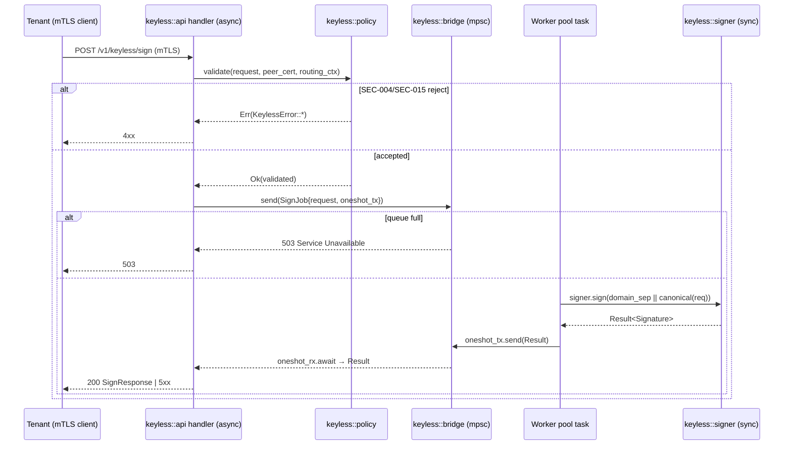

# feat: portal-relay overlay + keyless server (Phase 6b, v0.1 narrowed)

## Summary

Phase 6b ships two narrowly-scoped deliverables inside the existing `portal-relay` crate: (1) a WireGuard userspace overlay carrying inter-relay traffic across an isolated v4+v6 fabric, built from a chosen `boringtun`-family fork plus `smoltcp` as the in-process TCP/IP stack; and (2) a relay-side keyless TLS signing oracle exposed as a mutually-authenticated axum endpoint backed by a `rustls::sign::SigningKey`-implementing adapter, with a tokio worker-pool bridge between async HTTP handlers and rustls's sync `Signer::sign` surface. Per round-2 narrowing, R10 cross-relay reputation propagation, hop-mux per-hop traffic accounting, and the `ReputationDelta` wire envelope are deferred to v0.2 and explicitly out of scope here.

---

## Problem Frame

The Go reference (`portal-tunnel/portal/overlay/`, `portal-tunnel/portal/keyless/`) leans on three pieces of upstream infrastructure that do not have a single drop-in equivalent in 2026 Rust: (a) `wireguard-go` + `tun/netstack` for an in-process userspace WG TUN with a Go-native net stack; (b) `gosuda/keyless_tls` for the keyless signing wire shape and the `crypto.Signer`-style adapter; (c) `hashicorp/yamux` for overlay-internal multiplexing. The `boringtun` upstream is mid-restructure (advisory: do not link master), and the most server-side-validated active forks (NepTUN, defguard_boringtun, wiresock/boringtun, Mullvad GotaTun) sit on different maturity curves for Linux server use and IPv6 carriage. On the keyless side, rustls 0.23's `Signer::sign` is sync and `SigningKey` is a sync trait (FEAS-2), so the axum/tokio-native handler MUST land an async-bridge architecture rather than calling the signer directly from an async context. Both pieces also require security-sensitive design choices that downstream phases depend on: SEC-004 keyless oracle protections (mTLS root, input validation, per-tenant rate limit, output domain separation) and SEC-015 ECH `routed_hostname`/inner-SNI mismatch refusal, both gating the tenant↔relay privacy boundary.

---

## Requirements

- R1. Modern Rust idioms (edition 2024, structured concurrency, sealed APIs, `SecretBox<T>` secrets, `thiserror` boundaries) — overlay and keyless modules MUST conform.
- R2. Trust-boundary key isolation — keyless oracle holds `SecretBox<KeylessSigningKey>` distinct from `SecretBox<ApiHttpsKey>` and `SecretBox<QuicIdentityKey>`; cross-use rejected at type level.
- R3. Behavioral fidelity to the Go reference at the curated subset — keyless signing wire shape, overlay peer-sync semantics, and dual-stack listener behavior preserved (per R3 reframed; behavioral-trace harness lands in Phase 7).
- R12. IPv6 dual-stack by default — keyless mTLS listener binds dual-stack (v4+v6); chosen WG fork MUST carry IPv6 inside the overlay, with v6-maturity captured in the fork-evaluation matrix as a first-class column.
- R13 (carry-forward, partial). Stable transport baseline applies to keyless mTLS listener (TLS 1.3 + AEAD-only); ECH on the keyless surface is NOT in scope (keyless is mTLS-only, not browser-facing).
- **R10 — explicitly NOT a Phase 6b requirement in v0.1.** Per-relay reputation engine ships in Phase 5/U6. Cross-relay propagation, `ReputationDelta` wire envelope, hop-mux per-hop traffic accounting, and propagation-layer ASN-bin Sybil cap are v0.2 backlog. No code, tests, or wire shapes for them land here.

**Origin trace (roadmap U7b):** Files `crates/portal-relay/src/overlay/` and `crates/portal-relay/src/keyless/`; behavioral gate: at least one keyless mTLS sign round-trip integration test + one smoltcp hop-mux unit test as Phase 6b deliverables (per product-lens P1#4).

---

## Scope Boundaries

- Per-relay R10 reputation engine — owned by Phase 5/U6, NOT by Phase 6b.
- Cross-relay reputation propagation, `ReputationDelta` envelope, propagation through discovery announce/refresh — v0.2 backlog.
- Hop-mux per-hop traffic accounting — v0.2 backlog.
- ASN-bin propagation-layer Sybil cap (ADV-006) — v0.2 backlog.
- Eclipse-resistant relay-set picker — owned by Phase 6a/U7a (`portal-sdk`).
- Server-side ECH on the relay HTTPS API surface — gated on rustls#1980/PR#2993 landing; v0.2 backlog (per R13 narrowing).
- A pure-Rust vendoring of `wireguard-go` semantics — NOT v0.1; declared a 3-6 month rewrite, not a fallback (see Risks).
- Behavioral-trace harness against Go reference — Phase 7/U8 deliverable per R3 reframed.
- TLS 1.2 support on the keyless mTLS listener — keyless is internal infrastructure, mTLS-only; pin TLS 1.3 baseline.

### Deferred to Follow-Up Work

- v0.2 R10 cross-relay propagation: separate `/ce-plan` run gated on operator data showing eclipse-attack pressure (per Decision Stability v0.2 trigger criterion in roadmap).
- v0.2 hop-mux per-hop accounting: separate `/ce-plan` run; reuses the overlay deliverable from this plan as substrate.

---

## Context & Research

### Relevant Code and Patterns

- Go reference — overlay: `portal-tunnel/portal/overlay/overlay.go`, `stack.go`, `hop_mux.go` (yamux-over-TCP-on-netstack pattern; lifecycle, peer-sync via `IpcSet` lines, overlay-IPv4 derivation from WG public key).
- Go reference — keyless: `portal-tunnel/portal/keyless/signer.go` (HTTP signing endpoint shape, `signrpc.SignRequest`/`SignResponse` wire), `client.go` (remote-signer setup), `tls.go` (server TLS attachment).
- Go upstream wire and types: `github.com/gosuda/keyless_tls/relay/signrpc` (request/response shape; method/algorithm enumerations).
- Existing Rust crate scaffolding: `crates/portal-relay/src/lib.rs` (module-doc-only stub, ready for `overlay/` and `keyless/` directories to land per roadmap U7b Files).
- Workspace deps already provisioned for Phase 6b: `smoltcp = "0.13"` (default-features = false), `brotli = "9"`, `rustls = "0.23.22"` with `aws_lc_rs` + `prefer-post-quantum` + `tls12` features (workspace `Cargo.toml` lines 33, 87-88).
- `bon = "3"` for builder-derived configs; `governor = "0.10"` for keyless per-tenant rate limit; `papaya = "0.2"` for the per-tenant rate-limit map (read-dominated lookup); `secrecy = "0.10"` for `SecretBox<KeylessSigningKey>`; `thiserror = "2"` for `KeylessError`/`OverlayError` typed boundaries; `tracing` `#[instrument(skip_all)]` discipline per workspace house style.
- `tokio_util::sync::CancellationToken` + `tokio::task::JoinSet` per workspace structured-concurrency invariant (free `tokio::spawn` only at top-level `main`).

### Institutional Learnings

- Workspace `[workspace.lints.rust] unsafe_code = "forbid"` is binding — boringtun-fork integration MUST live entirely in safe Rust; if a candidate fork ships `unsafe` blocks in its public surface, that is recorded in the fork-evaluation matrix and forces an `#[expect]`-with-reason at the wrapper, not silent acceptance.
- Workspace house style bans `async-trait`; for Send-bound trait shapes use `trait_variant::make` (already in `[workspace.dependencies]`).
- Trust-boundary invariant (R2) — three `rustls::ServerConfig` instances must remain distinct and live behind distinct `SecretBox<KeyType>` newtypes. Phase 5/U6 owns `state/identity.rs` (QUIC) and the api-https `state/tls_material.rs`. Phase 6b owns `keyless/material.rs` (the third config) and MUST NOT alias it back into the api-https surface.
- IPv4-mapped IPv6 canonicalization (`::ffff:0:0/96` → 32-bit v4) lives in `crates/portal-relay/src/listeners/` (Phase 5/U6 deliverable). The Phase 6b keyless mTLS listener MUST consume that helper; do not re-implement.
- Roadmap risks-table entry — vendoring `wireguard-go` semantics is named a "fallback" but is in reality a 3-6 month rewrite (per Deferred-to-Phase-Plans F6). The honest fallback is MVP-without-overlay (defer multi-hop to v0.2 per F11).

### External References

- **WG userspace fork landscape, round-2 + round-3 research findings (carried verbatim from roadmap):**
  - **NepTUN** — most server-side-validated active fork at the time of /research; primary candidate for relay-server (Linux) deployment. Carries `boringtun` semantics, has active issue/PR cadence, server-validated.
  - **GotaTun** (Mullvad) — production on Android only as of Dec 2025; server-side Linux validation pending. Disqualified for v0.1 server use.
  - **`defguard_boringtun@0.6.5`** — community fork, active. IPv6 carriage support tracked.
  - **`wiresock/boringtun`** — active fork; Windows-leaning history.
  - **Cloudflare upstream `boringtun`** — master in restructuring; advisory not to link master.
- rustls 0.23 — `sign::SigningKey` and `sign::Signer` traits are sync (`fn sign(&self, message: &[u8]) -> Result<Vec<u8>, Error>`) per FEAS-2. Async-bridging is the integrator's responsibility.
- `smoltcp = "0.13"` — usable as a Phase-internal TCP/IP/UDP stack on top of a TUN-like packet sink/source. Heap-allocating buffers + `Interface` + `SocketSet` pattern; deterministic wakeup via `poll_at`/`poll_delay`.
- `gosuda/keyless_tls/relay/signrpc` — JSON `{key_id, payload, scheme, version}` (and similar fields) wire shape; greenfield port reproduces the curated subset under the same path constants but with renamed structs to avoid the `signrpc` namespace.

---

## Key Technical Decisions

- **WG fork pick — NepTUN as primary; defguard_boringtun as documented secondary.** Rationale: NepTUN is the most server-side-validated active fork at the time of round-3 research and is the closest to "drop-in `boringtun`-API". `defguard_boringtun@0.6.5` is the secondary because the defguard project actively deploys it for VPN gateway use (server-side) and tracks IPv6 carriage. GotaTun is disqualified for v0.1 (Android-only validation). Cloudflare upstream master is disqualified by upstream advisory. wiresock/boringtun is recorded but not picked (Windows-leaning). The pick is captured in **ADR-0015** with the full evaluation matrix and an explicit go/no-go date.
- **Go/no-go date for vendoring.** Set go/no-go = **2026-08-04** (90 days from this plan's date). If by 2026-08-04 NepTUN integration is blocked AND `defguard_boringtun` integration is blocked, Phase 6b ships **MVP-without-overlay** per F11 (single-hop only; multi-hop and the `overlay/` module deferred to v0.2). Vendoring `wireguard-go` semantics is NOT a v0.1 fallback — it is a 3-6 month rewrite that would consume the rest of the v0.1 budget.
- **Sealed `WgDevice` adapter trait.** The selected fork lives behind `crates/portal-relay/src/overlay/wg_device.rs` exposing a sealed trait (`pub trait WgDevice: sealed::Sealed`). Switching forks later is one file plus the `[workspace.dependencies]` entry; no ripple into `overlay::Overlay`, `overlay::netstack`, or `overlay::HopMux`. ADR-0015 records the trait shape. Captured in **ADR-0014** (overlay architecture) cross-referenced from ADR-0015.
- **Async bridge for keyless: tokio mpsc + dedicated worker pool.** rustls's `Signer::sign` is sync. The axum handler validates input, sends a `SignJob { request, reply: oneshot::Sender<Result<...>> }` over an `mpsc::Sender<SignJob>` to a small fixed-size worker pool of `JoinSet`-tracked tasks; each worker calls `signer.sign(message)` synchronously and replies via the oneshot. Backpressure: bounded mpsc capacity; full channel returns HTTP 503 (load-shed before queueing unbounded work). Captured in **ADR-0016**.
- **Worker-pool sizing.** Default = `max(2, num_cpus / 4)` workers; configurable via `KeylessConfig` (bon-derived). RSA-2048/3072 sign on a single core is bounded; 2-4 workers suffice for v0.1. Tuned later from production telemetry.
- **`KeylessSigningKey` newtype.** `pub struct KeylessSigningKey(SecretBox<KeylessKeyMaterial>)`. The inner type is opaque to the rest of the crate; `KeylessSignerAdapter` holds the only path to `expose_secret`, gated by `#[tracing::instrument(skip_all)]` audit instrumentation.
- **Keyless wire shape — greenfield.** Drops the Go `signrpc.SignRequest`/`SignResponse` namespace string. Keeps the JSON-on-the-wire shape reachable from existing tenant-side `keyless_tls` consumers conceptually, but renames into `portal-tunnel/keyless-request/v1` (matches Phase 1 SEC-007 domain separator). Outer body: `serde_json` (per workspace `outer = JSON, inner = postcard` rule). Inner authentication: ed25519 envelope (claim set per Phase 1/SEC-001) bound by the `b"portal-tunnel/keyless-request/v1"` domain separator. Captured in **ADR-0017**.
- **SEC-004 enforcement architecture.** Four protections layered in this exact order at the keyless handler:
  1. **mTLS root** — `rustls::ServerConfig::with_client_cert_verifier(WebPkiClientVerifier::with_pinned_roots(...))`; client roots are the relay's pinned tenant CA bundle, NOT the public web PKI. Distinct `RootCertStore` from the api-https surface.
  2. **Input validation** — `key_id` MUST be in the relay's known-key set; `scheme` (signature algorithm) MUST match the loaded key's type; `payload` length MUST fit the bounded budget (per Phase 1 SEC-014 size budget); `routing_context` MUST be present and well-formed.
  3. **Per-tenant rate limit** — `governor::Quota`-keyed by client-cert subject (`compact_str`); papaya-backed map for read-dominated lookup. Backpressure-before-block: 429 with `Retry-After` rather than connection drop.
  4. **Output domain separation** — every signature carries the `b"portal-tunnel/keyless-request/v1"` domain separator (per Phase 1/SEC-007); the signer's input is `domain_separator || canonical(request)`, never raw `request`.
- **SEC-015 ECH/inner-SNI mismatch refuse-to-sign.** The handler input includes a `routing_context: { routed_hostname, requested_cert_subject }` field (sourced from Phase 1's `routed_hostname` carriage). If `routed_hostname` does not match the cert subject the request is asking to sign for, the handler returns 403 BEFORE the signer ever sees the payload. This closes the MITM primitive enumerated in roadmap SEC-015.
- **Hop-mux replacement: QUIC streams over smoltcp UDP, not yamux.** Greenfield drops `hashicorp/yamux`. The smoltcp UDP socket carries QUIC datagrams; quinn handles multiplexing natively. The smoltcp TCP listener (port 7777 in Go convention; portable to a constant in `portal-wire`) carries inter-relay HTTP discovery only. The Phase 6b unit test exercises the smoltcp side: smoltcp UDP datagram round-trip across the WG fabric proves the substrate without coupling the test to quinn's multiplexing internals.
- **Dual-stack v4+v6 keyless listener (R12).** `tokio::net::TcpListener::bind("[::]:port")` with `IPV6_V6ONLY=false` (Linux); explicit dual-bind on macOS where the kernel does not implement v4-mapped automatically. Reuse `crates/portal-relay/src/listeners/` canonicalization helper from Phase 5/U6 — do NOT re-implement. The fork-evaluation matrix's v6-maturity column gates the fork pick: a fork that does not carry IPv6 inside the overlay disqualifies itself.

---

## Open Questions

### Resolved During Planning

- *WG-fork pick?* — NepTUN primary, defguard_boringtun secondary, GotaTun/wiresock/Cloudflare-master disqualified for v0.1 server use (decision in ADR-0015).
- *Vendor wireguard-go if forks fall through?* — No. MVP-without-overlay (defer multi-hop to v0.2) is the honest fallback. Vendoring is a 3-6 month rewrite, not a fallback.
- *Async-bridge shape?* — tokio mpsc + dedicated worker pool, bounded queue, 503 on full (ADR-0016).
- *Hop-mux mux primitive?* — QUIC streams over smoltcp UDP. Yamux dropped per greenfield-wide decision.
- *Keyless wire codec?* — outer `serde_json`, inner ed25519-signed envelope under `portal-tunnel/keyless-request/v1` domain separator (ADR-0017).
- *Keyless TLS version baseline?* — TLS 1.3 only on the mTLS listener (internal infrastructure, no legacy peers).
- *Where does the IPv4-mapped-IPv6 canonicalization helper live?* — `crates/portal-relay/src/listeners/` per Phase 5/U6; Phase 6b consumes, does not re-implement.

### Deferred to Implementation

- *Worker-pool exact tuning?* — Default 2-4 workers; production telemetry post-Phase 7 e2e harness will tune. Plan ships defaults; ADR-0016 records the rationale.
- *smoltcp `Interface` poll-loop tuning (timer wheel granularity)?* — Defer until U6 implementation surfaces a measurable wakeup-storm or starvation pattern.
- *Exact `KeylessConfig` field set?* — Specific tunables (worker count, queue depth, request timeout) finalized at U2/U3 implementation; bon-derived builder absorbs additions without breaking callers.
- *TUN MTU tuning per fork?* — Default to `1420` (Go reference) at U5; revisit if a fork's defaults differ materially.
- *Whether `overlay::HopMux` carries an explicit token-prefix (Go's 4-byte length + token bytes) on QUIC streams?* — Resolve at U7 implementation; Phase 1 wire spec may obviate the prefix entirely if QUIC stream-id discriminates.

---

## High-Level Technical Design

> *This illustrates the intended approach and is directional guidance for review, not implementation specification. The implementing agent should treat it as context, not code to reproduce.*

### Module shape (Phase 6b additions inside `crates/portal-relay/src/`)

```text
crates/portal-relay/src/
├── lib.rs                         # existing; gains `pub mod keyless; pub mod overlay;`
├── keyless/
│   ├── mod.rs                     # public re-exports + KeylessConfig
│   ├── material.rs                # SecretBox<KeylessSigningKey> + load/parse
│   ├── signer.rs                  # KeylessSignerAdapter: rustls::sign::SigningKey impl (sync)
│   ├── bridge.rs                  # mpsc<SignJob> + worker pool (async → sync bridge)
│   ├── api.rs                     # axum Router with mTLS ServerConfig + handler
│   ├── policy.rs                  # SEC-004 input validation + per-tenant governor + SEC-015 routing-context check
│   ├── wire.rs                    # SignRequest/SignResponse types (renamed from Go signrpc)
│   └── error.rs                   # KeylessError (thiserror, #[non_exhaustive])
└── overlay/
    ├── mod.rs                     # Overlay orchestrator + public re-exports
    ├── wg_device.rs               # sealed WgDevice trait + selected-fork adapter
    ├── netstack.rs                # smoltcp Interface + SocketSet wrapper
    ├── peer_sync.rs               # ApplyPeers / DiscoveryDescriptor → wg-config conversion
    ├── hop_mux.rs                 # smoltcp UDP socket carrying QUIC datagrams (replaces yamux)
    ├── overlay_ipv4.rs            # DeriveWireGuardOverlayIPv4 (port of Go util)
    └── error.rs                   # OverlayError (thiserror, #[non_exhaustive])
```

### Async-bridge sequence (keyless)



### Overlay packet flow (single hop)

```mermaid
graph LR
    A[Tenant traffic] -->|QUIC stream| Q[quinn endpoint]
    Q -->|"UDP datagram → smoltcp UDP socket"| SM[smoltcp::Interface]
    SM -->|TUN frame| WG[WgDevice adapter -- NepTUN]
    WG -->|UDP wire packet| NET[Internet]
    NET -->|UDP wire packet| WG2[WgDevice peer]
    WG2 -->|TUN frame| SM2[smoltcp::Interface peer]
    SM2 -->|UDP datagram| Q2[quinn endpoint peer]
    Q2 -->|QUIC stream| B[Peer relay handler]
```



---

## Implementation Units

### Phase 6b/A — Keyless deliverable

- U1. **Keyless module skeleton + `KeylessSigningKey` newtype + key-material loader**

**Goal:** Land the `keyless/` directory with the `SecretBox<KeylessSigningKey>` newtype, key-material loader (PEM → opaque), and the empty `mod.rs` re-export surface. No HTTP yet, no signing yet — only the type-level R2 isolation.

**Requirements:** R1, R2.

**Dependencies:** None on Phase 6b internal; depends on Phase 5/U6 for `crates/portal-relay/src/state/` neighborhood and `listeners/` canonicalization helper to exist.

**Files:**

- Create: `crates/portal-relay/src/keyless/mod.rs`
- Create: `crates/portal-relay/src/keyless/material.rs`
- Create: `crates/portal-relay/src/keyless/error.rs`
- Modify: `crates/portal-relay/src/lib.rs` (add `pub mod keyless;`)
- Test: `crates/portal-relay/src/keyless/material.rs` (`#[cfg(test)] mod tests`)

**Approach:**

- `pub struct KeylessSigningKey(SecretBox<KeyMaterial>)` — `KeyMaterial` is a private enum over RSA/ECDSA variants (P-256, RSA-2048/3072 to mirror Go reference).
- Loader accepts PEM; returns `Result<KeylessSigningKey, KeylessError>`. PEM parsing routed through `rustls-pemfile` (transitively present via rustls).
- Distinct newtype from `SecretBox<ApiHttpsKey>` and `SecretBox<QuicIdentityKey>` (both Phase 5/U6) — name uniqueness is the type-level R2 enforcement.
- `KeylessError` — `thiserror`, `#[non_exhaustive]`, variants for `MalformedPem`, `UnsupportedAlgorithm`, `IoError(#[from] io::Error)`.

**Patterns to follow:**

- `crates/portal-relay/src/state/identity.rs` (Phase 5/U6) for the `SecretBox<KeyType>` wrap shape.
- Workspace house style: `#[non_exhaustive]` on every public enum + struct; `#[must_use]` on every fluent return.

**Test scenarios:**

- Happy path: load valid RSA-2048 PEM → returns `Ok(KeylessSigningKey)`; debug-print does not leak material (`SecretBox` Display redaction holds).
- Happy path: load valid P-256 ECDSA PEM → returns `Ok(KeylessSigningKey)`.
- Edge case: load empty bytes → `Err(KeylessError::MalformedPem)`.
- Edge case: load PEM with unsupported algorithm (e.g., DSA) → `Err(KeylessError::UnsupportedAlgorithm)`.
- Error path: load PEM whose body is not parseable as the declared algorithm → `Err(KeylessError::MalformedPem)`.

**Verification:** `cargo test -p portal-relay keyless::material` passes; `cargo clippy -p portal-relay -- -D warnings` passes; debug-printing a `KeylessSigningKey` shows `[REDACTED]`.

---

- U2. **`KeylessSignerAdapter` — rustls `SigningKey` impl + async-bridge worker pool**

**Goal:** Land the sync `rustls::sign::SigningKey` adapter wrapping `KeylessSigningKey`, plus the tokio mpsc + worker-pool bridge that exposes an async-callable `sign(...)` to the axum handler.

**Requirements:** R1, R2.

**Dependencies:** U1.

**Files:**

- Create: `crates/portal-relay/src/keyless/signer.rs`
- Create: `crates/portal-relay/src/keyless/bridge.rs`
- Test: `crates/portal-relay/src/keyless/bridge.rs` (`#[cfg(test)] mod tests`)

**Approach:**

- `KeylessSignerAdapter` impls `rustls::sign::SigningKey` (sync) — `choose_scheme(&[SignatureScheme]) -> Option<Box<dyn Signer>>` + `algorithm()`. Inner `Signer::sign` calls `self.key.expose_secret().sign_inner(message)` and returns bytes; instrumented with `#[tracing::instrument(skip_all, fields(scheme))]`.
- `Bridge` owns: bounded `mpsc::Sender<SignJob>`, `JoinSet` of worker tasks, `CancellationToken`. `SignJob = { canonical_message: Vec<u8>, scheme: SignatureScheme, reply: oneshot::Sender<Result<Vec<u8>, KeylessError>> }`.
- Worker pool: fixed size from `KeylessConfig::worker_count` (default `max(2, num_cpus()/4)`); each worker is `JoinSet`-tracked; cancellation token gates clean shutdown.
- Bound: `mpsc::channel(KeylessConfig::queue_depth)` (default 256). Send returns `TrySendError::Full` → handler maps to 503.
- Free `tokio::spawn` is forbidden by workspace lints; the worker-pool spawn lives inside an `impl Bridge` constructor that takes the `JoinSet` from the caller (the relay top-level `main`).

**Execution note:** Start with a failing integration test for the request/response contract (worker pool round-trips a `SignJob` and returns a deterministic signature for a stub key).

**Patterns to follow:**

- `tokio::sync::mpsc` + `tokio::sync::oneshot` for the bridge (canonical async-to-sync pattern).
- `tokio_util::sync::CancellationToken` propagated from the JoinSet owner.

**Test scenarios:**

- Happy path: bridge with 2 workers, queue depth 8 → 100 concurrent `sign(...)` calls all complete; each receives the worker's signature output.
- Edge case: queue depth = 0 with all workers busy → `try_send` returns `Full` → handler observes 503 mapping (tested at U3).
- Error path: worker panics on signer error → JoinSet observes the panic, bridge logs via `tracing::error!`, channel stays alive for surviving workers.
- Integration: cancellation token fires → all workers drain inflight jobs and exit; new sends return `Closed`.

**Verification:** Bridge round-trip test passes; `cargo clippy -p portal-relay -- -D warnings` passes; no `tokio::spawn` outside the JoinSet-owner pattern (clippy `disallowed_methods` enforced workspace-wide).

---

- U3. **Keyless axum mTLS endpoint + SEC-004 protections + signrpc-equivalent wire**

**Goal:** Land the keyless HTTP signing endpoint as an axum `Router` mounted on a distinct `rustls::ServerConfig` with mTLS client-cert verification. Wire shape uses the greenfield rename of the Go `signrpc` types. SEC-004 protections (mTLS root, input validation, per-tenant rate limit, output domain separation) all enforced at the handler.

**Requirements:** R1, R2, R3, R12.

**Dependencies:** U1, U2.

**Files:**

- Create: `crates/portal-relay/src/keyless/wire.rs` (`SignRequest`, `SignResponse`, `KeylessErrorBody`)
- Create: `crates/portal-relay/src/keyless/policy.rs` (SEC-004 validation + governor rate limit)
- Create: `crates/portal-relay/src/keyless/api.rs` (axum Router + handler + dual-stack listener bind)
- Test: `crates/portal-relay/src/keyless/api.rs` (`#[cfg(test)] mod tests` with `axum::Router::oneshot` + `wiremock`-style certs from `rcgen` if available, else handcrafted PEM fixtures under `crates/portal-relay/tests/fixtures/`)
- Create: `crates/portal-relay/tests/keyless_mtls_round_trip.rs` (integration test — Phase 6b behavioral gate per product-lens P1#4)

**Approach:**

- `wire.rs` — greenfield `SignRequest { key_id: CompactStr, scheme: SignatureScheme, payload: Vec<u8>, routing_context: RoutingContext }` + `SignResponse { signature: Vec<u8>, scheme: SignatureScheme }` + `KeylessErrorBody { code, message }` (matches workspace HTTP response wrapper convention).
- `policy.rs` — three-step validation pipeline: (1) `key_id ∈ known_keys`, (2) `scheme` matches the loaded key's algorithm, (3) `payload.len() ≤ KEYLESS_PAYLOAD_BUDGET` (constant from `portal-wire` per Phase 1/SEC-014). Per-tenant governor keyed by client-cert subject (`compact_str`); papaya-backed map.
- `api.rs` — `Router::new().route(KEYLESS_SIGN_PATH, post(sign_handler))` mounted on a `rustls::ServerConfig` with `WebPkiClientVerifier::with_pinned_roots(...)` over a distinct `RootCertStore` (the relay's pinned tenant CA bundle). Listener binds `[::]:port` dual-stack per R12; v4-mapped-v6 canonicalization via the `listeners/` helper (Phase 5/U6).
- Handler order: extract client cert → `policy::validate` → `bridge.sign(canonical_message)` await → wrap response.
- `domain_sep || canonical(request)` — domain separator constant `b"portal-tunnel/keyless-request/v1"` lives in `portal-wire` (Phase 1/SEC-007); imported here.

**Execution note:** Add a failing integration test (`tests/keyless_mtls_round_trip.rs`) BEFORE the handler body. The test boots the keyless Router with a generated test key + test CA, makes an mTLS POST with a valid client cert, and asserts the signature verifies against the public key. This is the Phase 6b behavioral gate per product-lens P1#4.

**Patterns to follow:**

- Phase 5/U6 `crates/portal-relay/src/api/` for the axum Router shape and `Router::oneshot` test pattern.
- Workspace HTTP response wrapper convention: `{"data": T}` on 2xx, `{"error": {code, message}}` on 4xx/5xx.
- `#[tracing::instrument(skip_all, fields(key_id = %req.key_id))]` on the handler.

**Test scenarios:**

- *Covers Phase 6b behavioral gate (per product-lens P1#4).* Happy path: mTLS client with pinned cert → POST `/v1/keyless/sign` with valid `SignRequest` → 200 with verifiable signature.
- Happy path: same handler reachable on both v4 and v6 sockets (R12 dual-stack assertion).
- Edge case: `payload.len() == KEYLESS_PAYLOAD_BUDGET` exactly → 200 (boundary inclusive).
- Edge case: `payload.len() == KEYLESS_PAYLOAD_BUDGET + 1` → 400 `payload_too_large`.
- Error path: mTLS handshake without client cert → connection refused before HTTP ever fires.
- Error path: client cert signed by a non-pinned CA → connection refused.
- Error path: `key_id` not in known_keys → 400 `unknown_key_id`; Sign worker is NEVER invoked.
- Error path: `scheme` does not match the key's algorithm (e.g., RSA key + ECDSA scheme) → 400 `scheme_mismatch`.
- Rate-limit path: 100 requests within 1s from same client cert → governor returns 429 with `Retry-After` after threshold; surviving requests succeed.
- Rate-limit path: 503 on full bridge queue → handler returns 503 without calling the signer.
- Output domain separation: signature over `domain_sep || canonical(req)` verifies against the public key with the same domain separator; verification with a different separator fails.

**Verification:** Integration test `tests/keyless_mtls_round_trip.rs` passes; `cargo clippy -p portal-relay -- -D warnings` passes; manual review confirms `rustls::ServerConfig` is constructed locally to this module and never aliased into `state/tls_material.rs` (R2 boundary).

---

- U4. **SEC-015 ECH/inner-SNI mismatch refuse-to-sign**

**Goal:** Extend the keyless handler so it refuses to sign when the request's `routing_context.routed_hostname` does not match `routing_context.requested_cert_subject`. Closes the MITM primitive enumerated in roadmap SEC-015.

**Requirements:** R1, R3 (carry-forward — SEC-015 enforcement).

**Dependencies:** U3.

**Files:**

- Modify: `crates/portal-relay/src/keyless/wire.rs` (extend `RoutingContext` if not already present)
- Modify: `crates/portal-relay/src/keyless/policy.rs` (add SEC-015 check)
- Test: `crates/portal-relay/src/keyless/policy.rs` (`#[cfg(test)] mod tests`)

**Approach:**

- `RoutingContext { routed_hostname: CompactStr, requested_cert_subject: CompactStr }` — the upstream relay routing layer (Phase 5/U6 tenant TLS path) populates `routed_hostname`; the tenant-driven `SignRequest` declares `requested_cert_subject` (the cert's CN/SAN it intends to sign for).
- New `policy::check_routing_context` step runs BEFORE U3's other validations. Match rule: `requested_cert_subject` matches `routed_hostname` directly OR via wildcard rule (`*.example.com` covers `foo.example.com` but not `example.com` and not `foo.bar.example.com`).
- Mismatch → `KeylessError::RoutingContextMismatch` → 403 (NOT 400; signals the security-policy refusal explicitly).

**Execution note:** Test-first; the SEC-015 contract is security-critical and characterizing the exact mismatch matrix is the point.

**Patterns to follow:**

- `webpki::DnsName` or equivalent for hostname matching to avoid hand-rolled wildcard logic.

**Test scenarios:**

- Happy path: `routed_hostname = victim.com`, `requested_cert_subject = victim.com` → policy passes → handler proceeds to U3's validation chain.
- Happy path (wildcard): `routed_hostname = api.example.com`, `requested_cert_subject = *.example.com` (matches per RFC 6125 §6.4.3) → policy passes.
- Error path (the SEC-015 attack): `routed_hostname = attacker.com`, `requested_cert_subject = victim.com` → 403 `routing_context_mismatch`; signer is NEVER invoked; metrics counter `keyless_sec015_rejections_total` increments.
- Edge case: empty `requested_cert_subject` → 400 `malformed_request` (SEC-004 input validation, not SEC-015).
- Edge case: wildcard mismatch — `routed_hostname = example.com` (apex), `requested_cert_subject = *.example.com` → 403 (apex is NOT covered by single-level wildcard per RFC 6125).
- Edge case: wildcard depth — `routed_hostname = foo.bar.example.com`, `requested_cert_subject = *.example.com` → 403 (single-level wildcard does not cover multi-level).

**Verification:** Test matrix above passes; `cargo test -p portal-relay keyless::policy` green; ADR-0017 records the matching-rule reference (RFC 6125 §6.4.3).

---

### Phase 6b/B — Overlay deliverable

- U5. **WG-fork pick + ADR-0014 (overlay architecture) + ADR-0015 (fork pick)**

**Goal:** Land the two ADRs that capture the WG fork evaluation matrix, the NepTUN-primary / defguard_boringtun-secondary pick, and the 2026-08-04 go/no-go date for vendoring (with MVP-without-overlay as the honest fallback). Add the chosen fork to `[workspace.dependencies]` in `Cargo.toml`. No code yet.

**Requirements:** R1, R12 (fork-evaluation matrix MUST score IPv6-carriage maturity as a first-class column).

**Dependencies:** None.

**Files:**

- Create: `docs/adr/0014-portal-relay-overlay-architecture.md`
- Create: `docs/adr/0015-wireguard-userspace-fork-pick.md`
- Modify: `Cargo.toml` (add `neptun = "..."` to `[workspace.dependencies]`; secondary `defguard-boringtun` left commented with rationale)

**Approach:**

- ADR-0014 covers: overlay architecture, sealed `WgDevice` trait, smoltcp as the in-process net stack, hop-mux replaced by QUIC streams over smoltcp UDP (NOT yamux). References ADR-0001 (greenfield wire) for the yamux-removal decision.
- ADR-0015 covers: the 2026 fork landscape carried verbatim from roadmap research (NepTUN, GotaTun, defguard_boringtun, wiresock/boringtun, Cloudflare upstream). Evaluation matrix has columns: server-side validation, IPv6 carriage maturity, license, last commit, public API stability, unsafe-block surface.
- Go/no-go = **2026-08-04**. If both NepTUN and defguard_boringtun integration is blocked by that date, **MVP-without-overlay** lands instead (overlay/ module deleted, multi-hop deferred to v0.2 per F11). Vendoring `wireguard-go` is NOT a v0.1 fallback.
- Workspace `Cargo.toml` edit pins NepTUN to a specific version + sha (`cargo-vet` will require an audit at U6 land time — owned by Phase 5/U6 vet setup).

**Patterns to follow:**

- `docs/adr/0001-greenfield-wire.md` shape (the canonical ADR template for this workspace, established at Phase 0).
- `docs/adr/0002-aggressive-2026-register.md` for the "lists alternatives + pick + rationale + sunset criterion" pattern.

**Test expectation:** none — pure decision artifacts. Verification is reviewer agreement at code review.

**Verification:** Both ADRs land referenced from `docs/adr/README.md`; `Cargo.toml` builds with the new dep present (no consumers yet — `cargo build --workspace` succeeds).

---

- U6. **`overlay::wg_device` sealed trait + selected-fork adapter**

**Goal:** Land the sealed `WgDevice` trait that wraps the chosen WG userspace fork. Wraps construction (private key, listen port, peer list), packet I/O (TUN read/write), and lifecycle (close, wait). The fork lives behind this trait so future swaps are one file.

**Requirements:** R1, R2, R12 (IPv6 packets MUST traverse the device).

**Dependencies:** U5 (ADR pinning the fork pick + workspace dep).

**Files:**

- Create: `crates/portal-relay/src/overlay/mod.rs`
- Create: `crates/portal-relay/src/overlay/wg_device.rs`
- Create: `crates/portal-relay/src/overlay/error.rs`
- Modify: `crates/portal-relay/src/lib.rs` (add `pub mod overlay;`)
- Test: `crates/portal-relay/src/overlay/wg_device.rs` (`#[cfg(test)] mod tests`)

**Approach:**

- `pub trait WgDevice: sealed::Sealed + Send + Sync { ... }` — methods cover `apply_peers(&self, &[PeerConfig])`, `read_packet(&self, buf: &mut [u8]) -> Result<usize>`, `write_packet(&self, &[u8]) -> Result<()>`, `close(self)`. Sealed via the `mod sealed { pub trait Sealed {} }` pattern; only the in-crate adapter impls it.
- `NepTunAdapter` impl wraps the chosen fork's device handle + IPC interface. Configuration goes through the fork's `IpcSet`-equivalent (or direct API if the fork exposes one).
- `OverlayError` — `thiserror`, `#[non_exhaustive]`, variants for `DeviceInit`, `IpcSet`, `PeerConfig`, `IoError(#[from] io::Error)`.
- `forbid(unsafe_code)` is workspace-wide; if the fork's public API requires `unsafe` (e.g., raw FFI struct casts), that fact is recorded in ADR-0015's adversarial-row column AND wrapped in a single `#[expect(unsafe_code, reason = "...")]` block at the adapter — never silently accepted (workspace policy in `crates/portal-relay/src/keyless/error.rs` style).

**Patterns to follow:**

- Go `portal-tunnel/portal/overlay/stack.go` (lines 32-94) — the lifecycle shape (create device → IpcSet config → bring up) translates cleanly.
- Workspace sealed-trait pattern (pre-existing in `portal-wire` for marker types).

**Test scenarios:**

- Happy path: construct adapter with a generated WG private key + listen port → device handle is live; `apply_peers(&[])` is a no-op success.
- Happy path: `apply_peers` with one IPv4 peer → wg config string contains `allowed_ip=<derived>/32`.
- Happy path: `apply_peers` with one IPv6 peer → wg config string contains `allowed_ip=<derived>/128` (R12 carriage assertion).
- Edge case: `apply_peers` with a malformed peer public key → `Err(OverlayError::PeerConfig)`; device state unchanged.
- Error path: device construction with an in-use port → `Err(OverlayError::DeviceInit)`.

**Verification:** `cargo test -p portal-relay overlay::wg_device` passes; `cargo deny check bans` does not flag the new fork (cargo-vet audit added in same commit per Phase 5/U6 vet setup).

---

- U7. **`overlay::netstack` smoltcp integration + `overlay::Overlay` orchestrator (incl. hop-mux on smoltcp UDP)**

**Goal:** Land the smoltcp-backed in-process TCP/IP+UDP stack on top of the `WgDevice`, plus the `Overlay` orchestrator that wires fork + netstack + peer-sync + lifecycle. The hop-mux deliverable is the smoltcp UDP socket carrying QUIC datagrams (replaces Go's yamux-on-TCP).

**Requirements:** R1, R3 (overlay peer-sync semantics fidelity), R12 (smoltcp `Interface` carries v6 alongside v4).

**Dependencies:** U6.

**Files:**

- Create: `crates/portal-relay/src/overlay/netstack.rs`
- Create: `crates/portal-relay/src/overlay/peer_sync.rs`
- Create: `crates/portal-relay/src/overlay/hop_mux.rs`
- Create: `crates/portal-relay/src/overlay/overlay_ipv4.rs`
- Test: `crates/portal-relay/src/overlay/netstack.rs` (`#[cfg(test)] mod tests`)
- Create: `crates/portal-relay/tests/overlay_smoltcp_hop_mux.rs` (integration test — Phase 6b behavioral gate per product-lens P1#4)

**Approach:**

- `netstack.rs` — `Netstack` struct owns `smoltcp::iface::Interface`, `smoltcp::iface::SocketSet<'_>`, a buffer pool, and a poll-loop task (`JoinSet`-tracked). Exposes `listen_tcp(port) -> TcpListener`, `dial_tcp(addr) -> TcpStream`, `udp_socket(port) -> UdpSocket`. Packets cross the `WgDevice` adapter (read into smoltcp; write from smoltcp).
- `peer_sync.rs` — `apply_peers(&[RelayDescriptor])` converts greenfield `RelayDescriptor` (from `portal-wire`) into `Vec<PeerConfig>` for `WgDevice::apply_peers`. Includes the deterministic-sort and self-skip from Go reference (`overlay.go:202-222`).
- `hop_mux.rs` — `HopMux::open(udp_port) -> UdpSocket` (smoltcp UDP socket). Greenfield: that socket carries quinn's UDP datagrams directly. No yamux wrapping. The Phase 6b unit test does NOT exercise quinn integration (that's Phase 7/U8 e2e); it validates the smoltcp UDP datagram round-trip across two `Netstack` instances bridged by a paired `WgDevice` test fixture.
- `overlay_ipv4.rs` — `derive_overlay_ipv4(public_key: &str) -> Result<Ipv4Addr>` ported from Go `utils.DeriveWireGuardOverlayIPv4`. v0.1 keeps the Go-compatible derivation (subset of the curated R3 fidelity surface).
- `Overlay` orchestrator (`overlay/mod.rs`) — `Overlay::new(config, joinset, cancel) -> Result<Overlay>` constructs `WgDevice` + `Netstack`; `serve` is a no-op (smoltcp poll-loop task is JoinSet-tracked); `apply_peers(...)` delegates; `shutdown(...)` cancels the token, drains the JoinSet, closes the device.

**Execution note:** Test-first for the hop-mux unit test — that test IS the Phase 6b overlay-side behavioral gate.

**Patterns to follow:**

- Go `portal-tunnel/portal/overlay/overlay.go:77-170` for orchestrator lifecycle shape.
- `tokio_util::sync::CancellationToken` propagation through the JoinSet owner (workspace structured-concurrency invariant).

**Test scenarios:**

- *Covers Phase 6b behavioral gate (per product-lens P1#4).* Happy path: two paired `Netstack` instances bridged by a paired `WgDevice` test fixture → UDP datagram sent from instance A's `udp_socket(7778)` arrives at instance B's `udp_socket(7778)` with byte-identical payload.
- Happy path: TCP listen on instance A port 7777 → dial from instance B's `dial_tcp(<A's overlay-IPv4>, 7777)` → bidirectional stream works.
- Happy path (R12): instance A's overlay carries an IPv6 peer entry → smoltcp `Interface` configured with v6 address → v6 round-trip works.
- Edge case: `apply_peers` with the relay's own public key → entry is dropped (matches Go `overlay.go:213-215`).
- Edge case: `apply_peers` with two peers having identical overlay-IPv4 (hash collision) → returns `Err(OverlayError::PeerConfig)`; previous peer set unchanged.
- Error path: smoltcp poll-loop panics → JoinSet observes the panic, `tracing::error!` logged, `Overlay::shutdown` returns the panic in the join error.
- Error path: `WgDevice` write returns I/O error → smoltcp poll-loop logs and continues (single packet drop, not stack failure).

**Verification:** `tests/overlay_smoltcp_hop_mux.rs` integration test passes; `cargo clippy -p portal-relay -- -D warnings` passes; manual review confirms the smoltcp poll-loop task is JoinSet-tracked and consumes the cancellation token; the hop-mux module contains no yamux dependency.

---

## System-Wide Impact

- **Trust-boundary invariant (R2).** Phase 6b lands the third `rustls::ServerConfig` instance (the keyless mTLS listener). It MUST live entirely inside `crates/portal-relay/src/keyless/` and MUST NOT alias into `state/tls_material.rs` (api-https) or `state/identity.rs` (QUIC). The `SecretBox<KeylessSigningKey>` newtype is the type-level enforcement; clippy `disallowed_methods` rule (workspace) catches multi-key returns.
- **Structured-concurrency invariant.** Two new task families spawn from this phase: keyless worker pool (U2) and smoltcp poll-loop (U7). Both MUST live inside a `tokio::task::JoinSet` carried by the overlay/keyless constructors and consume a `CancellationToken` for clean shutdown. Free `tokio::spawn` is forbidden by workspace lints.
- **IPv6 canonicalization (R12).** Keyless mTLS listener consumes `crates/portal-relay/src/listeners/` canonicalization helper from Phase 5/U6 — does NOT re-implement. Without this, an attacker connecting via the dual-stack v6 listener with `::ffff:1.2.3.4` source bypasses any v4-only governor key on `1.2.3.4` (CVE-2023-45288 class).
- **Wire-protocol invariant.** Domain separator constant `b"portal-tunnel/keyless-request/v1"` is owned by `portal-wire` (Phase 1/SEC-007). Phase 6b imports it; cannot define a competing constant locally.
- **Error propagation.** `KeylessError` and `OverlayError` are crate-private until the relay binary needs them. They convert into the relay's top-level `eyre::Result` at `main` per workspace house style; do not surface them across `portal-*` crate boundaries (no consumers outside `portal-relay-bin`).
- **Unchanged invariants.** Phase 6b does NOT modify `portal-wire`, `portal-crypto`, `portal-net`, or `portal-acme` source. `portal-wire` is read-only consumed for constants. The Phase 5/U6 surface (`api/`, `state/`, `policy/`, `discovery/`, `listeners/`) is read-only consumed; if Phase 6b discovers a Phase 5/U6 gap (e.g., a missing canonicalization helper), the gap is filed back to Phase 5 — NOT patched in `keyless/` or `overlay/`.
- **Integration coverage.** The two behavioral gate tests (`tests/keyless_mtls_round_trip.rs`, `tests/overlay_smoltcp_hop_mux.rs`) prove cross-module behavior inside `portal-relay`. End-to-end coverage (relay-server boot → tenant → keyless sign in production wiring) is Phase 7/U8.

---

## Risks & Dependencies

| Risk | Mitigation |
|------|------------|
| All chosen WG userspace forks (NepTUN + defguard_boringtun) prove integration-blocked by 2026-08-04 | Honest fallback is **MVP-without-overlay** per F11 (defer multi-hop to v0.2). Vendoring `wireguard-go` semantics is a 3-6 month rewrite, not a v0.1 fallback. ADR-0015 records the cliff explicitly. |
| Chosen fork's IPv6 carriage is buggy or incomplete | The fork-evaluation matrix in ADR-0015 has IPv6-maturity as a first-class column; matrix re-scores at 2026-07-04 (30 days before go/no-go); a fork that regresses on v6 forces a swap to the secondary BEFORE go/no-go. |
| Chosen fork ships `unsafe` blocks in its public surface | `forbid(unsafe_code)` workspace lint forces an `#[expect(unsafe_code, reason = "...")]` at the adapter — never silently accepted. ADR-0015's adversarial-row column tracks per-fork `unsafe` exposure. |
| Async-bridge worker pool starves under burst load | Bounded mpsc + 503 load-shed (U2) returns control to the client rather than queueing unbounded work. Worker count tunable via `KeylessConfig`; production tuning post-Phase 7 e2e. |
| `rustls::sign::SigningKey` API surface shifts in a rustls minor bump | Pin `rustls = "0.23.22"` exact in workspace deps until Phase 7 release prep; new minor versions land via explicit ADR amendment per Decision Stability. |
| `gosuda/keyless_tls` semantics are subtle (TLS 1.2/1.3 signature schemes, key types) | Carry forward Phase 6b deferred item from roadmap. U2 starts with a careful read of `portal-tunnel/portal/keyless/signer.go` + the Go `signrpc` package and a `KeylessSignerAdapter` spike before committing the SEC-004 design. ADR-0017 records the curated subset. |
| smoltcp `Interface` poll-loop creates wakeup storm under high overlay traffic | Defer detailed tuning to U7 implementation; `poll_at`/`poll_delay` already provides amortization. Phase 7 e2e harness re-measures. |
| Phase 5/U6 has not landed `crates/portal-relay/src/listeners/` canonicalization helper at Phase 6b start | Phase 6b/B (overlay) can land independently; Phase 6b/A (keyless) blocks on Phase 5 listener helper. If Phase 5 slips, U3 lands a TODO with the helper signature plus `#[expect(clippy::todo, reason = "blocked on Phase 5/U6 listeners helper")]` — fix lands in same PR as Phase 5 ship, NOT carried as latent debt. |
| SEC-004 / SEC-015 enforcement order accidentally allows a payload-len / scheme-mismatch error to leak the existence of an unknown key_id (oracle) | Test matrix (U3 + U4) explicitly asserts `key_id` validation runs FIRST; rejection codes for unknown_key_id vs scheme_mismatch are distinguishable in the response body but identical in HTTP status (400) — eliminates the oracle channel via timing-equal handling. Captured in ADR-0017. |
| Per-tenant rate-limit governor map (papaya) holds guards across `.await` | papaya `pin()` returns `LocalGuard` (non-Send); `pin_owned()` is the Send-safe version per workspace papaya guidance. U3's governor lookup uses `pin_owned()` explicitly. Captured as a comment + clippy `#[expect(clippy::*, reason = "...")]` if needed. |

---

## Documentation / Operational Notes

- ADR-0014 (overlay architecture) and ADR-0015 (WG fork pick) land at U5.
- ADR-0016 (keyless async-bridge architecture) and ADR-0017 (keyless wire shape + SEC-004/SEC-015 protections) land alongside U2/U3/U4 at the latest.
- `docs/adr/README.md` index updated in the same commit as each ADR (workspace pattern from Phase 0).
- The 2026-08-04 go/no-go date is a **calendar event**, not a code constant. Implementer is responsible for re-evaluating the fork landscape on or before that date AND filing the MVP-without-overlay decision as an ADR amendment to ADR-0015 if the cliff fires.
- Phase 7/U8 picks up the e2e wiring (relay-server boot → tenant connect → keyless sign in production) and the behavioral-trace harness against Go reference per R3 reframed; Phase 6b's tests are crate-internal contract tests, not e2e.

---

## Sources & References

- **Origin document (roadmap):** `../../.cursor/plans/port_go_to_rust_greenfield_383a2dc9.plan.md` (U7b, lines 678-705).
- **Phase 0 ADRs (workspace foundation):** `docs/adr/0001-greenfield-wire.md`, `docs/adr/0002-aggressive-2026-register.md`.
- **Workspace `Cargo.toml`:** `Cargo.toml` lines 33 (rustls features), 87-88 (smoltcp + brotli for Phase 6b).
- **Workspace `AGENTS.md`:** `AGENTS.md` (trust-boundary table; per-lint silence rule; `unsafe_code = "forbid"`).
- **Phase 5/U6 plan (sibling, in flight):** `docs/plans/*-feat-portal-relay-plan.md` (writing in parallel; Phase 6b consumes its `state/`, `api/`, `listeners/`, `policy/` surfaces read-only).
- **Phase 1 deferred items consumed here:** SEC-004 (keyless oracle protections), SEC-007 (domain separators), SEC-014 (postcard envelope size budget), SEC-015 (ECH/inner-SNI mismatch refusal).
- **Go reference — overlay:** `portal-tunnel/portal/overlay/overlay.go`, `stack.go`, `hop_mux.go`.
- **Go reference — keyless:** `portal-tunnel/portal/keyless/signer.go`, `client.go`, `tls.go`; upstream `github.com/gosuda/keyless_tls/relay/signrpc` package.
- **External docs (round-2 + round-3 research, carried verbatim from roadmap):** NepTUN, Mullvad GotaTun, `defguard_boringtun@0.6.5`, `wiresock/boringtun`, Cloudflare upstream `boringtun` (advisory: do not link master).
- **rustls `SigningKey` / `Signer` API surface:** rustls 0.23.x docs (sync trait per FEAS-2).
- **smoltcp `Interface` + `SocketSet` patterns:** smoltcp 0.13 docs.
- **RFC 6125 §6.4.3** (hostname wildcard matching rules; consumed by U4).
