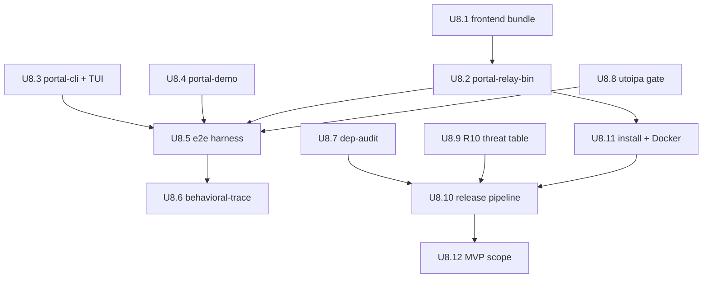

# feat: Phase 7 — binaries, e2e harness, behavioral-trace, release engineering

```
---
title: Phase 7 — binaries, e2e harness, behavioral-trace, release engineering
type: feat
status: active
date: 2026-05-04
origin: docs/plans/port_go_to_rust_greenfield_383a2dc9.plan.md (U8)
---
```

## Goal restatement

Phase 7 closes the v0.1 ship gate. Three binaries (`portal-relay`, `portal`, `portal-demo`) wire every preceding phase into operator-runnable artifacts; an in-process `tests/e2e/` harness proves cross-crate behavior across all three R2 trust boundaries; a `tests/behavioral-trace/` harness pins Rust state-machine output to the Go reference at `gosuda/portal-tunnel v2.1.8`; release engineering (`cliff.toml`, `release.toml`, cross-compile workflow, install-script adapters, regenerated Docker artifacts) ships the bits to operators; and the v0.1 cuts (R10 cross-relay deferred, R11 dashboard deferred, R14 SvelteKit unified deferred, R15 admin TUI views deferred) get an explicit release-notes declaration so v0.2 has a clean trigger boundary.

This is a *roadmap* phase plan. It defines the unit-of-work boundaries that downstream `/ce-plan implement` runs (or direct implementer subagents) execute commit-by-commit per `AGENTS.md` ≤200 LoC discipline. Phase 7 depends on Phase 6a + Phase 6b at execution time; this plan is written in parallel with those.

## Existing code to reuse

### Already in repo (Phase 0 outputs)

- `Cargo.toml` workspace (`/home/alpha/toys/portal-tunnel-rs/Cargo.toml`) — `[workspace.dependencies]` already pins everything Phase 7 consumes: `clap = "4"`, `rust-embed = { version = "8", features = ["compression"] }`, `figment`, `metrics-exporter-prometheus`, `ratatui`, `ratatui-crossterm`, `assert_cmd`, `predicates`, `insta`, `wiremock`, `axum 0.8`, `utoipa-axum 0.2`, `eyre`, `color-eyre`. Phase 7 adds **no** new workspace deps unless an item below explicitly declares one.
- `crates/portal-relay-bin/{Cargo.toml,src/main.rs}` — stub. Binary name `portal-relay`, crate name `portal-relay-bin` (R5+C11 split already in place).
- `crates/portal-cli/{Cargo.toml,src/main.rs}` — stub. Binary name `portal`, crate name `portal-cli`.
- `crates/portal-demo/{Cargo.toml,src/main.rs}` — stub. Binary name `portal-demo` (matches crate name; only `portal-cli` has the distinct binary alias).
- `xtask/{Cargo.toml,src/main.rs}` — stub task runner; description already lists `openapi-export`, `dep-audit`, `refresh-frontend-bundle` as reserved subcommands.
- `.gitignore` — already excludes `portal-tunnel/` (Go upstream) at workspace root; Phase 7 adds `frontend/build/` (transient build artifacts ignored; only `crates/portal-relay-bin/assets/` is committed).

### Go upstream reference (`portal-tunnel/cmd/`, behavioral spec only — no wire compat)

- `portal-tunnel/cmd/relay-server/main.go` — relay-server flag surface (`--portal-url`, `--identity-path`, `--bootstraps`, `--discovery`, `--wireguard-port`, `--api-port`, `--sni-port`, `--trust-proxy-headers`, `--trusted-proxy-cidrs`, `--udp-enabled`, `--tcp-enabled`, `--min-port`, `--max-port`, `--landing-page-enabled`, `--headless-shell-url`, `--pprof-enabled`, `--pprof-addr`, `--acme-dns-provider`, `--ens-gasless-enabled`, plus per-provider DNS credential flags). Rust replaces `--pprof-*` with `metrics-exporter-prometheus` `/metrics` endpoint per R11 v0.1; preserves the rest at the user-visible level via clap derive.
- `portal-tunnel/cmd/relay-server/frontend.go` — `embed.FS`-backed asset server with route map (`/__app/*`, `/__assets/*`, `/__admin/*`, `/__tunnel/*`, `/__thumbnail/*`, `/__install.sh`, `/__install.ps1`, `/__install/bin/*`, plus root + favicon family). Rust port mirrors the route map via `axum::Router` + `rust_embed::RustEmbed` derive on `crates/portal-relay-bin/assets/`. SSR injection (`__SSR_DATA__` script tag, `[%OG_TITLE%]`/`[%OG_DESCRIPTION%]`/`[%LANDING_PAGE_ENABLED%]`/`[%RELEASE_VERSION%]` placeholders) ports verbatim using `compact_str` + `html_escape` (or `askama_escape::escape` if already pulled in by utoipa transitive — confirm at implementation time).
- `portal-tunnel/cmd/portal-tunnel/main.go` — client CLI flag surface for `expose` (`--relays`, `--multi-hop`, `--discovery`, `--ban-mitm`, `--identity-path`, `--identity-json`, `--name`, `--description`, `--tags`, `--owner`, `--thumbnail`, `--hide`, `--http-route`, `--udp`, `--udp-addr`, `--tcp`, `--max-active-relays`, `--multi-hop-depth`) and `list`/`version`/`update`/`agent` subcommands. Rust ports `expose`, `list`, `version`; `update` ships as a stub printing "auto-update is out of scope per roadmap Scope Boundaries — use `cargo install --git ...` or distro packaging" (per roadmap Scope Boundaries L120); `agent run`/`agent dashboard`/`agent stop` deferred to v0.2 (TUI Admin views land alongside).
- `portal-tunnel/cmd/portal-tunnel/installer/{install.sh,install.ps1,installer.go}` — install scripts adapted to release artifact name `portal` (already aligned — Go binary is named `portal` per `installer.AssetFilename` slug map `linux-amd64`/`linux-arm64`/`darwin-amd64`/`darwin-arm64`/`windows-amd64`/`windows-arm64`). Rust port keeps the same slug surface; the only `BASE_URL` difference is repo path (`gosuda/portal-tunnel-rs` instead of `gosuda/portal-tunnel`). Same checksum/`fail-closed` machinery preserved verbatim.
- `portal-tunnel/cmd/demo-app/{main.go,handler.go,static/*}` — demo-app surface (`tcp` default + `udp` subcommands; static landing page).
- `portal-tunnel/Dockerfile` + `portal-tunnel/docker-compose.yml` — environment-variable surface to preserve in the Rust regeneration.
- `portal-tunnel/frontend/` (React 19 + Vite + shadcn/ui + Radix admin SPA; `package.json` + `package-lock.json` lockfile) and `portal-tunnel/docs/` (SvelteKit docs site; `package.json` + `bun.lock`) — sources for the v0.1 pre-built bundle. **Note**: `portal-tunnel/cmd/relay-server/dist/` in the Go repo is `.gitkeep`-only; the Rust port commits the actual built bundle at `crates/portal-relay-bin/assets/` with manifest provenance.

### From other Phase plans (referenced abstractly — Phase 7 consumes their public surface)

- `portal-sdk` (Phase 6a) — `Expose`, `RunHTTP`, `RunHTTPRoutes`, `ProxyExposure`, eclipse-resistant relay picker, MITM probe, ECH-aware client wire, `tokio::sync::broadcast` event stream consumed by the Tunnel TUI.
- `portal-relay` (Phase 5 + Phase 6b) — `Server`, `ServerConfig`, three `rustls::ServerConfig` instances (api-https / keyless-mtls / quic-identity), `metrics-exporter-prometheus` registry handle, `policy::Runtime` reload-on-`arc-swap` config, `admin::Action` enum + `admin::View` trait shared by web admin and TUI.
- `portal-relay::tui` (Phase 5 v0.1 Status view) — relay-side single-Status view consumed by `portal-relay tui` subcommand.
- `portal-cli::tui` (Phase 6a v0.1 Tunnel view) — client-side Tunnel view consumed by `portal expose` default mode.

## Alternatives considered

Three implementation alternatives surfaced during planning. Each is described, weighed, and one is recommended.

### Alt A — "everything-at-once" (single big PR per binary)

Land each binary (`portal-relay-bin`, `portal-cli`, `portal-demo`) as one commit per binary. E2E harness, behavioral-trace harness, release pipeline land in their own commits.

- **Scope**: 6-7 commits total (3 binaries + e2e + behavioral-trace + release).
- **Files**: ~30-40 per binary commit (config plumbing, route map, TUI integration, asset embed, graceful shutdown).
- **Risk**: HIGH. ≤200 LoC AGENTS.md rule violated by every single commit. Bisecting a regression that lands in commit "feat(relay-bin): wire all subcommands" requires reading 1.5k LoC. Reviewer fatigue collapses signal.
- **Tradeoff**: ships fastest in calendar time if the implementer never makes a mistake. They will.

### Alt B — "twelve atomic deliverables" (recommended)

Decompose Phase 7 into **12 atomic units** (the `todos` in the frontmatter), each ≤200 LoC, each with its own verification gate. Binaries land in slices: subcommand-graph commit, then config-plumbing commit, then asset-serve commit, then metrics-endpoint commit, then TUI-integration commit. E2E and behavioral-trace harnesses each land as their own concern. Release pipeline lands in three commits (cliff config, cargo-release config, GitHub workflow).

- **Scope**: ~22-26 commits across the phase.
- **Files**: ~6-12 per commit.
- **Risk**: LOW. Bisecting a regression lands on a single concern. Reviewers see one concept per PR. Reverts are surgical.
- **Tradeoff**: more commits to review; each is shallow. AGENTS.md ≤200 LoC rule is honored without artificial squashing.

### Alt C — "harnesses-first, binaries-second"

Land `tests/e2e/` and `tests/behavioral-trace/` harnesses against the **Phase 5/6 library crates** (no binaries needed — harnesses use library APIs directly). Binaries become the last commit set: thin clap shells over the already-tested library surface.

- **Scope**: harnesses-first means we discover the missing library APIs early. Binaries shrink because they're glue, not logic.
- **Files**: harnesses ~10-15 each; binaries ~3-5 commits each.
- **Risk**: MEDIUM. Harnesses-first is correct for the e2e gate but the behavioral-trace harness needs the binary surface (Docker sidecar boots `relay-server` Go binary against the Rust binary's `--portal-url` API). Half-and-half decomposition is messier than Alt B.
- **Tradeoff**: catches missing library surface before binary integration, but the behavioral-trace half is binary-coupled by definition.

### Recommendation: **Alt B**

Alt B is the only option that honors AGENTS.md ≤200 LoC discipline without creating dependency-order cycles. Alt A trades AGENTS.md compliance for a calendar-time mirage; Alt C splits the harness work along an axis (library-only vs binary-coupled) that doesn't match the Phase 7 dependency graph. Alt B's 12 atomic units map 1:1 to the verification gates the roadmap lists for U8.

**Justification axes:**

- **Simplicity**: each commit answers one question. Bisect always lands on the right concern.
- **Blast radius**: a regression in the asset-embed commit can't break the metrics endpoint; a regression in the cross-compile workflow can't break the e2e harness.
- **Reversibility**: any unit can be reverted in a single revert commit without unwinding others.

## Recommended decomposition — 12 atomic deliverables

Each deliverable below is a *unit of work* the downstream implementer phase plan slices further into ≤200 LoC commits. The verification column lists the specific check that closes the unit.

### U8.1 — Frontend asset bundle (R14 v0.1 + R3-FEAS-5/SEC-R3 supply-chain integrity)

| Aspect | Value |
|---|---|
| Concern | Commit pre-built React admin SPA + SvelteKit docs site bundle; freeze provenance; wire refresh tooling |
| Files | `crates/portal-relay-bin/assets/<bundle>` (binary artifacts), `crates/portal-relay-bin/assets/MANIFEST.toml`, `xtask/src/refresh_frontend_bundle.rs`, `xtask/src/main.rs` (subcommand routing), `.gitignore` (add `frontend/build/` exclusion), `.github/workflows/ci.yml` (asset-clean gate) |
| Action | (1) Run Node toolchain ONCE outside Rust CI against pinned Go-upstream SHA: `cd portal-tunnel/frontend && npm ci && npm run build` then `cd portal-tunnel/docs && bun install --frozen-lockfile && bun run build`. (2) Copy outputs to `crates/portal-relay-bin/assets/{app,docs}/`. (3) Generate `MANIFEST.toml` with `go_repo_sha = "<commit>"`, `node_version = "22.x"`, `bun_version = "1.x"`, `lockfile_sha256 = { frontend = "...", docs = "..." }`, `files = [{ path = "...", sha256 = "..." }, ...]`. (4) `xtask refresh-frontend-bundle` re-runs steps 1-3 against the pinned SHA + verifies match against committed `MANIFEST.toml`. (5) CI gate: after `cargo run -p xtask -- refresh-frontend-bundle`, `git status --porcelain crates/portal-relay-bin/assets/` MUST be empty. |
| Verification | `xtask refresh-frontend-bundle && git diff --exit-code crates/portal-relay-bin/assets/` exits 0; `xtask verify-frontend-manifest` recomputes per-file SHA-256 and matches `MANIFEST.toml`; CI workflow runs both. |
| Reuses | Go upstream `portal-tunnel/frontend/` + `portal-tunnel/docs/` source trees. **No new workspace deps** (sha2 + toml already pulled transitively via aws-sdk + cargo-deny config; xtask declares them directly to avoid cross-crate transitive coupling). |
| Risk | Bundle size — the React+Svelte combined output is ~5-15 MB. `rust-embed`'s `compression = true` (already pinned in workspace deps) brotli-compresses at build time; runtime cost is decompression-on-serve which axum handles per-request. Bundle staleness is detected by the manifest-clean CI gate; **no auto-rebuild in CI** by design (Node toolchain stays out of Rust CI per R14 v0.1). |
| Note | **No SvelteKit unification in v0.1 — that is R14 v0.2.** v0.2 replaces this entire pipeline with a Leptos-native UI + utoipa-generated Rust types (no TS regen, no Node toolchain). |

### U8.2 — `portal-relay-bin` main wiring

| Aspect | Value |
|---|---|
| Concern | clap subcommand graph + figment config + asset serving + metrics endpoint + graceful shutdown |
| Files | `crates/portal-relay-bin/src/main.rs`, `crates/portal-relay-bin/src/cli.rs`, `crates/portal-relay-bin/src/config.rs`, `crates/portal-relay-bin/src/assets.rs`, `crates/portal-relay-bin/src/tui.rs` (wires `portal-relay::tui` Status view), `crates/portal-relay-bin/Cargo.toml` (add deps: `portal-relay`, `portal-sdk`, `clap`, `figment`, `rust-embed`, `axum`, `tokio`, `tokio-util`, `tracing`, `tracing-subscriber`, `eyre`, `color-eyre`, `metrics-exporter-prometheus`, `ratatui`, `ratatui-crossterm`) |
| Action | (1) `serve` subcommand (default): clap-derive struct mirrors Go relay-server flag surface; figment layers env + JSON file + CLI flags per R8; spawns `portal-relay::Server` inside a `tokio::task::JoinSet`; wires `metrics-exporter-prometheus` `/metrics` endpoint into the relay's admin router (Phase 5 deliverable); installs `tokio_util::sync::CancellationToken` SIGTERM/SIGINT handler; awaits JoinSet shutdown. (2) `tui` subcommand: opens `portal-relay::tui::status::run(server_handle)` in alternate-screen ratatui-crossterm. (3) `--no-tui` is implicit because `tui` is a subcommand, not a flag (cleaner than client-side `--no-tui`; relay-side TUI is opt-in, plain output is default). (4) `RustEmbed`-derived `Assets` struct on `crates/portal-relay-bin/assets/` serves the route map from `portal-tunnel/cmd/relay-server/frontend.go`. |
| Verification | `cargo build --bin portal-relay`; `cargo test -p portal-relay-bin`; `assert_cmd` smoke test asserts `portal-relay --help` exits 0 with the Go-parity flag set listed; integration test spawns `portal-relay serve --api-port 0` against an ephemeral port and curls `/metrics` (Prometheus exposition format). |
| Reuses | `portal-relay::Server` (Phase 5 + 6b), `portal-relay::tui::status` (Phase 5 v0.1), `portal-tunnel/cmd/relay-server/frontend.go` route map. |
| Risk | Asset MIME-type table — Go uses `mime.TypeByExtension`. Rust port must explicitly register `.webmanifest` → `application/json` (Go falls through to a special-case in `getContentType`). Tested via per-extension snapshot (`insta`) of the `Content-Type` map. |

### U8.3 — `portal-cli` main wiring + Tunnel TUI integration

| Aspect | Value |
|---|---|
| Concern | clap subcommand graph mirroring Go portal-tunnel; TUI default + `--no-tui` plain mode; portal-sdk integration |
| Files | `crates/portal-cli/src/main.rs`, `crates/portal-cli/src/cli.rs`, `crates/portal-cli/src/expose.rs`, `crates/portal-cli/src/list.rs`, `crates/portal-cli/src/version.rs`, `crates/portal-cli/src/tui/mod.rs` (Tunnel view rendering — owned by `portal-cli` per Phase 6a; consumes `portal-sdk` event broadcast), `crates/portal-cli/Cargo.toml` (add: `portal-sdk`, `clap`, `tokio`, `eyre`, `color-eyre`, `ratatui`, `ratatui-crossterm`, `compact_str`, `tracing`, `tracing-subscriber`) |
| Action | (1) `expose [TARGET]` subcommand: clap-derive struct mirrors Go's `exposeFlags`; calls `portal-sdk::Expose`; default mode opens TUI; `--no-tui` falls back to plain stdout per AGENTS.md headless rule. (2) `list` subcommand: ports `runListCommand` from `portal-tunnel/cmd/portal-tunnel/main.go` — fetches version from each relay URL via concurrent `JoinSet`, prints tab-aligned table. (3) `version` prints `env!("CARGO_PKG_VERSION")`. (4) `update` prints "auto-update is out of scope per roadmap Scope Boundaries — use `cargo install --git ...` or distro packaging" + exits 2 (per roadmap L120). (5) `agent run`/`dashboard`/`stop` subcommands print "deferred to v0.2 — see docs/release-notes/v0.1-mvp-scope.md" + exit 2 (NOT silently rejected; users running `portal agent run` from Go-era muscle memory get a clear pointer). |
| Verification | `assert_cmd` golden-file tests via `insta` for `--help` output of every subcommand; integration test spawns relay + cli `expose 8080 --no-tui` against demo-app target; TUI state-transition snapshot tests via `insta` (per Phase 6a behavioral gate); a `--no-tui` smoke test for CI usage. |
| Reuses | `portal-sdk::Expose`, `portal-sdk::ProxyExposure`, `portal-sdk::HTTPRoute`, `portal-cli::tui` from Phase 6a. |
| Risk | TUI/no-TUI mode detection. Default to TUI when stdout is a tty (`std::io::IsTerminal`); auto-fallback to plain when stdout is piped. `--no-tui` forces plain regardless. `--tui` forces TUI even when stdout is piped (rare but useful for screencasts + asciinema recordings). |

### U8.4 — `portal-demo` main wiring

| Aspect | Value |
|---|---|
| Concern | clap subcommand graph matching Go demo-app; embedded static landing page |
| Files | `crates/portal-demo/src/main.rs`, `crates/portal-demo/src/cli.rs`, `crates/portal-demo/src/tcp.rs`, `crates/portal-demo/src/udp.rs`, `crates/portal-demo/src/handler.rs`, `crates/portal-demo/static/{index.html,style.css}` (verbatim from Go), `crates/portal-demo/Cargo.toml` (add: `portal-sdk`, `clap`, `tokio`, `axum`, `tower`, `eyre`, `color-eyre`, `tracing`, `tracing-subscriber`, `rust-embed`, `compact_str`) |
| Action | (1) `tcp` (default) subcommand mirrors Go `runTCPCommand` flag surface; embeds `static/` via `RustEmbed`; serves landing page + `portal-sdk::Expose::RunHTTP`. (2) `udp` subcommand mirrors `runUDPCommand` — opens UDP datagram session, runs echo loop. (3) Both share `registerConnectivityFlags`-equivalent via clap `#[command(flatten)]`. |
| Verification | `cargo build --bin portal-demo`; `assert_cmd --help` snapshots; in-process integration test (no external relay) verifies `tcp` boots HTTP listener and serves landing page. |
| Reuses | `portal-sdk` (Phase 6a). |
| Risk | Static-asset MIME registration mirrors U8.2 — same `.webmanifest` special case if landing page references one. |

### U8.5 — `tests/e2e/` single-process harness

| Aspect | Value |
|---|---|
| Concern | Boot relay + client + demo target in same test process; round-trip `expose`; exercise all three trust boundaries |
| Files | `tests/e2e/Cargo.toml` (workspace member if needed; or `[[test]]` target in `portal-relay-bin`/`portal-cli` — see Risk below), `tests/e2e/src/lib.rs`, `tests/e2e/tests/single_relay.rs`, `tests/e2e/tests/multi_hop.rs`, `tests/e2e/tests/dual_stack.rs`, `tests/e2e/src/harness.rs` (`Harness::spawn_relay()`, `Harness::spawn_demo()`, `Harness::spawn_client_expose()`) |
| Action | (1) `Harness` constructs ephemeral-port relay (`SocketAddrV4::new(LOCALHOST, 0)` + `SocketAddrV6::new(LOCALHOST_V6, 0)` per R12), demo target on ephemeral port, client `expose` against the relay. (2) Three trust boundaries exercised: (a) relay HTTPS API — client SDK calls `/v1/sdk/lease/register` over rustls + ed25519 envelope; (b) keyless mTLS — relay terminates tenant TLS via the keyless oracle (Phase 6b SigningKey); (c) QUIC datagram — backhaul stream from client SDK to relay. (3) `single_relay.rs` + `multi_hop.rs` (2-hop) + `dual_stack.rs` (forces both v4 and v6 listeners + verifies `::ffff:1.2.3.4` canonicalization per R12 system-wide invariant). (4) Each test asserts: (a) lease registered, (b) HTTP request through tunnel returns demo target's response, (c) MITM probe reports false positive, (d) shutdown completes within 5s. |
| Verification | `cargo test --workspace --test e2e_*` passes on Linux + macOS; coverage of all three trust boundaries asserted per test; v6 canonicalization regression test (`connect from ::ffff:1.2.3.4 with v4 ACL deny on 1.2.3.4 fails closed`) lives here. |
| Reuses | All preceding crates. |
| Risk | `tests/e2e/` as workspace member vs `[[test]]` integration target. **Recommend separate workspace member** (`tests/e2e/`) to keep portal-relay-bin's `dev-dependencies` clean and to allow the e2e tests to build the binaries via `assert_cmd::cargo::CommandCargoExt::cargo_bin` rather than re-link. The behavioral-trace harness (U8.6) follows the same pattern. Both sit under `tests/` directory at workspace root, listed in `[workspace] members`. |
| Behavioral gate | This unit IS the Phase 7 e2e behavioral gate listed in the roadmap. |

### U8.6 — `tests/behavioral-trace/` Go-reference harness (R3 reframed)

| Aspect | Value |
|---|---|
| Concern | Capture Go reference behavior under fixtures; replay against Rust port asserting state-equivalence on curated subset |
| Files | `tests/behavioral-trace/Cargo.toml`, `tests/behavioral-trace/CURATION.md` (criterion document — explicit, NOT "curator's interpretation"), `tests/behavioral-trace/Dockerfile.go-relay` (boots `gosuda/portal-tunnel:v2.1.8` pinned by SHA256 digest per ADV-R3-003), `tests/behavioral-trace/src/{lib.rs,fixtures.rs,replay.rs,docker.rs}`, `tests/behavioral-trace/fixtures/<scenario>/{input.json,go_output.json}` (committed fixture corpus), `tests/behavioral-trace/tests/replay_*.rs` |
| Action | (1) **Curation criterion** documented in `CURATION.md`: included scenarios are exactly the **9 user-visible behavioral surfaces from R3** (lease lifecycle, SIWE registration, ACME issuance, multi-hop routing, MITM probe, raw TCP routing, raw UDP routing, admin API, public discovery). Excluded: anything wire-level (greenfield breaks wire by R4); anything timing-dependent (jitter > 100ms is fixture-poison); anything requiring real DNS/Cloudflare/Route53 (covered by `wiremock` in Phase 4 instead). (2) `Dockerfile.go-relay` pins the Go relay-server to a specific SHA256 image digest; the digest comes from `docker manifest inspect ghcr.io/gosuda/portal-tunnel:v2.1.8` at fixture-capture time and is committed alongside the fixtures. (3) Capture phase (one-time, gated behind `cargo run --bin capture-go-fixtures` in xtask): boots Go relay-server, runs each curated scenario, snapshots wire-independent state output (lease record JSON, registry response JSON, admin API response JSON, MITM probe report) to `fixtures/<scenario>/go_output.json`. (4) Replay phase (every `cargo test`): boots Rust port, runs the same scenario inputs, asserts state-equivalence against `go_output.json` modulo greenfield-allowed differences (UUID/timestamp normalization helper applied). (5) State-equivalence helper lives in `replay.rs` as `assert_state_equivalent(go: &serde_json::Value, rust: &serde_json::Value, normalize: NormalizeMask)`; mask bits documented inline. |
| Verification | `cargo test -p behavioral-trace --test replay_*` passes; `xtask capture-go-fixtures --check` re-runs Go capture and asserts no fixture drift (rare; manual flow when intentionally bumping the pinned Go SHA); `CURATION.md` is reviewed by `ce-feasibility-reviewer` before merge. |
| Reuses | `portal-relay-bin` binary (booted by the harness against the Docker-side Go relay for cross-comparison). |
| Risk | **Docker dependency in CI**. Strategy: gate behavioral-trace tests behind a `BEHAVIORAL_TRACE=1` env var; CI workflow enables it on Linux runners only (no Docker on macOS GHA runners as of 2026 unless using nested virt — added cost). On macOS local dev, contributor runs without `BEHAVIORAL_TRACE`; CI is the source of truth. |
| Behavioral gate | This unit IS the Phase 7 behavioral-trace gate listed in the roadmap. |

### U8.7 — Per-dep task-spawning audit (F4)

| Aspect | Value |
|---|---|
| Concern | Document each library's task-spawning contract; honest claim about R9 transitive composition |
| Files | `xtask/src/dep_audit.rs`, `xtask/src/main.rs` (subcommand routing), `docs/dep-spawning-audit.md` (generated artifact) |
| Action | (1) `xtask dep-audit` enumerates per-dep contracts: (a) **`quinn`** — `Endpoint::accept` is a streaming future; consumer wraps in `JoinSet`; quinn internally spawns per-connection driver tasks via tokio (NOT under our `CancellationToken` — relies on connection close to terminate). (b) **`axum`/`hyper`** — `axum::serve` is a streaming future; per-request handler tasks are spawned by hyper internally (not under our token; rely on TCP close or hyper graceful shutdown). (c) **`instant-acme`** — order polling is a future under caller control; no internal task spawning; clean composition. (d) **chosen WG fork** (Phase 6b output) — fill in based on Phase 6b ADR; NepTUN/GotaTun/defguard_boringtun each have distinct shutdown contracts. (2) Output is `docs/dep-spawning-audit.md` with one section per dep, columns: `Spawns Tasks?` / `Honors CancellationToken?` / `Shutdown Contract` / `Risk`. (3) Honest claim section: "R9 structured-concurrency invariant binds *our* code; transitive deps follow each dep's documented shutdown contract — see per-dep entries above. We do NOT claim end-to-end JoinSet enclosure for tokio tasks spawned inside quinn/hyper." |
| Verification | `xtask dep-audit` produces non-empty `docs/dep-spawning-audit.md`; CI gate fails if file is empty or missing required sections (one per dep). |
| Reuses | None. |
| Behavioral gate | This unit IS the Phase 7 dep-spawning-audit gate. |

### U8.8 — utoipa coverage CI gate (v0.1 mechanism per round-3 reconciliation)

| Aspect | Value |
|---|---|
| Concern | Force `utoipa_axum::OpenApiRouter::route` over bare `axum::Router::route` in library crates |
| Files | `clippy.toml` (workspace-root, NEW), `.github/workflows/ci.yml` (add ast-grep step), `xtask/src/openapi_export.rs` (stub for v0.2 backlog), `docs/utoipa-coverage-policy.md` |
| Action | (1) **Clippy `disallowed_methods`**: `clippy.toml` at workspace root lists `axum::Router::route` and `axum::Router::nest` as disallowed in library crates (`portal-relay`, `portal-sdk`); binary crates (`portal-relay-bin`, `portal-cli`, `portal-demo`) keep an `#[expect(clippy::disallowed_methods, reason = "binary crate composes routers from documented utoipa registrations")]` escape at the single mount site. (2) **ast-grep belt-and-suspenders**: CI step runs `ast-grep --pattern 'Router::route($A, $B)' --globs 'crates/portal-relay/src/**' 'crates/portal-sdk/src/**'` and fails on non-empty output. Both signals are required because clippy's `disallowed_methods` operates on resolved paths (can be defeated by import alias) and ast-grep operates on syntactic shape (can be defeated by macro expansion); together they catch each other's blind spots. (3) `docs/utoipa-coverage-policy.md` documents the rule + escape procedure (binary-crate `#[expect]` + cited reason). (4) **v0.2 backlog**: `xtask openapi-export` writes `docs/openapi.yaml` from utoipa's `ApiDoc::openapi()`; CI snapshot test asserts committed `docs/openapi.yaml` matches generated output. v0.1 ships the stub xtask command (prints "v0.2 backlog — see roadmap §v0.2 Backlog"). |
| Verification | A smoke commit adding `Router::route("/x", get(handler))` to `portal-relay/src/lib.rs` causes both clippy AND the ast-grep CI step to fail; removing the smoke commit returns CI green. `clippy.toml` lints exactly the listed paths. |
| Reuses | None. |
| Behavioral gate | This unit IS the Phase 7 utoipa coverage gate. |

### U8.9 — R10 v0.1 release-notes threat-mapping table (round-3 SEC R3)

| Aspect | Value |
|---|---|
| Concern | Per-class threat mapping — declare what v0.1 mitigates vs defers |
| Files | `docs/release-notes/v0.1-r10-threat-mapping.md` |
| Action | Template-format markdown table with one row per R10 threat class (a-h, sourced from Phase 1 `docs/threat-model.md`'s 8-class enumeration). Columns: `Threat Class` / `v0.1 Status` (one of `mitigated by single-relay defense`, `partially mitigated`, `unmitigated in v0.1 (cross-relay required)`) / `v0.1 Mechanism` / `v0.2 Trigger`. Each row tagged with its v0.2 backlog item ID (linked to the roadmap's v0.2 Backlog section). Release-engineering pipeline (U8.10) consumes this template at tag time — `cargo release` post-tag hook injects it into the GitHub release body. |
| Verification | Markdown table passes `mdformat --check` (or equivalent); CI gate verifies all 8 threat classes present (exactly one row per class, no duplicates); `ce-doc-review` runs at landing time. |
| Reuses | Phase 1 `docs/threat-model.md` 8-class R10 enumeration. |

### U8.10 — Release-engineering pipeline (deferred from Phase 0 per scope-guardian #3)

| Aspect | Value |
|---|---|
| Concern | git-cliff changelog template + cargo-release config + cross-compile workflow |
| Files | `cliff.toml`, `release.toml`, `.github/workflows/release.yml` |
| Action | (1) **`cliff.toml`**: conventional-commit-driven changelog; sections per `feat`/`fix`/`docs`/`refactor`/`perf`/`test`/`chore`/`ci`/`build`; matches roadmap commit-message convention. (2) **`release.toml`**: `cargo-release` config — `publish = false` for all member crates (no crates.io until R6 SDK promotion ADR), `tag = true` for workspace root only, `pre-release-replacements` updates `CHANGELOG.md` via git-cliff invocation, `consolidate-commits = true`. **Disabled until v1.0**: `release.toml` ships with `[workspace.metadata.release] disable-publish = true, disable-push = true, disable-tag = true` overrides; `cargo release` is a no-op until those flip. (3) **`.github/workflows/release.yml`**: triggered on tag `v*`; cross-compile matrix `[{os: ubuntu-latest, target: x86_64-unknown-linux-gnu}, {os: ubuntu-latest, target: aarch64-unknown-linux-gnu}, {os: macos-latest, target: x86_64-apple-darwin}, {os: macos-latest, target: aarch64-apple-darwin}, {os: windows-latest, target: x86_64-pc-windows-msvc}]`; uses `cross` for the cross-compile leg; **WG userspace fork (Phase 6b) per-OS feature flags applied here** — matrix cells include `--features wg/<fork>` per OS where the fork choice differs (e.g., NepTUN on Linux, defguard_boringtun on macOS, wiresock on Windows; final matrix derives from Phase 6b ADR). Outputs uploaded as GitHub release assets with sha256 sidecar files matching the install-script-expected `<binary>.sha256` format. |
| Verification | `git cliff --tag v0.1.0 --strip header -o /tmp/changelog.md` produces non-empty markdown; `cargo release --workspace --dry-run --execute --no-confirm` succeeds in dry mode; tag `v0.1.0-rc1` triggers `release.yml` and produces 5 binaries (or N per Phase 6b matrix) + sidecar checksums. |
| Reuses | None. |
| Risk | WG fork per-OS variance — Phase 6b's WG-fork pick informs this matrix. If Phase 6b lands NepTUN for all platforms, matrix is symmetric; if Phase 6b lands different forks per OS, matrix has per-cell `--features` flags. **This unit lands AFTER Phase 6b for that reason** — see Coordination section below. |

### U8.11 — Adapted install scripts + regenerated Docker artifacts

| Aspect | Value |
|---|---|
| Concern | install.sh/install.ps1 adapted to Rust release artifact name; Dockerfile + docker-compose for Rust binaries |
| Files | `install.sh`, `install.ps1`, `Dockerfile`, `docker-compose.yml`, `crates/portal-relay-bin/installer.rs` (`RustEmbed` over the install scripts so `portal-relay` serves them at `/__install.sh` + `/__install.ps1` — Go parity per `frontend.go` route map) |
| Action | (1) **install.sh** + **install.ps1**: copied verbatim from `portal-tunnel/cmd/portal-tunnel/installer/`; only `BASE_URL` default changes (`gosuda/portal-tunnel-rs` instead of `gosuda/portal-tunnel`). Asset slug map already aligned (`portal-linux-amd64`, etc.) — Go upstream already named the binary `portal`, so no slug renaming. (2) **Dockerfile**: multi-stage Rust builder. Stage 1: `rust:1.91-bookworm` builds with `--release --bin portal-relay` and `--release --bin portal-demo`; Stage 2: `gcr.io/distroless/cc-debian12:nonroot` (NOT `static` — `aws-lc-rs` links libc via `cc` crate per dep-spawning-audit). Frontend bundle is committed at `crates/portal-relay-bin/assets/`, embedded into the binary at compile time — **no Node toolchain in Dockerfile**. (3) **docker-compose.yml**: regenerated; environment-variable surface preserved verbatim from Go (`PORTAL_URL`, `BOOTSTRAPS`, `DISCOVERY`, `IDENTITY_PATH`, `API_PORT`, `SNI_PORT`, `WIREGUARD_PORT`, `MIN_PORT`, `MAX_PORT`, `UDP_ENABLED`, `TCP_ENABLED`, `LANDING_PAGE_ENABLED`, `TRUST_PROXY_HEADERS`, `TRUSTED_PROXY_CIDRS`, `ACME_DNS_PROVIDER`, `ENS_GASLESS_ENABLED`, `CLOUDFLARE_TOKEN`, GCP family, AWS family). `PPROF_*` env vars dropped — Rust ships `metrics-exporter-prometheus` `/metrics` instead per R11 v0.1; release-notes call out the swap. (4) **`crates/portal-relay-bin/installer.rs`**: `#[derive(RustEmbed)]` on the `install.sh`/`install.ps1` files; serves them via the relay's existing axum router at `/__install.sh` + `/__install.ps1` — Go parity per `frontend.go::serveInstallScript`; per-request `BASE_URL`/`RELAY_URL`/`BIN_PATH_PREFIX` interpolation matches `installer.RelayScript` Go logic. |
| Verification | `docker build .` produces an image; `docker compose up portal-relay` starts the relay and `curl http://localhost:4017/healthz` returns 200; `curl http://localhost:4017/__install.sh \| sh` (in a `--platform=linux/amd64` test container) downloads the Linux amd64 binary; install.sh against a fixture HTTP server passes (no live GitHub call required). |
| Reuses | Go install.sh/install.ps1 (verbatim); Go Dockerfile env-var surface (preserved). |

### U8.12 — v0.1 MVP scope declaration (per F11)

| Aspect | Value |
|---|---|
| Concern | Explicit "what shipped in v0.1 vs what's deferred to v0.2" release-notes anchor |
| Files | `docs/release-notes/v0.1-mvp-scope.md` |
| Action | Markdown anchor for the v0.1 GitHub release body. Sections: **What v0.1 ships** (Phase 0-7 with all v0.1 R-IDs); **What v0.2 will add** (linked to roadmap §v0.2 Backlog: R10 cross-relay propagation, R11 tokio-console + dashboard, R13 server-side ECH, R14 Leptos-native UI, R15 admin TUI views, performance benchmarks vs Go v2.1.8, full utoipa snapshot CI gate); **Behavioral gates that established the ship**: links to e2e harness (U8.5), behavioral-trace harness (U8.6), utoipa coverage gate (U8.8), dep-spawning audit (U8.7); **Migration posture from Go v2.1.8**: links to ADR-0003. Each v0.2 item carries its trigger criterion (date / evidence threshold / ship-event) per Decision Stability §"v0.2 Backlog freeze trigger". |
| Verification | `mdformat --check`; `ce-doc-review` runs at landing time; release pipeline (U8.10) injects this file into the GitHub release body via `cargo release` post-tag hook. |
| Reuses | Roadmap §v0.2 Backlog; Decision Stability section. |

## Implementation sequencing (within Phase 7)



- **U8.1 + U8.7 + U8.8 + U8.9** can land independently and in parallel — no inter-dep.
- **U8.2 + U8.3 + U8.4** are the binary-wiring trio; each blocks U8.5.
- **U8.5** blocks **U8.6** (behavioral-trace needs the binary surface).
- **U8.10** consumes U8.9 (release-notes injection) + U8.11 (release artifact names). Phase 6b WG-fork pick informs U8.10's matrix; **U8.10 is the last unit to land**.
- **U8.12** is the trailing release-notes anchor; lands alongside or just before tag.

## Risks & open questions

| Risk | Mitigation |
|---|---|
| Frontend bundle staleness on Go upstream commits | `MANIFEST.toml` pins `go_repo_sha`; refresh is gated by `xtask refresh-frontend-bundle`; CI gate fails on unintentional drift. **No auto-rebuild** — refresh is human-triggered per R14 v0.1. |
| Bundle size hits embed limit | `rust-embed`'s `compression = true` brotli-compresses; runtime cost is per-request decompression which axum tolerates. If bundle exceeds 50MB after compression, evaluate sharding (`assets/app/` and `assets/docs/` as separate `RustEmbed` derives). |
| Behavioral-trace harness Docker dependency in CI | `BEHAVIORAL_TRACE=1` env-var gate; Linux runners enable, macOS local dev skips. Documented in `tests/behavioral-trace/CURATION.md`. |
| Curation criterion (U8.6) drifts into "curator's interpretation" | Round-3 review mandate. `CURATION.md` REQUIRED before fixture files commit; `ce-feasibility-reviewer` + `ce-adversarial-document-reviewer` review at landing. |
| WG fork per-OS variance breaks cross-compile matrix (U8.10) | U8.10 lands AFTER Phase 6b. Phase 6b ADR informs the matrix. If Phase 6b lands single-fork-all-OS, matrix is symmetric; if per-OS, matrix carries per-cell `--features` flags. |
| `cargo release` runs accidentally on non-tag commit | `release.toml` ships disabled (`disable-publish/push/tag = true`); first real release flips them in a dedicated commit reviewed by maintainers. |
| Install scripts rely on `gosuda/portal-tunnel-rs` GitHub repo + releases existing before first tag | Pre-tag fixture server (in `tests/e2e/`) covers install.sh logic; first real release populates the GitHub repo's Releases page. |
| utoipa coverage gate (U8.8) defeated by import alias | ast-grep belt-and-suspenders catches syntactic shape regardless of import path; both signals required. |
| Distroless `cc` runtime missing dynamic dep that `aws-lc-rs` needs | `cargo build --release` test in U8.11 verifies link succeeds; `ldd` smoke against `gcr.io/distroless/cc-debian12:nonroot` enumerated dependencies in `docs/release-engineering.md`. |
| `tests/e2e/` and `tests/behavioral-trace/` as workspace members vs `[[test]]` | Recommended workspace members per U8.5 Risk row — keeps binary `dev-dependencies` clean and lets harnesses use `assert_cmd::cargo::CommandCargoExt::cargo_bin`. Adds `tests/e2e` and `tests/behavioral-trace` to `[workspace] members` in `Cargo.toml`. |

### Open questions (defer to implementation)

- **Q1**: Should `portal-relay tui` mode share a process with `serve`, or attach to a running `serve` process via a Unix socket? **Recommendation**: share a process for v0.1 (simpler, no IPC); v0.2 adds attach-mode if operator demand surfaces. Decided in U8.2 implementation commit.
- **Q2**: `--no-tui` vs auto-detect-tty for `portal expose` default mode. **Recommendation**: auto-detect tty + explicit `--no-tui`/`--tui` overrides per U8.3 Risk row. Decided in U8.3 implementation commit.
- **Q3**: Should U8.6's `tests/behavioral-trace/CURATION.md` enumerate scenarios as "include" (whitelist) or "exclude" (blacklist)? **Recommendation**: whitelist of exactly the 9 R3 user-visible behavioral surfaces; new scenarios require an ADR amendment. Decided in U8.6 implementation commit, reviewed by `ce-feasibility-reviewer`.

## Verification strategy (end-to-end Phase 7 ship gate)

The Phase 7 ship gate is the conjunction of **all** behavioral gates listed in roadmap U8 verification:

1. **e2e harness runs** (U8.5): `cargo test --workspace --test e2e_*` green on Linux + macOS.
2. **Behavioral-trace harness against Go reference** (U8.6): `BEHAVIORAL_TRACE=1 cargo test -p behavioral-trace --test replay_*` green on Linux CI.
3. **utoipa coverage CI gate** (U8.8): clippy `disallowed_methods` + ast-grep both pass against current state.
4. **Dep-spawning audit produces non-empty report** (U8.7): `xtask dep-audit` exits 0 + `docs/dep-spawning-audit.md` is non-empty + has one section per dep.
5. **Cross-compile matrix builds on all platforms** (U8.10): `release.yml` dry-run produces a binary per matrix cell.

Each gate is a CI job. **All must pass** for `cargo release` to fire. v0.1 ships when all five gates green, the R10 threat-mapping table (U8.9) is approved, and the MVP scope declaration (U8.12) is signed off via `ce-doc-review`.

## Coordination

- **Depends on**: Phase 6a (`portal-sdk` + `portal-cli::tui`) and Phase 6b (`portal-relay` overlay + keyless + WG-fork pick) at execution time. This plan is written in parallel with their plans.
- **Predecessor abstract dependencies**:
  - Phase 5 / U6 — `portal-relay::Server`, `policy::Runtime`, `metrics-exporter-prometheus` registry handle, `admin::Action` + `admin::View`, dual-stack listener helpers (U8.2 consumes).
  - Phase 6a / U7a — `portal-sdk::Expose`, `portal-sdk::ProxyExposure`, `portal-cli::tui::tunnel` (U8.3 consumes).
  - Phase 6b / U7b — keyless server (U8.5 trust-boundary 2 exercises), WG-fork pick (U8.10 matrix shape derives from).
- **Parallelizable with**: Phase 0 + Phase 1-6 plans run in parallel — no file conflicts.
- **Phase 7 internal parallelism**: U8.1, U8.7, U8.8, U8.9 land in parallel; U8.2-U8.4 land in parallel after U8.1; U8.5 + U8.11 land after U8.2-U8.4; U8.6 lands after U8.5; U8.10 + U8.12 land last.

## v0.1 MVP shipping subset (per F11)

**v0.1 = Phase 0-7** with the following explicit deferrals to v0.2 (mirrored verbatim from roadmap §v0.2 Backlog):

- R10 cross-relay reputation propagation (per-relay defense ships in v0.1 via Phase 5).
- R11 tokio-console + `/admin/dashboard` HTML aggregator (`/metrics` endpoint ships in v0.1 via U8.2).
- R13 server-side ECH on relay HTTPS surface (tenant TLS ECH-aware routing ships in v0.1 via Phase 5).
- R14 Leptos-native unified UI (committed React + SvelteKit bundle ships in v0.1 via U8.1).
- R15 admin TUI views — Launch wizard, Config editor, Admin (tenant/lease/policy management) views (Status view ships in v0.1 via Phase 5; Tunnel view ships in v0.1 via Phase 6a + U8.3).
- Performance benchmarks vs Go v2.1.8 (promoted to v0.2 first-class deliverable).
- Full utoipa snapshot CI gate (clippy + ast-grep belt-and-suspenders ship in v0.1 via U8.8; `xtask openapi-export` snapshot test deferred to v0.2).

**Behavioral-trace harness (U8.6) + e2e harness (U8.5) establish the v0.1 ship gate** per roadmap U8 — no additional gate.

## Sources & References

- Roadmap origin: [docs/plans/port_go_to_rust_greenfield_383a2dc9.plan.md](../../../.cursor/plans/port_go_to_rust_greenfield_383a2dc9.plan.md) §U8 (Phase 7).
- Workspace manifest: [Cargo.toml](../../Cargo.toml).
- Phase 7 binary stubs: [crates/portal-relay-bin/src/main.rs](../../crates/portal-relay-bin/src/main.rs), [crates/portal-cli/src/main.rs](../../crates/portal-cli/src/main.rs), [crates/portal-demo/src/main.rs](../../crates/portal-demo/src/main.rs).
- xtask stub: [xtask/src/main.rs](../../xtask/src/main.rs).
- Go upstream relay-server: [portal-tunnel/cmd/relay-server/main.go](../../portal-tunnel/cmd/relay-server/main.go), [portal-tunnel/cmd/relay-server/frontend.go](../../portal-tunnel/cmd/relay-server/frontend.go).
- Go upstream client: [portal-tunnel/cmd/portal-tunnel/main.go](../../portal-tunnel/cmd/portal-tunnel/main.go), [portal-tunnel/cmd/portal-tunnel/agent.go](../../portal-tunnel/cmd/portal-tunnel/agent.go).
- Go upstream demo: [portal-tunnel/cmd/demo-app/main.go](../../portal-tunnel/cmd/demo-app/main.go).
- Install scripts: [portal-tunnel/cmd/portal-tunnel/installer/install.sh](../../portal-tunnel/cmd/portal-tunnel/installer/install.sh), [portal-tunnel/cmd/portal-tunnel/installer/install.ps1](../../portal-tunnel/cmd/portal-tunnel/installer/install.ps1), [portal-tunnel/cmd/portal-tunnel/installer/installer.go](../../portal-tunnel/cmd/portal-tunnel/installer/installer.go).
- Docker artifacts: [portal-tunnel/Dockerfile](../../portal-tunnel/Dockerfile), [portal-tunnel/docker-compose.yml](../../portal-tunnel/docker-compose.yml).
- Frontend sources: [portal-tunnel/frontend/](../../portal-tunnel/frontend/) (React 19 + Vite + shadcn/ui), [portal-tunnel/docs/](../../portal-tunnel/docs/) (SvelteKit).
- Repo constitution: [AGENTS.md](../../AGENTS.md) — note: still reflects Phase-0 stub language; ADR-0001/0002 (Phase 0) supersede the v2.1.8 wire pin captured there.
